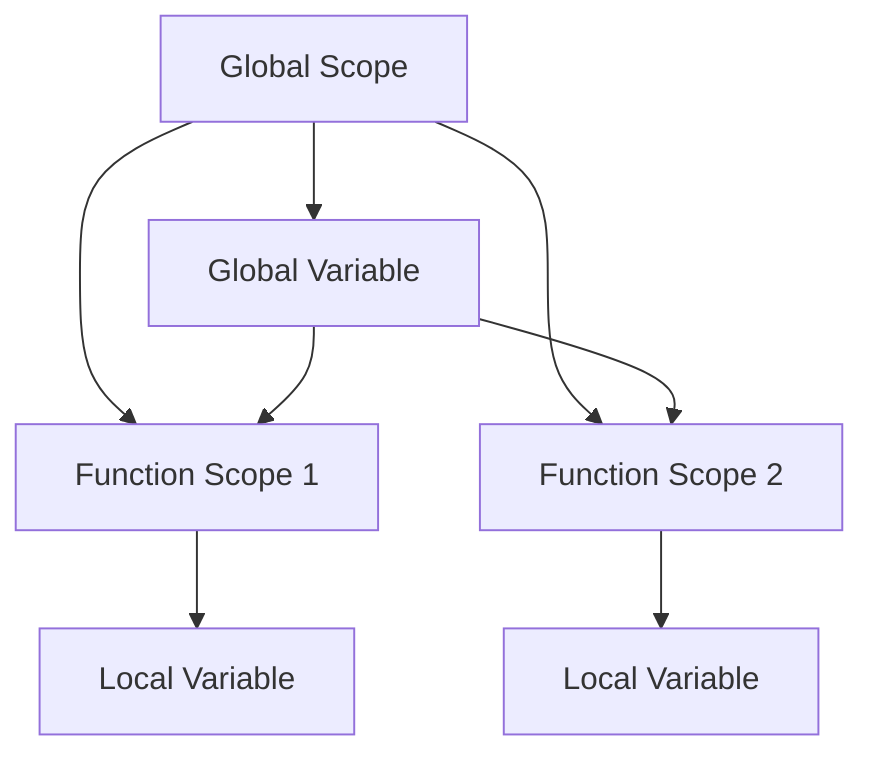

## 21.2 Overuse of Global Variables and Mutable States

In the world of software development, the use of global variables and mutable states can lead to significant challenges, especially in a language like Julia that emphasizes performance and flexibility. In this section, we will delve into the pitfalls associated with global variables and mutable states, particularly in the context of Julia, and explore best practices to mitigate these issues.

### Global Variables Pitfalls

Global variables are variables that are defined outside of any function or module and can be accessed from anywhere in the code. While they can be convenient for sharing data across different parts of a program, they come with several drawbacks:

1. **Type Instability**: Julia is a dynamically typed language, but it benefits greatly from type stability for performance optimization. Global variables can lead to type instability because their types can change at runtime, making it difficult for the compiler to optimize the code.

2. **Unintended Side-Effects**: Global variables can be modified from anywhere in the program, leading to unintended side-effects that can be difficult to trace and debug. This can result in unpredictable behavior and bugs that are hard to reproduce.

3. **Namespace Pollution**: Excessive use of global variables can clutter the global namespace, making it difficult to manage and understand the codebase. This can lead to naming conflicts and make the code less modular.

4. **Performance Overhead**: Accessing global variables can be slower than accessing local variables because the compiler cannot make certain optimizations. This can lead to performance bottlenecks, especially in performance-critical applications.

#### Code Example: Global Variable Pitfalls

```julia
global_counter = 0

function increment_counter()
    global global_counter
    global_counter += 1
end

increment_counter()
println(global_counter)  # Output: 1

function reset_counter()
    global global_counter
    global_counter = 0
end

reset_counter()
println(global_counter)  # Output: 0
```

In this example, the `global_counter` variable is accessible and modifiable from any function, leading to potential conflicts and unintended side-effects.

### Mutable Globals

Mutable global states refer to global variables that can be modified after their initial definition. While immutability is a powerful concept that can help prevent many common programming errors, mutable globals can introduce several issues:

1. **Concurrency Issues**: In concurrent or parallel programming, mutable global states can lead to race conditions where multiple threads or processes attempt to modify the same variable simultaneously. This can result in inconsistent or incorrect data.

2. **Difficult Debugging**: Mutable global states can make debugging more challenging because the state of the program can change unexpectedly, making it difficult to reproduce and fix bugs.

3. **Complex Dependencies**: Programs with mutable global states often have complex dependencies between different parts of the code, making it difficult to understand and maintain.

#### Code Example: Mutable Global State

```julia
global_data = Dict("key1" => 1, "key2" => 2)

function update_data(key, value)
    global global_data
    global_data[key] = value
end

update_data("key1", 10)
println(global_data)  # Output: Dict("key1" => 10, "key2" => 2)

Threads.@threads for i in 1:10
    update_data("key1", i)
end
```

In this example, the `global_data` dictionary is mutable and shared across different parts of the program. Concurrent updates can lead to inconsistent states.

### Best Practices

To avoid the pitfalls of global variables and mutable states, consider the following best practices:

1. **Use Constants**: Whenever possible, use constants instead of global variables. Constants are immutable and can be optimized by the compiler, leading to better performance.

2. **Pass Variables Explicitly**: Instead of relying on global variables, pass variables explicitly to functions. This makes the code more modular and easier to understand.

3. **Minimize Global State**: Keep the global state to a minimum. If you must use global variables, limit their scope and ensure they are well-documented.

4. **Use Local Variables**: Prefer local variables over global variables. Local variables are more efficient and reduce the risk of unintended side-effects.

5. **Encapsulation**: Encapsulate mutable states within objects or modules to control access and modification. This can help prevent unintended modifications and improve code organization.

6. **Thread Safety**: When working with concurrent or parallel code, ensure that mutable states are thread-safe. Use locks or other synchronization mechanisms to prevent race conditions.

#### Code Example: Best Practices

```julia
const PI_APPROX = 3.14

function calculate_area(radius)
    return PI_APPROX * radius^2
end

module CounterModule
    mutable struct Counter
        value::Int
    end

    function increment!(counter::Counter)
        counter.value += 1
    end
end

counter = CounterModule.Counter(0)
CounterModule.increment!(counter)
println(counter.value)  # Output: 1
```

In this example, we use a constant for immutable data and encapsulate mutable state within a module to control access and modification.

### Visualizing Global Variables and Mutable States

To better understand the impact of global variables and mutable states, let's visualize the scope and access patterns using a scope chain diagram.



**Diagram Description**: This diagram illustrates the relationship between global and local scopes. The global variable `F` is accessible from both function scopes `B` and `C`, while local variables `D` and `E` are confined to their respective function scopes.

### References and Links

For further reading on global variables and mutable states, consider the following resources:

- [Julia Documentation on Scope](https://docs.julialang.org/en/v1/manual/variables-and-scoping/)
- [MDN Web Docs on Global Variables](https://developer.mozilla.org/en-US/docs/Web/JavaScript/Guide/Functions#global_variables)
- [Concurrency and Parallelism in Julia](https://docs.julialang.org/en/v1/manual/multi-threading/)

### Knowledge Check

Before we conclude, let's pose a few questions to reinforce the concepts covered in this section:

- What are the main drawbacks of using global variables in Julia?
- How can mutable global states lead to concurrency issues?
- What are some best practices for managing state in Julia applications?

### Embrace the Journey

Remember, understanding and managing global variables and mutable states is just one step in mastering Julia. As you continue to explore and experiment, you'll develop more robust and maintainable applications. Keep learning, stay curious, and enjoy the journey!

## Quiz Time!



### What is a major drawback of using global variables in Julia?

- [x] Type instability
- [ ] Improved performance
- [ ] Simplified code structure
- [ ] Enhanced readability

> **Explanation:** Global variables can lead to type instability, which hinders the compiler's ability to optimize the code.

### How can mutable global states affect concurrent programming?

- [x] They can lead to race conditions
- [ ] They improve thread safety
- [ ] They simplify debugging
- [ ] They enhance performance

> **Explanation:** Mutable global states can lead to race conditions when multiple threads attempt to modify the same variable simultaneously.

### What is a recommended practice for managing state in Julia?

- [x] Use constants for immutable data
- [ ] Rely on global variables
- [ ] Avoid encapsulation
- [ ] Use mutable globals freely

> **Explanation:** Using constants for immutable data helps optimize performance and prevent unintended modifications.

### Which of the following is a benefit of passing variables explicitly to functions?

- [x] Improved code modularity
- [ ] Increased global state
- [ ] Enhanced namespace pollution
- [ ] Reduced code readability

> **Explanation:** Passing variables explicitly to functions improves code modularity and makes the code easier to understand.

### What is a potential issue with excessive use of global variables?

- [x] Namespace pollution
- [ ] Improved performance
- [ ] Enhanced readability
- [ ] Simplified debugging

> **Explanation:** Excessive use of global variables can clutter the global namespace, leading to naming conflicts and reduced modularity.

### How can encapsulating mutable states within modules help?

- [x] It controls access and modification
- [ ] It increases global state
- [ ] It simplifies debugging
- [ ] It reduces code readability

> **Explanation:** Encapsulating mutable states within modules helps control access and modification, improving code organization.

### What is a common issue with mutable global states in concurrent code?

- [x] Race conditions
- [ ] Improved performance
- [ ] Simplified debugging
- [ ] Enhanced readability

> **Explanation:** Mutable global states can lead to race conditions when multiple threads attempt to modify the same variable simultaneously.

### Why should local variables be preferred over global variables?

- [x] They are more efficient
- [ ] They increase global state
- [ ] They simplify debugging
- [ ] They reduce code readability

> **Explanation:** Local variables are more efficient and reduce the risk of unintended side-effects compared to global variables.

### What is a benefit of using constants in Julia?

- [x] Compiler optimization
- [ ] Increased global state
- [ ] Simplified debugging
- [ ] Enhanced readability

> **Explanation:** Constants are immutable and can be optimized by the compiler, leading to better performance.

### True or False: Global variables are always the best choice for sharing data across functions.

- [ ] True
- [x] False

> **Explanation:** Global variables can lead to type instability, unintended side-effects, and performance overhead, making them not always the best choice.


