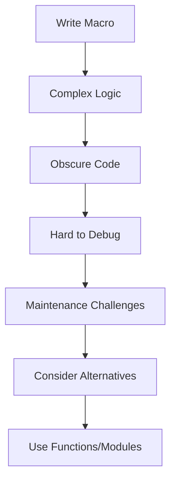

## 21.3 Misusing Macros and Metaprogramming

Metaprogramming in Julia is a powerful feature that allows developers to write code that generates other code. While this can lead to elegant and efficient solutions, it also opens the door to potential misuse. In this section, we will explore the common pitfalls associated with macros and metaprogramming, and provide guidelines to use these features effectively.

### Complex or Obscure Macros

**Explain the Problem**: Macros in Julia are designed to transform code before it is executed. However, when macros become overly complex or obscure, they can make the codebase difficult to understand and maintain. This complexity can lead to errors that are hard to debug and fix.

**Demonstrate with an Example**: Consider a macro that attempts to automate logging for a function. While the intention is to reduce repetitive code, the macro's complexity can obscure its purpose.

```julia
macro log_and_execute(expr)
    return quote
        println("Executing: ", $(string(expr)))
        result = $(esc(expr))
        println("Result: ", result)
        result
    end
end

@log_and_execute begin
    x = 10
    y = x * 2
    y + 5
end
```

**Highlight the Issue**: The macro `@log_and_execute` is relatively simple, but as macros grow in complexity, they can become difficult to read and understand. The use of `esc` and `quote` can be confusing for those unfamiliar with Julia's macro system.

**Provide a Solution**: Simplify macros by limiting their scope and functionality. Use clear and concise naming conventions, and document the macro's purpose and usage.

### Metaprogramming Overuse

**Explain the Problem**: Metaprogramming allows for dynamic code generation, which can be tempting to use extensively. However, overuse can lead to code that is difficult to follow and maintain, especially if the metaprogramming logic is not well-documented or justified.

**Demonstrate with an Example**: Consider a scenario where metaprogramming is used to dynamically create functions based on a set of parameters.

```julia
function create_function(name, operation)
    eval(:(function $(Symbol(name))(x, y)
        return x $operation y
    end))
end

create_function("add", :+)
create_function("subtract", :-)
```

**Highlight the Issue**: While this approach is flexible, it can lead to code that is hard to trace and debug. The use of `eval` can introduce security risks and performance issues.

**Provide a Solution**: Use metaprogramming judiciously. Consider whether the same functionality can be achieved with regular functions or higher-order functions. Document the metaprogramming logic thoroughly.

### Alternatives and Guidelines

**Simplifying Code with Functions and Modules**: Instead of relying heavily on macros and metaprogramming, explore alternatives such as functions and modules. These constructs are more straightforward and easier to understand.

**Guidelines for Effective Use**:
- **Limit Complexity**: Keep macros simple and focused on a single task.
- **Document Thoroughly**: Provide clear documentation for any macros or metaprogramming logic.
- **Test Extensively**: Ensure that macros and metaprogramming code are well-tested to catch potential issues early.
- **Use Sparingly**: Reserve metaprogramming for cases where it provides significant benefits over traditional coding approaches.

### Visualizing the Impact of Misusing Macros

To better understand the impact of misusing macros, let's visualize the flow of macro execution and its potential pitfalls.



**Diagram Explanation**: This flowchart illustrates how complex macro logic can lead to obscure code, making debugging and maintenance challenging. It emphasizes the importance of considering alternatives like functions and modules.

### Try It Yourself

Encourage experimentation by suggesting modifications to the code examples. For instance, try simplifying the `@log_and_execute` macro by removing unnecessary complexity, or refactor the `create_function` logic to use higher-order functions instead of `eval`.

### References and Links

- [Julia Documentation on Macros](https://docs.julialang.org/en/v1/manual/metaprogramming/#Macros)
- [Metaprogramming in Julia](https://julialang.org/blog/2017/04/metaprogramming/)
- [Best Practices for Julia Metaprogramming](https://www.juliabloggers.com/best-practices-for-julia-metaprogramming/)

### Knowledge Check

- **Question**: What are the potential risks of using `eval` in metaprogramming?
- **Exercise**: Refactor a complex macro in your codebase to use functions instead.

### Embrace the Journey

Remember, mastering macros and metaprogramming in Julia is a journey. As you progress, you'll learn to balance the power of these features with the need for code clarity and maintainability. Keep experimenting, stay curious, and enjoy the journey!

### Summary

In this section, we've explored the common pitfalls of misusing macros and metaprogramming in Julia. By understanding the risks and following best practices, you can harness the power of these features without compromising code quality.

## Quiz Time!



### What is a common issue with overly complex macros?

- [x] They make code hard to read and debug.
- [ ] They improve code readability.
- [ ] They simplify code maintenance.
- [ ] They enhance code performance.

> **Explanation:** Overly complex macros can obscure the code's purpose, making it difficult to read and debug.

### What is a potential risk of using `eval` in metaprogramming?

- [x] Security vulnerabilities.
- [ ] Improved performance.
- [ ] Simplified code structure.
- [ ] Enhanced readability.

> **Explanation:** Using `eval` can introduce security vulnerabilities and performance issues.

### What is a recommended alternative to complex macros?

- [x] Using functions and modules.
- [ ] Increasing macro complexity.
- [ ] Avoiding documentation.
- [ ] Using more `eval` statements.

> **Explanation:** Functions and modules are more straightforward and easier to understand than complex macros.

### How can you simplify a macro?

- [x] Limit its scope and functionality.
- [ ] Add more features.
- [ ] Use more metaprogramming.
- [ ] Avoid testing.

> **Explanation:** Simplifying a macro involves limiting its scope and functionality to make it easier to understand.

### What is a key guideline for using metaprogramming?

- [x] Use it sparingly and document thoroughly.
- [ ] Use it extensively without documentation.
- [ ] Avoid testing metaprogramming code.
- [ ] Increase complexity for flexibility.

> **Explanation:** Metaprogramming should be used sparingly and documented thoroughly to ensure code clarity.

### What is a benefit of using functions over macros?

- [x] Easier to understand and maintain.
- [ ] More complex and flexible.
- [ ] Less readable.
- [ ] Harder to debug.

> **Explanation:** Functions are easier to understand and maintain compared to macros.

### What should you do if a macro becomes too complex?

- [x] Refactor it to use functions.
- [ ] Add more complexity.
- [ ] Ignore the complexity.
- [ ] Use more `eval` statements.

> **Explanation:** Refactoring a complex macro to use functions can simplify the code and improve readability.

### What is a common pitfall of metaprogramming overuse?

- [x] Unnecessary complexity without significant benefits.
- [ ] Improved code simplicity.
- [ ] Enhanced code readability.
- [ ] Increased performance.

> **Explanation:** Overusing metaprogramming can add unnecessary complexity without significant benefits.

### How can you ensure macros are well-tested?

- [x] Include them in your test suite.
- [ ] Avoid testing them.
- [ ] Use them sparingly.
- [ ] Increase their complexity.

> **Explanation:** Including macros in your test suite ensures they are well-tested and reliable.

### True or False: Metaprogramming should be used extensively in all Julia projects.

- [ ] True
- [x] False

> **Explanation:** Metaprogramming should be used judiciously and only when it provides significant benefits over traditional coding approaches.


