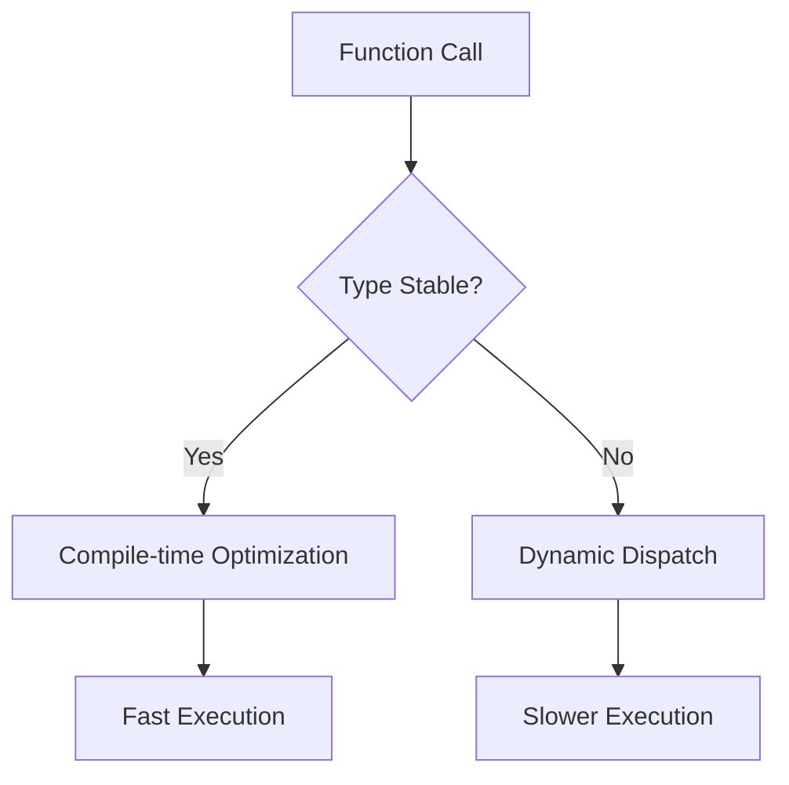

## 21.4 Ignoring Type Stability and Performance

In the world of Julia programming, type stability is a cornerstone of writing efficient and performant code. Ignoring type stability can lead to significant performance degradation, making your applications slower and less responsive. In this section, we will delve into the concept of type stability, explore the consequences of type instability, and provide techniques to ensure type stability in your Julia code.

### Understanding Type Stability

Type stability refers to the property of a function where the return type is predictable based on the types of the input arguments. In Julia, type stability is crucial because it allows the compiler to generate optimized machine code, leading to faster execution.

#### Type Instability Issues

When a function is type unstable, the Julia compiler cannot determine the return type at compile time. This uncertainty forces the compiler to use dynamic dispatch, which involves runtime type checks and can significantly slow down the execution. Let's explore some common scenarios that lead to type instability:

1. **Unpredictable Return Types**: Functions that return different types based on input conditions.
2. **Complex Control Flow**: Functions with intricate logic that makes it difficult to infer the return type.
3. **Use of Global Variables**: Accessing global variables within functions can introduce type instability.

#### Consequences of Type Instability

Ignoring type stability can have several negative impacts on your Julia code:

- **Performance Degradation**: Type instability leads to slower code execution due to dynamic dispatch and the inability to optimize.
- **Increased Memory Usage**: Dynamic dispatch can result in higher memory consumption as the system needs to store additional type information.
- **Harder Debugging**: Type instability can make debugging more challenging, as unexpected types can lead to subtle bugs.

### Ensuring Type Stability

To write performant Julia code, it's essential to ensure type stability. Here are some techniques to achieve this:

#### Type Annotations

Type annotations can help the compiler infer the return type of a function. By explicitly specifying the types of function arguments and return values, you can guide the compiler towards generating optimized code.

```julia
function add_numbers(a::Int, b::Int)::Int
    return a + b
end
```

#### Simplifying Logic

Simplifying the logic within your functions can make it easier for the compiler to infer types. Avoid complex control flows and ensure that the return type is consistent across different code paths.

```julia
function calculate_area(shape::Symbol, dimensions::Tuple{Float64, Float64})::Float64
    if shape == :rectangle
        return dimensions[1] * dimensions[2]
    elseif shape == :circle
        return π * dimensions[1]^2
    else
        error("Unsupported shape")
    end
end
```

#### Avoiding Global Variables

Global variables can introduce type instability because their types can change at runtime. Instead, use local variables or pass necessary data as function arguments.

```julia
function compute_sum(data::Vector{Int})::Int
    total = 0
    for num in data
        total += num
    end
    return total
end
```

### Code Examples and Visualizations

Let's explore some code examples to illustrate the impact of type stability on performance.

#### Example 1: Type-unstable Function

```julia
function unstable_function(x)
    if x > 0
        return x
    else
        return "negative"
    end
end

using BenchmarkTools
@benchmark unstable_function(10)
```

In this example, the function `unstable_function` returns different types based on the input. This type instability leads to slower performance, as seen in the benchmark results.

#### Example 2: Type-stable Function

```julia
function stable_function(x::Int)::Int
    return max(x, 0)
end

@benchmark stable_function(10)
```

By ensuring type stability, the `stable_function` provides consistent performance, as demonstrated by the benchmark results.

#### Visualizing Type Stability

To better understand the concept of type stability, let's visualize the process using a flowchart.



**Figure 1: Visualizing Type Stability and Performance**

In this flowchart, we see that type-stable functions benefit from compile-time optimization, leading to fast execution. In contrast, type-unstable functions rely on dynamic dispatch, resulting in slower execution.

### Try It Yourself

Experiment with the code examples provided above. Try modifying the functions to introduce or resolve type instability and observe the impact on performance using the `BenchmarkTools` package.

### References and Further Reading

- [Julia Documentation: Performance Tips](https://docs.julialang.org/en/v1/manual/performance-tips/)
- [JuliaLang: Understanding Type Stability](https://julialang.org/blog/2018/08/understanding-type-stability/)
- [MDN Web Docs: Type Systems](https://developer.mozilla.org/en-US/docs/Glossary/Type_system)

### Knowledge Check

Let's test your understanding of type stability and performance in Julia with a few questions.

## Quiz Time!



### What is type stability in Julia?

- [x] A property where the return type of a function is predictable based on input types.
- [ ] A feature that allows dynamic typing at runtime.
- [ ] A method for optimizing memory usage.
- [ ] A technique for handling exceptions.

> **Explanation:** Type stability refers to the predictability of a function's return type based on its input types, allowing for compile-time optimization.

### What is a consequence of type instability?

- [x] Slower code execution due to dynamic dispatch.
- [ ] Improved memory usage.
- [ ] Easier debugging.
- [ ] Increased code readability.

> **Explanation:** Type instability leads to slower execution because the compiler cannot optimize the code, resulting in dynamic dispatch.

### How can you ensure type stability in a function?

- [x] Use type annotations for function arguments and return values.
- [ ] Use global variables within the function.
- [ ] Introduce complex control flows.
- [ ] Avoid using local variables.

> **Explanation:** Type annotations help the compiler infer types, ensuring type stability and optimized code generation.

### What is the impact of using global variables in functions?

- [x] They can introduce type instability.
- [ ] They improve code readability.
- [ ] They enhance performance.
- [ ] They simplify debugging.

> **Explanation:** Global variables can change types at runtime, leading to type instability and performance issues.

### Which of the following is a type-stable function?

- [x] `function add(a::Int, b::Int)::Int; return a + b; end`
- [ ] `function add(a, b); return a + b; end`
- [ ] `function add(a::Int, b::Int); return a + b; end`
- [ ] `function add(a::Int, b); return a + b; end`

> **Explanation:** The function with type annotations for arguments and return value is type-stable.

### What does dynamic dispatch involve?

- [x] Runtime type checks and slower execution.
- [ ] Compile-time optimization.
- [ ] Improved memory usage.
- [ ] Simplified control flow.

> **Explanation:** Dynamic dispatch involves runtime type checks, leading to slower execution compared to compile-time optimization.

### How can you visualize type stability?

- [x] Using a flowchart to show the process of optimization and execution.
- [ ] By writing complex code examples.
- [ ] Through memory usage graphs.
- [ ] By analyzing error logs.

> **Explanation:** A flowchart can effectively illustrate the process of type stability and its impact on performance.

### What is a benefit of type-stable functions?

- [x] Faster execution due to compile-time optimization.
- [ ] Increased memory usage.
- [ ] Easier debugging.
- [ ] Improved code readability.

> **Explanation:** Type-stable functions benefit from compile-time optimization, leading to faster execution.

### What is a common cause of type instability?

- [x] Functions returning different types based on input conditions.
- [ ] Consistent return types across all code paths.
- [ ] Use of local variables.
- [ ] Simplified logic within functions.

> **Explanation:** Functions that return different types based on input conditions can lead to type instability.

### True or False: Type stability is not important for performance in Julia.

- [ ] True
- [x] False

> **Explanation:** Type stability is crucial for performance in Julia, as it allows for compile-time optimization and faster execution.



Remember, mastering type stability is a journey. As you continue to explore Julia, keep experimenting with type annotations and optimizing your code for performance. Stay curious and enjoy the process of becoming a more proficient Julia developer!
