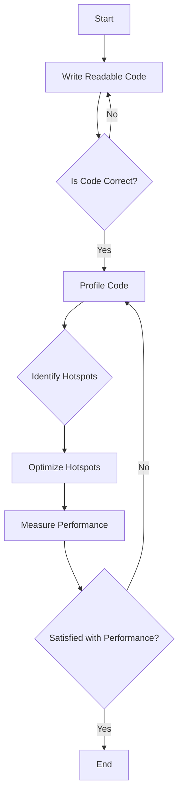

## 21.5 Premature Optimization Pitfalls

In the world of software development, the phrase "premature optimization is the root of all evil" is often quoted to caution developers against the hasty pursuit of performance improvements. This section delves into the concept of premature optimization, its potential pitfalls, and how to adopt a balanced approach to optimization in Julia programming.

### Definition of Premature Optimization

Premature optimization refers to the act of trying to improve the performance of a program before it is necessary or before the program's behavior is fully understood. This often leads to efforts being misplaced, as developers may focus on optimizing parts of the code that do not significantly impact overall performance.

#### Key Characteristics of Premature Optimization:

- **Untimely Efforts**: Optimization is attempted too early in the development process, often before the code is complete or fully functional.
- **Misplaced Focus**: Efforts are directed towards parts of the code that are not performance bottlenecks.
- **Complexity Overhead**: Introduces unnecessary complexity, making the code harder to read, maintain, and debug.

### Negative Effects of Premature Optimization

Premature optimization can have several detrimental effects on software projects, particularly in a language like Julia, which emphasizes clarity and performance.

#### 1. **Increased Complexity**

Optimizing too early can lead to convoluted code structures that are difficult to understand and maintain. This complexity can obscure the original intent of the code, making it challenging for other developers to work with.

```julia
function optimized_sum(arr)
    sum = 0
    for i in 1:2:length(arr)
        sum += arr[i] + (i+1 <= length(arr) ? arr[i+1] : 0)
    end
    return sum
end
```

In this example, the code is optimized to sum pairs of elements in a single loop iteration, but it sacrifices readability.

#### 2. **Reduced Readability**

Readable code is crucial for collaboration and future maintenance. Premature optimization often results in code that is difficult to follow, as it prioritizes performance over clarity.

#### 3. **Negligible Performance Gains**

Often, the parts of the code that are optimized prematurely do not contribute significantly to the program's overall performance. This results in wasted effort with minimal benefit.

#### 4. **Increased Risk of Bugs**

Complex, optimized code is more prone to errors. The added complexity can introduce subtle bugs that are difficult to detect and fix.

### Balanced Approach to Optimization

To avoid the pitfalls of premature optimization, it's essential to adopt a balanced approach that prioritizes correctness and readability before performance. Here are some strategies to achieve this:

#### 1. **Focus on Correctness and Readability First**

Ensure that your code is correct and easy to understand before considering optimization. This approach makes it easier to identify and fix bugs and facilitates collaboration.

```julia
function simple_sum(arr)
    sum = 0
    for num in arr
        sum += num
    end
    return sum
end
```

#### 2. **Profile Before Optimizing**

Use profiling tools to identify actual performance bottlenecks in your code. Julia provides tools like `Profile.jl` to help you understand where your program spends most of its time.

```julia
using Profile

function compute_heavy_task(arr)
    # Simulate a heavy computation task
    return sum(x^2 for x in arr)
end

Profile.clear()
@profile compute_heavy_task(1:10000)
Profile.print()
```

#### 3. **Optimize Hotspots**

Once you have identified the bottlenecks, focus your optimization efforts on these hotspots. This targeted approach ensures that your efforts yield significant performance improvements.

#### 4. **Iterative Optimization**

Adopt an iterative approach to optimization. Make small, incremental changes and measure their impact on performance. This allows you to assess the effectiveness of each optimization step.

#### 5. **Leverage Julia's Features**

Julia offers unique features like multiple dispatch and metaprogramming that can be used to optimize code effectively. Use these features judiciously to achieve performance gains without sacrificing readability.

```julia
function process_data(data::Vector{Int})
    # Optimized for integer data
    return sum(data)
end

function process_data(data::Vector{Float64})
    # Optimized for floating-point data
    return sum(data) / length(data)
end
```

### Visualizing the Optimization Process

To better understand the optimization process, let's visualize the typical workflow using a flowchart.



**Caption**: This flowchart illustrates the iterative process of optimizing code, emphasizing the importance of correctness and profiling before optimization.

### References and Further Reading

- [JuliaLang Profiling](https://docs.julialang.org/en/v1/manual/profile/)
- [Donald Knuth's Quote on Premature Optimization](https://en.wikipedia.org/wiki/Program_optimization#When_to_optimize)
- [MDN Web Docs on Code Optimization](https://developer.mozilla.org/en-US/docs/Web/Performance/How_to_optimize_your_site)

### Knowledge Check

- **Question**: Why is it important to focus on correctness and readability before optimization?
- **Challenge**: Use `Profile.jl` to identify a bottleneck in a simple Julia program and optimize it.

### Embrace the Journey

Remember, optimization is a journey, not a destination. By focusing on correctness and readability first, and using profiling tools to guide your optimization efforts, you'll create efficient and maintainable Julia applications. Keep experimenting, stay curious, and enjoy the process of continuous improvement!

## Quiz Time!



### What is premature optimization?

- [x] Attempting to optimize code before it is necessary or fully understood.
- [ ] Optimizing code after identifying performance bottlenecks.
- [ ] Writing code that is difficult to read.
- [ ] Focusing on code correctness before performance.

> **Explanation:** Premature optimization involves optimizing code too early, often without understanding its impact on performance.

### What is a common negative effect of premature optimization?

- [x] Increased code complexity.
- [ ] Improved code readability.
- [ ] Reduced risk of bugs.
- [ ] Enhanced collaboration among developers.

> **Explanation:** Premature optimization often leads to increased complexity, making code harder to understand and maintain.

### What should be prioritized before optimization?

- [x] Correctness and readability.
- [ ] Performance and speed.
- [ ] Complexity and abstraction.
- [ ] Code obfuscation.

> **Explanation:** Ensuring code is correct and readable is crucial before considering optimization.

### How can you identify performance bottlenecks in Julia?

- [x] Using profiling tools like `Profile.jl`.
- [ ] Guessing based on code complexity.
- [ ] Optimizing every part of the code.
- [ ] Writing more complex algorithms.

> **Explanation:** Profiling tools help identify where the program spends most of its time, guiding optimization efforts.

### What is the benefit of focusing optimization efforts on hotspots?

- [x] Significant performance improvements.
- [ ] Increased code complexity.
- [ ] Reduced code readability.
- [ ] More bugs in the code.

> **Explanation:** Targeting hotspots ensures that optimization efforts yield meaningful performance gains.

### What is an iterative approach to optimization?

- [x] Making small, incremental changes and measuring their impact.
- [ ] Optimizing the entire codebase at once.
- [ ] Ignoring performance until the end of development.
- [ ] Writing complex algorithms from the start.

> **Explanation:** An iterative approach involves gradual improvements, allowing for assessment of each change's effectiveness.

### How can Julia's multiple dispatch feature aid in optimization?

- [x] By allowing specialized methods for different data types.
- [ ] By making code more complex.
- [ ] By reducing code readability.
- [ ] By increasing the risk of bugs.

> **Explanation:** Multiple dispatch enables writing optimized methods for specific data types, improving performance.

### What is a key takeaway from the concept of premature optimization?

- [x] Optimize only after identifying actual performance bottlenecks.
- [ ] Always optimize code from the start.
- [ ] Complexity is more important than readability.
- [ ] Performance should be prioritized over correctness.

> **Explanation:** Optimization should be guided by profiling to ensure efforts are focused on actual bottlenecks.

### True or False: Premature optimization often results in negligible performance gains.

- [x] True
- [ ] False

> **Explanation:** Premature optimization frequently targets non-critical parts of the code, leading to minimal performance improvements.

### What is the main message of the phrase "premature optimization is the root of all evil"?

- [x] Avoid optimizing too early in the development process.
- [ ] Always prioritize performance over readability.
- [ ] Complexity is necessary for optimization.
- [ ] Optimization should be the first step in development.

> **Explanation:** The phrase cautions against optimizing before understanding the code's behavior and identifying bottlenecks.


