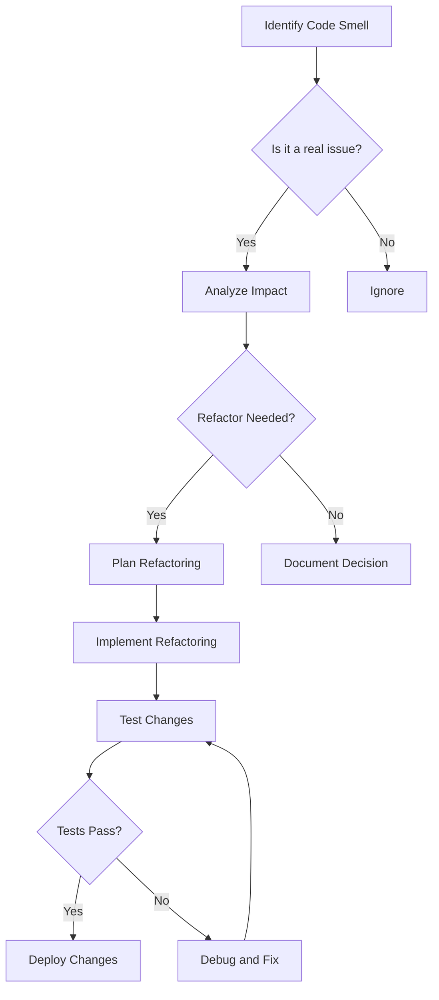

## 21.6 Identifying Code Smells

As developers, we strive to write clean, efficient, and maintainable code. However, over time, even the best codebases can develop "code smells"—subtle indicators that something might be amiss. In this section, we'll explore what code smells are, common examples in Julia, and how to address them effectively.

### What Are Code Smells?

Code smells are not bugs or errors; rather, they are characteristics of the code that may indicate deeper problems. They are often subjective and context-dependent, but recognizing them is crucial for maintaining a healthy codebase. Code smells can lead to increased complexity, reduced readability, and higher maintenance costs if left unaddressed.

#### Key Characteristics of Code Smells

- **Subjective**: What one developer considers a smell, another might not.
- **Contextual**: A smell in one context might be acceptable in another.
- **Indicative**: They suggest potential issues but don't guarantee them.

### Common Code Smells in Julia

Julia, with its unique features like multiple dispatch and metaprogramming, has its own set of common code smells. Let's explore some of these and how they manifest in Julia codebases.

#### 1. Overly Long Functions

Long functions can be difficult to read, understand, and maintain. They often do too much and violate the Single Responsibility Principle.

```julia
function process_data(data)
    # Step 1: Clean data
    cleaned_data = clean_data(data)
    
    # Step 2: Transform data
    transformed_data = transform_data(cleaned_data)
    
    # Step 3: Analyze data
    results = analyze_data(transformed_data)
    
    # Step 4: Generate report
    report = generate_report(results)
    
    return report
end
```

**Solution**: Break down long functions into smaller, more focused functions.

```julia
function process_data(data)
    cleaned_data = clean_data(data)
    transformed_data = transform_data(cleaned_data)
    results = analyze_data(transformed_data)
    return generate_report(results)
end
```

#### 2. Duplicated Code

Duplicated code increases the risk of inconsistencies and makes maintenance more challenging.

```julia
function calculate_area_circle(radius)
    return π * radius^2
end

function calculate_area_square(side)
    return side * side
end

function calculate_area_rectangle(length, width)
    return length * width
end
```

**Solution**: Use abstraction to eliminate duplication.

```julia
abstract type Shape end

struct Circle <: Shape
    radius::Float64
end

struct Square <: Shape
    side::Float64
end

struct Rectangle <: Shape
    length::Float64
    width::Float64
end

function calculate_area(shape::Shape)
    if shape isa Circle
        return π * shape.radius^2
    elseif shape isa Square
        return shape.side^2
    elseif shape isa Rectangle
        return shape.length * shape.width
    else
        error("Unknown shape")
    end
end
```

#### 3. Poor Naming Conventions

Names should be descriptive and convey the purpose of the variable, function, or type.

```julia
function f(x)
    return x * x
end
```

**Solution**: Use meaningful names.

```julia
function square(number)
    return number * number
end
```

#### 4. Excessive Use of Global Variables

Global variables can lead to unpredictable behavior and are difficult to track.

```julia
global_counter = 0

function increment_counter()
    global global_counter
    global_counter += 1
end
```

**Solution**: Encapsulate state within functions or types.

```julia
mutable struct Counter
    value::Int
end

function increment!(counter::Counter)
    counter.value += 1
end
```

#### 5. Misuse of Macros

Macros are powerful but can lead to complex and hard-to-debug code if misused.

```julia
macro debug(expr)
    quote
        println("Debug: ", $(string(expr)), " = ", $expr)
    end
end

@debug x + y
```

**Solution**: Use macros judiciously and prefer functions when possible.

### Addressing Code Smells

Identifying code smells is only the first step. The real challenge lies in addressing them effectively. Here are some strategies for refactoring and improving code quality incrementally.

#### Refactoring Techniques

1. **Extract Function**: Break down large functions into smaller, more manageable ones.
2. **Rename Variables**: Use descriptive names that convey the purpose and usage.
3. **Eliminate Duplication**: Use abstraction to remove duplicated code.
4. **Encapsulate State**: Use types and functions to manage state instead of global variables.
5. **Simplify Logic**: Reduce complexity by simplifying control structures and logic.

#### Best Practices for Refactoring

- **Test-Driven Development (TDD)**: Write tests before refactoring to ensure behavior remains consistent.
- **Incremental Changes**: Make small, incremental changes to minimize risk.
- **Code Reviews**: Use peer reviews to catch potential issues and gather feedback.
- **Continuous Integration**: Automate testing and integration to catch issues early.

### Visualizing Code Smells

To better understand the impact of code smells, let's visualize the process of identifying and addressing them using a flowchart.



**Diagram Description**: This flowchart illustrates the process of identifying code smells, analyzing their impact, and deciding whether refactoring is necessary. It emphasizes the importance of testing and documentation throughout the process.

### Try It Yourself

To solidify your understanding, try identifying and addressing code smells in your own projects. Start by reviewing a small section of code and look for common smells such as long functions or duplicated code. Experiment with refactoring techniques and observe the impact on code readability and maintainability.

### References and Links

- [Refactoring: Improving the Design of Existing Code](https://martinfowler.com/books/refactoring.html) by Martin Fowler
- [Code Smells](https://en.wikipedia.org/wiki/Code_smell) on Wikipedia
- [Julia Documentation](https://docs.julialang.org/)

### Knowledge Check

- What are code smells, and why are they important to identify?
- How can long functions be refactored to improve readability?
- What are the risks associated with duplicated code?
- Why is it important to use descriptive naming conventions?
- How can global variables be managed more effectively?

### Embrace the Journey

Remember, identifying and addressing code smells is an ongoing process. As you gain experience, you'll become more adept at recognizing subtle indicators of potential issues. Keep experimenting, stay curious, and enjoy the journey toward cleaner, more maintainable code!

## Quiz Time!



### What are code smells?

- [x] Indicators of potential deeper problems in the codebase
- [ ] Syntax errors in the code
- [ ] Compiler warnings
- [ ] Runtime exceptions

> **Explanation:** Code smells are characteristics of the code that suggest potential issues, not actual errors or exceptions.

### Which of the following is a common code smell?

- [x] Overly long functions
- [ ] Proper use of functions
- [ ] Well-documented code
- [ ] Efficient algorithms

> **Explanation:** Overly long functions are a common code smell as they can be difficult to read and maintain.

### How can duplicated code be addressed?

- [x] By using abstraction to eliminate duplication
- [ ] By adding more comments
- [ ] By increasing the code length
- [ ] By using global variables

> **Explanation:** Abstraction helps eliminate duplicated code by creating reusable components.

### Why is poor naming a code smell?

- [x] It reduces code readability and understanding
- [ ] It increases code performance
- [ ] It enhances code security
- [ ] It simplifies code logic

> **Explanation:** Poor naming conventions make it harder to understand the purpose and usage of code elements.

### What is a recommended practice for managing global variables?

- [x] Encapsulate state within functions or types
- [ ] Use more global variables
- [ ] Ignore them
- [ ] Increase their scope

> **Explanation:** Encapsulating state within functions or types helps manage global variables more effectively.

### What is the first step in addressing code smells?

- [x] Identifying the code smell
- [ ] Writing more code
- [ ] Ignoring the smell
- [ ] Deleting the code

> **Explanation:** Identifying the code smell is the first step in addressing it.

### What is a benefit of refactoring code?

- [x] Improved code readability and maintainability
- [ ] Increased code length
- [ ] More complex logic
- [ ] Higher number of global variables

> **Explanation:** Refactoring improves code readability and maintainability by simplifying and organizing the code.

### How can long functions be refactored?

- [x] By breaking them into smaller, focused functions
- [ ] By adding more comments
- [ ] By increasing their length
- [ ] By using more global variables

> **Explanation:** Breaking long functions into smaller, focused functions improves readability and maintainability.

### What is the role of testing in refactoring?

- [x] Ensuring behavior remains consistent after changes
- [ ] Increasing code complexity
- [ ] Ignoring code smells
- [ ] Reducing code readability

> **Explanation:** Testing ensures that the code's behavior remains consistent after refactoring changes.

### True or False: Code smells are always indicative of bugs.

- [ ] True
- [x] False

> **Explanation:** Code smells are not bugs; they are indicators of potential deeper issues in the codebase.


