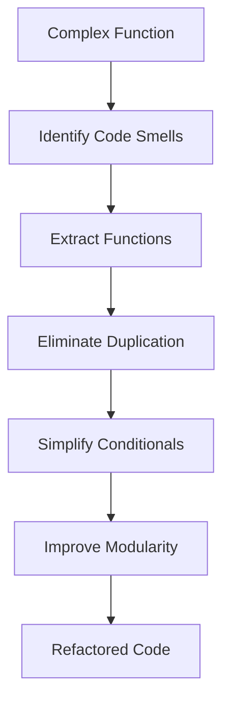

## 21.7 Refactoring Techniques and Strategies

Refactoring is a critical practice in software development that involves restructuring existing code without altering its external behavior. This process enhances code readability, reduces complexity, and improves maintainability. In this section, we will explore various refactoring techniques and strategies specific to Julia, a high-performance programming language known for its expressive syntax and powerful features.

### The Process of Refactoring

Refactoring is a systematic approach to improving code quality. It involves identifying areas of improvement, applying specific techniques, and ensuring that the code's functionality remains unchanged. Here are the key steps in the refactoring process:

1. **Identify Code Smells**: Recognize patterns in the code that indicate potential issues, such as duplicated code, long methods, or complex conditionals.
2. **Select Refactoring Techniques**: Choose appropriate techniques to address the identified code smells.
3. **Apply Refactoring**: Implement the selected techniques while ensuring that the code's behavior remains consistent.
4. **Test the Code**: Verify that the refactored code functions correctly by running existing tests or creating new ones.
5. **Review and Iterate**: Continuously review the code for further improvement opportunities.

### When to Refactor

Refactoring should be an ongoing practice throughout the software development lifecycle. However, there are specific situations where refactoring is particularly beneficial:

- **Before Adding New Features**: Ensure the existing codebase is clean and maintainable to facilitate the integration of new features.
- **After Identifying Bugs**: Use refactoring to simplify the code and make it easier to identify and fix bugs.
- **During Code Reviews**: Encourage refactoring as part of the code review process to maintain high code quality.
- **When Performance Issues Arise**: Refactor to optimize code performance without altering its functionality.

### Techniques for Refactoring in Julia

Julia offers several powerful features that facilitate effective refactoring. Here are some common techniques:

#### Extracting Functions

Extracting functions involves breaking down complex code into smaller, reusable functions. This improves code readability and promotes code reuse.

```julia
function process_data(data)
    result = []
    for item in data
        if item > 0
            push!(result, item * 2)
        end
    end
    return result
end

function process_data(data)
    return filter_map(data, x -> x > 0, x -> x * 2)
end

function filter_map(data, filter_fn, map_fn)
    result = []
    for item in data
        if filter_fn(item)
            push!(result, map_fn(item))
        end
    end
    return result
end
```

#### Eliminating Duplication

Duplication in code can lead to maintenance challenges. Use Julia's powerful multiple dispatch and parametric types to eliminate redundancy.

```julia
function calculate_area(shape::Circle)
    return π * shape.radius^2
end

function calculate_area(shape::Square)
    return shape.side^2
end

abstract type Shape end

struct Circle <: Shape
    radius::Float64
end

struct Square <: Shape
    side::Float64
end

function calculate_area(shape::Shape)
    if shape isa Circle
        return π * shape.radius^2
    elseif shape isa Square
        return shape.side^2
    end
end
```

#### Simplifying Conditionals

Complex conditionals can be difficult to understand and maintain. Simplify them using pattern matching or guard clauses.

```julia
function categorize_age(age)
    if age < 13
        return "Child"
    elseif age < 20
        return "Teenager"
    else
        return "Adult"
    end
end

function categorize_age(age)
    return age < 13 ? "Child" : age < 20 ? "Teenager" : "Adult"
end
```

#### Improving Modularity

Modular code is easier to understand, test, and maintain. Use Julia's module system to organize code into logical units.

```julia
function calculate_tax(income)
    if income < 10000
        return income * 0.1
    else
        return income * 0.2
    end
end

module TaxCalculator

export calculate_tax

function calculate_tax(income)
    return income < 10000 ? income * 0.1 : income * 0.2
end

end
```

### Visualizing Refactoring Techniques

To better understand the refactoring process, let's visualize the transformation of a complex function into a modular structure using a flowchart.



**Figure 1**: Visualizing the Refactoring Process

### Try It Yourself

Experiment with the provided code examples by modifying them to suit different scenarios. For instance, try adding a new shape type to the `calculate_area` function or modify the `categorize_age` function to include additional age categories.

### References and Links

For further reading on refactoring techniques and best practices, consider exploring the following resources:

- [Refactoring: Improving the Design of Existing Code](https://martinfowler.com/books/refactoring.html) by Martin Fowler
- [JuliaLang Documentation](https://docs.julialang.org/)
- [Design Patterns in Julia](https://github.com/svaksha/Julia.jl)

### Knowledge Check

Let's reinforce your understanding of refactoring techniques with some questions:

1. What is the primary goal of refactoring?
2. When is it most beneficial to refactor code?
3. How can extracting functions improve code quality?
4. What are some common code smells that indicate the need for refactoring?
5. How does Julia's multiple dispatch facilitate refactoring?

### Embrace the Journey

Remember, refactoring is an ongoing process that requires practice and patience. As you continue to refine your skills, you'll find that refactoring not only improves code quality but also enhances your understanding of the codebase. Keep experimenting, stay curious, and enjoy the journey!

## Quiz Time!



### What is the primary goal of refactoring?

- [x] To improve code quality without changing its external behavior
- [ ] To add new features to the code
- [ ] To rewrite the entire codebase
- [ ] To increase the complexity of the code

> **Explanation:** Refactoring aims to enhance code quality, readability, and maintainability without altering its external behavior.

### When is it most beneficial to refactor code?

- [x] Before adding new features
- [x] After identifying bugs
- [ ] During the initial development phase
- [ ] When the code is already perfect

> **Explanation:** Refactoring is particularly beneficial before adding new features and after identifying bugs to ensure the codebase is clean and maintainable.

### How can extracting functions improve code quality?

- [x] By breaking down complex code into smaller, reusable functions
- [ ] By increasing the number of lines in the code
- [ ] By making the code more difficult to understand
- [ ] By duplicating code across the codebase

> **Explanation:** Extracting functions improves code readability and promotes code reuse by breaking down complex code into smaller, manageable pieces.

### What are some common code smells that indicate the need for refactoring?

- [x] Duplicated code
- [x] Long methods
- [ ] Well-documented code
- [ ] Simple conditionals

> **Explanation:** Duplicated code and long methods are common code smells that suggest the need for refactoring to improve code quality.

### How does Julia's multiple dispatch facilitate refactoring?

- [x] By allowing functions to be defined for different types
- [ ] By increasing code duplication
- [ ] By making the code more complex
- [ ] By reducing code readability

> **Explanation:** Julia's multiple dispatch allows functions to be defined for different types, reducing redundancy and improving code organization.

### What is the benefit of simplifying conditionals?

- [x] It makes the code easier to understand and maintain
- [ ] It increases the number of conditional statements
- [ ] It makes the code more complex
- [ ] It reduces code readability

> **Explanation:** Simplifying conditionals makes the code easier to understand and maintain by reducing complexity.

### Why is modularity important in code?

- [x] It makes the code easier to understand, test, and maintain
- [ ] It increases the complexity of the code
- [ ] It reduces code readability
- [ ] It duplicates code across the codebase

> **Explanation:** Modularity improves code organization, making it easier to understand, test, and maintain.

### What is a key step in the refactoring process?

- [x] Identify code smells
- [ ] Increase code duplication
- [ ] Add new features
- [ ] Rewrite the entire codebase

> **Explanation:** Identifying code smells is a key step in the refactoring process to recognize areas of improvement.

### How can refactoring help with performance issues?

- [x] By optimizing code without altering functionality
- [ ] By adding more features to the code
- [ ] By increasing code complexity
- [ ] By duplicating code

> **Explanation:** Refactoring can optimize code performance without changing its functionality, addressing performance issues effectively.

### True or False: Refactoring should only be done at the end of a project.

- [ ] True
- [x] False

> **Explanation:** Refactoring should be an ongoing practice throughout the software development lifecycle, not just at the end of a project.


