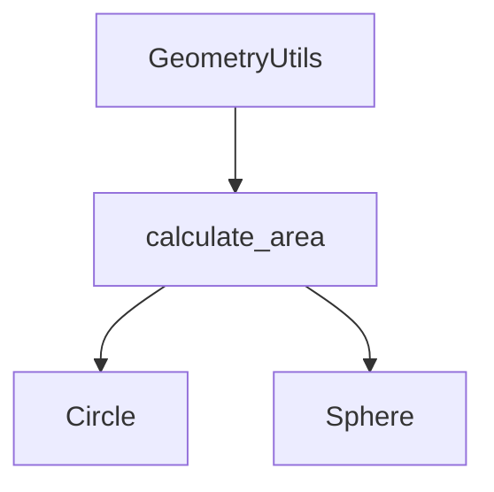

## 21.8 Improving Code Readability and Maintainability

In the world of software development, code readability and maintainability are paramount. As developers, we often spend more time reading code than writing it. Therefore, writing code that is easy to read and maintain is crucial for collaboration, debugging, and extending functionality. In this section, we'll explore strategies to enhance code readability and maintainability in Julia, focusing on formatting standards, documentation, and best practices for clean code.

### Importance of Readability

Readable code is like a well-written book: it communicates its intent clearly and concisely. When code is readable, it becomes easier to understand, modify, and extend. This is especially important in collaborative environments where multiple developers work on the same codebase. Let's delve into why readability is essential:

- **Easier Maintenance**: Readable code simplifies the process of identifying and fixing bugs, as well as adding new features.
- **Improved Collaboration**: When code is easy to understand, team members can collaborate more effectively, reducing the learning curve for new developers.
- **Reduced Errors**: Clear code reduces the likelihood of introducing errors during modifications.
- **Faster Onboarding**: New developers can quickly get up to speed with a codebase that is well-organized and documented.

### Code Formatting Standards

Adopting consistent code formatting standards is the first step towards improving readability. Let's explore some key formatting practices:

#### Indentation and Spacing

Consistent indentation and spacing make code visually appealing and easier to follow. In Julia, the convention is to use four spaces per indentation level. Avoid mixing tabs and spaces, as this can lead to inconsistent formatting across different editors.

```julia
function greet(name::String)
    println("Hello, $name!")
end
```

#### Line Length

Keeping line lengths reasonable (typically 80-100 characters) ensures that code is easy to read on different devices and editors. Long lines can be broken into multiple lines for better readability.

```julia
function long_function_name_with_many_parameters(param1, param2, param3,
                                                 param4, param5)
    # Function body
end
```

#### Consistent Naming Conventions

Use descriptive and consistent naming conventions for variables, functions, and modules. In Julia, it's common to use `snake_case` for variable and function names and `CamelCase` for module names.

```julia
user_name = "Alice"
function calculate_area(radius::Float64)
    return π * radius^2
end

module GeometryUtils
    # Module content
end
```

### Documentation and Comments

Documentation and comments play a vital role in explaining the purpose and functionality of code. Let's explore how to effectively document your Julia code:

#### Writing Clear Docstrings

Docstrings provide a way to document functions, types, and modules. They should describe what the code does, its parameters, and return values. In Julia, docstrings are written using triple quotes `"""`.

```julia
"""
    calculate_area(radius::Float64) -> Float64

Calculate the area of a circle given its radius.

- `radius::Float64`: The radius of the circle.

- `Float64`: The area of the circle.
"""
function calculate_area(radius::Float64)
    return π * radius^2
end
```

#### Module Documentation

Documenting modules provides an overview of the module's purpose and functionality. This is especially useful for larger projects with multiple modules.

```julia
module GeometryUtils

"""
    GeometryUtils

A module for performing geometric calculations, including area and perimeter calculations for various shapes.
"""

end
```

#### Inline Comments

Use inline comments sparingly to explain complex logic or important decisions in the code. Avoid stating the obvious, as excessive comments can clutter the code.

```julia
function fibonacci(n::Int)
    # Base cases
    if n == 0
        return 0
    elseif n == 1
        return 1
    end

    # Recursive case
    return fibonacci(n - 1) + fibonacci(n - 2)
end
```

### Best Practices for Clean Code

Beyond formatting and documentation, several best practices contribute to clean, maintainable code:

#### Avoiding Code Duplication

The DRY (Don't Repeat Yourself) principle emphasizes reducing code duplication. Repeated code can lead to inconsistencies and make maintenance difficult. Use functions and modules to encapsulate reusable logic.

```julia
function calculate_circle_area(radius::Float64)
    return π * radius^2
end

function calculate_sphere_area(radius::Float64)
    return 4 * π * radius^2
end

function calculate_area(radius::Float64, shape::Symbol)
    if shape == :circle
        return π * radius^2
    elseif shape == :sphere
        return 4 * π * radius^2
    else
        error("Unsupported shape")
    end
end
```

#### Modular Design

Organize code into modules to separate concerns and improve maintainability. Each module should have a clear responsibility and interface.

```julia
module GeometryUtils

export calculate_area

function calculate_area(radius::Float64, shape::Symbol)
    if shape == :circle
        return π * radius^2
    elseif shape == :sphere
        return 4 * π * radius^2
    else
        error("Unsupported shape")
    end
end

end
```

#### Leveraging Julia's Type System

Julia's type system allows for expressive and flexible code. Use types to enforce constraints and improve code clarity.

```julia
abstract type Shape end

struct Circle <: Shape
    radius::Float64
end

struct Sphere <: Shape
    radius::Float64
end

function calculate_area(shape::Shape)
    if shape isa Circle
        return π * shape.radius^2
    elseif shape isa Sphere
        return 4 * π * shape.radius^2
    else
        error("Unsupported shape")
    end
end
```

### Visualizing Code Structure

Visualizing code structure can aid in understanding complex relationships and dependencies. Let's explore how to use diagrams to represent code structure.

#### Module and Function Relationships



*Diagram: Module and function relationships in the GeometryUtils module.*

### Try It Yourself

To reinforce these concepts, try modifying the code examples provided. Experiment with different naming conventions, add docstrings to undocumented functions, or refactor code to reduce duplication. By actively engaging with the code, you'll gain a deeper understanding of how to improve readability and maintainability.

### References and Further Reading

- [Julia Documentation](https://docs.julialang.org/en/v1/)
- [Effective Julia](https://docs.julialang.org/en/v1/manual/performance-tips/)
- [Clean Code: A Handbook of Agile Software Craftsmanship](https://www.goodreads.com/book/show/3735293-clean-code)

### Knowledge Check

- What are the benefits of readable code?
- How can consistent indentation improve code readability?
- Why is it important to document functions and modules?
- How does the DRY principle contribute to maintainable code?
- What role does Julia's type system play in code clarity?

### Embrace the Journey

Improving code readability and maintainability is an ongoing journey. As you continue to develop your skills in Julia, remember that clean code is not just about following rules—it's about communicating effectively with your future self and your collaborators. Keep experimenting, stay curious, and enjoy the process of crafting beautiful, maintainable code.

## Quiz Time!



### What is one of the primary benefits of readable code?

- [x] Easier maintenance and debugging
- [ ] Faster execution
- [ ] More compact code
- [ ] Increased complexity

> **Explanation:** Readable code simplifies maintenance and debugging, making it easier to understand and modify.

### Which indentation style is recommended in Julia?

- [x] Four spaces per indentation level
- [ ] Two spaces per indentation level
- [ ] Tabs
- [ ] No indentation

> **Explanation:** Julia conventionally uses four spaces per indentation level for consistency and readability.

### What is the purpose of docstrings in Julia?

- [x] To document functions, types, and modules
- [ ] To execute code
- [ ] To optimize performance
- [ ] To format code

> **Explanation:** Docstrings provide documentation for functions, types, and modules, explaining their purpose and usage.

### How does the DRY principle help in code maintainability?

- [x] By reducing code duplication
- [ ] By increasing code complexity
- [ ] By making code longer
- [ ] By using more resources

> **Explanation:** The DRY principle emphasizes reducing code duplication, which leads to more maintainable and consistent code.

### What is a common naming convention for modules in Julia?

- [x] CamelCase
- [ ] snake_case
- [ ] kebab-case
- [ ] ALL_CAPS

> **Explanation:** In Julia, modules typically use CamelCase for naming.

### Why should line lengths be kept reasonable?

- [x] To ensure code is easy to read on different devices
- [ ] To make code run faster
- [ ] To reduce file size
- [ ] To increase complexity

> **Explanation:** Keeping line lengths reasonable ensures code is easy to read on various devices and editors.

### What is the role of inline comments?

- [x] To explain complex logic or important decisions
- [ ] To execute code
- [ ] To optimize performance
- [ ] To format code

> **Explanation:** Inline comments are used to explain complex logic or important decisions in the code.

### How can modular design improve code maintainability?

- [x] By separating concerns and improving organization
- [ ] By increasing code length
- [ ] By reducing performance
- [ ] By making code more complex

> **Explanation:** Modular design separates concerns and improves organization, leading to more maintainable code.

### What is a benefit of using Julia's type system?

- [x] Enforcing constraints and improving code clarity
- [ ] Slowing down execution
- [ ] Increasing code size
- [ ] Reducing readability

> **Explanation:** Julia's type system enforces constraints and improves code clarity, making it easier to understand and maintain.

### True or False: Excessive comments can clutter code.

- [x] True
- [ ] False

> **Explanation:** Excessive comments can clutter code, making it harder to read. Comments should be used sparingly and only when necessary.


