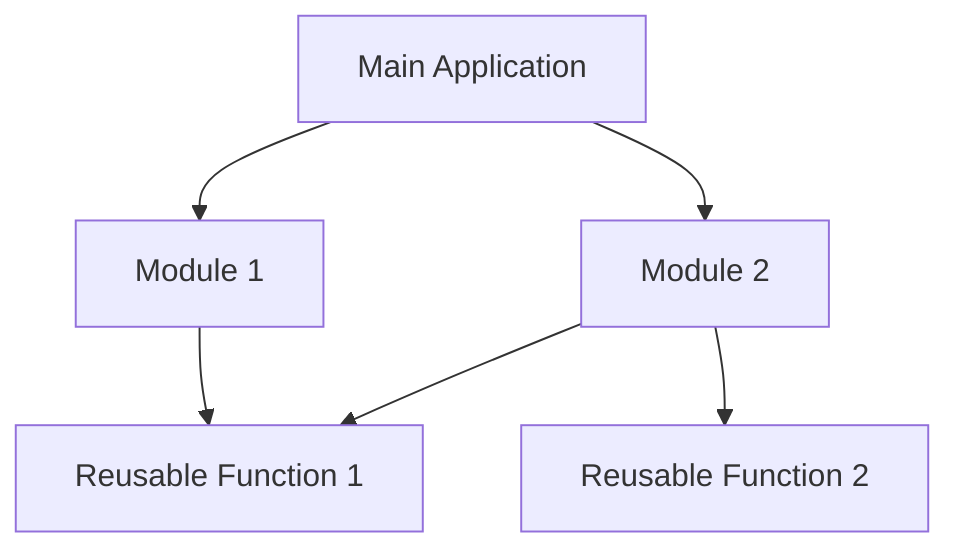

## 21.9 Promoting Modularity and Reusability

In the realm of software development, modularity and reusability are crucial for building scalable, maintainable, and efficient applications. Julia, with its unique features and capabilities, offers a robust platform for implementing these principles. In this section, we will delve into the concepts of modularity and reusability, explore how to achieve them in Julia, and provide practical examples and best practices.

### Understanding Modularity

**Modularity** refers to the design principle of breaking down a software system into smaller, self-contained components or modules. Each module encapsulates a specific functionality, making it easier to manage, understand, and test. Modularity enhances code readability and maintainability, allowing developers to focus on individual components without being overwhelmed by the entire system.

#### Benefits of Modularity

- **Improved Maintainability**: Modular code is easier to maintain and update. Changes in one module do not affect others, reducing the risk of introducing bugs.
- **Enhanced Collaboration**: Teams can work on different modules simultaneously, improving collaboration and productivity.
- **Scalability**: Modular systems can be easily extended by adding new modules without disrupting existing functionality.
- **Reusability**: Modules can be reused across different projects, saving time and effort in development.

### Implementing Modularity in Julia

Julia provides several features and constructs that facilitate modular design. Let's explore some of these features and how they can be leveraged to promote modularity.

#### Modules and Namespaces

In Julia, modules are the primary means of achieving modularity. A module is a collection of functions, types, and variables that can be grouped together. Modules help in organizing code and managing namespaces, preventing name clashes.

```julia
module MathOperations

export add, subtract

function add(a, b)
    return a + b
end

function subtract(a, b)
    return a - b
end

end
```

In the above example, `MathOperations` is a module that contains two functions, `add` and `subtract`. By using the `export` keyword, we specify which functions are accessible from outside the module.

#### Encapsulation

**Encapsulation** is the practice of hiding the internal details of a module and exposing only the necessary interfaces. This ensures that the internal implementation can be changed without affecting other parts of the system.

```julia
module SecureOperations

export encrypt, decrypt

const SECRET_KEY = "my_secret_key"

function encrypt(data)
    # Encryption logic using SECRET_KEY
    return "encrypted_" * data
end

function decrypt(data)
    # Decryption logic using SECRET_KEY
    return replace(data, "encrypted_" => "")
end

end
```

In this example, `SECRET_KEY` is encapsulated within the `SecureOperations` module. The functions `encrypt` and `decrypt` provide the necessary interface for encryption and decryption, while the key remains hidden.

### Promoting Reusability

Reusability is the ability to use existing code components in different contexts or applications. It reduces redundancy and accelerates development by leveraging pre-existing solutions.

#### Leveraging Julia's Package Ecosystem

Julia has a rich package ecosystem that provides a wide range of functionalities. Reusing existing libraries and packages is a key strategy for promoting reusability.

```julia
using DataFrames

df = DataFrame(Name = ["Alice", "Bob"], Age = [25, 30])

println(df)
```

In this example, we use the `DataFrames` package to create and manipulate tabular data. By leveraging existing packages, we avoid reinventing the wheel and focus on building higher-level functionalities.

#### Creating Reusable Functions and Types

Design functions and types with reusability in mind. Avoid hardcoding values and dependencies, and use parameters to make functions more flexible.

```julia
function calculate_area(shape::Symbol, dimensions...)
    if shape == :circle
        return π * dimensions[1]^2
    elseif shape == :rectangle
        return dimensions[1] * dimensions[2]
    else
        error("Unsupported shape")
    end
end

println(calculate_area(:circle, 5))  # Circle with radius 5
println(calculate_area(:rectangle, 4, 6))  # Rectangle with width 4 and height 6
```

The `calculate_area` function is designed to be reusable for different shapes by accepting a `Symbol` and a variable number of dimensions.

### Best Practices for Modularity and Reusability

To effectively promote modularity and reusability in Julia, consider the following best practices:

- **Design for Change**: Anticipate future changes and design modules that can be easily modified or extended.
- **Use Clear Interfaces**: Define clear and concise interfaces for modules. This makes it easier for other developers to understand and use your code.
- **Document Your Code**: Provide comprehensive documentation for your modules and functions. This aids in understanding and reusing your code.
- **Adopt a Consistent Naming Convention**: Use consistent naming conventions for modules, functions, and variables to improve code readability.
- **Test Modules Independently**: Write unit tests for individual modules to ensure they work as expected in isolation.

### Visualizing Modularity and Reusability

To better understand how modularity and reusability work together, let's visualize the relationship between modules and their interactions.



In this diagram, the main application interacts with two modules, each containing reusable functions. The functions can be shared between modules, promoting reusability.

### Try It Yourself

To reinforce your understanding of modularity and reusability, try modifying the code examples provided:

- Add a new function to the `MathOperations` module and export it.
- Modify the `calculate_area` function to support additional shapes, such as triangles.
- Create a new module that uses the `DataFrames` package to perform data analysis.

### References and Further Reading

- [Julia Documentation on Modules](https://docs.julialang.org/en/v1/manual/modules/)
- [Julia Packages](https://julialang.org/packages/)
- [Design Patterns: Elements of Reusable Object-Oriented Software](https://en.wikipedia.org/wiki/Design_Patterns)

### Knowledge Check

- What are the benefits of modularity in software design?
- How does encapsulation enhance modularity?
- Why is reusability important in software development?
- How can you leverage Julia's package ecosystem for reusability?

### Embrace the Journey

Remember, promoting modularity and reusability is an ongoing process. As you continue to develop in Julia, keep experimenting with different design patterns and best practices. Stay curious, and enjoy the journey of building efficient and maintainable software!

## Quiz Time!



### What is modularity in software design?

- [x] Breaking down a system into smaller, self-contained components
- [ ] Combining multiple systems into one large system
- [ ] Writing code without any structure
- [ ] Using global variables extensively

> **Explanation:** Modularity involves breaking down a system into smaller, manageable components, each encapsulating specific functionality.

### How does encapsulation benefit modularity?

- [x] By hiding internal details and exposing clear interfaces
- [ ] By making all internal details public
- [ ] By increasing code complexity
- [ ] By reducing code readability

> **Explanation:** Encapsulation hides internal details and exposes only necessary interfaces, making modules easier to manage and modify.

### Which of the following is a benefit of reusability?

- [x] Reduces redundancy and accelerates development
- [ ] Increases the amount of code to write
- [ ] Makes code harder to understand
- [ ] Requires more memory

> **Explanation:** Reusability reduces redundancy by allowing existing components to be used in different contexts, speeding up development.

### What is the primary means of achieving modularity in Julia?

- [x] Modules
- [ ] Functions
- [ ] Variables
- [ ] Loops

> **Explanation:** In Julia, modules are used to organize code and manage namespaces, facilitating modularity.

### How can you promote reusability in Julia?

- [x] By leveraging existing libraries and packages
- [ ] By writing all code from scratch
- [ ] By avoiding the use of functions
- [ ] By using global variables

> **Explanation:** Leveraging existing libraries and packages allows developers to reuse pre-existing solutions, promoting reusability.

### What is the role of the `export` keyword in a Julia module?

- [x] To specify which functions are accessible from outside the module
- [ ] To import functions from another module
- [ ] To delete functions from the module
- [ ] To rename functions within the module

> **Explanation:** The `export` keyword specifies which functions or variables are accessible from outside the module.

### Why is documentation important for promoting reusability?

- [x] It aids in understanding and using code effectively
- [ ] It makes code harder to read
- [ ] It is only useful for beginners
- [ ] It is not necessary for experienced developers

> **Explanation:** Documentation provides essential information about how to use and understand code, making it easier to reuse.

### What is a key strategy for designing reusable functions?

- [x] Avoid hardcoding values and dependencies
- [ ] Use as many global variables as possible
- [ ] Write functions with a single fixed purpose
- [ ] Avoid using parameters

> **Explanation:** Designing functions without hardcoded values and dependencies makes them more flexible and reusable.

### Which of the following is a best practice for modularity?

- [x] Define clear and concise interfaces for modules
- [ ] Use inconsistent naming conventions
- [ ] Write code without any comments
- [ ] Avoid testing modules independently

> **Explanation:** Clear and concise interfaces make modules easier to understand and use, promoting modularity.

### True or False: Modularity and reusability are unrelated concepts.

- [ ] True
- [x] False

> **Explanation:** Modularity and reusability are closely related; modular design often leads to reusable components.


