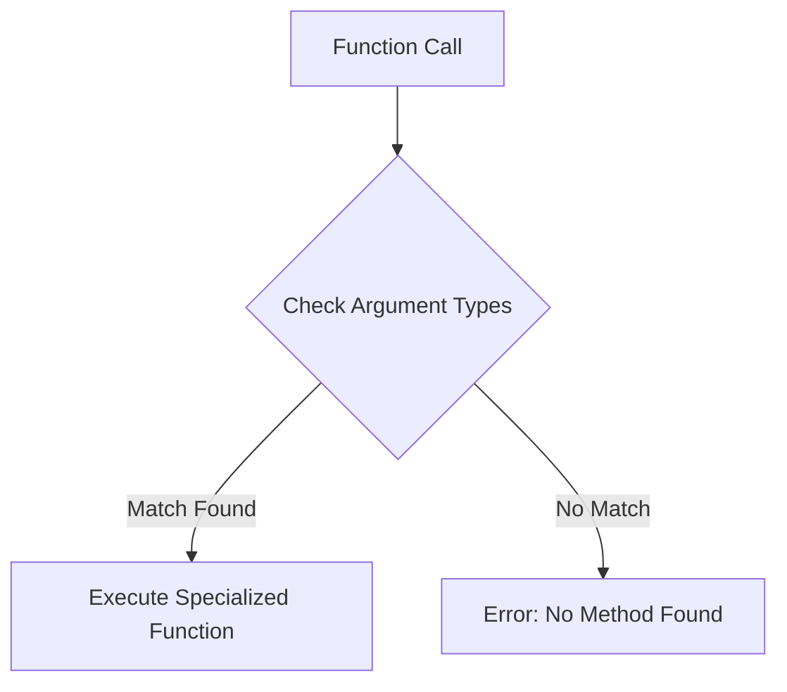

## 22.1 Writing Idiomatic Julia Code

Writing idiomatic code in Julia is about leveraging the language's unique features to produce code that is not only efficient but also readable and maintainable. In this section, we will explore how to embrace Julia's paradigms, avoid common anti-patterns, and write code that truly reflects the idiomatic style of Julia programming.

### Embracing Julia’s Paradigms

Julia is a high-level, high-performance programming language for technical computing, with syntax that is familiar to users of other technical computing environments. However, to write idiomatic Julia code, we need to embrace its unique paradigms, such as multiple dispatch, composability, and its powerful type system.

#### Utilizing Multiple Dispatch

Multiple dispatch is one of Julia's most powerful features, allowing functions to be defined for different combinations of argument types. This enables more flexible and reusable code.

**Example:**

```julia
function area(shape)
    error("area not implemented for this shape")
end

function area(shape::Circle)
    return π * shape.radius^2
end

function area(shape::Rectangle)
    return shape.width * shape.height
end

struct Circle
    radius::Float64
end

struct Rectangle
    width::Float64
    height::Float64
end

c = Circle(5.0)
r = Rectangle(4.0, 6.0)

println("Area of circle: ", area(c))  # Output: Area of circle: 78.53981633974483
println("Area of rectangle: ", area(r))  # Output: Area of rectangle: 24.0
```

**Key Takeaway:** Use multiple dispatch to write functions that can handle different types of inputs, making your code more modular and easier to extend.

#### Composability

Julia encourages composability, where small, simple functions are combined to build more complex functionality. This is often achieved through higher-order functions and function chaining.

**Example:**

```julia
double(x) = 2x
square(x) = x^2

composed_function = double ∘ square

result = composed_function(3)  # Output: 18
println("Result of composed function: ", result)
```

**Key Takeaway:** Write small, reusable functions and compose them to achieve complex behavior. This leads to cleaner and more maintainable code.

#### Leveraging the Type System

Julia's type system is both expressive and flexible, allowing you to define custom types and use parametric types to write generic code.

**Example:**

```julia
struct Point{T}
    x::T
    y::T
end

function distance(p1::Point{T}, p2::Point{T}) where T
    return sqrt((p2.x - p1.x)^2 + (p2.y - p1.y)^2)
end

p1 = Point(1.0, 2.0)
p2 = Point(4.0, 6.0)

println("Distance between points: ", distance(p1, p2))  # Output: Distance between points: 5.0
```

**Key Takeaway:** Use Julia's type system to create clear and efficient abstractions, making your code more robust and easier to understand.

### Avoiding Anti-Patterns

To write idiomatic Julia code, it's important to avoid common anti-patterns that can lead to inefficient or hard-to-maintain code.

#### Overuse of Global Variables

Global variables can lead to performance issues and make code harder to reason about. Instead, use local variables and pass data through function arguments.

**Non-idiomatic Example:**

```julia
x = 10

function increment_global()
    global x += 1
end

increment_global()
println(x)  # Output: 11
```

**Idiomatic Example:**

```julia
function increment(x)
    return x + 1
end

x = 10
x = increment(x)
println(x)  # Output: 11
```

**Key Takeaway:** Avoid global variables. Use function arguments and return values to manage state.

#### Misusing Type Annotations

While type annotations can improve performance, overusing them can make code less flexible and harder to read.

**Non-idiomatic Example:**

```julia
function add(x::Int, y::Int)::Int
    return x + y
end
```

**Idiomatic Example:**

```julia
function add(x, y)
    return x + y
end
```

**Key Takeaway:** Use type annotations judiciously. Let Julia's type inference do the heavy lifting.

#### Ignoring Type Stability

Type stability is crucial for performance in Julia. Ensure that functions return consistent types.

**Non-idiomatic Example:**

```julia
function unstable(x)
    if x > 0
        return x
    else
        return "negative"
    end
end
```

**Idiomatic Example:**

```julia
function stable(x)
    if x > 0
        return x
    else
        return 0
    end
end
```

**Key Takeaway:** Ensure functions are type-stable by returning consistent types.

### Code Examples: Idiomatic vs. Non-Idiomatic

Let's look at some examples to illustrate the difference between idiomatic and non-idiomatic Julia code.

#### Example 1: Looping

**Non-idiomatic Example:**

```julia
i = 1
while i <= 10
    println(i)
    i += 1
end
```

**Idiomatic Example:**

```julia
for i in 1:10
    println(i)
end
```

**Key Takeaway:** Use Julia's range and for loop constructs for cleaner and more efficient iteration.

#### Example 2: String Concatenation

**Non-idiomatic Example:**

```julia
s = "Hello, " * "world!"
println(s)
```

**Idiomatic Example:**

```julia
name = "world"
s = "Hello, $name!"
println(s)
```

**Key Takeaway:** Use string interpolation for readability and efficiency.

### Try It Yourself

Experiment with the code examples provided. Try modifying the types in the multiple dispatch example, compose different functions, or refactor non-idiomatic code to be more idiomatic.

### Visualizing Julia's Multiple Dispatch

To better understand how multiple dispatch works in Julia, let's visualize it using a simple flowchart.



**Description:** This diagram illustrates the process of multiple dispatch in Julia. When a function is called, Julia checks the argument types and executes the corresponding specialized function if a match is found. If no match is found, an error is raised.

### References and Links

- [Julia Documentation](https://docs.julialang.org/)
- [JuliaLang GitHub](https://github.com/JuliaLang/julia)
- [Julia Discourse](https://discourse.julialang.org/)

### Knowledge Check

- What is multiple dispatch, and how does it benefit Julia programming?
- How can composability improve code maintainability?
- Why should global variables be avoided in Julia?
- What is type stability, and why is it important for performance?

### Embrace the Journey

Remember, writing idiomatic Julia code is a journey. As you continue to explore and experiment with Julia, you'll discover more about its unique features and how to use them effectively. Keep practicing, stay curious, and enjoy the process of mastering Julia!

## Quiz Time!



### What is a key feature of Julia that allows functions to be defined for different combinations of argument types?

- [x] Multiple dispatch
- [ ] Single dispatch
- [ ] Dynamic typing
- [ ] Static typing

> **Explanation:** Multiple dispatch allows functions to be defined for different combinations of argument types, making Julia's code more flexible and reusable.

### Which of the following is a benefit of composability in Julia?

- [x] Improved code maintainability
- [ ] Increased code complexity
- [ ] Reduced code readability
- [ ] Slower execution speed

> **Explanation:** Composability improves code maintainability by allowing small, simple functions to be combined to build more complex functionality.

### Why should global variables be avoided in Julia?

- [x] They can lead to performance issues
- [ ] They make code easier to read
- [ ] They improve code efficiency
- [ ] They enhance code modularity

> **Explanation:** Global variables can lead to performance issues and make code harder to reason about, so they should be avoided.

### What is type stability, and why is it important in Julia?

- [x] Ensuring functions return consistent types for performance
- [ ] Using type annotations for all variables
- [ ] Avoiding the use of parametric types
- [ ] Ensuring variables are always mutable

> **Explanation:** Type stability ensures functions return consistent types, which is crucial for performance in Julia.

### Which of the following is an idiomatic way to concatenate strings in Julia?

- [x] Using string interpolation
- [ ] Using the `+` operator
- [ ] Using the `concat` function
- [ ] Using the `join` function

> **Explanation:** String interpolation is the idiomatic way to concatenate strings in Julia, as it is more readable and efficient.

### What is the benefit of using Julia's type system?

- [x] Creating clear and efficient abstractions
- [ ] Making code less flexible
- [ ] Reducing code readability
- [ ] Increasing code complexity

> **Explanation:** Julia's type system allows for creating clear and efficient abstractions, making code more robust and easier to understand.

### How does multiple dispatch enhance code modularity?

- [x] By allowing functions to handle different types of inputs
- [ ] By enforcing strict type annotations
- [ ] By reducing the number of functions needed
- [ ] By simplifying the type system

> **Explanation:** Multiple dispatch enhances code modularity by allowing functions to handle different types of inputs, making the code more flexible and easier to extend.

### What is a common anti-pattern in Julia related to type annotations?

- [x] Overusing type annotations
- [ ] Avoiding type annotations altogether
- [ ] Using type annotations only for return types
- [ ] Using type annotations for global variables

> **Explanation:** Overusing type annotations can make code less flexible and harder to read, which is a common anti-pattern in Julia.

### Which of the following is a non-idiomatic way to loop in Julia?

- [x] Using a `while` loop for simple iterations
- [ ] Using a `for` loop with a range
- [ ] Using a `for` loop with an iterator
- [ ] Using a `for` loop with a generator

> **Explanation:** Using a `while` loop for simple iterations is non-idiomatic in Julia, where a `for` loop with a range is preferred.

### True or False: Julia's multiple dispatch allows for defining functions that can handle different combinations of argument types.

- [x] True
- [ ] False

> **Explanation:** True. Julia's multiple dispatch allows for defining functions that can handle different combinations of argument types, making the code more flexible and reusable.


