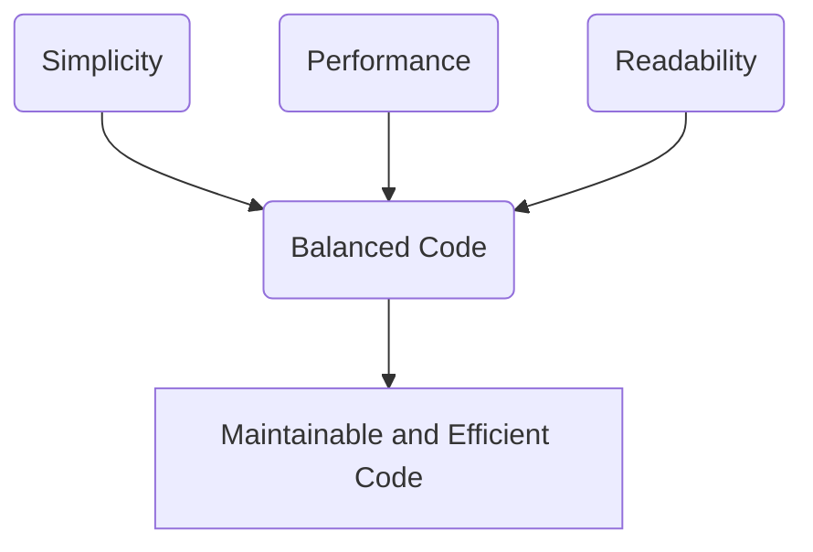

## 22.10 Balancing Simplicity, Performance, and Readability

In the realm of software development, achieving a balance between simplicity, performance, and readability is crucial for creating robust and maintainable code. This section delves into the strategies and best practices for striking this balance in Julia programming. We'll explore how to assess trade-offs, optimize when necessary, and prioritize code clarity to facilitate maintenance and collaboration.

### Assessing Trade-Offs

When developing software, we often face trade-offs between simplicity, performance, and readability. Understanding these trade-offs is essential for making informed decisions that align with project goals.

#### Finding the Right Balance

1. **Simplicity vs. Performance**: Simple code is easier to understand and maintain, but it may not always be the most performant. Conversely, highly optimized code can be complex and harder to maintain. Striking a balance involves understanding the performance requirements and choosing simplicity when performance is not a critical concern.

2. **Readability vs. Performance**: Readable code enhances collaboration and reduces the risk of errors. However, readability might sometimes come at the cost of performance. The key is to write code that is as readable as possible without compromising the necessary performance.

3. **Simplicity vs. Readability**: While simplicity often leads to readability, overly simplistic code can sometimes obscure the intent. Ensure that simplicity does not come at the expense of clarity.

#### Example: Assessing Trade-Offs in Julia

Consider a scenario where we need to compute the sum of squares of a list of numbers. We can write this in a simple and readable way:

```julia
function sum_of_squares(numbers)
    return sum(x^2 for x in numbers)
end
```

This code is straightforward and easy to understand. However, if performance is a concern, we might consider a more optimized approach:

```julia
function sum_of_squares_optimized(numbers)
    total = 0
    @inbounds for x in numbers
        total += x * x
    end
    return total
end
```

The optimized version uses the `@inbounds` macro to eliminate bounds checking, which can improve performance at the cost of some readability.

### Optimizing When Necessary

Optimization should be driven by necessity rather than assumption. Premature optimization can lead to complex code that is difficult to maintain. Instead, focus on writing clear and correct code first, then optimize based on profiling results.

#### Profiling Before Optimizing

1. **Identify Bottlenecks**: Use profiling tools to identify performance bottlenecks in your code. Julia provides the `Profile` module for this purpose.

2. **Targeted Optimization**: Once bottlenecks are identified, focus optimization efforts on those areas rather than the entire codebase.

3. **Measure Impact**: After making optimizations, measure their impact to ensure they provide the desired performance improvements.

#### Example: Profiling and Optimization in Julia

Let's profile and optimize a function that processes a large array:

```julia
using Profile

function process_array(arr)
    result = []
    for x in arr
        push!(result, x^2 + 2x + 1)
    end
    return result
end

@profile process_array(1:1000000)
```

After profiling, we might find that the `push!` operation is a bottleneck. We can optimize it by preallocating the result array:

```julia
function process_array_optimized(arr)
    result = Vector{Int}(undef, length(arr))
    for i in eachindex(arr)
        result[i] = arr[i]^2 + 2arr[i] + 1
    end
    return result
end
```

### Readable Code

Readable code is essential for long-term maintenance and collaboration. It helps team members understand the codebase and reduces the likelihood of introducing errors.

#### Prioritizing Clarity

1. **Descriptive Naming**: Use descriptive names for variables, functions, and modules. Names should convey the purpose and functionality of the code elements.

2. **Consistent Style**: Follow a consistent coding style throughout the project. This includes indentation, spacing, and naming conventions.

3. **Comments and Documentation**: Provide comments and documentation to explain complex logic and usage. However, avoid over-commenting; the code should be self-explanatory where possible.

4. **Modular Design**: Break down complex functions into smaller, reusable components. This enhances readability and facilitates testing and debugging.

#### Example: Enhancing Readability in Julia

Consider a function that calculates the factorial of a number. We can enhance its readability by using descriptive names and comments:

```julia
function factorial(n::Int)
    # Base case: factorial of 0 is 1
    if n == 0
        return 1
    end
    
    # Recursive case: n * factorial of (n-1)
    return n * factorial(n - 1)
end
```

### Try It Yourself

Experiment with the examples provided by modifying them to suit different scenarios. For instance, try optimizing the `sum_of_squares` function for different data types or enhancing the readability of the `factorial` function by adding more comments or using different control structures.

### Visualizing the Balance

To better understand the balance between simplicity, performance, and readability, let's visualize these concepts using a Venn diagram.



**Diagram Description**: This Venn diagram illustrates the intersection of simplicity, performance, and readability, highlighting the goal of achieving balanced code that is both maintainable and efficient.

### References and Links

- [JuliaLang Documentation](https://docs.julialang.org/): Official Julia documentation for further reading on language features and best practices.
- [Profile.jl](https://github.com/JuliaLang/julia/tree/master/stdlib/Profile): A tool for profiling Julia code to identify performance bottlenecks.
- [Code Readability](https://en.wikipedia.org/wiki/Code_readability): Wikipedia article on code readability and its importance in software development.

### Knowledge Check

1. What are the trade-offs between simplicity and performance in Julia programming?
2. How can profiling help in optimizing Julia code?
3. Why is code readability important for collaboration and maintenance?
4. What are some strategies for enhancing code readability in Julia?

### Embrace the Journey

Remember, balancing simplicity, performance, and readability is an ongoing journey. As you gain experience, you'll develop an intuition for making these trade-offs. Keep experimenting, stay curious, and enjoy the process of creating efficient and maintainable Julia code.

### Quiz Time!



### What is the primary goal when balancing simplicity, performance, and readability in Julia?

- [x] To create maintainable and efficient code
- [ ] To write the shortest code possible
- [ ] To use the most advanced features of Julia
- [ ] To avoid using comments

> **Explanation:** The primary goal is to create code that is both maintainable and efficient, balancing simplicity, performance, and readability.

### Why should optimization be driven by necessity?

- [x] To avoid premature optimization and maintain code clarity
- [ ] To ensure the code runs on all platforms
- [ ] To make the code as complex as possible
- [ ] To use all available Julia features

> **Explanation:** Optimization should be driven by necessity to avoid premature optimization, which can lead to complex and hard-to-maintain code.

### What is a common tool used for profiling Julia code?

- [x] Profile.jl
- [ ] Debugger.jl
- [ ] Rebugger.jl
- [ ] BenchmarkTools.jl

> **Explanation:** Profile.jl is a common tool used for profiling Julia code to identify performance bottlenecks.

### How can code readability be enhanced?

- [x] By using descriptive names and consistent style
- [ ] By minimizing the use of comments
- [ ] By using complex algorithms
- [ ] By avoiding modular design

> **Explanation:** Code readability can be enhanced by using descriptive names, consistent style, and providing comments and documentation.

### What is the benefit of modular design in code?

- [x] It enhances readability and facilitates testing
- [ ] It makes the code longer
- [ ] It reduces the need for comments
- [ ] It complicates the code structure

> **Explanation:** Modular design enhances readability and facilitates testing and debugging by breaking down complex functions into smaller, reusable components.

### What is the role of comments in code?

- [x] To explain complex logic and usage
- [ ] To make the code longer
- [ ] To replace variable names
- [ ] To reduce the need for documentation

> **Explanation:** Comments are used to explain complex logic and usage, helping others understand the code better.

### What should be prioritized when writing code?

- [x] Clarity and correctness
- [ ] Complexity and length
- [ ] Use of advanced features
- [ ] Minimizing the number of lines

> **Explanation:** Clarity and correctness should be prioritized to ensure the code is understandable and functions as intended.

### What is a trade-off between readability and performance?

- [x] Readable code might sometimes come at the cost of performance
- [ ] Readable code is always the most performant
- [ ] Performance is never affected by readability
- [ ] Readability and performance are unrelated

> **Explanation:** Readable code might sometimes come at the cost of performance, requiring a balance between the two.

### What is the purpose of descriptive naming in code?

- [x] To convey the purpose and functionality of code elements
- [ ] To make the code longer
- [ ] To confuse other developers
- [ ] To avoid using comments

> **Explanation:** Descriptive naming conveys the purpose and functionality of code elements, enhancing readability.

### True or False: Simplicity always leads to readability.

- [ ] True
- [x] False

> **Explanation:** While simplicity often leads to readability, overly simplistic code can sometimes obscure the intent, so it does not always guarantee readability.



By understanding and applying these principles, you'll be well-equipped to write Julia code that is not only efficient but also easy to read and maintain. Keep exploring and refining your skills, and you'll continue to grow as a proficient Julia developer.
