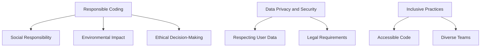

## 22.11 Ethical Considerations in Software Development

As developers, we wield significant power in shaping the digital world. With this power comes the responsibility to consider the ethical implications of our work. In this section, we will explore the ethical considerations that are crucial in software development, particularly when using Julia. We will delve into responsible coding, data privacy and security, and inclusive practices, providing guidance and examples to help you integrate these principles into your work.

### Responsible Coding

Responsible coding involves understanding the broader impact of software on society and ensuring that our creations do not harm individuals or communities. It requires a commitment to ethical principles throughout the software development lifecycle.

#### Understanding the Impact of Software on Society

Software can have far-reaching effects on society, influencing everything from personal privacy to economic systems. As developers, we must be aware of these impacts and strive to create software that benefits society as a whole.

- **Social Responsibility**: Consider how your software affects users and communities. Does it promote well-being, or could it potentially cause harm? Engage with stakeholders to understand their needs and concerns.

- **Environmental Impact**: Be mindful of the environmental footprint of your software. Optimize code for efficiency to reduce energy consumption, and consider the lifecycle of the hardware your software runs on.

- **Ethical Decision-Making**: Incorporate ethical considerations into decision-making processes. Use frameworks like the ACM Code of Ethics to guide your choices.

#### Code Example: Responsible Logging

Logging is a common practice in software development, but it can inadvertently expose sensitive information. Here's how you can implement responsible logging in Julia:

```julia
using Logging

struct SafeLogger <: AbstractLogger
    logger::ConsoleLogger
end

function Logging.shouldlog(logger::SafeLogger, level, _module, group, id)
    return Logging.shouldlog(logger.logger, level, _module, group, id)
end

function Logging.handle_message(logger::SafeLogger, level, message, _module, group, id, filepath, line)
    # Filter out sensitive information
    filtered_message = replace(message, r"(?i)sensitive" => "[REDACTED]")
    Logging.handle_message(logger.logger, level, filtered_message, _module, group, id, filepath, line)
end

global_logger(SafeLogger(ConsoleLogger()))

@info "This is a safe log message"
@info "This contains sensitive information"
```

In this example, we create a custom logger that filters out sensitive information before logging messages. This practice helps protect user privacy and demonstrates responsible coding.

### Data Privacy and Security

Data privacy and security are paramount in today's digital landscape. As developers, we must respect user data and adhere to legal requirements to protect it.

#### Respecting User Data

User data is a valuable asset that must be handled with care. Here are some best practices for respecting user data:

- **Data Minimization**: Collect only the data you need. Avoid gathering unnecessary information that could increase the risk of privacy breaches.

- **Anonymization**: When possible, anonymize data to protect user identities. Use techniques like data masking and aggregation to achieve this.

- **User Consent**: Obtain explicit consent from users before collecting or processing their data. Provide clear and transparent information about how their data will be used.

#### Legal Requirements

Adhering to legal requirements is essential for maintaining data privacy and security. Familiarize yourself with relevant regulations, such as the General Data Protection Regulation (GDPR) and the California Consumer Privacy Act (CCPA).

#### Code Example: Data Encryption

Encrypting sensitive data is a fundamental security practice. Here's how you can implement data encryption in Julia using the `Cryptography.jl` package:

```julia
using Cryptography

key = randombytes(32)

plaintext = "Sensitive data"
ciphertext = encrypt(key, plaintext)

decrypted_text = decrypt(key, ciphertext)

println("Original: $plaintext")
println("Encrypted: $ciphertext")
println("Decrypted: $decrypted_text")
```

This example demonstrates how to encrypt and decrypt data using a symmetric encryption algorithm. By encrypting sensitive information, you can protect it from unauthorized access.

### Inclusive Practices

Inclusive practices ensure that software is accessible and usable by everyone, regardless of their background or abilities. Fostering diversity in teams and writing inclusive code are key components of ethical software development.

#### Writing Accessible and Inclusive Code

Accessible and inclusive code accommodates users with diverse needs and abilities. Here are some strategies for achieving this:

- **Accessibility Standards**: Follow accessibility standards, such as the Web Content Accessibility Guidelines (WCAG), to ensure your software is usable by people with disabilities.

- **Internationalization and Localization**: Design software that can be easily adapted to different languages and cultures. Use libraries like `Intl.jl` for internationalization in Julia.

- **User-Centered Design**: Involve users from diverse backgrounds in the design process. Conduct usability testing to identify and address accessibility barriers.

#### Fostering Diversity in Teams

Diverse teams bring a variety of perspectives and experiences, leading to more innovative and inclusive software solutions. Here are some ways to foster diversity in your team:

- **Inclusive Hiring Practices**: Implement hiring practices that promote diversity and reduce bias. Use tools like blind recruitment to focus on skills and qualifications.

- **Inclusive Work Environment**: Create a work environment where everyone feels valued and respected. Encourage open communication and provide opportunities for professional development.

- **Diversity Training**: Offer diversity training to raise awareness and promote understanding among team members.

### Visualizing Ethical Considerations

To better understand the interplay between different ethical considerations, let's visualize these concepts using a flowchart.



This flowchart illustrates the relationships between responsible coding, data privacy and security, and inclusive practices. Each element is interconnected, highlighting the holistic nature of ethical software development.

### References and Links

- [ACM Code of Ethics](https://www.acm.org/code-of-ethics)
- [General Data Protection Regulation (GDPR)](https://gdpr-info.eu/)
- [Web Content Accessibility Guidelines (WCAG)](https://www.w3.org/WAI/standards-guidelines/wcag/)
- [Cryptography.jl Documentation](https://github.com/JuliaCrypto/Cryptography.jl)

### Knowledge Check

- **Question**: What is the primary goal of responsible coding?
  - **Answer**: To ensure that software benefits society and does not cause harm.

- **Question**: Why is data minimization important in data privacy?
  - **Answer**: It reduces the risk of privacy breaches by limiting the amount of data collected.

- **Question**: What is the purpose of accessibility standards like WCAG?
  - **Answer**: To ensure software is usable by people with disabilities.

### Embrace the Journey

Remember, ethical software development is an ongoing journey. As you continue to grow as a developer, keep exploring new ways to integrate ethical considerations into your work. Stay curious, engage with diverse perspectives, and strive to create software that makes a positive impact on the world.

## Quiz Time!



### What is the primary goal of responsible coding?

- [x] To ensure that software benefits society and does not cause harm
- [ ] To maximize software performance
- [ ] To reduce development costs
- [ ] To increase user engagement

> **Explanation:** Responsible coding focuses on the societal impact of software, ensuring it benefits society and avoids causing harm.

### Why is data minimization important in data privacy?

- [x] It reduces the risk of privacy breaches by limiting the amount of data collected
- [ ] It increases data processing speed
- [ ] It enhances user experience
- [ ] It simplifies data analysis

> **Explanation:** Data minimization is crucial for privacy as it limits the data collected, reducing the risk of breaches.

### What is the purpose of accessibility standards like WCAG?

- [x] To ensure software is usable by people with disabilities
- [ ] To improve software performance
- [ ] To enhance visual design
- [ ] To increase software sales

> **Explanation:** Accessibility standards like WCAG ensure that software is accessible to individuals with disabilities.

### Which practice helps protect user identities in data handling?

- [x] Anonymization
- [ ] Logging
- [ ] Encryption
- [ ] Data aggregation

> **Explanation:** Anonymization involves removing or altering identifying information to protect user identities.

### What is a key component of fostering diversity in teams?

- [x] Inclusive hiring practices
- [ ] Increasing team size
- [ ] Reducing project deadlines
- [ ] Focusing on technical skills only

> **Explanation:** Inclusive hiring practices promote diversity by reducing bias and focusing on skills and qualifications.

### How can developers ensure they respect user data?

- [x] By obtaining explicit consent from users
- [ ] By collecting as much data as possible
- [ ] By ignoring legal requirements
- [ ] By focusing on software performance

> **Explanation:** Respecting user data involves obtaining explicit consent and adhering to privacy regulations.

### What is the role of encryption in data security?

- [x] To protect sensitive data from unauthorized access
- [ ] To increase data processing speed
- [ ] To enhance user experience
- [ ] To simplify data analysis

> **Explanation:** Encryption protects sensitive data by making it unreadable to unauthorized users.

### Which of the following is an example of responsible coding?

- [x] Implementing a custom logger to filter sensitive information
- [ ] Collecting all available user data
- [ ] Ignoring accessibility standards
- [ ] Focusing solely on software performance

> **Explanation:** Responsible coding includes practices like filtering sensitive information to protect user privacy.

### What is the benefit of involving users from diverse backgrounds in the design process?

- [x] It helps identify and address accessibility barriers
- [ ] It increases project costs
- [ ] It reduces development time
- [ ] It simplifies code maintenance

> **Explanation:** Involving diverse users helps identify accessibility barriers, leading to more inclusive software.

### True or False: Ethical software development is a one-time effort.

- [ ] True
- [x] False

> **Explanation:** Ethical software development is an ongoing journey, requiring continuous exploration and integration of ethical considerations.


