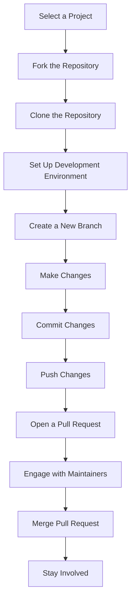

## 22.12 Case Study: Open Source Contribution Workflow

Contributing to open source projects is a rewarding way to improve your coding skills, collaborate with other developers, and give back to the community. In this case study, we will explore the workflow of contributing to open source projects using Julia, a high-level, high-performance programming language for technical computing. We will guide you through the process of selecting a project, getting started, making contributions, and engaging with maintainers.

### Selecting a Project

The first step in contributing to open source is selecting a project that aligns with your interests and skills. Here are some tips to help you find the right project:

- **Identify Your Interests**: Consider what areas of software development you are passionate about. Are you interested in data science, machine learning, web development, or scientific computing? Julia has a rich ecosystem of packages in these areas.

- **Assess Your Skills**: Evaluate your current skill level and look for projects that match your expertise. If you are new to Julia, consider starting with beginner-friendly projects that have good documentation and a welcoming community.

- **Explore Julia Packages**: Visit the [JuliaHub](https://juliahub.com/) to explore a wide range of Julia packages. You can search for packages by category, popularity, or recent activity.

- **Check Contribution Guidelines**: Look for projects with clear contribution guidelines. These guidelines will help you understand how to contribute and what the maintainers expect from contributors.

- **Engage with the Community**: Join Julia community forums, such as [JuliaLang Discourse](https://discourse.julialang.org/) or the [Julia Slack](https://julialang.org/slack/), to connect with other developers and learn about ongoing projects.

### Getting Started

Once you have selected a project, it's time to get started with the contribution process. This involves forking the repository, setting up your development environment, and familiarizing yourself with the project's codebase.

#### Forking the Repository

Forking a repository creates a personal copy of the project on your GitHub account. This allows you to make changes without affecting the original project. Here's how to fork a repository:

1. **Navigate to the Repository**: Go to the GitHub page of the project you want to contribute to.

2. **Click the Fork Button**: In the top-right corner of the page, click the "Fork" button. This will create a copy of the repository in your GitHub account.

3. **Clone the Forked Repository**: Clone the forked repository to your local machine using the following command:

   ```bash
   git clone https://github.com/your-username/project-name.git
   ```

4. **Set Up the Upstream Remote**: Add the original repository as a remote called `upstream` to keep your fork up-to-date:

   ```bash
   cd project-name
   git remote add upstream https://github.com/original-owner/project-name.git
   ```

#### Setting Up the Development Environment

Setting up your development environment is crucial for efficient coding and testing. Here are some steps to help you get started:

- **Install Julia**: Ensure you have the latest version of Julia installed on your machine. You can download it from the [official Julia website](https://julialang.org/downloads/).

- **Install Required Packages**: Check the project's documentation for any required Julia packages and install them using Julia's package manager, `Pkg.jl`:

  ```julia
  using Pkg
  Pkg.add("PackageName")
  ```

- **Configure Your Editor**: Use a code editor that supports Julia, such as [Visual Studio Code](https://code.visualstudio.com/) with the Julia extension, or [Juno](https://junolab.org/).

- **Run Tests**: Before making any changes, run the project's test suite to ensure everything is working correctly. This will help you identify any issues that may arise from your contributions.

### Making Contributions

Contributing to an open source project involves making changes to the codebase and submitting them for review. Here are some best practices for making effective contributions:

#### Submitting Pull Requests

A pull request (PR) is a request to merge your changes into the original repository. Follow these steps to submit a PR:

1. **Create a New Branch**: Create a new branch for your changes to keep your work organized:

   ```bash
   git checkout -b feature-branch-name
   ```

2. **Make Your Changes**: Implement your changes in the codebase. Be sure to follow the project's coding standards and guidelines.

3. **Commit Your Changes**: Commit your changes with a descriptive commit message:

   ```bash
   git add .
   git commit -m "Add feature or fix issue"
   ```

4. **Push Your Changes**: Push your changes to your forked repository:

   ```bash
   git push origin feature-branch-name
   ```

5. **Open a Pull Request**: Navigate to the original repository on GitHub and click the "New Pull Request" button. Select your branch and provide a detailed description of your changes.

#### Following Project Guidelines

Adhering to project guidelines is essential for a smooth contribution process. Here are some common guidelines to follow:

- **Read the Documentation**: Familiarize yourself with the project's documentation, including any contribution guidelines or code of conduct.

- **Write Tests**: If you are adding new features or fixing bugs, write tests to ensure your changes work as expected.

- **Keep Changes Small**: Make small, incremental changes to make it easier for maintainers to review your PR.

- **Provide Clear Descriptions**: When opening a PR, provide a clear and concise description of your changes, including any relevant issue numbers.

### Engaging with Maintainers

Effective communication with project maintainers is key to a successful contribution. Here are some tips for engaging with maintainers:

- **Be Respectful**: Always communicate respectfully and professionally. Remember that maintainers are often volunteers who contribute their time to the project.

- **Respond to Feedback**: Be open to feedback and willing to make changes to your PR based on the maintainers' suggestions.

- **Ask Questions**: If you are unsure about something, don't hesitate to ask questions. Maintainers and other contributors are usually happy to help.

- **Stay Involved**: Continue to engage with the project even after your PR is merged. This could involve reviewing other contributors' PRs, reporting issues, or suggesting new features.

### Visualizing the Contribution Workflow

To better understand the open source contribution workflow, let's visualize the process using a flowchart:



**Figure 1**: Open Source Contribution Workflow

This flowchart illustrates the key steps in the open source contribution workflow, from selecting a project to staying involved after your contributions are merged.

### Try It Yourself

Now that you have a solid understanding of the open source contribution workflow, it's time to try it yourself. Here are some exercises to get you started:

- **Exercise 1**: Find a Julia package that interests you and explore its GitHub repository. Identify any open issues that you could help with.

- **Exercise 2**: Fork the repository and set up your development environment. Make a small change, such as fixing a typo in the documentation, and submit a pull request.

- **Exercise 3**: Engage with the maintainers by asking questions or providing feedback on other contributors' pull requests.

Remember, contributing to open source is a journey. As you gain more experience, you'll be able to tackle more complex issues and make a greater impact on the projects you contribute to.

### References and Links

- [JuliaHub](https://juliahub.com/)
- [JuliaLang Discourse](https://discourse.julialang.org/)
- [GitHub Guide to Forking](https://guides.github.com/activities/forking/)
- [Visual Studio Code](https://code.visualstudio.com/)
- [Juno](https://junolab.org/)

## Quiz Time!



### What is the first step in contributing to an open source project?

- [x] Selecting a project that aligns with your interests and skills
- [ ] Forking the repository
- [ ] Setting up the development environment
- [ ] Submitting a pull request

> **Explanation:** The first step is to select a project that aligns with your interests and skills.

### What is the purpose of forking a repository?

- [x] To create a personal copy of the project on your GitHub account
- [ ] To delete the original repository
- [ ] To merge changes into the original repository
- [ ] To create a new branch in the original repository

> **Explanation:** Forking a repository creates a personal copy of the project on your GitHub account, allowing you to make changes without affecting the original project.

### Which command is used to clone a forked repository to your local machine?

- [x] `git clone https://github.com/your-username/project-name.git`
- [ ] `git fork https://github.com/your-username/project-name.git`
- [ ] `git pull https://github.com/your-username/project-name.git`
- [ ] `git push https://github.com/your-username/project-name.git`

> **Explanation:** The `git clone` command is used to clone a forked repository to your local machine.

### What should you do before making changes to the codebase?

- [x] Run the project's test suite
- [ ] Submit a pull request
- [ ] Delete the forked repository
- [ ] Create a new GitHub account

> **Explanation:** Running the project's test suite before making changes helps ensure everything is working correctly.

### What is a pull request?

- [x] A request to merge your changes into the original repository
- [ ] A request to delete the original repository
- [ ] A request to fork the repository
- [ ] A request to create a new branch

> **Explanation:** A pull request is a request to merge your changes into the original repository.

### How should you respond to feedback from maintainers?

- [x] Be open to feedback and willing to make changes
- [ ] Ignore the feedback
- [ ] Delete your pull request
- [ ] Create a new GitHub account

> **Explanation:** Being open to feedback and willing to make changes is essential for a successful contribution.

### What is the purpose of adding the original repository as a remote called `upstream`?

- [x] To keep your fork up-to-date with the original repository
- [ ] To delete the original repository
- [ ] To merge changes into the original repository
- [ ] To create a new branch in the original repository

> **Explanation:** Adding the original repository as a remote called `upstream` helps keep your fork up-to-date with the original repository.

### What should you include in your pull request description?

- [x] A clear and concise description of your changes
- [ ] A request to delete the original repository
- [ ] A list of all contributors
- [ ] A new GitHub account

> **Explanation:** Including a clear and concise description of your changes helps maintainers understand your contribution.

### What is the benefit of making small, incremental changes?

- [x] It makes it easier for maintainers to review your pull request
- [ ] It allows you to delete the original repository
- [ ] It creates a new branch in the original repository
- [ ] It merges changes into the original repository

> **Explanation:** Making small, incremental changes makes it easier for maintainers to review your pull request.

### True or False: Contributing to open source is a one-time activity.

- [ ] True
- [x] False

> **Explanation:** Contributing to open source is an ongoing journey, and staying involved with the project can lead to more impactful contributions.



Remember, contributing to open source is not just about writing code; it's about collaboration, learning, and growing as a developer. Keep experimenting, stay curious, and enjoy the journey!
