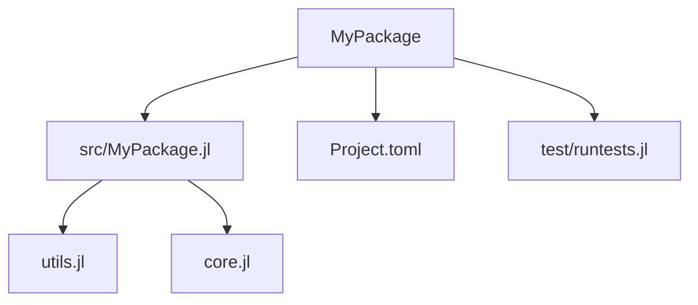

## 22.2 Organizing Code with Modules and Packages

In the world of software development, organizing code efficiently is crucial for building scalable, maintainable, and robust applications. Julia, with its powerful module and package system, provides developers with the tools to achieve this. In this section, we will explore how to effectively organize code using modules and packages in Julia, ensuring that your projects are well-structured and easy to navigate.

### Module Design

Modules in Julia are used to encapsulate functionality, manage namespaces, and control the visibility of functions and variables. They are essential for preventing name clashes and for organizing code into logical units.

#### Creating Modules

To create a module in Julia, use the `module` keyword followed by the module name. Here's a simple example:

```julia
module MyModule

export greet

function greet(name::String)
    println("Hello, $name!")
end

function secret_function()
    println("This is a secret function.")
end

end
```

In this example, `MyModule` contains two functions: `greet`, which is exported and can be accessed from outside the module, and `secret_function`, which is internal to the module.

#### Managing Namespaces

Modules help manage namespaces by allowing you to define functions and variables without worrying about name conflicts. When you import a module, you can access its exported symbols directly, or use the module's name as a prefix to access non-exported symbols.

```julia
using .MyModule

greet("Alice")  # Calls the exported function

MyModule.secret_function()
```

#### Best Practices for Module Design

- **Encapsulation**: Keep internal functions and variables private unless they need to be accessed externally. Use the `export` keyword judiciously.
- **Modularity**: Break down large modules into smaller, focused modules. This makes the codebase easier to manage and understand.
- **Documentation**: Document your modules and their functions using Julia's built-in documentation system. This helps other developers (and your future self) understand the purpose and usage of each module.

### Package Structure

A well-structured package is key to maintaining a clean and efficient codebase. Julia's package manager, `Pkg.jl`, provides a framework for creating and managing packages.

#### Directory Layout

A typical Julia package has the following directory structure:

```
MyPackage/
├── Project.toml
├── src/
│   └── MyPackage.jl
└── test/
    └── runtests.jl
```

- **Project.toml**: This file contains metadata about the package, such as its name, version, and dependencies.
- **src/**: This directory contains the source code of the package. The main file, typically named after the package, includes the module definition and imports other source files if needed.
- **test/**: This directory contains test scripts to ensure the package functions as expected.

#### File Organization

Organize your source files logically within the `src/` directory. For larger packages, consider breaking down the code into multiple files and including them in the main module file.

```julia
module MyPackage

include("utils.jl")
include("core.jl")

end
```

This approach keeps your code modular and easier to navigate.

#### Best Practices for Package Structure

- **Consistency**: Follow a consistent naming convention for files and directories.
- **Modularity**: Separate different functionalities into distinct files or submodules.
- **Testing**: Include comprehensive tests in the `test/` directory to ensure code quality and reliability.

### Exporting and Importing

Controlling symbol visibility and managing dependencies between modules is crucial for maintaining a clean codebase.

#### Exporting Symbols

Use the `export` keyword to specify which symbols (functions, types, etc.) should be accessible from outside the module. This helps in creating a clear API for your module.

```julia
module MyModule

export greet, farewell

function greet(name::String)
    println("Hello, $name!")
end

function farewell(name::String)
    println("Goodbye, $name!")
end

end
```

#### Importing Modules

To use a module in Julia, you can use the `using` or `import` statements. The `using` statement imports all exported symbols, while `import` allows you to specify which symbols to import.

```julia
using MyModule

greet("Bob")  # Calls the greet function

import MyModule: farewell

farewell("Bob")  # Calls the farewell function
```

#### Managing Dependencies

When developing a package, it's important to manage dependencies effectively. Use the `Project.toml` file to specify dependencies and their versions. This ensures that your package works consistently across different environments.

```toml
[deps]
DataFrames = "0.22"
Plots = "1.10"
```

### Visualizing Module and Package Structure

To better understand how modules and packages are structured in Julia, let's visualize a simple package setup using Mermaid.js.



**Diagram Description**: This diagram illustrates the structure of a typical Julia package. The main package directory contains the `src/` directory with the main module file and additional source files, a `Project.toml` file for package metadata, and a `test/` directory for testing scripts.

### Try It Yourself

Experiment with creating your own module and package in Julia. Start by defining a simple module with a couple of functions. Then, create a package structure following the guidelines above. Modify the code to add more functionalities and test the package using the `test/` directory.

### References and Links

- [Julia Documentation on Modules](https://docs.julialang.org/en/v1/manual/modules/)
- [Pkg.jl Documentation](https://julialang.github.io/Pkg.jl/v1/)
- [JuliaLang GitHub](https://github.com/JuliaLang)

### Knowledge Check

- What is the purpose of using modules in Julia?
- How do you control symbol visibility in a module?
- What is the role of the `Project.toml` file in a Julia package?
- How can you organize source files within a package?
- What is the difference between `using` and `import` statements?

### Embrace the Journey

Remember, organizing code with modules and packages is just the beginning of building robust Julia applications. As you progress, you'll learn to leverage these tools to create more complex and efficient software. Keep experimenting, stay curious, and enjoy the journey!

## Quiz Time!



### What is the primary purpose of using modules in Julia?

- [x] To encapsulate functionality and manage namespaces
- [ ] To increase execution speed
- [ ] To reduce memory usage
- [ ] To simplify syntax

> **Explanation:** Modules in Julia are used to encapsulate functionality and manage namespaces, preventing name clashes and organizing code into logical units.

### How do you specify which symbols should be accessible from outside a module?

- [x] Using the `export` keyword
- [ ] Using the `import` keyword
- [ ] Using the `include` keyword
- [ ] Using the `require` keyword

> **Explanation:** The `export` keyword is used to specify which symbols (functions, types, etc.) should be accessible from outside the module.

### What is the role of the `Project.toml` file in a Julia package?

- [x] To contain metadata about the package, such as its name, version, and dependencies
- [ ] To store the source code of the package
- [ ] To execute tests for the package
- [ ] To compile the package into an executable

> **Explanation:** The `Project.toml` file contains metadata about the package, including its name, version, and dependencies, which are crucial for package management.

### Which statement imports all exported symbols from a module in Julia?

- [x] `using`
- [ ] `import`
- [ ] `include`
- [ ] `require`

> **Explanation:** The `using` statement imports all exported symbols from a module, allowing them to be accessed directly.

### How can you organize source files within a Julia package?

- [x] By separating different functionalities into distinct files or submodules
- [ ] By placing all code in a single file
- [ ] By using only global variables
- [ ] By avoiding the use of directories

> **Explanation:** Organizing source files by separating different functionalities into distinct files or submodules helps maintain a clean and efficient codebase.

### What is the difference between `using` and `import` statements in Julia?

- [x] `using` imports all exported symbols, while `import` allows specifying which symbols to import
- [ ] `using` is for importing packages, while `import` is for importing modules
- [ ] `using` is faster than `import`
- [ ] `using` is deprecated in favor of `import`

> **Explanation:** The `using` statement imports all exported symbols from a module, while `import` allows you to specify which symbols to import, providing more control over namespace management.

### What is the benefit of breaking down large modules into smaller ones?

- [x] It makes the codebase easier to manage and understand
- [ ] It increases the execution speed of the code
- [ ] It reduces the memory usage of the application
- [ ] It simplifies the syntax of the language

> **Explanation:** Breaking down large modules into smaller, focused modules makes the codebase easier to manage and understand, promoting modularity and reusability.

### How do you include additional source files in a Julia module?

- [x] Using the `include` function
- [ ] Using the `import` statement
- [ ] Using the `require` function
- [ ] Using the `export` keyword

> **Explanation:** The `include` function is used to include additional source files in a Julia module, allowing you to organize code across multiple files.

### What is the purpose of the `test/` directory in a Julia package?

- [x] To contain test scripts that ensure the package functions as expected
- [ ] To store the source code of the package
- [ ] To compile the package into an executable
- [ ] To manage package dependencies

> **Explanation:** The `test/` directory contains test scripts that ensure the package functions as expected, helping maintain code quality and reliability.

### True or False: The `Project.toml` file is optional for a Julia package.

- [ ] True
- [x] False

> **Explanation:** The `Project.toml` file is essential for a Julia package as it contains important metadata and dependency information necessary for package management.


