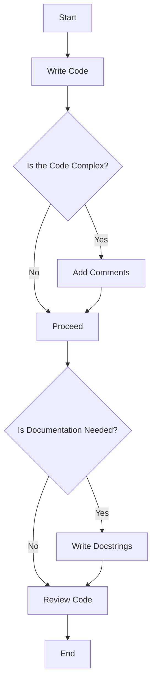

## 22.3 Documentation and Commenting Guidelines

In the realm of software development, documentation and commenting are crucial elements that ensure code is not only functional but also understandable and maintainable. This section delves into the best practices for documenting and commenting in Julia, a language known for its high performance and ease of use. We will explore the importance of documentation, how to write effective docstrings using Julia's built-in support for Markdown, and strategies for commenting that enhance code clarity without cluttering it.

### Importance of Documentation

Documentation serves as the bridge between the developer's intent and the user's understanding. It is an essential component of any software project, providing numerous benefits:

- **Enhances Code Readability**: Well-documented code is easier to read and understand, reducing the cognitive load on developers who need to work with it.
- **Facilitates Maintenance**: Documentation helps maintainers quickly grasp the functionality and purpose of code, making it easier to update and debug.
- **Supports Collaboration**: In team environments, documentation ensures that all team members have a shared understanding of the codebase.
- **Aids Learning and Onboarding**: For new developers or contributors, comprehensive documentation serves as a valuable learning resource.
- **Improves User Experience**: For end-users, documentation provides guidance on how to effectively use the software, enhancing their overall experience.

### Writing Effective Docstrings

Docstrings in Julia are a powerful tool for documenting functions, types, and modules. They are written using triple quotes (`"""`) and can include Markdown for formatting. Here's how to write effective docstrings:

#### Basic Structure of a Docstring

A well-structured docstring typically includes the following components:

1. **Brief Description**: A concise summary of what the function or type does.
2. **Arguments**: A list of parameters, including their types and descriptions.
3. **Return Value**: A description of what the function returns.
4. **Examples**: Code snippets demonstrating how to use the function or type.

#### Example of a Docstring

```julia
"""
    add_numbers(a::Int, b::Int) -> Int

Add two integers and return the result.

- `a::Int`: The first integer.
- `b::Int`: The second integer.

- `Int`: The sum of `a` and `b`.

```julia
julia> add_numbers(2, 3)
5
```
"""
function add_numbers(a::Int, b::Int) 
    return a + b
end
```

In this example, the docstring provides a clear and concise description of the function's purpose, its parameters, and what it returns. The use of Markdown allows for formatting that enhances readability.

#### Utilizing Markdown in Docstrings

Julia's support for Markdown in docstrings allows developers to create rich, formatted documentation. Here are some tips for using Markdown effectively:

- **Headers**: Use headers (e.g., `# Arguments`) to organize information.
- **Lists**: Use bullet points or numbered lists to enumerate items.
- **Code Blocks**: Use triple backticks (```) to include code examples.
- **Links**: Include hyperlinks to external resources for additional information.

#### Best Practices for Writing Docstrings

- **Be Concise**: Avoid unnecessary details; focus on what the user needs to know.
- **Be Consistent**: Use a consistent style and structure across all docstrings.
- **Use Active Voice**: Write in an active voice to make the documentation more engaging.
- **Keep It Updated**: Regularly update docstrings to reflect changes in the code.

### Commenting Strategies

Comments are annotations in the code that explain what the code does. They are essential for providing context and clarifying complex logic. However, comments should be used judiciously to avoid cluttering the code.

#### When to Use Comments

- **Clarify Complex Logic**: Use comments to explain non-obvious code or complex algorithms.
- **Document Assumptions**: Note any assumptions made in the code that are not immediately apparent.
- **Explain Workarounds**: If the code includes a workaround or hack, explain why it was necessary.
- **Highlight Important Information**: Use comments to draw attention to critical parts of the code.

#### Types of Comments

1. **Inline Comments**: Brief comments placed on the same line as the code they describe. Use sparingly to avoid clutter.
   
   ```julia
   x = x + 1  # Increment x by 1
   ```

2. **Block Comments**: Longer comments that span multiple lines, used to describe a section of code or provide detailed explanations.

   ```julia
   # This function calculates the factorial of a number
   # using a recursive approach. It is efficient for
   # small numbers but may cause a stack overflow for
   # larger inputs.
   function factorial(n::Int)
       return n == 0 ? 1 : n * factorial(n - 1)
   end
   ```

3. **Documentation Comments**: These are the docstrings discussed earlier, used for documenting functions, types, and modules.

#### Best Practices for Commenting

- **Be Relevant**: Ensure comments add value and are relevant to the code.
- **Avoid Redundancy**: Do not state the obvious; comments should provide additional insight.
- **Be Clear and Concise**: Write comments that are easy to understand and to the point.
- **Use Proper Grammar and Spelling**: Well-written comments reflect professionalism and care.

### Visualizing Documentation and Commenting Workflow

To better understand the process of documenting and commenting in Julia, let's visualize the workflow using a flowchart.



**Figure 1**: This flowchart illustrates the decision-making process for adding comments and documentation to your code. It emphasizes the importance of assessing the complexity of the code and the need for documentation.

### Try It Yourself

To reinforce your understanding of documentation and commenting in Julia, try the following exercises:

1. **Exercise 1**: Write a function that calculates the Fibonacci sequence and document it using a docstring. Include a brief description, arguments, return value, and examples.

2. **Exercise 2**: Identify a complex piece of code in your project and add inline and block comments to clarify its logic.

3. **Exercise 3**: Review an existing codebase and update outdated or incorrect comments and documentation.

### References and Links

- [Julia Documentation](https://docs.julialang.org/en/v1/manual/documentation/)
- [Markdown Guide](https://www.markdownguide.org/)
- [Effective Documentation Practices](https://www.writethedocs.org/)

### Knowledge Check

Before we conclude, let's test your understanding of documentation and commenting guidelines in Julia.

## Quiz Time!



### What is the primary purpose of documentation in software development?

- [x] To enhance code readability and maintainability
- [ ] To increase code execution speed
- [ ] To reduce the size of the codebase
- [ ] To make the code more complex

> **Explanation:** Documentation enhances code readability and maintainability by providing clear explanations of the code's purpose and functionality.

### Which of the following is NOT a component of a well-structured docstring?

- [ ] Brief Description
- [ ] Arguments
- [x] Code Compilation Time
- [ ] Examples

> **Explanation:** Code compilation time is not a component of a docstring. Docstrings typically include a brief description, arguments, return value, and examples.

### What is the benefit of using Markdown in Julia docstrings?

- [x] It allows for rich formatting and organization of information
- [ ] It increases the execution speed of the code
- [ ] It reduces the file size
- [ ] It makes the code harder to read

> **Explanation:** Markdown allows for rich formatting and organization of information, making docstrings more readable and informative.

### When should inline comments be used?

- [x] To clarify complex logic in a specific line of code
- [ ] To describe every line of code
- [ ] To replace docstrings
- [ ] To increase code execution speed

> **Explanation:** Inline comments should be used to clarify complex logic in a specific line of code, not to describe every line or replace docstrings.

### Which of the following is a best practice for writing comments?

- [x] Be clear and concise
- [ ] Use comments to state the obvious
- [ ] Write comments in a different language
- [ ] Avoid using comments altogether

> **Explanation:** Comments should be clear and concise, providing additional insight without stating the obvious.

### What is the role of block comments?

- [x] To provide detailed explanations for a section of code
- [ ] To describe a single line of code
- [ ] To replace docstrings
- [ ] To increase code execution speed

> **Explanation:** Block comments provide detailed explanations for a section of code, offering context and clarity.

### How often should documentation be updated?

- [x] Regularly, to reflect changes in the code
- [ ] Only when the code is first written
- [ ] Never, once it's written
- [ ] Only when a new developer joins the team

> **Explanation:** Documentation should be updated regularly to reflect changes in the code and ensure accuracy.

### What is a common pitfall to avoid when writing comments?

- [x] Redundancy
- [ ] Clarity
- [ ] Relevance
- [ ] Conciseness

> **Explanation:** Redundancy is a common pitfall to avoid, as comments should provide additional insight rather than stating the obvious.

### Which of the following is a benefit of well-documented code?

- [x] It supports collaboration among team members
- [ ] It increases the code's execution speed
- [ ] It makes the code more complex
- [ ] It reduces the need for testing

> **Explanation:** Well-documented code supports collaboration among team members by providing a shared understanding of the codebase.

### True or False: Comments should be written in proper grammar and spelling.

- [x] True
- [ ] False

> **Explanation:** Comments should be written in proper grammar and spelling to reflect professionalism and ensure clarity.



Remember, effective documentation and commenting are key to maintaining a healthy codebase. As you continue your journey with Julia, keep experimenting with different documentation styles and strategies to find what works best for you and your team. Happy coding!
