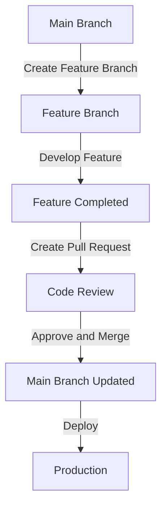

## 22.4 Git Version Control and Collaboration for Julia Developers

In the world of software development, version control is an indispensable tool that enables teams to collaborate efficiently, maintain code integrity, and track changes over time. Git, a distributed version control system, has become the industry standard due to its flexibility, speed, and robust feature set. In this section, we will explore how to use Git effectively in Julia development, focusing on basic commands, collaboration workflows, and techniques for handling merges and conflicts.

### Using Git Effectively

Git provides a powerful set of tools for managing code changes, but mastering its use requires understanding its core concepts and commands. Let's delve into the essentials of using Git effectively.

#### Basic Commands

To start using Git, you need to familiarize yourself with some basic commands. These commands form the foundation of your version control workflow.

- **git init**: Initialize a new Git repository in your project directory.

  ```bash
  git init
  ```

- **git clone**: Clone an existing repository from a remote source.

  ```bash
  git clone https://github.com/user/repo.git
  ```

- **git status**: Check the status of your working directory and staging area.

  ```bash
  git status
  ```

- **git add**: Stage changes for the next commit.

  ```bash
  git add filename
  ```

- **git commit**: Commit staged changes with a descriptive message.

  ```bash
  git commit -m "Add feature X"
  ```

- **git push**: Push local commits to a remote repository.

  ```bash
  git push origin main
  ```

- **git pull**: Fetch and merge changes from a remote repository.

  ```bash
  git pull origin main
  ```

- **git branch**: List, create, or delete branches.

  ```bash
  git branch
  git branch new-feature
  git branch -d old-feature
  ```

- **git checkout**: Switch branches or restore working tree files.

  ```bash
  git checkout new-feature
  ```

- **git merge**: Merge changes from one branch into another.

  ```bash
  git merge new-feature
  ```

#### Branching Strategies

Branching is a powerful feature in Git that allows you to work on different features or fixes simultaneously without affecting the main codebase. Here are some common branching strategies:

- **Feature Branching**: Create a new branch for each feature or bug fix. This keeps the main branch clean and stable.

  ```bash
  git checkout -b feature/new-feature
  ```

- **Git Flow**: A popular branching model that uses feature, release, and hotfix branches to manage development.

  ```bash
  git flow init
  ```

- **Trunk-Based Development**: Developers work on short-lived branches and merge changes frequently to the main branch.

  ```bash
  git checkout -b short-lived-branch
  ```

#### Commit Best Practices

Commits are the building blocks of your project's history. Follow these best practices to maintain a clean and informative commit history:

- **Write Descriptive Messages**: Clearly describe what changes were made and why.

  ```bash
  git commit -m "Fix bug in data processing module"
  ```

- **Commit Often**: Make small, frequent commits to track incremental changes.

- **Use Atomic Commits**: Each commit should represent a single logical change.

- **Avoid Committing Generated Files**: Use `.gitignore` to exclude files like binaries or logs.

  ```plaintext
  # .gitignore
  *.log
  /build/
  ```

### Collaboration Workflows

Effective collaboration is key to successful software development. Git provides several workflows to facilitate teamwork, code reviews, and integration.

#### Pull Requests

Pull requests (PRs) are a mechanism for proposing changes to a codebase. They enable code review and discussion before merging changes.

- **Create a Pull Request**: After pushing your feature branch, open a PR on platforms like GitHub or GitLab.

- **Review and Discuss**: Team members review the code, suggest changes, and discuss improvements.

- **Merge the PR**: Once approved, merge the PR into the main branch.

#### Code Reviews

Code reviews are an essential part of maintaining code quality and sharing knowledge within a team.

- **Review Guidelines**: Establish guidelines for what reviewers should look for, such as code style, logic, and performance.

- **Automated Checks**: Use tools like linters and CI/CD pipelines to automate code quality checks.

- **Feedback and Iteration**: Provide constructive feedback and iterate on changes as needed.

#### Continuous Integration

Continuous Integration (CI) is the practice of automatically building and testing code changes to ensure they integrate smoothly.

- **Set Up CI Pipelines**: Use services like Travis CI, GitHub Actions, or Jenkins to automate builds and tests.

- **Run Tests on Every Commit**: Ensure that all tests pass before merging changes.

- **Deploy Automatically**: Automate deployment to staging or production environments after successful builds.

### Handling Merges and Conflicts

Merging branches is a common task in Git, but it can lead to conflicts when changes overlap. Let's explore techniques for handling merges and resolving conflicts.

#### Techniques for Resolving Conflicts

Conflicts occur when changes in different branches overlap. Here are steps to resolve them:

- **Identify Conflicts**: Git will notify you of conflicts during a merge.

  ```bash
  git merge feature-branch
  ```

- **Edit Conflicting Files**: Open the files with conflicts and manually resolve them.

  ```plaintext
  <<<<<<< HEAD
  Current change
  =======
  Incoming change
  >>>>>>> feature-branch
  ```

- **Mark as Resolved**: After resolving conflicts, mark the files as resolved.

  ```bash
  git add resolved-file
  ```

- **Complete the Merge**: Commit the resolved changes to complete the merge.

  ```bash
  git commit -m "Resolve merge conflicts"
  ```

#### Maintaining a Clean History

A clean commit history is easier to understand and maintain. Here are some tips:

- **Rebase Instead of Merge**: Use `git rebase` to apply changes on top of the current branch, creating a linear history.

  ```bash
  git rebase main
  ```

- **Squash Commits**: Combine multiple commits into one to simplify history.

  ```bash
  git rebase -i HEAD~3
  ```

- **Avoid Force Pushes**: Use force pushes sparingly, as they can overwrite others' work.

### Visualizing Git Workflows

To better understand Git workflows, let's visualize a typical feature branching and merging process using a Mermaid.js diagram.



**Diagram Description**: This diagram illustrates the process of creating a feature branch from the main branch, developing the feature, creating a pull request, undergoing code review, merging the changes back into the main branch, and finally deploying to production.

### References and Links

- [Git Documentation](https://git-scm.com/doc)
- [GitHub Guides](https://guides.github.com/)
- [Atlassian Git Tutorials](https://www.atlassian.com/git/tutorials)

### Knowledge Check

To reinforce your understanding, consider the following questions:

- What are the benefits of using feature branches?
- How does continuous integration improve code quality?
- What steps should you take to resolve merge conflicts?

### Embrace the Journey

Remember, mastering Git is a journey. As you continue to use Git in your Julia projects, you'll develop a deeper understanding of its capabilities and best practices. Keep experimenting, stay curious, and enjoy the collaborative process!

### Quiz Time!



### What is the purpose of the `git init` command?

- [x] To initialize a new Git repository
- [ ] To clone an existing repository
- [ ] To commit changes to a repository
- [ ] To merge branches

> **Explanation:** The `git init` command initializes a new Git repository in the current directory, setting up the necessary files and directories for version control.

### Which command is used to stage changes for the next commit?

- [ ] `git commit`
- [x] `git add`
- [ ] `git push`
- [ ] `git pull`

> **Explanation:** The `git add` command stages changes, preparing them to be included in the next commit.

### What is a pull request?

- [x] A request to merge changes from one branch to another
- [ ] A command to fetch changes from a remote repository
- [ ] A method for resolving merge conflicts
- [ ] A technique for rebasing branches

> **Explanation:** A pull request is a proposal to merge changes from one branch into another, often used for code review and collaboration.

### How can you resolve merge conflicts in Git?

- [x] By manually editing conflicting files and marking them as resolved
- [ ] By using the `git clone` command
- [ ] By creating a new branch
- [ ] By deleting the conflicting files

> **Explanation:** Merge conflicts are resolved by manually editing the conflicting files to reconcile differences, then marking them as resolved with `git add`.

### What is the benefit of using `git rebase` instead of `git merge`?

- [x] It creates a linear commit history
- [ ] It automatically resolves conflicts
- [ ] It deletes the feature branch
- [ ] It pushes changes to the remote repository

> **Explanation:** `git rebase` applies changes on top of the current branch, creating a linear commit history without merge commits.

### Which command is used to switch branches in Git?

- [ ] `git add`
- [ ] `git commit`
- [x] `git checkout`
- [ ] `git push`

> **Explanation:** The `git checkout` command is used to switch between branches or restore working tree files.

### What is the purpose of a `.gitignore` file?

- [x] To specify files and directories that should not be tracked by Git
- [ ] To list all commits in a repository
- [ ] To merge branches automatically
- [ ] To initialize a new repository

> **Explanation:** A `.gitignore` file specifies files and directories that should be ignored by Git, preventing them from being tracked.

### How does continuous integration benefit a development team?

- [x] By automating builds and tests to ensure code quality
- [ ] By merging branches automatically
- [ ] By deleting unused branches
- [ ] By creating new repositories

> **Explanation:** Continuous integration automates the process of building and testing code changes, ensuring that they integrate smoothly and maintain quality.

### What is the main advantage of using feature branches?

- [x] They allow developers to work on separate features without affecting the main codebase
- [ ] They automatically resolve merge conflicts
- [ ] They delete old branches
- [ ] They push changes to production

> **Explanation:** Feature branches enable developers to work on separate features or fixes without affecting the main codebase, allowing for parallel development.

### True or False: Force pushes should be used frequently to keep the repository clean.

- [ ] True
- [x] False

> **Explanation:** Force pushes should be used sparingly, as they can overwrite others' work and disrupt the repository's history.




