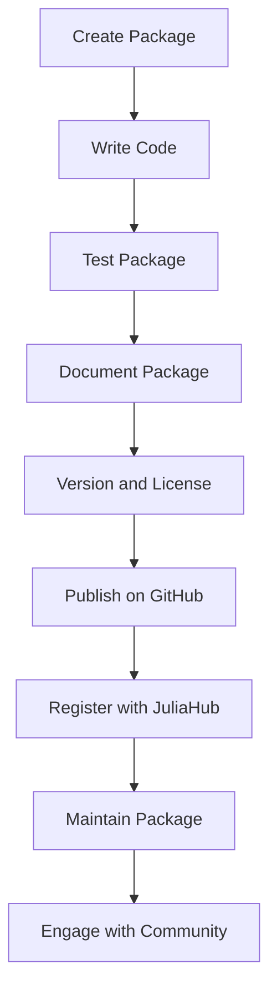

## 22.5 Package Development and Publishing to JuliaHub

In the world of Julia programming, developing and publishing packages is a crucial skill for contributing to the ecosystem and sharing your work with the community. This guide will walk you through the entire process of package development, from setting up your environment to publishing your package on JuliaHub, and maintaining it over time.

### Developing Packages

#### Setting Up Your Development Environment

Before diving into package development, ensure that your Julia environment is set up correctly. This includes having the latest version of Julia installed and a suitable code editor like VS Code or Atom with Julia extensions.

#### Creating a New Package

To create a new package, we use Julia's built-in package manager, `Pkg`. Start by entering the package manager mode in the Julia REPL:

```julia
using Pkg
Pkg.generate("MyAwesomePackage")
```

This command creates a new directory named `MyAwesomePackage` with a basic package structure, including a `Project.toml` file, which is essential for managing dependencies and package metadata.

#### Understanding the Package Structure

A typical Julia package has the following structure:

```
MyAwesomePackage/
├── Project.toml
├── src/
│   └── MyAwesomePackage.jl
└── test/
    └── runtests.jl
```

- **Project.toml**: Contains metadata about the package, such as its name, version, and dependencies.
- **src/**: Contains the source code of your package. The main file should have the same name as the package.
- **test/**: Contains test scripts to ensure your package functions correctly.

#### Writing Package Code

In `src/MyAwesomePackage.jl`, define your module and functions:

```julia
module MyAwesomePackage

export greet

function greet(name::String)
    println("Hello, $name!")
end

end
```

This simple function `greet` will be the starting point of your package. As you develop, you can add more functions and types to expand its functionality.

#### Testing Your Package

Testing is a critical part of package development. Julia provides a `Test` standard library to facilitate this. Create a test file in the `test/` directory:

```julia
using Test
using MyAwesomePackage

@testset "Greet Function Tests" begin
    @test greet("World") == "Hello, World!"
end
```

Run your tests using the following command in the Julia REPL:

```julia
using Pkg
Pkg.test("MyAwesomePackage")
```

This command will execute your test suite and report any failures.

### Publishing Packages

#### Preparing for Publication

Before publishing your package, ensure that it meets the following criteria:

- **Documentation**: Provide clear documentation for your package. Consider using Documenter.jl to generate HTML documentation.
- **Versioning**: Follow semantic versioning (e.g., 1.0.0) to indicate the stability and changes in your package.
- **Licensing**: Choose an appropriate open-source license and include it in your package.

#### Registering with the General Registry

To make your package available to the Julia community, you need to register it with the General Registry. This process is facilitated by JuliaHub, which automates many of the steps involved.

1. **Create a GitHub Repository**: Host your package on GitHub. Ensure that your repository is public and contains a `README.md` file.

2. **Tag a Release**: Use GitHub to create a release tag that matches the version in your `Project.toml`.

3. **Register Your Package**: Use the JuliaHub interface to submit your package for registration. JuliaHub will check your package for compliance with registry guidelines and provide feedback if necessary.

#### Publishing to JuliaHub

JuliaHub is a platform that simplifies the process of publishing and managing Julia packages. It provides tools for continuous integration, documentation hosting, and more.

- **Continuous Integration**: Set up CI/CD pipelines using GitHub Actions or Travis CI to automatically test your package on different Julia versions and operating systems.
- **Documentation Hosting**: Use JuliaHub to host your package documentation, making it easily accessible to users.

### Maintaining Packages

#### Handling Updates and Deprecations

As your package evolves, you'll need to manage updates and deprecations:

- **Backward Compatibility**: Ensure that new versions of your package do not break existing functionality unless necessary.
- **Deprecation Warnings**: Use deprecation warnings to inform users about changes that will occur in future versions.

#### Engaging with the Community

Community feedback is invaluable for improving your package. Encourage users to report issues and contribute to the development:

- **Issue Tracking**: Use GitHub Issues to track bugs and feature requests.
- **Pull Requests**: Welcome contributions from other developers through pull requests.

#### Best Practices for Package Maintenance

- **Regular Updates**: Keep your package up-to-date with the latest Julia releases and dependencies.
- **Clear Communication**: Maintain clear communication with your users about changes and updates.

### Visualizing the Package Development Workflow

Below is a flowchart representing the package development workflow, from creation to publication and maintenance.



### Try It Yourself

Experiment with creating your own package by following these steps:

1. Create a new package using `Pkg.generate`.
2. Implement a simple function and write tests for it.
3. Document your function using comments or a `README.md`.
4. Publish your package to GitHub and register it with JuliaHub.
5. Engage with the community by encouraging feedback and contributions.

### References and Links

- [JuliaLang Documentation](https://docs.julialang.org/en/v1/)
- [Pkg.jl Documentation](https://julialang.github.io/Pkg.jl/v1/)
- [JuliaHub](https://juliahub.com/)
- [Documenter.jl](https://juliadocs.github.io/Documenter.jl/stable/)

### Knowledge Check

- What is the purpose of the `Project.toml` file in a Julia package?
- How can you test a Julia package locally?
- What are the steps to publish a package on JuliaHub?
- Why is it important to follow semantic versioning?

### Embrace the Journey

Remember, developing and publishing Julia packages is a rewarding process that contributes to the growth of the Julia ecosystem. Keep experimenting, stay curious, and enjoy the journey!

## Quiz Time!



### What is the first step in creating a new Julia package?

- [x] Use `Pkg.generate("PackageName")`
- [ ] Create a GitHub repository
- [ ] Write the package documentation
- [ ] Register the package with JuliaHub

> **Explanation:** The first step in creating a new Julia package is to use the `Pkg.generate("PackageName")` command, which sets up the basic package structure.

### Which file contains the metadata for a Julia package?

- [x] Project.toml
- [ ] README.md
- [ ] src/PackageName.jl
- [ ] runtests.jl

> **Explanation:** The `Project.toml` file contains the metadata for a Julia package, including its name, version, and dependencies.

### How do you run tests for a Julia package?

- [x] Pkg.test("PackageName")
- [ ] julia test/runtests.jl
- [ ] Pkg.run("tests")
- [ ] julia --test PackageName

> **Explanation:** You run tests for a Julia package using the `Pkg.test("PackageName")` command, which executes the test suite defined in the `test/` directory.

### What is the purpose of semantic versioning?

- [x] To indicate the stability and changes in a package
- [ ] To provide a unique identifier for each package
- [ ] To ensure compatibility with all Julia versions
- [ ] To manage package dependencies

> **Explanation:** Semantic versioning is used to indicate the stability and changes in a package, helping users understand the impact of updates.

### What platform simplifies the process of publishing and managing Julia packages?

- [x] JuliaHub
- [ ] GitHub
- [ ] Travis CI
- [ ] Documenter.jl

> **Explanation:** JuliaHub simplifies the process of publishing and managing Julia packages, providing tools for continuous integration, documentation hosting, and more.

### What should you do before registering your package with the General Registry?

- [x] Create a GitHub repository and tag a release
- [ ] Write extensive documentation
- [ ] Set up a CI/CD pipeline
- [ ] Engage with the community

> **Explanation:** Before registering your package with the General Registry, you should create a GitHub repository and tag a release that matches the version in your `Project.toml`.

### How can you encourage community contributions to your package?

- [x] Use GitHub Issues and welcome pull requests
- [ ] Keep the package private
- [ ] Avoid documenting the code
- [ ] Limit the package's functionality

> **Explanation:** Encouraging community contributions involves using GitHub Issues to track bugs and feature requests and welcoming pull requests from other developers.

### What is a critical part of package development?

- [x] Testing the package
- [ ] Avoiding version updates
- [ ] Keeping the package undocumented
- [ ] Limiting the package's functionality

> **Explanation:** Testing the package is a critical part of development to ensure that it functions correctly and meets user expectations.

### Which tool can you use to generate HTML documentation for your package?

- [x] Documenter.jl
- [ ] Pkg.jl
- [ ] JuliaHub
- [ ] GitHub Actions

> **Explanation:** Documenter.jl is a tool used to generate HTML documentation for Julia packages, making it easier for users to understand and use the package.

### True or False: Semantic versioning is optional for Julia packages.

- [ ] True
- [x] False

> **Explanation:** Semantic versioning is not optional; it is a best practice for Julia packages to indicate the stability and changes in the package.


