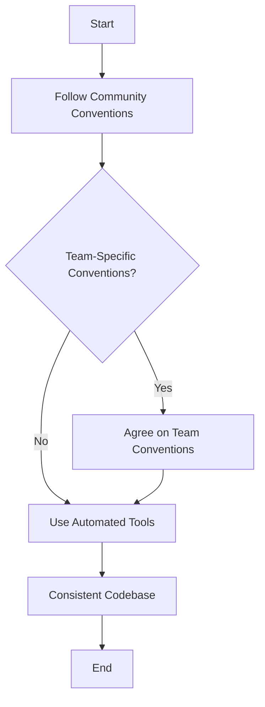

## 22.6 Coding Standards and Style Conventions

In the world of software development, coding standards and style conventions are crucial for ensuring that code is not only functional but also readable, maintainable, and efficient. In this section, we will explore the coding standards and style conventions specific to Julia, a high-level, high-performance programming language for technical computing. By adhering to these guidelines, developers can produce code that is consistent, easy to understand, and less prone to errors.

### Julia Style Guide

The Julia community has established a set of conventions that help maintain consistency across codebases. These conventions cover various aspects of coding, including naming, indentation, and formatting. Let's delve into these conventions and understand their importance.

#### Naming Conventions

1. **Variables and Functions**: Use lowercase letters and underscores to separate words. For example, `my_variable` and `calculate_sum`.
2. **Constants**: Use uppercase letters with underscores. For example, `MAX_ITERATIONS`.
3. **Types and Modules**: Use CamelCase. For example, `MyType` and `MyModule`.
4. **Functions with Boolean Return Values**: Use a question mark at the end. For example, `is_valid?`.

#### Indentation and Formatting

1. **Indentation**: Use four spaces per indentation level. Avoid using tabs.
2. **Line Length**: Limit lines to 92 characters for better readability.
3. **Whitespace**: Use spaces around operators and after commas. Avoid trailing whitespace.
4. **Braces and Parentheses**: Place opening braces on the same line as the statement, and closing braces on a new line.

#### Example Code

```julia
function factorial(n::Int)
    if n < 0
        error("Factorial is not defined for negative numbers")
    elseif n == 0
        return 1
    else
        result = 1
        for i in 1:n
            result *= i
        end
        return result
    end
end

println(factorial(5))  # Output: 120
```

### Automated Formatting Tools

To enforce style guidelines consistently, automated formatting tools like JuliaFormatter.jl can be used. These tools help maintain a uniform coding style across projects, reducing the cognitive load on developers and minimizing style-related code review comments.

#### JuliaFormatter.jl

JuliaFormatter.jl is a popular tool that automatically formats Julia code according to specified style guidelines. It can be integrated into development workflows to ensure code consistency.

- **Installation**: Install JuliaFormatter.jl using Julia's package manager.

```julia
using Pkg
Pkg.add("JuliaFormatter")
```

- **Usage**: Format a file or an entire directory.

```julia
using JuliaFormatter

format("path/to/file.jl")

format("path/to/directory")
```

- **Configuration**: Customize formatting options by creating a `.JuliaFormatter.toml` file in the project directory.

```toml
style = "blue"
margin = 92
```

### Consistency Within Teams

While community conventions provide a solid foundation, teams may have specific needs that require additional guidelines. Establishing team-specific conventions ensures that all team members are on the same page and can collaborate effectively.

#### Agreeing on Conventions

1. **Team Meetings**: Discuss and agree on coding standards during team meetings.
2. **Documentation**: Document the agreed-upon conventions in a shared document accessible to all team members.
3. **Code Reviews**: Use code reviews to reinforce adherence to the conventions and provide feedback.

#### Example Team Conventions

- **Commenting**: Use comments to explain complex logic or decisions.
- **Error Handling**: Standardize error handling practices, such as using specific exception types.
- **Testing**: Agree on testing frameworks and practices to ensure code quality.

### Visualizing Julia's Style Conventions

To better understand the flow of coding standards and style conventions, let's visualize the process using a flowchart.



**Figure 1**: Flowchart illustrating the process of establishing and maintaining coding standards and style conventions in Julia.

### Key Takeaways

- **Consistency**: Consistent coding style improves readability and maintainability.
- **Automation**: Use tools like JuliaFormatter.jl to automate style enforcement.
- **Collaboration**: Agree on team-specific conventions to facilitate collaboration.

### Try It Yourself

Experiment with the provided code examples by modifying variable names, changing indentation levels, or adding comments. Use JuliaFormatter.jl to format your code and observe the changes.

### References and Links

- [JuliaFormatter.jl Documentation](https://github.com/domluna/JuliaFormatter)
- [Julia Style Guide](https://docs.julialang.org/en/v1/manual/style-guide/)

### Knowledge Check

1. What are the naming conventions for variables and functions in Julia?
2. How can automated formatting tools help maintain coding standards?
3. Why is consistency important in a team setting?

### Embrace the Journey

Remember, mastering coding standards and style conventions is a journey. As you progress, you'll find that adhering to these guidelines becomes second nature, allowing you to focus on solving complex problems. Keep experimenting, stay curious, and enjoy the journey!

## Quiz Time!



### What is the recommended indentation level in Julia?

- [ ] Two spaces
- [x] Four spaces
- [ ] One tab
- [ ] Eight spaces

> **Explanation:** Julia style guide recommends using four spaces per indentation level.

### Which tool can be used to automatically format Julia code?

- [ ] PyFormatter
- [x] JuliaFormatter.jl
- [ ] CodeBeautifier
- [ ] FormatIt

> **Explanation:** JuliaFormatter.jl is a tool specifically designed to format Julia code according to style guidelines.

### What is the naming convention for constants in Julia?

- [ ] camelCase
- [ ] snake_case
- [x] UPPERCASE_WITH_UNDERSCORES
- [ ] PascalCase

> **Explanation:** Constants in Julia should be named using uppercase letters with underscores.

### Why is it important to agree on team-specific conventions?

- [x] To ensure all team members are on the same page
- [ ] To make code reviews unnecessary
- [ ] To avoid using automated tools
- [ ] To increase code complexity

> **Explanation:** Agreeing on team-specific conventions ensures that all team members follow the same guidelines, facilitating collaboration.

### What should be the maximum line length in Julia code for better readability?

- [ ] 80 characters
- [x] 92 characters
- [ ] 100 characters
- [ ] 120 characters

> **Explanation:** The Julia style guide recommends limiting lines to 92 characters for better readability.

### Which of the following is a benefit of using automated formatting tools?

- [x] Consistent code style
- [ ] Increased code complexity
- [ ] Reduced code readability
- [ ] Elimination of code reviews

> **Explanation:** Automated formatting tools help maintain a consistent code style across projects.

### How can team-specific conventions be documented?

- [x] In a shared document accessible to all team members
- [ ] In individual emails to each team member
- [ ] In private notes
- [ ] In verbal agreements only

> **Explanation:** Documenting team-specific conventions in a shared document ensures that all team members have access to the guidelines.

### What is the purpose of using comments in code?

- [x] To explain complex logic or decisions
- [ ] To increase code length
- [ ] To make code harder to read
- [ ] To replace documentation

> **Explanation:** Comments are used to explain complex logic or decisions, making the code easier to understand.

### Which of the following is NOT a recommended practice for error handling?

- [ ] Using specific exception types
- [ ] Standardizing error handling practices
- [x] Ignoring errors
- [ ] Documenting error handling strategies

> **Explanation:** Ignoring errors is not a recommended practice; errors should be handled appropriately.

### True or False: Consistent coding style is only important for large teams.

- [ ] True
- [x] False

> **Explanation:** Consistent coding style is important for both small and large teams as it improves readability and maintainability.


