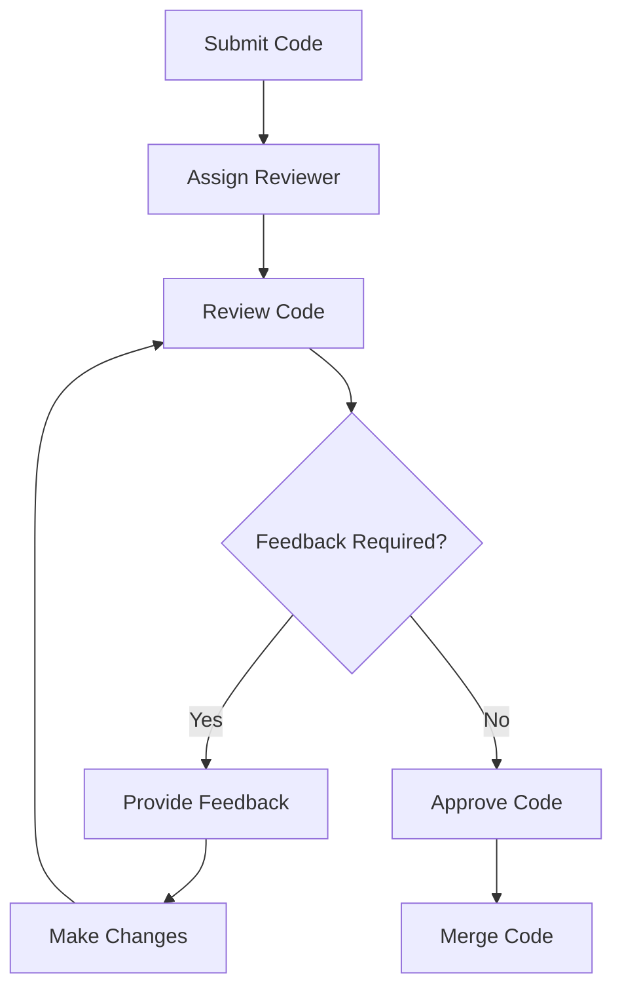
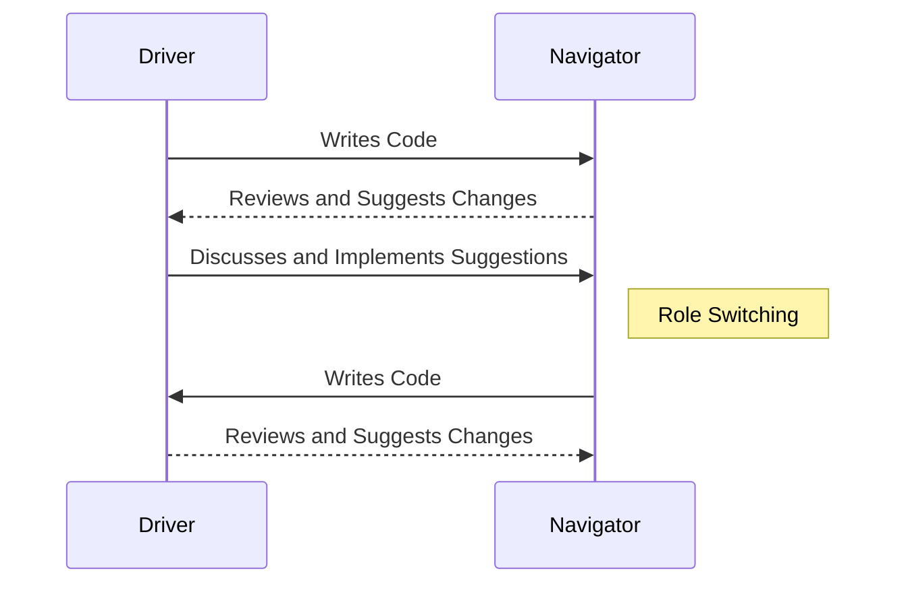

## 22.7 Code Review and Pair Programming Practices

In the realm of software development, code review and pair programming are two practices that stand out for their ability to enhance code quality, foster collaboration, and improve team productivity. In this section, we will delve into the benefits of these practices, explore techniques for conducting effective code reviews, and discuss pair programming methods that can be particularly beneficial for Julia developers.

### Benefits of Code Reviews

Code reviews are a critical component of the software development lifecycle. They involve the systematic examination of source code by one or more developers, other than the author, to identify defects, ensure adherence to coding standards, and improve the overall quality of the software. Here are some key benefits:

- **Improving Code Quality**: Code reviews help catch bugs and logical errors that automated tests might miss. They ensure that the code adheres to best practices and coding standards, leading to more robust and maintainable software.
  
- **Knowledge Sharing**: Code reviews are an excellent opportunity for knowledge transfer among team members. They allow developers to learn new techniques, understand different parts of the codebase, and stay updated with the latest changes.

- **Consistency and Standards**: Regular code reviews help maintain consistency across the codebase by ensuring that all developers adhere to the same coding standards and practices.

- **Reduced Technical Debt**: By identifying potential issues early, code reviews help reduce technical debt, making future maintenance and enhancements easier.

- **Enhanced Collaboration**: Code reviews foster a culture of collaboration and open communication within the team, leading to better teamwork and a more cohesive development process.

### Conducting Effective Reviews

To maximize the benefits of code reviews, it's essential to conduct them effectively. Here are some strategies to consider:

- **Set Clear Objectives**: Before starting a code review, define what you aim to achieve. Are you focusing on finding bugs, improving design, or ensuring adherence to coding standards? Having clear objectives helps reviewers focus on what's important.

- **Provide Constructive Feedback**: Feedback should be specific, actionable, and respectful. Instead of simply pointing out what's wrong, suggest improvements and explain why certain changes are necessary.

- **Focus on Important Issues**: Prioritize critical issues that impact the functionality, security, or performance of the application. Avoid nitpicking on minor style issues unless they significantly affect readability or maintainability.

- **Use Tools to Automate Checks**: Leverage tools like linters and static analyzers to automate style and syntax checks. This allows reviewers to focus on more complex issues that require human judgment.

- **Limit the Scope of Reviews**: Large code reviews can be overwhelming and less effective. Break them down into smaller, manageable chunks to ensure thorough examination and meaningful feedback.

- **Encourage Open Discussion**: Create an environment where developers feel comfortable discussing code and asking questions. Encourage open dialogue to clarify misunderstandings and explore different solutions.

- **Document Decisions**: Keep a record of the decisions made during code reviews. This documentation can be valuable for future reference and helps new team members understand the rationale behind certain design choices.

### Pair Programming Techniques

Pair programming is a collaborative approach where two developers work together at one workstation. One developer, the "driver," writes the code, while the other, the "observer" or "navigator," reviews each line of code as it is typed. Here are some techniques to make pair programming effective:

- **Role Switching**: Regularly switch roles between driver and navigator to keep both developers engaged and to leverage their unique strengths and perspectives.

- **Set Clear Goals**: Before starting a session, define what you aim to achieve. Whether it's solving a specific problem, implementing a feature, or refactoring code, having clear goals helps maintain focus.

- **Communicate Continuously**: Maintain an open line of communication throughout the session. Discuss the code, ask questions, and share insights to ensure both developers are on the same page.

- **Embrace Diversity**: Pair developers with different skill sets and experiences. This diversity can lead to innovative solutions and provides an opportunity for mentoring and skill development.

- **Use Tools Effectively**: Utilize collaborative tools and platforms that support pair programming, such as shared IDEs or remote pair programming tools, to facilitate seamless collaboration.

- **Reflect and Adjust**: After each session, take time to reflect on what went well and what could be improved. Use this feedback to adjust your approach and enhance future sessions.

### Code Review and Pair Programming in Julia

Julia, with its unique features and capabilities, offers several opportunities to enhance code review and pair programming practices:

- **Leveraging Multiple Dispatch**: Julia's multiple dispatch system can lead to complex interactions between functions and types. Code reviews can help ensure that these interactions are well-understood and correctly implemented.

- **Metaprogramming Considerations**: Julia's powerful metaprogramming capabilities can introduce complexity. During code reviews, pay special attention to macros and generated functions to ensure they are used appropriately and do not introduce unexpected behavior.

- **Performance Optimization**: Julia is known for its performance. Code reviews can be an opportunity to identify performance bottlenecks and suggest optimizations, such as ensuring type stability and minimizing memory allocations.

- **Collaborative Exploration**: Pair programming in Julia can be particularly beneficial when exploring new libraries or solving complex mathematical problems, as it allows developers to combine their expertise and explore different approaches together.

### Try It Yourself

To get hands-on experience with code review and pair programming, try the following exercises:

1. **Code Review Exercise**: Review a small Julia script written by a colleague or found in an open-source repository. Identify areas for improvement and provide constructive feedback.

2. **Pair Programming Session**: Pair up with a fellow developer to implement a new feature or solve a bug in a Julia project. Practice role switching and continuous communication throughout the session.

3. **Experiment with Tools**: Explore tools that facilitate code review and pair programming, such as GitHub's pull request review system or collaborative IDEs like Visual Studio Code with Live Share.

### Visualizing Code Review and Pair Programming

To better understand the flow of code review and pair programming, let's visualize these processes using Mermaid.js diagrams.

#### Code Review Process

*Diagram 1: The flowchart illustrates the typical process of a code review, from submission to merging.*

#### Pair Programming Workflow

*Diagram 2: The sequence diagram shows the interaction between the driver and navigator during a pair programming session.*

### References and Links

- [GitHub Code Review Guide](https://docs.github.com/en/pull-requests/reviewing-changes-in-pull-requests/about-pull-request-reviews)
- [Pair Programming Techniques](https://martinfowler.com/articles/on-pair-programming.html)
- [JuliaLang Documentation](https://docs.julialang.org/)

### Knowledge Check

- **What are the main benefits of code reviews?**
- **How can you provide constructive feedback during a code review?**
- **What are some effective pair programming techniques?**
- **How does Julia's multiple dispatch influence code reviews?**

### Embrace the Journey

Remember, mastering code review and pair programming practices is a journey. As you continue to refine these skills, you'll not only improve your code quality but also enhance your collaboration and communication within your team. Keep experimenting, stay curious, and enjoy the process of learning and growing as a developer.

## Quiz Time!



### What is one of the primary benefits of code reviews?

- [x] Improving code quality
- [ ] Increasing code complexity
- [ ] Reducing team communication
- [ ] Eliminating the need for testing

> **Explanation:** Code reviews help improve code quality by identifying bugs and ensuring adherence to coding standards.

### What should be the focus of feedback during a code review?

- [x] Constructive and actionable feedback
- [ ] Personal criticism
- [ ] Only positive comments
- [ ] Ignoring major issues

> **Explanation:** Feedback should be constructive and actionable, focusing on improving the code rather than personal criticism.

### In pair programming, what is the role of the "navigator"?

- [x] Reviewing code and suggesting improvements
- [ ] Writing code
- [ ] Testing code
- [ ] Documenting code

> **Explanation:** The navigator reviews the code written by the driver and suggests improvements or alternative approaches.

### How can Julia's multiple dispatch system affect code reviews?

- [x] It can lead to complex interactions that need careful review
- [ ] It simplifies all code interactions
- [ ] It eliminates the need for code reviews
- [ ] It only affects performance, not code quality

> **Explanation:** Julia's multiple dispatch can lead to complex interactions between functions and types, which require careful review to ensure correctness.

### What is a key strategy for effective pair programming?

- [x] Regularly switching roles between driver and navigator
- [ ] Only one person working while the other watches
- [ ] Avoiding communication
- [ ] Focusing solely on speed

> **Explanation:** Regularly switching roles keeps both developers engaged and allows them to leverage their unique strengths.

### Which tool can automate style and syntax checks during code reviews?

- [x] Linters
- [ ] Debuggers
- [ ] Compilers
- [ ] Text editors

> **Explanation:** Linters can automate style and syntax checks, allowing reviewers to focus on more complex issues.

### What is an important consideration when conducting code reviews?

- [x] Limiting the scope of reviews to manageable chunks
- [ ] Reviewing entire codebases at once
- [ ] Focusing only on style issues
- [ ] Ignoring documentation

> **Explanation:** Limiting the scope of reviews to manageable chunks ensures thorough examination and meaningful feedback.

### How can pair programming benefit Julia developers specifically?

- [x] By facilitating collaborative exploration of complex problems
- [ ] By reducing the need for testing
- [ ] By eliminating the need for documentation
- [ ] By simplifying all code interactions

> **Explanation:** Pair programming allows developers to combine their expertise and explore different approaches to complex problems.

### What should be documented during code reviews?

- [x] Decisions made and rationale behind them
- [ ] Only the code changes
- [ ] Personal opinions
- [ ] Unrelated project details

> **Explanation:** Documenting decisions and their rationale provides valuable context for future reference and helps new team members understand design choices.

### True or False: Pair programming eliminates the need for code reviews.

- [ ] True
- [x] False

> **Explanation:** Pair programming complements code reviews but does not eliminate the need for them. Both practices have unique benefits and can be used together to enhance code quality.



