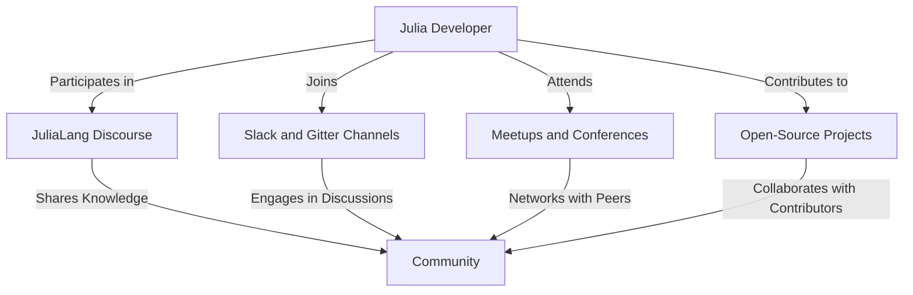

## 22.8 Continuous Learning and Community Involvement

In the rapidly evolving world of software development, staying updated and continuously learning is crucial for maintaining and enhancing your skills. This is especially true in the Julia programming ecosystem, where new features, packages, and best practices are frequently introduced. In this section, we will explore strategies for continuous learning and community involvement, providing you with the tools and resources to stay at the forefront of Julia development.

### Staying Updated

#### Keeping Abreast of New Julia Versions

Julia's development is dynamic, with regular updates and new releases that introduce powerful features and optimizations. To stay current:

- **Subscribe to JuliaLang Announcements**: Join the [JuliaLang Discourse](https://discourse.julialang.org/) and subscribe to the announcements category. This will keep you informed about new releases, important changes, and community news.
- **Follow the JuliaLang GitHub Repository**: By watching the [JuliaLang GitHub repository](https://github.com/JuliaLang/julia), you can track changes, pull requests, and issues that provide insights into ongoing development.
- **Read Release Notes**: Each new version of Julia comes with detailed release notes. These notes highlight new features, deprecations, and improvements. Make it a habit to review them to understand how updates might affect your projects.

#### Exploring New Packages and Libraries

The Julia ecosystem is rich with packages that extend its capabilities. To discover and evaluate new packages:

- **JuliaHub and Julia Observer**: Use [JuliaHub](https://juliahub.com/) and [Julia Observer](https://juliaobserver.com/) to explore popular and trending packages. These platforms provide insights into package usage, documentation, and community ratings.
- **Package Documentation**: Always review the documentation of new packages to understand their functionality and integration points. Good documentation is a sign of a well-maintained package.
- **Community Recommendations**: Engage with the community to get recommendations on packages. Forums, Slack channels, and meetups are excellent places to ask for advice and share experiences.

#### Adopting Best Practices

Best practices in Julia development evolve as the language matures. To ensure your code remains efficient and maintainable:

- **Follow the Julia Style Guide**: Adhere to the [Julia Style Guide](https://docs.julialang.org/en/v1/manual/style-guide/) for consistent and readable code.
- **Engage in Code Reviews**: Participate in code reviews within your team or open-source projects. This practice not only improves code quality but also exposes you to different coding styles and techniques.
- **Benchmark and Profile**: Regularly benchmark and profile your code using tools like `BenchmarkTools.jl` to identify performance bottlenecks and optimize your applications.

### Participating in the Community

#### Engaging in Forums and Discussions

The Julia community is vibrant and welcoming. Engaging with it can provide support, inspiration, and collaboration opportunities:

- **JuliaLang Discourse**: Join discussions on the [JuliaLang Discourse](https://discourse.julialang.org/), where you can ask questions, share knowledge, and participate in community-driven initiatives.
- **Slack and Gitter Channels**: Join the [JuliaLang Slack](https://julialang.org/slack/) and Gitter channels to connect with other developers in real-time. These platforms are great for quick questions and networking.
- **Social Media**: Follow Julia-related hashtags and accounts on platforms like Twitter and LinkedIn to stay informed about news, events, and discussions.

#### Attending Meetups and Conferences

Meetups and conferences are excellent opportunities to learn from experts, network with peers, and showcase your work:

- **JuliaCon**: Attend [JuliaCon](https://juliacon.org/), the annual conference dedicated to the Julia language. It features talks, workshops, and networking events that cover a wide range of topics.
- **Local Meetups**: Look for local Julia meetups in your area or consider organizing one. These gatherings provide a platform for sharing knowledge and collaborating on projects.
- **Workshops and Hackathons**: Participate in workshops and hackathons to gain hands-on experience and solve real-world problems using Julia.

#### Contributing to Open-Source Projects

Contributing to open-source projects is a rewarding way to improve your skills and give back to the community:

- **Find Projects on GitHub**: Explore Julia projects on GitHub that align with your interests and expertise. Look for issues labeled "good first issue" to get started.
- **Submit Pull Requests**: Contribute by submitting pull requests to fix bugs, add features, or improve documentation. This process helps you learn from code reviews and feedback.
- **Collaborate with Others**: Collaborate with other contributors to tackle larger projects. This experience enhances your teamwork and communication skills.

### Learning Resources

#### Books and Tutorials

Books and tutorials provide structured learning paths and in-depth knowledge:

- **"Think Julia" by Ben Lauwens and Allen Downey**: This book is an excellent introduction to programming with Julia, covering fundamental concepts and practical applications.
- **Online Tutorials**: Platforms like [JuliaAcademy](https://juliaacademy.com/) and [Coursera](https://www.coursera.org/) offer online courses and tutorials on various Julia topics, from basics to advanced techniques.

#### Workshops and Online Courses

Workshops and online courses offer interactive learning experiences:

- **JuliaAcademy**: Enroll in courses on [JuliaAcademy](https://juliaacademy.com/) to learn from experts and gain hands-on experience through exercises and projects.
- **MOOCs**: Massive Open Online Courses (MOOCs) on platforms like [edX](https://www.edx.org/) and [Coursera](https://www.coursera.org/) offer courses on data science, machine learning, and scientific computing using Julia.

#### Conferences and Webinars

Conferences and webinars provide insights into the latest trends and developments:

- **JuliaCon**: Attend [JuliaCon](https://juliacon.org/) to learn from leading experts and practitioners. The conference covers a wide range of topics, from core language features to industry applications.
- **Webinars and Online Talks**: Participate in webinars and online talks hosted by Julia organizations and community members. These events are often recorded and available for later viewing.

### Try It Yourself

To solidify your understanding of continuous learning and community involvement, try the following exercises:

1. **Join the JuliaLang Discourse**: Create an account on the [JuliaLang Discourse](https://discourse.julialang.org/) and introduce yourself in the "New to Julia" category. Participate in at least one discussion.

2. **Explore JuliaHub**: Visit [JuliaHub](https://juliahub.com/) and search for a package related to your interests. Read the documentation and try using the package in a small project.

3. **Contribute to an Open-Source Project**: Find a Julia project on GitHub and contribute by fixing a bug or improving documentation. Submit a pull request and engage with the maintainers.

4. **Attend a Webinar or Conference**: Register for an upcoming Julia webinar or conference. Take notes on key takeaways and share your insights with the community.

### Visualizing Community Involvement

To better understand the flow of community involvement, consider the following diagram that illustrates the interaction between different community platforms and activities:

**Diagram Description**: This diagram illustrates how a Julia developer can engage with various community platforms and activities, contributing to and benefiting from the collective knowledge and support of the community.

### References and Links

- [JuliaLang Discourse](https://discourse.julialang.org/)
- [JuliaHub](https://juliahub.com/)
- [JuliaCon](https://juliacon.org/)
- [JuliaAcademy](https://juliaacademy.com/)
- [GitHub - JuliaLang](https://github.com/JuliaLang/julia)

### Knowledge Check

- **What are the benefits of engaging with the Julia community?**
- **How can you stay updated with the latest Julia developments?**
- **What are some recommended resources for learning Julia?**

### Embrace the Journey

Continuous learning and community involvement are key to thriving in the Julia ecosystem. Remember, this is just the beginning. As you engage with the community and explore new resources, you'll deepen your understanding and contribute to the growth of Julia. Keep experimenting, stay curious, and enjoy the journey!

## Quiz Time!



### What is a key benefit of participating in the Julia community?

- [x] Access to collective knowledge and support
- [ ] Guaranteed job opportunities
- [ ] Free access to all Julia courses
- [ ] Automatic updates to your Julia installation

> **Explanation:** Engaging with the community provides access to collective knowledge, support, and collaboration opportunities.

### How can you stay updated with new Julia versions?

- [x] Subscribe to JuliaLang announcements
- [ ] Only follow social media
- [ ] Wait for automatic updates
- [ ] Ignore updates until necessary

> **Explanation:** Subscribing to JuliaLang announcements ensures you receive timely information about new releases and changes.

### Which platform is recommended for exploring Julia packages?

- [x] JuliaHub
- [ ] LinkedIn
- [ ] Facebook
- [ ] Instagram

> **Explanation:** JuliaHub is a dedicated platform for exploring and evaluating Julia packages.

### What is a good starting point for contributing to open-source projects?

- [x] Issues labeled "good first issue"
- [ ] Complex feature requests
- [ ] Only documentation updates
- [ ] Large refactoring tasks

> **Explanation:** Issues labeled "good first issue" are designed to help newcomers start contributing to projects.

### What is JuliaCon?

- [x] An annual conference dedicated to the Julia language
- [ ] A social media group for Julia developers
- [ ] A Julia package management tool
- [ ] A coding competition

> **Explanation:** JuliaCon is an annual conference that features talks, workshops, and networking events for Julia developers.

### Which resource offers structured learning paths for Julia?

- [x] JuliaAcademy
- [ ] Only YouTube tutorials
- [ ] Random blog posts
- [ ] Unverified online forums

> **Explanation:** JuliaAcademy offers structured courses and tutorials for learning Julia.

### How can you engage with other Julia developers in real-time?

- [x] Join Slack and Gitter channels
- [ ] Only send emails
- [ ] Use postal mail
- [ ] Attend physical meetings only

> **Explanation:** Slack and Gitter channels provide real-time communication with other Julia developers.

### What is the purpose of code reviews?

- [x] Improve code quality and expose developers to different styles
- [ ] Only to criticize others' work
- [ ] To delay project timelines
- [ ] To avoid writing documentation

> **Explanation:** Code reviews help improve code quality and expose developers to different coding styles and techniques.

### Which of the following is a benefit of attending meetups?

- [x] Networking with peers
- [ ] Guaranteed job offers
- [ ] Free meals
- [ ] Automatic skill upgrades

> **Explanation:** Meetups provide networking opportunities and a platform for sharing knowledge and collaborating on projects.

### True or False: Continuous learning is unnecessary once you master Julia.

- [ ] True
- [x] False

> **Explanation:** Continuous learning is essential in the ever-evolving field of software development to stay updated with new tools, techniques, and best practices.


