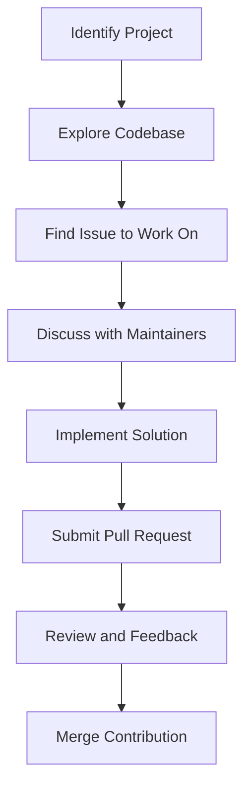

## 22.9 Leveraging the Julia Community and Resources

As we delve deeper into the world of Julia programming, it's essential to recognize the power of community and the wealth of resources available to us. Engaging with the Julia community not only enhances our understanding but also opens doors to collaboration, innovation, and growth. In this section, we'll explore how to effectively leverage the Julia community and resources to become a more proficient and connected developer.

### Online Forums and Discussions

#### Utilizing Discourse

The Julia Discourse forum is a vibrant hub where developers, researchers, and enthusiasts converge to discuss all things Julia. It's a place where you can ask questions, share insights, and learn from the experiences of others. Here's how you can make the most of it:

- **Engage Actively**: Participate in discussions by asking questions and providing answers. This not only helps you learn but also establishes your presence in the community.
- **Search Before Posting**: Before asking a question, use the search feature to see if it has already been addressed. This helps maintain the forum's efficiency and relevance.
- **Follow Topics of Interest**: Subscribe to categories or tags that align with your interests to stay updated on the latest discussions and developments.

#### Slack Channels and Community Chats

Slack channels offer real-time communication with fellow Julia users. These channels are ideal for quick questions, brainstorming sessions, and networking. Here's how to get involved:

- **Join Relevant Channels**: Find and join channels that match your interests, whether it's machine learning, data visualization, or general Julia programming.
- **Be Respectful and Professional**: Maintain a professional demeanor in your interactions. Remember, you're representing yourself and the community.
- **Share Your Knowledge**: Don't hesitate to share your expertise and help others. This fosters a collaborative environment and enhances your reputation.

### Contributing to Open-Source

#### Making Meaningful Contributions

Contributing to open-source projects is a rewarding way to give back to the community while honing your skills. Here's how to get started:

- **Identify Projects of Interest**: Explore the Julia ecosystem on platforms like GitHub to find projects that align with your skills and interests.
- **Start Small**: Begin with small contributions, such as fixing bugs or improving documentation. This helps you familiarize yourself with the project's codebase and workflow.
- **Communicate Effectively**: Engage with project maintainers and contributors through issues and pull requests. Clear communication is key to successful collaboration.

#### Benefits of Open-Source Contribution

- **Skill Development**: Working on real-world projects enhances your coding skills and exposes you to new technologies and methodologies.
- **Networking Opportunities**: Collaborating with developers worldwide expands your professional network and opens doors to new opportunities.
- **Recognition and Reputation**: Consistent contributions can lead to recognition within the community and bolster your professional reputation.

### Collaboration Opportunities

#### Finding Collaborators for Projects and Research

Collaboration is at the heart of innovation. Whether you're working on a personal project or conducting research, finding the right collaborators can make all the difference. Here's how to connect with potential collaborators:

- **Leverage Online Platforms**: Use platforms like GitHub, GitLab, and Bitbucket to showcase your projects and find collaborators with complementary skills.
- **Attend Conferences and Meetups**: Participate in Julia conferences, workshops, and meetups to network with like-minded individuals and explore collaboration opportunities.
- **Engage in Community Initiatives**: Join community-driven initiatives and hackathons to work on projects with fellow developers and researchers.

#### Building a Collaborative Environment

- **Define Clear Goals**: Establish clear objectives and expectations for your collaborative projects to ensure alignment and focus.
- **Foster Open Communication**: Maintain open lines of communication with your collaborators to address challenges and celebrate successes.
- **Embrace Diversity**: Encourage diverse perspectives and ideas to foster creativity and innovation in your projects.

### Code Examples

To illustrate the power of community collaboration, let's look at a simple example of how you might contribute to an open-source Julia project. Suppose you're contributing a new feature to a data visualization library.

```julia

"""
    plot_custom(data::Vector{Float64}, title::String)

Plots a custom line graph with the given data and title.
"""
function plot_custom(data::Vector{Float64}, title::String)
    # Import necessary plotting library
    using Plots

    # Create the plot
    plot(data, title=title, xlabel="Index", ylabel="Value", legend=false)

    # Display the plot
    display(plot)
end

data = [1.0, 2.5, 3.8, 4.2, 5.5]
plot_custom(data, "Custom Line Graph")
```

In this example, we've defined a simple function `plot_custom` that takes a vector of data and a title to generate a line graph. This function could be part of a larger contribution to a data visualization library, showcasing how small contributions can enhance a project.

### Visualizing Community Engagement

To better understand the flow of community engagement, let's visualize the process of contributing to an open-source project using a flowchart.



**Caption**: This flowchart illustrates the typical process of contributing to an open-source project, from identifying a project to having your contribution merged.

### References and Links

- [Julia Discourse Forum](https://discourse.julialang.org/)
- [JuliaLang Slack](https://julialang.org/slack/)
- [GitHub - JuliaLang](https://github.com/JuliaLang)

### Knowledge Check

To reinforce your understanding, consider the following questions:

- How can engaging with the Julia community enhance your programming skills?
- What are the benefits of contributing to open-source projects?
- How can you find collaborators for your projects?

### Embrace the Journey

Remember, engaging with the Julia community is a journey, not a destination. As you participate in discussions, contribute to projects, and collaborate with others, you'll grow as a developer and make meaningful connections. Keep exploring, stay curious, and enjoy the journey!

### Quiz Time!



### What is the primary purpose of the Julia Discourse forum?

- [x] To discuss all things Julia and engage with the community
- [ ] To host Julia code repositories
- [ ] To provide official Julia documentation
- [ ] To sell Julia-related merchandise

> **Explanation:** The Julia Discourse forum is a platform for discussing Julia-related topics and engaging with the community.

### How can you effectively contribute to an open-source project?

- [x] Start with small contributions like fixing bugs
- [ ] Only contribute to large, well-known projects
- [ ] Avoid communicating with project maintainers
- [ ] Focus solely on adding new features

> **Explanation:** Starting with small contributions helps you familiarize yourself with the project's codebase and workflow.

### What is a benefit of contributing to open-source projects?

- [x] Skill development and exposure to new technologies
- [ ] Guaranteed financial compensation
- [ ] Exclusive access to private repositories
- [ ] Avoiding collaboration with others

> **Explanation:** Contributing to open-source projects enhances your coding skills and exposes you to new technologies.

### Which platform is recommended for real-time communication with Julia users?

- [x] Slack channels
- [ ] GitHub issues
- [ ] JuliaLang website
- [ ] LinkedIn groups

> **Explanation:** Slack channels offer real-time communication with fellow Julia users.

### What is a key aspect of building a collaborative environment?

- [x] Defining clear goals and expectations
- [ ] Avoiding communication with collaborators
- [ ] Working independently without feedback
- [ ] Focusing solely on individual achievements

> **Explanation:** Establishing clear objectives and expectations ensures alignment and focus in collaborative projects.

### How can you find collaborators for your projects?

- [x] Attend conferences and meetups
- [ ] Only work with people you already know
- [ ] Avoid online platforms
- [ ] Focus solely on solo projects

> **Explanation:** Participating in conferences and meetups helps you network and find potential collaborators.

### What is an advantage of engaging with the Julia community?

- [x] Networking opportunities and professional growth
- [ ] Guaranteed job offers
- [ ] Access to private Julia repositories
- [ ] Avoiding learning new skills

> **Explanation:** Engaging with the community expands your professional network and opens doors to new opportunities.

### What should you do before posting a question on the Julia Discourse forum?

- [x] Use the search feature to see if it has been addressed
- [ ] Post the question immediately without searching
- [ ] Contact the forum administrator
- [ ] Wait for someone else to ask the same question

> **Explanation:** Using the search feature helps maintain the forum's efficiency and relevance.

### What is a recommended practice when contributing to open-source projects?

- [x] Communicate effectively with project maintainers
- [ ] Avoid discussing your contributions
- [ ] Focus solely on your own ideas
- [ ] Ignore feedback from others

> **Explanation:** Clear communication is key to successful collaboration in open-source projects.

### True or False: Engaging with the Julia community is a journey, not a destination.

- [x] True
- [ ] False

> **Explanation:** Engaging with the community is an ongoing process that involves continuous learning and growth.



By leveraging the Julia community and resources, you can enhance your skills, contribute to meaningful projects, and collaborate with fellow developers. Embrace the opportunities available to you and continue to grow as a Julia programmer.
