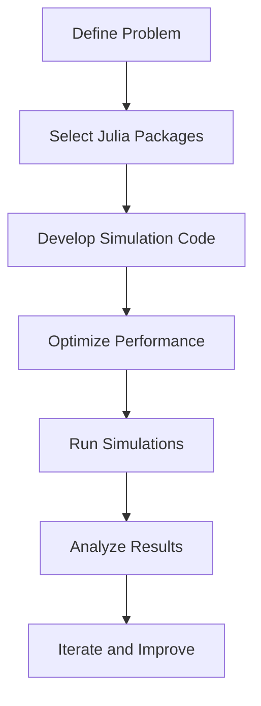

## 23.1 High-Performance Computing Projects with Julia

High-Performance Computing (HPC) is a critical domain that drives advancements in scientific research, engineering, and data analysis. Julia, a modern programming language, is uniquely positioned to excel in HPC due to its design and capabilities. In this section, we will explore how Julia's features make it an ideal choice for HPC applications, examine case studies of successful projects, and review performance benchmarks that highlight Julia's strengths compared to traditional HPC languages.

### Overview of HPC in Julia

Julia was designed with performance in mind, making it particularly well-suited for HPC applications. Let's delve into the key aspects of Julia that contribute to its effectiveness in this domain:

#### 1. Just-In-Time (JIT) Compilation

Julia employs JIT compilation through LLVM, allowing it to generate highly optimized machine code at runtime. This results in performance comparable to statically compiled languages like C and Fortran, which are traditionally used in HPC.

#### 2. Multiple Dispatch

Julia's multiple dispatch system enables flexible and efficient function definitions, allowing for highly optimized code paths based on the types of function arguments. This feature is particularly beneficial in scientific computing, where operations on different data types are common.

#### 3. Parallel and Distributed Computing

Julia provides robust support for parallel and distributed computing, enabling developers to leverage multi-core processors and distributed systems effectively. With built-in constructs for multi-threading and distributed computing, Julia simplifies the development of parallel algorithms.

#### 4. Rich Ecosystem

Julia's ecosystem includes powerful libraries for numerical computing, data manipulation, and visualization. Packages like DifferentialEquations.jl, JuMP.jl, and Flux.jl provide tools for solving complex scientific problems, optimizing mathematical models, and implementing machine learning algorithms.

#### 5. Interoperability

Julia can seamlessly call C, Fortran, and Python libraries, allowing developers to integrate existing HPC codebases and leverage specialized libraries without sacrificing performance.

### Case Study Examples

To illustrate Julia's capabilities in HPC, let's explore some notable case studies where Julia has been successfully applied to solve complex computational problems.

#### Climate Modeling

Climate modeling involves simulating the Earth's climate system to understand and predict climate changes. Julia's performance and ease of use make it an excellent choice for developing climate models.

**Project: ClimateMachine.jl**

ClimateMachine.jl is a Julia-based framework developed by the Climate Modeling Alliance (CliMA) for simulating the Earth's climate. It leverages Julia's performance to run large-scale simulations efficiently. The framework is designed to be modular and extensible, allowing researchers to experiment with different physical models and numerical methods.

```julia
using ClimateMachine

climate_model = ClimateMachine.init()

ClimateMachine.set_parameters!(climate_model, time_step=1.0, duration=3600.0)

ClimateMachine.run!(climate_model)
```

**Key Achievements:**

- **Scalability:** ClimateMachine.jl can scale across thousands of cores, enabling high-resolution simulations.
- **Flexibility:** Researchers can easily modify and extend the framework to incorporate new scientific insights.

#### Computational Physics Simulations

Computational physics involves solving complex physical systems using numerical methods. Julia's ability to handle large datasets and perform intensive computations makes it ideal for this domain.

**Project: Celeste.jl**

Celeste.jl is a project that uses Julia to perform probabilistic inference on astronomical data. It aims to create a detailed map of the universe by analyzing data from the Sloan Digital Sky Survey (SDSS).

```julia
using Celeste

data = Celeste.load_data("sdss_data.csv")

results = Celeste.infer(data)

Celeste.analyze(results)
```

**Key Achievements:**

- **Performance:** Celeste.jl achieved petaflop performance on a supercomputer, demonstrating Julia's capability to handle massive datasets efficiently.
- **Accuracy:** The project improved the accuracy of astronomical object detection and classification.

### Performance Achievements

Julia's performance in HPC is often compared to traditional languages like C, C++, and Fortran. Let's examine some benchmarks that highlight Julia's strengths:

#### Benchmark: Matrix Multiplication

Matrix multiplication is a common operation in scientific computing. Julia's performance in this area is comparable to optimized C and Fortran implementations.

```julia
using LinearAlgebra

A = rand(1000, 1000)
B = rand(1000, 1000)

C = A * B
```

**Performance Results:**

- **Julia:** Achieves similar performance to C and Fortran, thanks to its JIT compilation and optimized BLAS libraries.
- **Python (NumPy):** Slower due to the overhead of the Python interpreter.

#### Benchmark: Differential Equations

Solving differential equations is a core task in many scientific applications. Julia's DifferentialEquations.jl package provides state-of-the-art solvers that outperform traditional libraries.

```julia
using DifferentialEquations

function f(du, u, p, t)
    du[1] = p[1] * u[1]
end

u0 = [1.0]
p = [0.5]
tspan = (0.0, 10.0)

prob = ODEProblem(f, u0, tspan, p)
sol = solve(prob)
```

**Performance Results:**

- **Julia:** Outperforms MATLAB and SciPy in terms of speed and accuracy, especially for stiff and large-scale problems.
- **MATLAB/SciPy:** Slower due to less efficient solvers and overhead.

### Visualizing Julia's HPC Capabilities

To better understand Julia's role in HPC, let's visualize the workflow of a typical HPC project using Julia.



**Diagram Description:** This flowchart illustrates the typical steps involved in an HPC project using Julia, from defining the problem to analyzing results and iterating for improvements.

### Try It Yourself

To get hands-on experience with Julia in HPC, try modifying the code examples provided. Experiment with different parameters, data sizes, and algorithms to see how Julia's performance scales with complexity.

### Knowledge Check

Before we conclude, let's reinforce what we've learned with a few questions:

- How does Julia's JIT compilation contribute to its performance in HPC?
- What are some key features of Julia that make it suitable for parallel computing?
- How does Julia's performance compare to traditional HPC languages like C and Fortran?

### Embrace the Journey

Remember, mastering HPC with Julia is a journey. As you explore more complex projects, you'll discover new ways to leverage Julia's capabilities. Keep experimenting, stay curious, and enjoy the process of pushing the boundaries of computational science.

## Quiz Time!



### How does Julia's JIT compilation contribute to its performance in HPC?

- [x] It generates optimized machine code at runtime.
- [ ] It interprets code line by line.
- [ ] It compiles code to bytecode.
- [ ] It uses a virtual machine for execution.

> **Explanation:** Julia's JIT compilation generates optimized machine code at runtime, resulting in performance comparable to statically compiled languages.

### What is a key feature of Julia that supports parallel computing?

- [x] Multiple dispatch
- [ ] Single-threaded execution
- [ ] Bytecode interpretation
- [ ] Virtual machine execution

> **Explanation:** Julia's multiple dispatch system allows for efficient and flexible function definitions, which is beneficial for parallel computing.

### Which package is used for solving differential equations in Julia?

- [x] DifferentialEquations.jl
- [ ] LinearAlgebra.jl
- [ ] DataFrames.jl
- [ ] Flux.jl

> **Explanation:** DifferentialEquations.jl is a powerful package in Julia for solving differential equations efficiently.

### What is the primary advantage of using Julia for climate modeling?

- [x] Performance and flexibility
- [ ] Limited library support
- [ ] Slow execution
- [ ] Lack of scalability

> **Explanation:** Julia offers performance and flexibility, making it ideal for developing and running large-scale climate models.

### How does Julia's performance in matrix multiplication compare to Python's NumPy?

- [x] Comparable to C and Fortran
- [ ] Slower than Python
- [ ] Faster than C++
- [ ] Similar to Java

> **Explanation:** Julia's performance in matrix multiplication is comparable to C and Fortran, outperforming Python's NumPy due to JIT compilation and optimized libraries.

### What is a notable achievement of the Celeste.jl project?

- [x] Achieving petaflop performance
- [ ] Limited scalability
- [ ] Slow data processing
- [ ] Inaccurate results

> **Explanation:** Celeste.jl achieved petaflop performance on a supercomputer, showcasing Julia's capability to handle massive datasets efficiently.

### Which feature of Julia allows seamless integration with C and Fortran libraries?

- [x] Interoperability
- [ ] Bytecode interpretation
- [ ] Virtual machine execution
- [ ] Single-threaded execution

> **Explanation:** Julia's interoperability allows seamless integration with C and Fortran libraries, enabling developers to leverage existing HPC codebases.

### What is the role of ClimateMachine.jl in climate modeling?

- [x] Simulating the Earth's climate
- [ ] Analyzing financial data
- [ ] Solving algebraic equations
- [ ] Visualizing data

> **Explanation:** ClimateMachine.jl is a Julia-based framework for simulating the Earth's climate, leveraging Julia's performance for large-scale simulations.

### How does Julia's performance in solving differential equations compare to MATLAB?

- [x] Outperforms MATLAB
- [ ] Slower than MATLAB
- [ ] Similar to Python
- [ ] Comparable to Java

> **Explanation:** Julia outperforms MATLAB in solving differential equations, especially for stiff and large-scale problems, due to its efficient solvers.

### True or False: Julia's ecosystem includes powerful libraries for numerical computing and data manipulation.

- [x] True
- [ ] False

> **Explanation:** True. Julia's ecosystem includes powerful libraries like DifferentialEquations.jl and JuMP.jl for numerical computing and data manipulation.



By exploring these concepts and engaging with the exercises, you're well on your way to mastering high-performance computing with Julia. Keep pushing the boundaries, and remember that the journey is as important as the destination.
