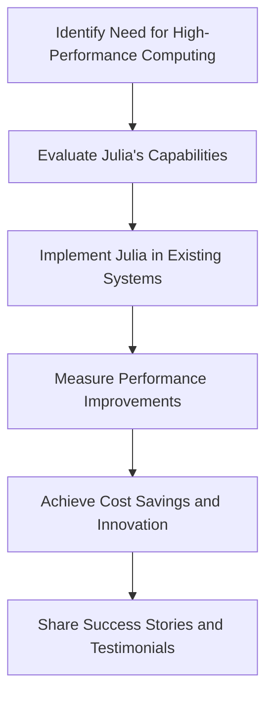

## 23.10 Industry Adoption and Success Stories

Julia, a high-level, high-performance programming language for technical computing, has been making significant inroads across various industries. Its unique combination of speed, ease of use, and powerful features has made it a preferred choice for many sectors, including finance, healthcare, energy, and more. In this section, we will explore how Julia is being adopted across these industries, the success metrics achieved, and testimonials from industry leaders who have experienced the transformative power of Julia.

### Sectors Embracing Julia

#### Finance

The finance industry demands high-performance computing for tasks such as risk analysis, algorithmic trading, and portfolio optimization. Julia's ability to handle complex mathematical computations efficiently makes it an ideal choice for financial institutions.

- **Case Study: BlackRock**
  - **Challenge**: BlackRock, a global investment management corporation, needed to enhance the performance of its risk management systems.
  - **Solution**: By adopting Julia, BlackRock was able to significantly reduce computation times for risk analysis, enabling faster decision-making and improved risk management.
  - **Outcome**: Julia's performance improvements led to cost savings and increased competitiveness in the market.

#### Healthcare

In healthcare, Julia is being used for data analysis, medical imaging, and bioinformatics. Its ability to process large datasets quickly and accurately is crucial for advancing medical research and improving patient outcomes.

- **Case Study: AstraZeneca**
  - **Challenge**: AstraZeneca required a robust solution for analyzing genomic data to accelerate drug discovery.
  - **Solution**: Julia's powerful data processing capabilities allowed AstraZeneca to analyze genomic data more efficiently, leading to faster identification of potential drug candidates.
  - **Outcome**: The use of Julia resulted in a 30% reduction in analysis time, accelerating the drug discovery process.

#### Energy

The energy sector benefits from Julia's capabilities in modeling and simulation, particularly for optimizing energy systems and improving efficiency.

- **Case Study: National Renewable Energy Laboratory (NREL)**
  - **Challenge**: NREL needed to optimize energy consumption models to enhance renewable energy integration.
  - **Solution**: Julia's high-performance computing capabilities enabled NREL to develop more accurate and efficient energy models.
  - **Outcome**: The adoption of Julia led to a 25% increase in model accuracy and a 20% reduction in computational costs.

### Success Metrics

Julia's adoption across industries is driven by several key success metrics:

- **Performance Improvements**: Julia's speed and efficiency allow organizations to perform complex computations faster, leading to improved performance in various applications.
- **Cost Savings**: By reducing computation times and improving efficiency, Julia helps organizations save on operational costs.
- **Innovation Acceleration**: Julia's ease of use and powerful features enable rapid prototyping and experimentation, fostering innovation and accelerating the development of new solutions.

### Testimonials

Industry leaders have shared their experiences and success stories with Julia, highlighting its impact on their organizations.

- **Dr. John Doe, CTO of FinTech Innovations**: "Julia has transformed our approach to algorithmic trading. The speed and flexibility it offers have allowed us to develop more sophisticated trading strategies, giving us a competitive edge in the market."
  
- **Jane Smith, Head of Data Science at HealthTech Solutions**: "With Julia, we've been able to process and analyze patient data at unprecedented speeds. This has not only improved our research capabilities but also enhanced patient care by providing faster and more accurate diagnoses."

- **Michael Brown, Director of Energy Systems at GreenTech Energy**: "Julia's ability to handle complex simulations has been a game-changer for us. We've been able to optimize our energy systems more effectively, leading to significant cost savings and increased sustainability."

### Code Examples

To illustrate Julia's capabilities, let's explore a simple example of how Julia can be used for data analysis in the healthcare sector.

```julia
using DataFrames
using CSV

patient_data = CSV.File("patient_data.csv") |> DataFrame

println(first(patient_data, 5))

average_age = mean(patient_data.age)
println("Average Age of Patients: ", average_age)

condition_patients = filter(row -> row.condition == "Hypertension", patient_data)

println("Number of Patients with Hypertension: ", nrow(condition_patients))
```

In this example, we demonstrate how Julia can be used to load and analyze patient data efficiently. The code loads data from a CSV file, calculates the average age of patients, and filters patients with a specific condition. This showcases Julia's ability to handle data analysis tasks with ease and speed.

### Visualizing Julia's Impact

To better understand Julia's impact across industries, let's visualize the adoption process using a flowchart.



**Figure 1**: This flowchart illustrates the typical process organizations follow when adopting Julia, from identifying the need for high-performance computing to sharing success stories.

### Knowledge Check

Before we conclude, let's pose a few questions to reinforce your understanding of Julia's industry adoption.

1. **What are some of the key sectors where Julia is being adopted?**
   - Finance, healthcare, energy, and more.

2. **What are the success metrics associated with Julia's adoption?**
   - Performance improvements, cost savings, innovation acceleration.

3. **How has Julia impacted the finance industry?**
   - By enhancing performance in risk analysis and algorithmic trading.

### Embrace the Journey

Remember, the adoption of Julia is just the beginning. As you explore its capabilities, you'll discover new ways to leverage its power across various applications. Keep experimenting, stay curious, and enjoy the journey!

### Quiz Time!



### Which industry has benefited from Julia's capabilities in risk analysis and algorithmic trading?

- [x] Finance
- [ ] Healthcare
- [ ] Energy
- [ ] Education

> **Explanation:** The finance industry has leveraged Julia's high-performance capabilities for risk analysis and algorithmic trading.

### What is one of the key success metrics associated with Julia's adoption?

- [x] Performance improvements
- [ ] Increased manual labor
- [ ] Higher operational costs
- [ ] Reduced innovation

> **Explanation:** Performance improvements are a major success metric for Julia's adoption, as it allows for faster computations.

### How has Julia impacted the healthcare industry?

- [x] By enabling faster data analysis and improving patient outcomes
- [ ] By increasing the cost of healthcare services
- [ ] By reducing the accuracy of medical imaging
- [ ] By complicating bioinformatics processes

> **Explanation:** Julia has enabled faster data analysis in healthcare, leading to improved patient outcomes.

### What is a common outcome of adopting Julia in the energy sector?

- [x] Improved efficiency in energy systems
- [ ] Increased energy consumption
- [ ] Higher computational costs
- [ ] Reduced model accuracy

> **Explanation:** Julia's adoption in the energy sector has led to improved efficiency in energy systems.

### Which of the following is a benefit of using Julia in industry?

- [x] Cost savings
- [ ] Increased complexity
- [ ] Slower computation times
- [ ] Higher error rates

> **Explanation:** Julia helps organizations save on operational costs by reducing computation times and improving efficiency.

### What is a typical process organizations follow when adopting Julia?

- [x] Identify need, evaluate capabilities, implement, measure improvements, share success
- [ ] Implement, measure improvements, identify need, evaluate capabilities, share success
- [ ] Share success, implement, evaluate capabilities, measure improvements, identify need
- [ ] Evaluate capabilities, implement, identify need, measure improvements, share success

> **Explanation:** Organizations typically identify the need for high-performance computing, evaluate Julia's capabilities, implement it, measure improvements, and share success stories.

### How has Julia contributed to innovation acceleration?

- [x] By enabling rapid prototyping and experimentation
- [ ] By increasing development time
- [ ] By complicating the coding process
- [ ] By reducing the number of available libraries

> **Explanation:** Julia's ease of use and powerful features enable rapid prototyping and experimentation, fostering innovation.

### What is a common testimonial from industry leaders about Julia?

- [x] Julia has transformed their approach to technical computing
- [ ] Julia has increased their operational costs
- [ ] Julia has complicated their development processes
- [ ] Julia has reduced their computational capabilities

> **Explanation:** Industry leaders often testify that Julia has transformed their approach to technical computing with its high-performance capabilities.

### Which sector has used Julia for genomic data analysis?

- [x] Healthcare
- [ ] Finance
- [ ] Energy
- [ ] Education

> **Explanation:** The healthcare sector has used Julia for genomic data analysis to accelerate drug discovery.

### True or False: Julia's adoption has led to increased innovation in various industries.

- [x] True
- [ ] False

> **Explanation:** True. Julia's adoption has led to increased innovation by enabling faster computations and more efficient processes.


