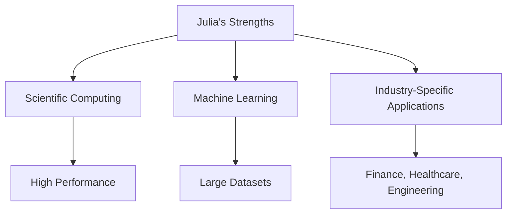

## 23.11 Lessons Learned from Real-World Julia Applications

As Julia continues to gain traction in various domains, from scientific computing to machine learning, developers and organizations have gathered valuable insights from deploying Julia in real-world applications. This section delves into the lessons learned, best practices identified, challenges overcome, and future outlooks for Julia's role in diverse industries.

### Best Practices Identified

#### Embrace Julia's Strengths

Julia's strengths lie in its high-performance capabilities, ease of use, and ability to handle complex mathematical computations. Leveraging these strengths can lead to significant improvements in application performance and developer productivity.

- **Utilize Multiple Dispatch**: Julia's multiple dispatch system allows for more flexible and efficient code. By designing functions that can operate on various types, developers can create more generic and reusable code.

```julia
function process(data::Array{Int})
    println("Processing integer array")
end

function process(data::Array{Float64})
    println("Processing float array")
end

```

- **Optimize with Type Declarations**: Explicit type declarations can enhance performance by allowing the compiler to generate more efficient code. This is particularly important in performance-critical sections.

```julia
function compute_sum(arr::Vector{Int})::Int
    sum = 0
    for num in arr
        sum += num
    end
    return sum
end
```

- **Leverage Julia's Ecosystem**: The Julia ecosystem offers a wide range of packages for various tasks. Utilizing these packages can save time and effort, allowing developers to focus on core application logic.

#### Effective Package Management

Managing packages effectively is crucial for maintaining a stable and reproducible development environment.

- **Use Project Environments**: Julia's project environments allow for isolated package management, ensuring that dependencies are consistent across different projects.

```julia
using Pkg
Pkg.activate("MyProject")
Pkg.add("DataFrames")
```

- **Version Control for Dependencies**: Keeping track of package versions helps prevent compatibility issues. Use `Manifest.toml` to lock dependencies to specific versions.

#### Collaborative Development

Collaboration is key in large-scale projects. Julia's features can facilitate teamwork and code sharing.

- **Modular Code Design**: Break down applications into modules to promote code reuse and simplify maintenance. This approach also makes it easier for teams to work on different parts of the application concurrently.

- **Documentation and Comments**: Clear documentation and comments are essential for team collaboration. Use Julia's built-in documentation tools to generate comprehensive documentation.

```julia
"""
    add(x, y)

Add two numbers `x` and `y`.
"""
function add(x, y)
    return x + y
end
```

### Overcoming Obstacles

Deploying Julia applications at scale presents unique challenges. Here are some common obstacles and strategies to overcome them.

#### Package Management Challenges

- **Dealing with Package Conflicts**: Conflicts between package dependencies can arise. Regularly update packages and test compatibility to mitigate these issues.

- **Deployment Complexity**: Deploying Julia applications can be complex due to the need for consistent environments. Use containerization tools like Docker to simplify deployment.

#### Team Training and Adoption

- **Training Developers**: Transitioning to Julia requires training for developers familiar with other languages. Provide resources and workshops to ease this transition.

- **Community Engagement**: Encourage team members to engage with the Julia community. This can provide support and insights into best practices and emerging trends.

#### Performance Optimization

- **Profiling and Benchmarking**: Use Julia's profiling tools to identify performance bottlenecks and optimize critical sections of code.

```julia
using Profile

@profile begin
    # Code to profile
end

Profile.print()
```

- **Parallel and Distributed Computing**: Julia's built-in support for parallel and distributed computing can significantly enhance performance for computationally intensive tasks.

### Future Outlook

Julia's future in various industries looks promising, with several trends and predictions emerging.

#### Growing Adoption in Scientific Computing

Julia's performance and ease of use make it an attractive choice for scientific computing. As more researchers and institutions adopt Julia, we can expect further advancements in scientific libraries and tools.

#### Expansion in Machine Learning and AI

Julia's capabilities in handling large datasets and performing complex computations position it well for machine learning and AI applications. The development of new packages and frameworks will likely drive further adoption in this field.

#### Industry-Specific Applications

Julia's flexibility allows it to be tailored to specific industry needs. We anticipate growth in domains such as finance, healthcare, and engineering, where Julia can provide significant performance benefits.

#### Community and Ecosystem Growth

The Julia community continues to grow, contributing to a rich ecosystem of packages and tools. This collaborative environment fosters innovation and ensures that Julia remains at the forefront of modern programming languages.

### Visualizing Julia's Role in Real-World Applications

To better understand Julia's impact and potential, let's visualize its role in various industries using a flowchart.



**Caption**: This flowchart illustrates how Julia's strengths translate into real-world applications across different industries.

### Knowledge Check

To reinforce your understanding, consider the following questions:

- How can multiple dispatch enhance code flexibility in Julia?
- What are the benefits of using project environments for package management?
- How can containerization tools aid in deploying Julia applications?
- Why is community engagement important for teams adopting Julia?

### Embrace the Journey

Remember, the journey with Julia is just beginning. As you continue to explore and experiment, you'll uncover new possibilities and innovations. Stay curious, engage with the community, and enjoy the process of mastering Julia.

## Quiz Time!



### What is one of Julia's key strengths that enhances performance?

- [x] Multiple dispatch
- [ ] Single inheritance
- [ ] Static typing
- [ ] Dynamic scoping

> **Explanation:** Multiple dispatch allows Julia to efficiently handle different types, enhancing performance.

### How can developers manage package dependencies effectively in Julia?

- [x] Use project environments
- [ ] Avoid using external packages
- [ ] Manually track package versions
- [ ] Use global environment for all projects

> **Explanation:** Project environments in Julia allow for isolated and consistent package management.

### What tool can be used to simplify the deployment of Julia applications?

- [x] Docker
- [ ] Git
- [ ] Jupyter
- [ ] REPL

> **Explanation:** Docker can create consistent environments, simplifying the deployment process.

### Why is community engagement beneficial for teams using Julia?

- [x] Provides support and insights
- [ ] Increases competition
- [ ] Reduces code quality
- [ ] Limits collaboration

> **Explanation:** Engaging with the community offers support, insights, and best practices.

### What is a common challenge when deploying Julia applications?

- [x] Package conflicts
- [ ] Lack of libraries
- [ ] Limited performance
- [ ] Static typing

> **Explanation:** Package conflicts can arise due to dependency issues, requiring careful management.

### How can Julia's profiling tools be used?

- [x] To identify performance bottlenecks
- [ ] To write documentation
- [ ] To manage packages
- [ ] To deploy applications

> **Explanation:** Profiling tools help identify and optimize performance-critical sections of code.

### What is a future trend for Julia in machine learning?

- [x] Expansion in handling large datasets
- [ ] Decrease in library development
- [ ] Limited adoption in AI
- [ ] Static analysis tools

> **Explanation:** Julia's capabilities make it well-suited for handling large datasets in machine learning.

### How does modular code design benefit collaborative development?

- [x] Promotes code reuse and simplifies maintenance
- [ ] Increases code complexity
- [ ] Limits team collaboration
- [ ] Reduces code readability

> **Explanation:** Modular design allows for easier maintenance and collaboration by breaking down applications into manageable parts.

### What industry-specific applications can benefit from Julia?

- [x] Finance, healthcare, engineering
- [ ] Only scientific computing
- [ ] Only web development
- [ ] Only mobile applications

> **Explanation:** Julia's flexibility and performance make it suitable for various industry-specific applications.

### True or False: Julia's community is expected to shrink in the future.

- [ ] True
- [x] False

> **Explanation:** Julia's community is growing, contributing to a rich ecosystem of packages and tools.



By reflecting on these lessons and insights, developers can better navigate the challenges and opportunities presented by Julia, ultimately leading to more successful and impactful applications.
