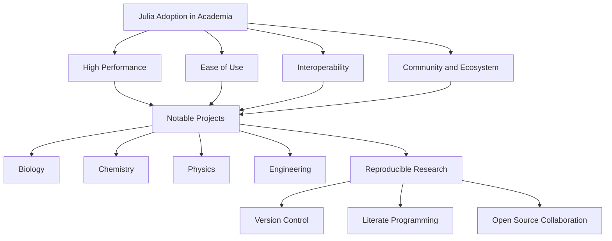

## 23.2 Julia in Scientific Research and Simulations

Julia has emerged as a powerful tool in the realm of scientific research and simulations, offering a unique blend of high performance and ease of use. Its ability to handle complex computations efficiently makes it a preferred choice for researchers across various disciplines. In this section, we will explore Julia's adoption in academia, highlight notable projects, and discuss its role in promoting reproducible research.

### Adoption in Academia

Julia's adoption in academic institutions is on the rise, driven by its ability to seamlessly integrate with existing workflows and its open-source nature. Let's delve into the factors contributing to its growing presence in research institutions.

#### 1. High Performance

Julia's performance is comparable to that of low-level languages like C and Fortran, making it ideal for computationally intensive tasks. This performance is achieved through features like just-in-time (JIT) compilation and multiple dispatch, which allow Julia to optimize code execution dynamically.

#### 2. Ease of Use

Julia's syntax is intuitive and easy to learn, especially for those familiar with other programming languages like Python or MATLAB. This ease of use lowers the barrier to entry for researchers who may not have a strong programming background.

#### 3. Interoperability

Julia can easily interface with other languages, allowing researchers to leverage existing codebases and libraries. This interoperability is facilitated by packages like PyCall.jl for Python and RCall.jl for R, enabling seamless integration with established scientific tools.

#### 4. Community and Ecosystem

The Julia community is vibrant and rapidly growing, with numerous packages available for various scientific domains. This ecosystem provides researchers with the tools they need to tackle complex problems without reinventing the wheel.

### Notable Projects

Julia's versatility and performance have led to its adoption in a wide range of scientific projects. Here, we highlight some notable use cases across different fields.

#### Biology

In the field of biology, Julia is used for tasks such as genomic analysis and bioinformatics. The BioJulia organization provides a suite of packages for biological computation, enabling researchers to perform tasks like sequence alignment and phylogenetic analysis efficiently.

#### Chemistry

Julia's ability to handle large datasets and perform complex calculations makes it suitable for computational chemistry. Projects like QuantumOptics.jl allow researchers to simulate quantum systems, facilitating studies in areas like molecular dynamics and chemical reactions.

#### Physics

In physics, Julia is used for simulations ranging from classical mechanics to quantum field theory. The DifferentialEquations.jl package is particularly popular, providing a comprehensive suite of tools for solving differential equations, which are fundamental to many physical models.

#### Engineering

Engineering applications of Julia include structural analysis, fluid dynamics, and control systems. The JuMP.jl package is widely used for optimization problems, enabling engineers to design efficient systems and processes.

### Reproducible Research

Reproducibility is a cornerstone of scientific research, and Julia plays a significant role in promoting transparent and reproducible studies.

#### 1. Version Control and Environment Management

Julia's package manager, Pkg.jl, allows researchers to manage project dependencies and environments effectively. By using project-specific environments, researchers can ensure that their code runs consistently across different systems and over time.

#### 2. Literate Programming

Julia supports literate programming through tools like Literate.jl, which allows researchers to combine code and documentation in a single file. This approach enhances the readability and reproducibility of scientific studies by providing a clear narrative alongside the code.

#### 3. Open Source and Collaboration

As an open-source language, Julia encourages collaboration and sharing of code. Researchers can publish their code and data alongside their publications, enabling others to verify and build upon their work.

### Code Examples

Let's explore some code examples that demonstrate Julia's capabilities in scientific research.

#### Example 1: Solving Differential Equations

```julia
using DifferentialEquations

function f(du, u, p, t)
    du[1] = u[2]
    du[2] = -u[1]
end

u0 = [1.0, 0.0]
tspan = (0.0, 10.0)

prob = ODEProblem(f, u0, tspan)
sol = solve(prob)

using Plots
plot(sol, xlabel="Time", ylabel="Solution", title="Harmonic Oscillator")
```

In this example, we solve a simple harmonic oscillator problem using the DifferentialEquations.jl package. The code defines the differential equation, sets initial conditions, and solves the problem over a specified time span. The solution is then plotted using the Plots.jl package.

#### Example 2: Optimization with JuMP.jl

```julia
using JuMP, GLPK

model = Model(GLPK.Optimizer)

@variable(model, x >= 0)
@variable(model, y >= 0)

@objective(model, Max, 3x + 4y)

@constraint(model, 2x + y <= 10)
@constraint(model, x + 2y <= 8)

optimize!(model)

println("Optimal solution: x = ", value(x), ", y = ", value(y))
println("Maximum objective value: ", objective_value(model))
```

This example demonstrates how to solve a linear optimization problem using the JuMP.jl package. We define variables, an objective function, and constraints, then solve the problem using the GLPK solver.

### Visualizing Julia's Role in Scientific Research

To better understand Julia's impact on scientific research, let's visualize its role using a flowchart.



**Figure 1:** This flowchart illustrates the factors driving Julia's adoption in academia and its applications in various scientific fields, culminating in its role in promoting reproducible research.

### Try It Yourself

To deepen your understanding of Julia's capabilities, try modifying the code examples provided. For instance, in the differential equations example, experiment with different initial conditions or modify the equation to simulate a damped oscillator. In the optimization example, change the objective function or constraints to explore different scenarios.

### References and Links

- [JuliaLang Official Website](https://julialang.org/)
- [DifferentialEquations.jl Documentation](https://diffeq.sciml.ai/stable/)
- [JuMP.jl Documentation](https://jump.dev/JuMP.jl/stable/)
- [BioJulia Organization](https://biojulia.net/)

### Knowledge Check

To reinforce your understanding, consider the following questions:

1. What are the key factors contributing to Julia's adoption in academia?
2. How does Julia's performance compare to other programming languages?
3. What role does Julia play in promoting reproducible research?
4. How can Julia's interoperability benefit researchers?
5. What are some notable projects that utilize Julia in scientific research?

### Embrace the Journey

Remember, this is just the beginning of your exploration into Julia's role in scientific research and simulations. As you continue to experiment and learn, you'll discover even more ways to leverage Julia's capabilities in your own projects. Keep experimenting, stay curious, and enjoy the journey!

## Quiz Time!



### What is one of the main reasons for Julia's adoption in academia?

- [x] High performance
- [ ] Limited community support
- [ ] Lack of interoperability
- [ ] Complex syntax

> **Explanation:** Julia's high performance, comparable to low-level languages, is a key factor in its adoption in academia.

### Which package is commonly used for solving differential equations in Julia?

- [x] DifferentialEquations.jl
- [ ] JuMP.jl
- [ ] PyCall.jl
- [ ] RCall.jl

> **Explanation:** DifferentialEquations.jl is a popular package for solving differential equations in Julia.

### How does Julia promote reproducible research?

- [x] Through version control and environment management
- [ ] By limiting open-source collaboration
- [ ] By using proprietary software
- [ ] By discouraging code sharing

> **Explanation:** Julia's package manager allows for effective version control and environment management, promoting reproducible research.

### What is the role of JuMP.jl in scientific research?

- [x] Solving optimization problems
- [ ] Performing genomic analysis
- [ ] Simulating quantum systems
- [ ] Visualizing data

> **Explanation:** JuMP.jl is used for solving optimization problems in scientific research.

### Which field benefits from Julia's ability to handle large datasets and perform complex calculations?

- [x] Chemistry
- [ ] Literature
- [ ] History
- [ ] Art

> **Explanation:** Julia's capabilities make it suitable for computational chemistry, which involves handling large datasets and complex calculations.

### What is a key feature of Julia that enhances its performance?

- [x] Just-in-time (JIT) compilation
- [ ] Lack of multiple dispatch
- [ ] Complex syntax
- [ ] Limited package ecosystem

> **Explanation:** Julia's just-in-time (JIT) compilation optimizes code execution dynamically, enhancing performance.

### How does Julia's syntax compare to other programming languages?

- [x] Intuitive and easy to learn
- [ ] More complex than C
- [ ] Similar to assembly language
- [ ] Difficult for beginners

> **Explanation:** Julia's syntax is intuitive and easy to learn, especially for those familiar with languages like Python or MATLAB.

### Which package allows Julia to interface with Python?

- [x] PyCall.jl
- [ ] RCall.jl
- [ ] JuMP.jl
- [ ] DifferentialEquations.jl

> **Explanation:** PyCall.jl is used to interface Julia with Python.

### What is the benefit of literate programming in Julia?

- [x] Combines code and documentation in a single file
- [ ] Separates code and documentation
- [ ] Limits code readability
- [ ] Discourages reproducibility

> **Explanation:** Literate programming in Julia enhances readability and reproducibility by combining code and documentation in a single file.

### True or False: Julia is an open-source language that encourages collaboration.

- [x] True
- [ ] False

> **Explanation:** Julia is an open-source language, which encourages collaboration and sharing of code.


