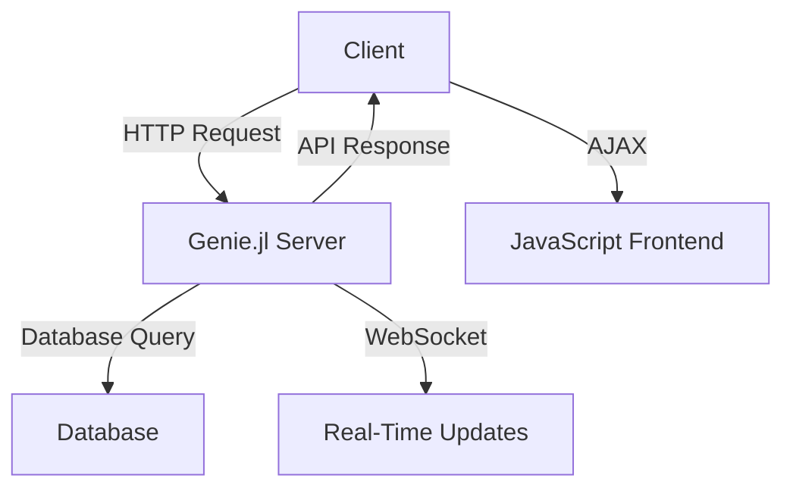

## 23.4 Developing Web Applications with Julia Frameworks

As the demand for high-performance web applications continues to grow, developers are increasingly turning to Julia for its speed and efficiency. In this section, we will explore how to develop web applications using Julia frameworks, focusing on Genie.jl and other tools that make Julia a compelling choice for web development. We will delve into case studies, discuss scalability and performance, and explore full-stack development with Julia.

### Genie.jl and Beyond

Genie.jl is a full-stack web framework for Julia that provides a robust platform for building web applications. It offers a range of features, including routing, templating, and real-time web capabilities. Let's explore how Genie.jl can be used to build web applications and examine some case studies of successful implementations.

#### Introduction to Genie.jl

Genie.jl is designed to be intuitive and easy to use, making it accessible for developers familiar with other web frameworks like Ruby on Rails or Django. It leverages Julia's strengths, such as its high performance and ease of use for numerical and scientific computing, to deliver fast and efficient web applications.

**Key Features of Genie.jl:**

- **Routing**: Define routes and handle HTTP requests with ease.
- **Templating**: Use Genie’s built-in templating engine for dynamic content generation.
- **Real-Time Capabilities**: Implement WebSockets for real-time communication.
- **Database Integration**: Seamlessly connect to databases using ORM-like features.
- **Modular Architecture**: Build scalable applications with a modular approach.

#### Building a Simple Web Application with Genie.jl

Let's walk through the process of building a simple web application using Genie.jl. We'll create a basic application that displays a list of items and allows users to add new items.

**Step 1: Setting Up Your Environment**

First, ensure that you have Julia installed on your system. You can download it from the [official Julia website](https://julialang.org/downloads/).

Next, install Genie.jl by running the following command in the Julia REPL:

```julia
using Pkg
Pkg.add("Genie")
```

**Step 2: Creating a New Genie Application**

Create a new Genie application by running:

```bash
genie new MyWebApp
```

This command will generate a new project structure with all the necessary files and directories.

**Step 3: Defining Routes**

Open the `routes.jl` file in the `MyWebApp` directory and define a route for displaying items:

```julia
route("/") do
    items = ["Item 1", "Item 2", "Item 3"]
    @html """
    <h1>Items List</h1>
    <ul>
        $(for item in items
            "<li>$item</li>"
        end)
    </ul>
    <form action="/add" method="post">
        <input type="text" name="item" placeholder="New Item">
        <button type="submit">Add Item</button>
    </form>
    """
end
```

**Step 4: Handling Form Submissions**

Add a route to handle form submissions and add new items:

```julia
route("/add", method=:post) do
    new_item = Genie.Requests.params("item")
    # Here you would typically save the new item to a database
    redirect("/")
end
```

**Step 5: Running Your Application**

Start the Genie server by running:

```bash
julia -e 'using Genie; Genie.AppServer.startup()'
```

Visit `http://localhost:8000` in your web browser to see your application in action.

### Case Studies of Web Applications Built with Julia

Let's explore some real-world examples of web applications built using Julia frameworks like Genie.jl.

#### Case Study 1: Real-Time Data Dashboard

A financial services company used Genie.jl to build a real-time data dashboard for monitoring stock prices. By leveraging Julia's high-performance capabilities, they were able to process and display large volumes of data in real-time, providing their clients with up-to-the-minute insights.

**Key Features:**

- **Real-Time Updates**: Implemented using WebSockets for live data streaming.
- **Data Visualization**: Integrated with Plotly.jl for interactive charts and graphs.
- **Scalability**: Designed to handle thousands of concurrent users.

#### Case Study 2: Scientific Research Portal

A research institution developed a web portal using Genie.jl to provide access to scientific datasets and computational tools. The portal allows researchers to upload data, run analyses, and visualize results, all within a web interface.

**Key Features:**

- **Data Management**: Integrated with DataFrames.jl for data manipulation.
- **Computational Tools**: Utilized Julia's scientific libraries for data analysis.
- **User Authentication**: Implemented secure login and access control.

### Scalability and Performance

One of the key advantages of using Julia for web development is its ability to handle high-performance computing tasks. This makes it an excellent choice for web applications that require heavy data processing or real-time analytics.

#### Meeting the Demands of High-Traffic Web Services

To ensure your Julia web application can handle high traffic, consider the following strategies:

- **Load Balancing**: Distribute incoming requests across multiple servers to prevent any single server from becoming a bottleneck.
- **Caching**: Use caching mechanisms to store frequently accessed data and reduce database load.
- **Asynchronous Processing**: Offload time-consuming tasks to background workers to keep the main application responsive.

#### Performance Optimization Techniques

Optimize your Julia web application by focusing on the following areas:

- **Efficient Code**: Write type-stable and memory-efficient code to maximize performance.
- **Profiling and Benchmarking**: Use tools like `Profile.jl` and `BenchmarkTools.jl` to identify and address performance bottlenecks.
- **Database Optimization**: Optimize database queries and use indexing to speed up data retrieval.

### Full-Stack Development

Julia can be used not only on the server side but also on the client side, making it a versatile choice for full-stack development.

#### Integrating Julia on Both the Server and Client Sides

While Julia is primarily used on the server side, there are ways to integrate it into client-side development:

- **WebAssembly**: Compile Julia code to WebAssembly to run it in the browser, enabling client-side computations.
- **JavaScript Interoperability**: Use JavaScript libraries alongside Julia to enhance client-side functionality.

#### Building a Full-Stack Application

Let's explore how to build a full-stack application using Julia on the server side and JavaScript on the client side.

**Server-Side: Julia with Genie.jl**

Use Genie.jl to handle server-side logic, data processing, and API endpoints.

**Client-Side: JavaScript and HTML**

Use JavaScript frameworks like React or Vue.js to build dynamic user interfaces and interact with the Julia backend via RESTful APIs.

**Example: Full-Stack To-Do Application**

1. **Backend (Julia with Genie.jl):**

   - Define API endpoints for CRUD operations on to-do items.
   - Use a database to store items and handle user authentication.

2. **Frontend (JavaScript with React):**

   - Create a user interface for displaying and managing to-do items.
   - Use AJAX requests to interact with the Julia backend.

### Try It Yourself

Experiment with the code examples provided in this section. Try adding new features to the Genie.jl application, such as user authentication or data visualization. Explore integrating Julia with JavaScript frameworks for a full-stack experience.

### Visualizing the Architecture

To better understand the architecture of a web application built with Julia, let's visualize the components and their interactions.



**Diagram Description:** This diagram illustrates the flow of data in a web application built with Genie.jl. The client sends HTTP requests to the Genie.jl server, which interacts with a database and provides real-time updates via WebSockets. The server responds to the client, which uses AJAX to update the JavaScript frontend.

### References and Links

For further reading and exploration, consider the following resources:

- [Genie.jl Documentation](https://genieframework.github.io/Genie.jl/dev/)
- [JuliaLang Official Website](https://julialang.org/)
- [WebAssembly and Julia](https://webassembly.org/)

### Knowledge Check

Before we conclude, let's test your understanding with a few questions:

1. What are the key features of Genie.jl?
2. How can you optimize a Julia web application for high traffic?
3. Describe a real-world use case for a web application built with Julia.
4. How can Julia be integrated into full-stack development?

### Embrace the Journey

Developing web applications with Julia frameworks like Genie.jl opens up a world of possibilities. Remember, this is just the beginning. As you progress, you'll build more complex and interactive web applications. Keep experimenting, stay curious, and enjoy the journey!

## Quiz Time!



### What is Genie.jl primarily used for in Julia?

- [x] Building web applications
- [ ] Data visualization
- [ ] Machine learning
- [ ] Scientific computing

> **Explanation:** Genie.jl is a full-stack web framework for Julia, designed for building web applications.

### Which feature of Genie.jl allows for real-time communication?

- [x] WebSockets
- [ ] RESTful APIs
- [ ] Templating
- [ ] Routing

> **Explanation:** WebSockets in Genie.jl enable real-time communication between the server and clients.

### What is a common strategy for handling high traffic in web applications?

- [x] Load balancing
- [ ] Increasing server memory
- [ ] Using more databases
- [ ] Reducing code size

> **Explanation:** Load balancing distributes incoming requests across multiple servers to manage high traffic efficiently.

### How can Julia be used on the client side of a web application?

- [x] Compiling to WebAssembly
- [ ] Using Julia scripts directly
- [ ] Through Genie.jl
- [ ] By converting to Python

> **Explanation:** Julia can be compiled to WebAssembly to run in the browser, enabling client-side computations.

### Which tool can be used to profile Julia applications?

- [x] Profile.jl
- [ ] Genie.jl
- [ ] WebSockets
- [ ] React

> **Explanation:** Profile.jl is a tool used to profile and identify performance bottlenecks in Julia applications.

### What is a benefit of using Julia for web development?

- [x] High performance
- [ ] Limited library support
- [ ] Slow execution
- [ ] Complex syntax

> **Explanation:** Julia offers high performance, making it suitable for web applications that require efficient data processing.

### What is the purpose of caching in web applications?

- [x] To store frequently accessed data
- [ ] To increase server load
- [ ] To slow down response times
- [ ] To reduce code complexity

> **Explanation:** Caching stores frequently accessed data to reduce database load and improve response times.

### How can you integrate Julia with JavaScript for full-stack development?

- [x] Using RESTful APIs
- [ ] Directly embedding Julia code
- [ ] Through Genie.jl only
- [ ] By converting Julia to JavaScript

> **Explanation:** RESTful APIs allow the Julia backend to communicate with the JavaScript frontend, enabling full-stack development.

### What is a key consideration when optimizing database queries?

- [x] Use indexing
- [ ] Increase query size
- [ ] Reduce server memory
- [ ] Avoid using databases

> **Explanation:** Indexing optimizes database queries by speeding up data retrieval processes.

### True or False: Genie.jl can only be used for server-side development.

- [ ] True
- [x] False

> **Explanation:** While Genie.jl is primarily used for server-side development, Julia can also be integrated into client-side development through WebAssembly.




