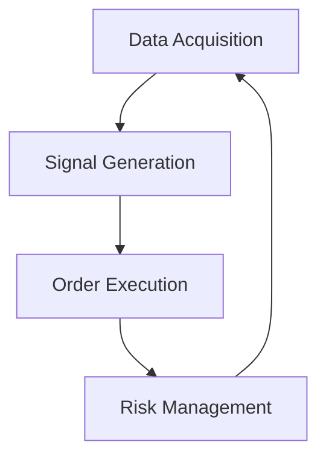
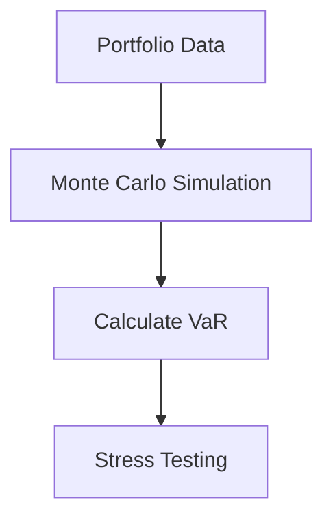

## 23.5 Finance and Quantitative Analysis Using Julia

In the realm of finance and quantitative analysis, the need for high-performance computing, flexibility, and ease of use is paramount. Julia, with its unique combination of speed and expressiveness, has emerged as a powerful tool for financial professionals. In this section, we will delve into how Julia can be leveraged for algorithmic trading systems, risk modeling, and analytics, supported by real-world case studies of financial institutions adopting Julia for quantitative analysis.

### Algorithmic Trading Systems

Algorithmic trading involves the use of computer algorithms to automate trading decisions and execute trades at speeds and frequencies that are impossible for human traders. Julia's high performance and ability to handle complex mathematical computations make it an ideal choice for developing algorithmic trading systems.

#### Implementing Trading Algorithms with Low-Latency Execution

Low-latency execution is critical in algorithmic trading, where milliseconds can make a significant difference in profitability. Julia's just-in-time (JIT) compilation and ability to interface with low-level system libraries allow for the development of trading algorithms that execute with minimal delay.

**Key Components of an Algorithmic Trading System:**

1. **Data Acquisition**: Collecting real-time market data.
2. **Signal Generation**: Analyzing data to generate buy/sell signals.
3. **Order Execution**: Placing orders in the market.
4. **Risk Management**: Monitoring and managing risk exposure.

**Sample Code Snippet:**

```julia
using MarketData, TradingStrategies, OrderExecution

market_data = get_realtime_data("AAPL")

function moving_average_strategy(data, short_window, long_window)
    short_ma = moving_average(data, short_window)
    long_ma = moving_average(data, long_window)
    return short_ma > long_ma ? :buy : :sell
end

function execute_order(signal, quantity)
    if signal == :buy
        place_order("AAPL", quantity, :buy)
    elseif signal == :sell
        place_order("AAPL", quantity, :sell)
    end
end

function manage_risk(portfolio)
    # Implement risk management logic
end

while true
    signal = moving_average_strategy(market_data, 50, 200)
    execute_order(signal, 100)
    manage_risk(portfolio)
    sleep(1)  # Wait for 1 second before next iteration
end
```

**Try It Yourself**: Modify the moving average windows or the stock symbol to see how the strategy performs with different parameters.

#### Visualizing Algorithmic Trading Workflow



*Figure 1: Algorithmic Trading Workflow*

### Risk Modeling and Analytics

Risk modeling is a crucial aspect of financial analysis, involving the assessment and management of financial risks. Julia's ability to handle large datasets and perform complex mathematical computations makes it an excellent choice for risk modeling and analytics.

#### Handling Complex Financial Models and Large Datasets

Financial models often involve complex calculations and simulations that require significant computational power. Julia's high-performance capabilities and extensive library ecosystem enable the efficient handling of these tasks.

**Key Concepts in Risk Modeling:**

1. **Value at Risk (VaR)**: A measure of the potential loss in value of a portfolio.
2. **Monte Carlo Simulations**: A method for estimating the probability of different outcomes.
3. **Stress Testing**: Evaluating the impact of extreme market conditions.

**Sample Code Snippet:**

```julia
using Distributions, Statistics

function simulate_portfolio_returns(portfolio, num_simulations)
    returns = []
    for _ in 1:num_simulations
        simulated_return = sum(rand(Normal(0, 0.01), length(portfolio)))
        push!(returns, simulated_return)
    end
    return returns
end

function calculate_var(returns, confidence_level)
    sorted_returns = sort(returns)
    index = Int(round((1 - confidence_level) * length(sorted_returns)))
    return sorted_returns[index]
end

portfolio = [100, 200, 150]  # Example portfolio values
simulated_returns = simulate_portfolio_returns(portfolio, 10000)
var_95 = calculate_var(simulated_returns, 0.95)
println("95% VaR: ", var_95)
```

**Try It Yourself**: Experiment with different portfolio compositions and confidence levels to see how the VaR changes.

#### Visualizing Risk Modeling Process



*Figure 2: Risk Modeling Process*

### Case Studies: Financial Institutions Adopting Julia

Several financial institutions have adopted Julia for quantitative analysis due to its performance and ease of use. Let's explore some real-world case studies.

#### Case Study 1: Asset Management Firm

An asset management firm implemented Julia to optimize their portfolio management strategies. By leveraging Julia's high-performance capabilities, they were able to run complex simulations and optimize their portfolios more efficiently than with their previous tools.

**Key Benefits:**

- **Increased Efficiency**: Reduced computation time for portfolio optimization.
- **Improved Accuracy**: Enhanced precision in risk assessments and forecasts.
- **Scalability**: Ability to handle larger datasets and more complex models.

#### Case Study 2: Hedge Fund

A hedge fund adopted Julia for developing and executing their algorithmic trading strategies. Julia's speed and ability to interface with low-level system libraries allowed them to achieve low-latency execution, giving them a competitive edge in the market.

**Key Benefits:**

- **Low Latency**: Faster execution of trading algorithms.
- **Flexibility**: Easy integration with existing systems and data sources.
- **Robustness**: Improved reliability and stability of trading systems.

#### Case Study 3: Investment Bank

An investment bank utilized Julia for risk modeling and analytics. By using Julia, they were able to perform complex risk assessments and stress testing more efficiently, leading to better risk management and decision-making.

**Key Benefits:**

- **Enhanced Risk Management**: More accurate and timely risk assessments.
- **Cost Savings**: Reduced computational costs due to Julia's efficiency.
- **Innovation**: Ability to develop and test new risk models quickly.

### Conclusion

Julia's unique combination of high performance, flexibility, and ease of use makes it an ideal choice for finance and quantitative analysis. Whether it's developing algorithmic trading systems, performing risk modeling, or conducting complex financial analytics, Julia provides the tools and capabilities needed to succeed in the fast-paced world of finance.

### Key Takeaways

- Julia's high performance and ability to handle complex computations make it ideal for algorithmic trading and risk modeling.
- Real-world case studies demonstrate the benefits of adopting Julia in financial institutions.
- Experimenting with Julia's capabilities can lead to innovative solutions and competitive advantages in finance.

### Embrace the Journey

Remember, this is just the beginning. As you continue to explore Julia's capabilities in finance and quantitative analysis, you'll discover new ways to optimize your strategies and improve your decision-making. Keep experimenting, stay curious, and enjoy the journey!

## Quiz Time!



### What is a key advantage of using Julia for algorithmic trading?

- [x] Low-latency execution
- [ ] High-level abstraction
- [ ] Limited library support
- [ ] Complex syntax

> **Explanation:** Julia's just-in-time compilation and ability to interface with low-level system libraries allow for low-latency execution, which is crucial in algorithmic trading.

### Which of the following is a component of an algorithmic trading system?

- [x] Signal Generation
- [ ] Portfolio Diversification
- [ ] Tax Optimization
- [ ] Customer Relationship Management

> **Explanation:** Signal generation is a critical component of an algorithmic trading system, where data is analyzed to generate buy/sell signals.

### What is Value at Risk (VaR)?

- [x] A measure of the potential loss in value of a portfolio
- [ ] A method for optimizing portfolio returns
- [ ] A technique for increasing trading volume
- [ ] A strategy for minimizing transaction costs

> **Explanation:** Value at Risk (VaR) is a measure used to assess the potential loss in value of a portfolio over a specified period.

### How does Julia's performance benefit risk modeling?

- [x] It allows for efficient handling of large datasets and complex computations.
- [ ] It simplifies the user interface for risk analysts.
- [ ] It reduces the need for financial expertise.
- [ ] It automates all risk management processes.

> **Explanation:** Julia's high-performance capabilities enable efficient handling of large datasets and complex computations, which are essential in risk modeling.

### Which financial institution benefited from using Julia for low-latency execution?

- [x] Hedge Fund
- [ ] Retail Bank
- [ ] Credit Union
- [ ] Insurance Company

> **Explanation:** A hedge fund adopted Julia for developing and executing algorithmic trading strategies, benefiting from low-latency execution.

### What is Monte Carlo Simulation used for in finance?

- [x] Estimating the probability of different outcomes
- [ ] Calculating interest rates
- [ ] Managing customer accounts
- [ ] Designing financial products

> **Explanation:** Monte Carlo Simulation is a method used to estimate the probability of different outcomes in finance.

### Which of the following is a benefit of using Julia in finance?

- [x] Scalability
- [ ] Limited data handling
- [ ] High computational cost
- [ ] Complex syntax

> **Explanation:** Julia's scalability allows it to handle larger datasets and more complex models, making it beneficial in finance.

### What is the primary focus of risk modeling?

- [x] Assessing and managing financial risks
- [ ] Increasing sales revenue
- [ ] Enhancing customer satisfaction
- [ ] Developing marketing strategies

> **Explanation:** Risk modeling focuses on assessing and managing financial risks to ensure better decision-making.

### How can Julia's flexibility benefit financial institutions?

- [x] By allowing easy integration with existing systems and data sources
- [ ] By limiting the number of available libraries
- [ ] By increasing the complexity of financial models
- [ ] By reducing the need for data analysis

> **Explanation:** Julia's flexibility allows financial institutions to easily integrate it with existing systems and data sources, enhancing their capabilities.

### True or False: Julia is only suitable for small-scale financial applications.

- [ ] True
- [x] False

> **Explanation:** False. Julia is suitable for both small-scale and large-scale financial applications due to its high performance and scalability.


