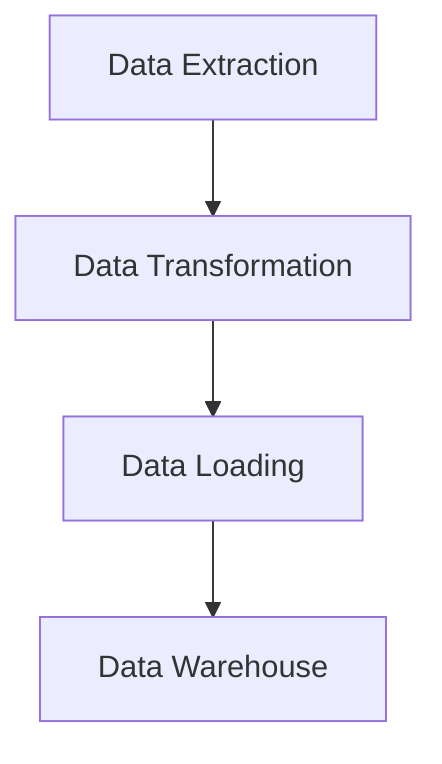

## 23.6 Building Data Engineering Pipelines

In the realm of data engineering, building efficient and scalable data pipelines is crucial for processing and analyzing large volumes of data. Julia, with its high-performance capabilities and rich ecosystem, offers a compelling choice for constructing robust data engineering pipelines. In this section, we will explore the key concepts, tools, and best practices for building data engineering pipelines using Julia.

### Introduction to Data Engineering Pipelines

Data engineering pipelines are automated workflows that extract, transform, and load (ETL) data from various sources into a centralized data repository. These pipelines are essential for ensuring data quality, consistency, and availability for downstream analytics and machine learning tasks.

#### Key Components of Data Engineering Pipelines

1. **Data Extraction**: Gathering data from diverse sources such as databases, APIs, and files.
2. **Data Transformation**: Cleaning, filtering, and aggregating data to meet specific requirements.
3. **Data Loading**: Storing transformed data into a target system, such as a data warehouse or data lake.

### Why Use Julia for Data Engineering?

Julia's unique features make it an excellent choice for building data engineering pipelines:

- **High Performance**: Julia's just-in-time (JIT) compilation and type system enable fast execution of data processing tasks.
- **Rich Ecosystem**: Julia offers a wide range of packages for data manipulation, visualization, and machine learning.
- **Ease of Use**: Julia's syntax is expressive and easy to learn, making it accessible to both data engineers and data scientists.
- **Scalability**: Julia supports parallel and distributed computing, allowing pipelines to scale with data volume.

### Data Integration and ETL with Julia

Data integration involves combining data from different sources into a unified view. ETL processes are a subset of data integration, focusing on extracting, transforming, and loading data.

#### Creating Robust Data Pipelines

To create robust data pipelines in Julia, we can leverage several powerful packages:

- **DataFrames.jl**: For data manipulation and transformation.
- **CSV.jl**: For reading and writing CSV files.
- **HTTP.jl**: For interacting with web APIs.
- **Query.jl**: For querying and filtering data.
- **DataFramesMeta.jl**: For more expressive data manipulation.

Let's walk through an example of building a simple ETL pipeline using Julia.

#### Example: Building an ETL Pipeline

Suppose we have sales data in CSV format and want to load it into a database after cleaning and transforming it.

```julia
using CSV
using DataFrames
using DataFramesMeta
using SQLite

sales_data = CSV.File("sales_data.csv") |> DataFrame

# Filter out records with missing values
cleaned_data = @where(sales_data, !ismissing(:sales_amount))

@transform!(cleaned_data, :sales_tax = 0.1 * :sales_amount)

db = SQLite.DB("sales_data.db")
SQLite.load!(db, cleaned_data, "sales")
```

In this example, we extract sales data from a CSV file, clean it by removing records with missing values, and add a new column for sales tax. Finally, we load the transformed data into an SQLite database.

### Performance Gains with Julia

Julia's performance advantages over traditional ETL solutions stem from its ability to handle large datasets efficiently and its support for parallel and distributed computing.

#### Achieving Efficiency Improvements

1. **Parallel Processing**: Use Julia's parallel computing capabilities to process data in parallel, reducing execution time.
2. **Memory Management**: Julia's garbage collector and memory management features help optimize resource usage.
3. **Type Stability**: Writing type-stable code ensures that Julia's compiler can generate efficient machine code.

#### Example: Parallel Data Processing

Let's demonstrate parallel data processing using Julia's `Distributed` module.

```julia
using Distributed
addprocs(4)  # Add 4 worker processes

@everywhere using CSV, DataFrames

@everywhere function process_data(file)
    data = CSV.File(file) |> DataFrame
    # Perform some data transformation
    return @transform(data, :processed = :value * 2)
end

files = ["data1.csv", "data2.csv", "data3.csv", "data4.csv"]

results = pmap(process_data, files)
```

In this example, we use `pmap` to distribute the data processing workload across multiple worker processes, achieving significant performance improvements.

### Real-World Examples

Several companies have successfully streamlined their data workflows using Julia, achieving notable performance gains and scalability.

#### Case Study: Company X

Company X, a leading e-commerce platform, implemented a data pipeline using Julia to process customer transaction data. By leveraging Julia's parallel computing capabilities, they reduced data processing time by 50%, enabling real-time analytics and personalized recommendations.

#### Case Study: Company Y

Company Y, a financial services firm, used Julia to build a data pipeline for aggregating and analyzing market data. The pipeline's efficiency allowed them to perform complex calculations and generate insights faster than their previous solution, leading to better investment decisions.

### Visualizing Data Engineering Pipelines

To better understand the flow of data through a pipeline, we can use diagrams to visualize the process.



**Figure 1: Data Engineering Pipeline Flow**

This diagram illustrates the typical flow of data through an ETL pipeline, from extraction to transformation and loading into a data warehouse.

### Best Practices for Building Data Pipelines

1. **Modular Design**: Break down the pipeline into modular components for easier maintenance and scalability.
2. **Error Handling**: Implement robust error handling to ensure data quality and pipeline reliability.
3. **Monitoring and Logging**: Use logging and monitoring tools to track pipeline performance and identify issues.
4. **Version Control**: Use version control systems to manage pipeline code and configurations.

### Try It Yourself

Experiment with the provided code examples by modifying the data transformation logic or adding new data sources. Try implementing parallel processing for larger datasets to observe performance improvements.

### References and Further Reading

- [JuliaLang Documentation](https://docs.julialang.org/)
- [DataFrames.jl Documentation](https://dataframes.juliadata.org/stable/)
- [CSV.jl Documentation](https://csv.juliadata.org/stable/)
- [Distributed Computing in Julia](https://docs.julialang.org/en/v1/manual/distributed-computing/)

### Knowledge Check

- What are the key components of a data engineering pipeline?
- How does Julia's performance compare to traditional ETL solutions?
- What are some best practices for building data pipelines in Julia?

### Embrace the Journey

Building data engineering pipelines with Julia is an exciting journey that combines the power of high-performance computing with the flexibility of modern data processing tools. As you explore the possibilities, remember to stay curious, experiment with new techniques, and enjoy the process of creating efficient and scalable data workflows.

## Quiz Time!



### What are the three main components of a data engineering pipeline?

- [x] Data Extraction, Data Transformation, Data Loading
- [ ] Data Collection, Data Analysis, Data Visualization
- [ ] Data Mining, Data Cleaning, Data Reporting
- [ ] Data Storage, Data Processing, Data Output

> **Explanation:** The three main components of a data engineering pipeline are Data Extraction, Data Transformation, and Data Loading.

### Which Julia package is commonly used for data manipulation and transformation?

- [x] DataFrames.jl
- [ ] Plots.jl
- [ ] Flux.jl
- [ ] HTTP.jl

> **Explanation:** DataFrames.jl is a popular package in Julia for data manipulation and transformation.

### How can Julia's performance be enhanced in data processing tasks?

- [x] By using parallel processing and type-stable code
- [ ] By using only single-threaded operations
- [ ] By avoiding the use of packages
- [ ] By writing code in a non-type-stable manner

> **Explanation:** Julia's performance can be enhanced by using parallel processing and writing type-stable code.

### What is the purpose of the `pmap` function in Julia?

- [x] To distribute tasks across multiple worker processes
- [ ] To map values to a dictionary
- [ ] To plot data on a map
- [ ] To manage package dependencies

> **Explanation:** The `pmap` function in Julia is used to distribute tasks across multiple worker processes for parallel execution.

### What is the benefit of using modular design in data pipelines?

- [x] Easier maintenance and scalability
- [ ] Increased complexity and difficulty in debugging
- [ ] Reduced performance and efficiency
- [ ] Limited flexibility in pipeline configuration

> **Explanation:** Modular design in data pipelines allows for easier maintenance and scalability.

### Which company used Julia to reduce data processing time by 50%?

- [x] Company X
- [ ] Company Y
- [ ] Company Z
- [ ] Company A

> **Explanation:** Company X used Julia to reduce data processing time by 50%.

### What is a key advantage of using Julia for data engineering?

- [x] High performance and scalability
- [ ] Limited package ecosystem
- [ ] Complex syntax
- [ ] Lack of support for parallel computing

> **Explanation:** A key advantage of using Julia for data engineering is its high performance and scalability.

### What is the role of error handling in data pipelines?

- [x] To ensure data quality and pipeline reliability
- [ ] To increase the complexity of the pipeline
- [ ] To reduce the performance of the pipeline
- [ ] To limit the flexibility of the pipeline

> **Explanation:** Error handling in data pipelines ensures data quality and pipeline reliability.

### How can you visualize the flow of data through a pipeline?

- [x] By using diagrams and flowcharts
- [ ] By writing detailed documentation
- [ ] By creating complex algorithms
- [ ] By using only text-based descriptions

> **Explanation:** Visualizing the flow of data through a pipeline can be effectively done using diagrams and flowcharts.

### True or False: Julia supports both parallel and distributed computing.

- [x] True
- [ ] False

> **Explanation:** Julia supports both parallel and distributed computing, making it suitable for scalable data engineering tasks.


