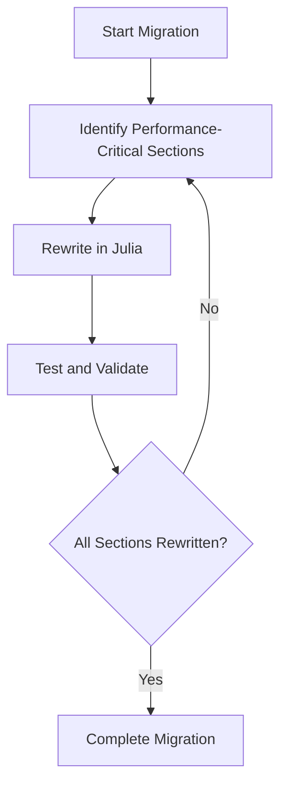

## 23.7 Migrating Applications from Other Languages to Julia

Migrating applications from one programming language to another is a significant undertaking that can yield substantial benefits, particularly when transitioning to a language like Julia. Known for its high performance, ease of use, and robust ecosystem, Julia is an attractive option for developers looking to enhance their applications. In this section, we will explore the reasons for migrating to Julia, strategies for a successful transition, and the challenges you may encounter along the way.

### Reasons for Migration

Before embarking on a migration journey, it's essential to understand the motivations behind the move. Here are some common reasons why developers choose to migrate applications to Julia:

- **Performance Needs**: Julia is designed for high-performance numerical and scientific computing. Its ability to execute code at speeds comparable to C or Fortran makes it an excellent choice for applications requiring intensive computations.

- **Code Consolidation**: Julia's versatility allows developers to consolidate codebases written in multiple languages into a single, cohesive language. This consolidation simplifies maintenance and reduces the complexity of managing multiple language environments.

- **Ease of Development**: Julia's syntax is intuitive and easy to learn, especially for those familiar with other high-level languages like Python or MATLAB. This ease of use accelerates development and enhances productivity.

- **Interoperability**: Julia provides seamless interoperability with other languages, allowing developers to leverage existing code and libraries during the migration process.

### Migration Strategies

Migrating an application to Julia requires careful planning and execution. Here are some strategies to consider:

#### Incremental Rewriting

One effective approach to migration is incremental rewriting, where parts of the application are gradually rewritten in Julia. This strategy allows for continuous integration and testing, minimizing disruption to the existing system.

- **Start with Performance-Critical Sections**: Identify the parts of the application that will benefit most from Julia's performance capabilities and rewrite these sections first.

- **Maintain Interoperability**: Use Julia's interoperability features to call existing code from other languages, ensuring that the application remains functional during the transition.

- **Test and Validate**: Continuously test the rewritten sections to ensure they meet performance and functionality requirements.

#### Interoperability During Transition

Julia's ability to interface with other languages is a powerful tool during migration. By leveraging this feature, you can maintain a hybrid application that combines Julia with existing codebases.

- **Use PyCall.jl for Python Integration**: If your application is written in Python, use the PyCall.jl package to call Python functions and libraries from Julia.

- **Leverage C and Fortran Libraries**: Julia's `ccall` function allows you to call C and Fortran libraries directly, making it easy to integrate existing native code.

- **Gradual Replacement**: Replace components of the application with Julia equivalents over time, ensuring a smooth transition.

### Challenges and Resolutions

Migrating to Julia is not without its challenges. Here are some common issues and how to address them:

#### Compatibility Issues

- **Challenge**: Differences in language features and libraries can lead to compatibility issues during migration.

- **Resolution**: Thoroughly analyze the existing codebase to identify potential compatibility issues. Use Julia's extensive package ecosystem to find equivalent libraries and tools.

#### Retraining Teams

- **Challenge**: Developers familiar with other languages may require training to become proficient in Julia.

- **Resolution**: Provide comprehensive training and resources to help your team learn Julia. Encourage participation in the Julia community for additional support and learning opportunities.

#### Performance Optimization

- **Challenge**: Achieving optimal performance in Julia may require changes to algorithms and data structures.

- **Resolution**: Utilize Julia's profiling and benchmarking tools to identify performance bottlenecks. Optimize code by leveraging Julia's strengths, such as multiple dispatch and type stability.

### Code Examples

Let's explore some code examples to illustrate the migration process. We'll start with a simple Python function and demonstrate how to rewrite it in Julia.

#### Python Code Example

```python
def factorial(n):
    if n == 0:
        return 1
    else:
        return n * factorial(n - 1)

print(factorial(5))  # Output: 120
```

#### Julia Code Example

```julia
function factorial(n::Int)
    if n == 0
        return 1
    else
        return n * factorial(n - 1)
    end
end

println(factorial(5))  # Output: 120
```

**Key Differences**:
- Julia's syntax is similar to Python, making the transition straightforward.
- Julia requires type annotations (e.g., `n::Int`) for performance optimization, although they are optional.

### Visualizing the Migration Process

To better understand the migration process, let's visualize the workflow using a flowchart.



**Description**: This flowchart illustrates the incremental rewriting strategy, where performance-critical sections are identified, rewritten in Julia, tested, and validated until the entire application is migrated.

### Try It Yourself

To gain hands-on experience with migration, try modifying the Julia code example to include error handling for negative input values. Experiment with different approaches and observe how Julia's features can enhance the code.

### References and Links

For further reading on migrating to Julia, consider the following resources:

- [JuliaLang Documentation](https://docs.julialang.org/)
- [Julia Interoperability](https://docs.julialang.org/en/v1/manual/calling-c-and-fortran-code/)
- [PyCall.jl Documentation](https://github.com/JuliaPy/PyCall.jl)

### Knowledge Check

- What are the primary reasons for migrating applications to Julia?
- How can interoperability be leveraged during the migration process?
- What are some common challenges faced during migration, and how can they be resolved?

### Embrace the Journey

Migrating applications to Julia is a rewarding journey that can lead to significant performance improvements and code consolidation. Remember, this is just the beginning. As you progress, you'll discover more of Julia's capabilities and how they can transform your applications. Keep experimenting, stay curious, and enjoy the journey!

## Quiz Time!



### What is one of the primary reasons for migrating applications to Julia?

- [x] Performance needs
- [ ] Lack of documentation
- [ ] Limited community support
- [ ] High licensing costs

> **Explanation:** Julia is known for its high-performance capabilities, making it an attractive option for applications requiring intensive computations.

### Which strategy involves gradually rewriting parts of the application in Julia?

- [x] Incremental rewriting
- [ ] Complete overhaul
- [ ] Parallel development
- [ ] Code duplication

> **Explanation:** Incremental rewriting allows for continuous integration and testing, minimizing disruption to the existing system.

### How can Julia's interoperability features be used during migration?

- [x] By calling existing code from other languages
- [ ] By ignoring existing code
- [ ] By rewriting all code at once
- [ ] By using only Julia libraries

> **Explanation:** Julia's interoperability features allow developers to maintain a hybrid application that combines Julia with existing codebases.

### What is a common challenge faced during migration to Julia?

- [x] Compatibility issues
- [ ] Lack of syntax
- [ ] Excessive documentation
- [ ] Overabundance of libraries

> **Explanation:** Differences in language features and libraries can lead to compatibility issues during migration.

### How can teams be retrained to become proficient in Julia?

- [x] Provide comprehensive training and resources
- [ ] Ignore the need for training
- [ ] Use only online forums
- [ ] Avoid community involvement

> **Explanation:** Providing comprehensive training and resources helps teams become proficient in Julia.

### What tool can be used to call Python functions from Julia?

- [x] PyCall.jl
- [ ] NumPy.jl
- [ ] SciPy.jl
- [ ] Matplotlib.jl

> **Explanation:** PyCall.jl is a package that allows calling Python functions and libraries from Julia.

### What is a key benefit of using Julia for performance optimization?

- [x] Type stability
- [ ] Lack of type annotations
- [ ] Limited dispatch
- [ ] Complex syntax

> **Explanation:** Type stability is a key benefit of using Julia for performance optimization.

### What is the purpose of the `ccall` function in Julia?

- [x] To call C and Fortran libraries directly
- [ ] To create new libraries
- [ ] To ignore existing libraries
- [ ] To rewrite libraries in Julia

> **Explanation:** The `ccall` function in Julia allows calling C and Fortran libraries directly, facilitating integration with existing native code.

### What is the first step in the incremental rewriting strategy?

- [x] Identify performance-critical sections
- [ ] Rewrite the entire application
- [ ] Test all code at once
- [ ] Ignore existing code

> **Explanation:** Identifying performance-critical sections is the first step in the incremental rewriting strategy.

### True or False: Julia's syntax is significantly different from Python's, making migration challenging.

- [ ] True
- [x] False

> **Explanation:** Julia's syntax is similar to Python, making the transition straightforward for developers familiar with Python.


