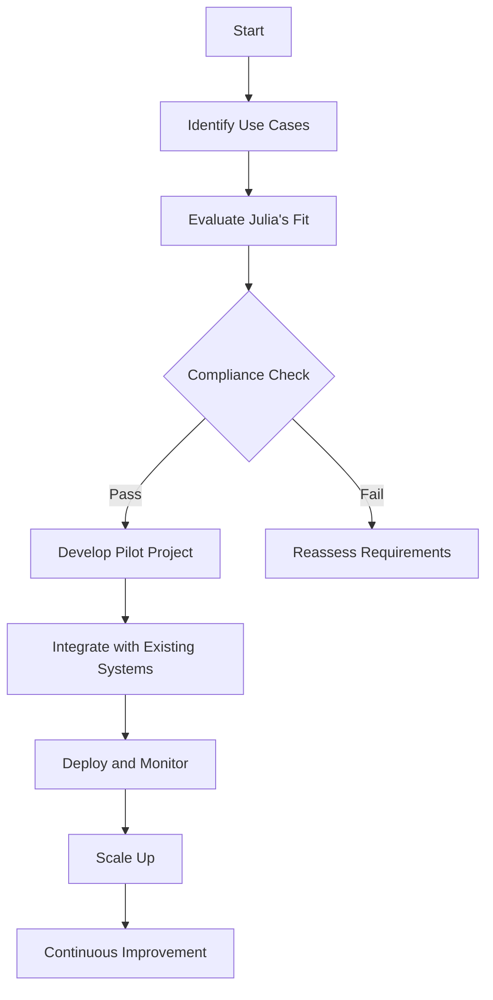

## 23.8 Integrating Julia into Enterprise Environments

As Julia continues to gain traction in the world of scientific computing and data analysis, enterprises are increasingly recognizing its potential to enhance their technology stacks. However, integrating a relatively new language like Julia into established enterprise environments presents unique challenges and opportunities. In this section, we will explore the barriers to adoption, effective integration strategies, and real-world case studies of successful Julia implementations in enterprise settings.

### Adoption Barriers

#### Compliance and Regulatory Challenges

Enterprises often operate under strict regulatory frameworks that dictate the technologies they can use. Julia, being a newer language, may not yet have the same level of compliance certifications as more established languages like Java or Python. This can pose a challenge for enterprises in regulated industries such as finance, healthcare, or government.

**Strategies to Overcome Compliance Challenges:**

- **Engage with Julia's Community and Developers:** Collaborate with the Julia community to understand ongoing efforts towards compliance and contribute to these initiatives.
- **Leverage Open-Source Nature:** Utilize Julia's open-source nature to conduct internal audits and ensure compliance with industry standards.
- **Pilot Projects:** Start with small-scale pilot projects to demonstrate Julia's compliance capabilities before scaling up.

#### Tooling and Ecosystem Maturity

While Julia's ecosystem is rapidly growing, it may still lack some of the mature tooling available for other languages. This includes integrated development environments (IDEs), debugging tools, and libraries for specific enterprise needs.

**Strategies to Enhance Tooling:**

- **Adopt Hybrid Approaches:** Use Julia in conjunction with other languages to leverage existing tools and libraries.
- **Contribute to Tool Development:** Encourage internal teams to contribute to the development of Julia tools and libraries.
- **Utilize Existing Tools:** Explore existing Julia tools such as Juno, VS Code extensions, and the Julia debugger to enhance productivity.

#### Integration with Existing Systems

Integrating Julia into existing enterprise systems can be challenging, especially when dealing with legacy systems or languages. Ensuring seamless interoperability is crucial for successful adoption.

**Strategies for Seamless Integration:**

- **Interoperability Libraries:** Utilize libraries like PyCall.jl, RCall.jl, and JavaCall.jl to interface with Python, R, and Java, respectively.
- **Microservices Architecture:** Implement Julia as part of a microservices architecture to allow for gradual integration without disrupting existing systems.
- **APIs and Web Services:** Develop APIs and web services using Julia to facilitate communication with other systems.

### Integration Approaches

#### Combining Julia with Existing Technologies

Julia's ability to interface with other languages and systems makes it a versatile addition to any tech stack. Here are some approaches to integrating Julia with existing technologies:

- **Data Processing Pipelines:** Use Julia for high-performance data processing tasks within existing data pipelines. Julia's speed and efficiency make it ideal for handling large datasets.
  
  ```julia
  using DataFrames, CSV

  # Load a CSV file into a DataFrame
  df = CSV.read("data.csv", DataFrame)

  # Perform data manipulation
  df_filtered = filter(row -> row[:value] > 100, df)

  # Save the processed data
  CSV.write("processed_data.csv", df_filtered)
  ```

- **Machine Learning and AI:** Integrate Julia's machine learning libraries, such as Flux.jl and MLJ.jl, with existing AI frameworks to enhance model performance and scalability.

  ```julia
  using Flux

  # Define a simple neural network model
  model = Chain(
      Dense(10, 5, relu),
      Dense(5, 2),
      softmax
  )

  # Train the model with data
  loss(x, y) = Flux.crossentropy(model(x), y)
  opt = ADAM()
  Flux.train!(loss, params(model), data, opt)
  ```

- **Scientific Computing:** Leverage Julia's strengths in scientific computing by integrating it with existing simulation and modeling tools.

  ```julia
  using DifferentialEquations

  # Define a differential equation
  function f(du, u, p, t)
      du[1] = p[1] * u[1]
  end

  # Initial condition and parameters
  u0 = [1.0]
  tspan = (0.0, 1.0)
  p = [0.5]

  # Solve the differential equation
  prob = ODEProblem(f, u0, tspan, p)
  sol = solve(prob)
  ```

#### Leveraging Julia's Unique Features

Julia offers several unique features that can be leveraged to enhance enterprise applications:

- **Multiple Dispatch:** Julia's multiple dispatch system allows for flexible and efficient function definitions, making it easier to write generic and reusable code.

  ```julia
  function process(data::Array{Int})
      println("Processing integer array")
  end

  function process(data::Array{Float64})
      println("Processing float array")
  end
  ```

- **Metaprogramming:** Use Julia's metaprogramming capabilities to generate code dynamically, reducing redundancy and improving maintainability.

  ```julia
  macro sayhello(name)
      return :(println("Hello, ", $name))
  end

  @sayhello "Julia"
  ```

- **Performance Optimization:** Julia's ability to compile to efficient machine code allows for significant performance gains, especially in computationally intensive tasks.

### Case Studies

#### Enterprise Success Stories

Several enterprises have successfully integrated Julia into their technology stacks, demonstrating its versatility and performance benefits.

**Case Study 1: Financial Services**

A leading financial services company integrated Julia into their risk management system to enhance computational efficiency. By leveraging Julia's speed and multiple dispatch capabilities, they were able to reduce computation times for complex risk models by over 50%.

**Case Study 2: Healthcare Analytics**

A healthcare analytics firm adopted Julia for processing large volumes of patient data. Julia's ability to handle complex data transformations and statistical analyses enabled the firm to deliver insights faster and more accurately, improving patient outcomes.

**Case Study 3: Manufacturing Optimization**

A manufacturing company used Julia to optimize their production processes. By integrating Julia with their existing ERP system, they were able to model and simulate production scenarios, leading to a 20% increase in operational efficiency.

### Visualizing Julia's Integration in Enterprises

To better understand how Julia can be integrated into enterprise environments, let's visualize a typical integration workflow using a flowchart.



**Diagram Description:** This flowchart illustrates the process of integrating Julia into an enterprise environment, starting from identifying use cases to scaling up and continuous improvement.

### Knowledge Check

Before we conclude, let's reinforce our understanding with a few questions:

1. What are some common barriers to adopting Julia in enterprise environments?
2. How can Julia be integrated with existing technologies?
3. What are some unique features of Julia that can be leveraged in enterprise applications?
4. Can you describe a real-world case study where Julia was successfully integrated into an enterprise?

### Embrace the Journey

Integrating Julia into enterprise environments is a journey filled with challenges and opportunities. By understanding the barriers and leveraging Julia's unique features, enterprises can unlock new levels of performance and innovation. Remember, this is just the beginning. As you progress, you'll discover even more ways to harness Julia's power in your enterprise applications. Keep experimenting, stay curious, and enjoy the journey!

## Quiz Time!



### What is a common barrier to adopting Julia in enterprise environments?

- [x] Compliance and regulatory challenges
- [ ] Lack of community support
- [ ] High cost of implementation
- [ ] Limited language features

> **Explanation:** Compliance and regulatory challenges are common barriers due to Julia's relative newness compared to more established languages.

### How can Julia be integrated with existing technologies?

- [x] Using interoperability libraries like PyCall.jl
- [ ] By rewriting all existing code in Julia
- [ ] Only through microservices architecture
- [ ] By replacing existing systems entirely

> **Explanation:** Julia can be integrated with existing technologies using interoperability libraries, allowing it to work alongside other languages and systems.

### What is a unique feature of Julia that can be leveraged in enterprise applications?

- [x] Multiple dispatch
- [ ] Lack of type system
- [ ] Single-threaded execution
- [ ] Static typing

> **Explanation:** Multiple dispatch is a unique feature of Julia that allows for flexible and efficient function definitions.

### Which industry was mentioned as having successfully integrated Julia for risk management?

- [x] Financial services
- [ ] Healthcare
- [ ] Manufacturing
- [ ] Retail

> **Explanation:** The financial services industry was mentioned as having successfully integrated Julia for risk management.

### What is a strategy to overcome compliance challenges when adopting Julia?

- [x] Engage with Julia's community and developers
- [ ] Ignore compliance requirements
- [ ] Use Julia only for non-critical tasks
- [ ] Avoid using Julia in regulated industries

> **Explanation:** Engaging with Julia's community and developers can help address compliance challenges by contributing to ongoing efforts towards compliance.

### What is the benefit of using Julia's metaprogramming capabilities?

- [x] Reducing redundancy and improving maintainability
- [ ] Increasing code complexity
- [ ] Limiting code reusability
- [ ] Decreasing performance

> **Explanation:** Julia's metaprogramming capabilities allow for dynamic code generation, reducing redundancy and improving maintainability.

### How can enterprises start integrating Julia into their systems?

- [x] By developing pilot projects
- [ ] By immediately replacing all existing systems
- [ ] By ignoring existing compliance requirements
- [ ] By using Julia only for documentation

> **Explanation:** Developing pilot projects allows enterprises to test Julia's capabilities and demonstrate its value before scaling up.

### What is a key advantage of using Julia for data processing tasks?

- [x] High performance and efficiency
- [ ] Limited data handling capabilities
- [ ] High memory consumption
- [ ] Lack of data manipulation libraries

> **Explanation:** Julia's high performance and efficiency make it ideal for handling large datasets in data processing tasks.

### Which of the following is a strategy for enhancing Julia's tooling in enterprises?

- [x] Adopt hybrid approaches
- [ ] Avoid using existing tools
- [ ] Limit contributions to tool development
- [ ] Use Julia only for small projects

> **Explanation:** Adopting hybrid approaches allows enterprises to leverage existing tools and libraries alongside Julia.

### True or False: Julia's open-source nature can be leveraged for compliance audits.

- [x] True
- [ ] False

> **Explanation:** Julia's open-source nature allows enterprises to conduct internal audits and ensure compliance with industry standards.




