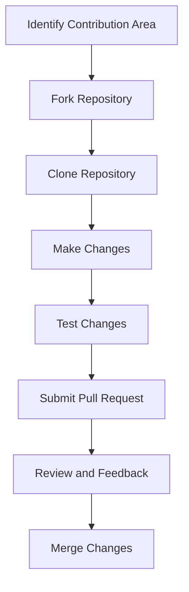

## 23.9 Contributing to Open Source Julia Projects

Contributing to open source projects is a rewarding way to enhance your skills, collaborate with a global community, and make a meaningful impact on the software you use. In the Julia ecosystem, contributions can range from improving documentation to developing new features in core libraries. This section will guide you through the paths to contribution, the impact of your efforts, and how to engage effectively with the community.

### Paths to Contribution

#### Documentation Improvements

Documentation is the backbone of any open source project, providing users with the necessary information to understand and use the software. Contributing to documentation is an excellent starting point for newcomers.

- **Identify Gaps**: Review existing documentation to identify areas that need clarification or expansion.
- **Enhance Examples**: Provide additional examples or improve existing ones to make concepts clearer.
- **Update Outdated Information**: Ensure that the documentation reflects the latest features and changes in the project.

#### Bug Reporting and Fixing

Identifying and fixing bugs is a critical contribution that improves the stability and reliability of a project.

- **Reproduce Bugs**: Attempt to reproduce reported bugs and provide detailed information to help maintainers understand the issue.
- **Submit Fixes**: If you have the skills, submit a patch or pull request with a fix for the bug.

#### Feature Development

Developing new features or enhancing existing ones can significantly impact a project's functionality and user experience.

- **Propose Ideas**: Discuss your ideas with the community to gather feedback and ensure alignment with the project's goals.
- **Implement Features**: Work on implementing the feature, following the project's contribution guidelines.

#### Core Language Development

Contributing to the core language involves working on the Julia language itself, which requires a deep understanding of its internals.

- **Understand the Codebase**: Familiarize yourself with the Julia source code and architecture.
- **Collaborate with Core Developers**: Engage with core developers to understand the priorities and areas where contributions are needed.

### Impact of Contributions

Contributions to open source projects have a ripple effect, benefiting both the contributor and the broader community.

#### Enhancing the Julia Ecosystem

- **Improved Software Quality**: Contributions lead to more robust and reliable software, enhancing the overall quality of the Julia ecosystem.
- **Increased Adoption**: High-quality contributions can attract more users and developers to the project, increasing its adoption and impact.

#### Personal and Professional Growth

- **Skill Development**: Contributing to open source projects helps you develop technical skills and gain experience working with real-world codebases.
- **Networking Opportunities**: Engaging with the community allows you to connect with other developers, opening up opportunities for collaboration and mentorship.

### Community Support

The Julia community is known for its welcoming and collaborative nature, providing ample support for contributors.

#### Engaging with Mentors

- **Seek Guidance**: Reach out to experienced contributors or project maintainers for guidance and mentorship.
- **Participate in Mentorship Programs**: Join programs like Google Summer of Code or Julia Seasons of Contributions to receive structured mentorship.

#### Collaborating with Other Contributors

- **Join Discussions**: Participate in community forums, mailing lists, and chat channels to discuss ideas and collaborate with other contributors.
- **Attend Community Events**: Engage with the community through events like JuliaCon, where you can meet other contributors and learn about the latest developments in the Julia ecosystem.

### Code Examples

To illustrate the process of contributing to an open source Julia project, let's walk through a simple example of improving a function in a Julia package.

```julia
function add_numbers(a, b)
    return a + b
end

function add_numbers(a::Number, b::Number)::Number
    return a + b
end

println(add_numbers(3, 5))  # Output: 8
println(add_numbers(2.5, 4.5))  # Output: 7.0
```

In this example, we have improved the `add_numbers` function by adding type annotations, which enhances code readability and helps with type inference.

### Try It Yourself

To experiment with contributing to a Julia project, try the following:

1. **Fork a Repository**: Choose a Julia project on GitHub, fork the repository, and clone it to your local machine.
2. **Identify an Area for Improvement**: Look for issues labeled "good first issue" or "help wanted" to find tasks suitable for newcomers.
3. **Make Changes**: Implement your changes and test them locally.
4. **Submit a Pull Request**: Once you're satisfied with your changes, submit a pull request to the original repository.

### Visualizing the Contribution Process

Below is a flowchart illustrating the typical process of contributing to an open source Julia project.



**Figure 1**: Flowchart of the open source contribution process.

### References and Links

- [JuliaLang GitHub](https://github.com/JuliaLang) - Explore the official Julia repositories.
- [Julia Discourse](https://discourse.julialang.org/) - Join discussions and connect with the Julia community.
- [Contributing to Julia](https://julialang.org/contribute/) - Learn more about contributing to the Julia language.

### Knowledge Check

- **What are some common paths to contributing to open source Julia projects?**
- **How can contributions impact the Julia ecosystem?**
- **What are some ways to engage with the Julia community for support?**

### Embrace the Journey

Remember, contributing to open source is a journey of continuous learning and growth. As you contribute, you'll not only improve your skills but also make a positive impact on the software you use and the community you're a part of. Keep experimenting, stay curious, and enjoy the journey!

## Quiz Time!



### What is a good starting point for newcomers to contribute to open source Julia projects?

- [x] Improving documentation
- [ ] Developing new features
- [ ] Core language development
- [ ] Bug fixing

> **Explanation:** Improving documentation is an excellent starting point for newcomers as it requires less technical expertise and helps them familiarize themselves with the project.

### Which of the following is a benefit of contributing to open source projects?

- [x] Skill development
- [ ] Decreased networking opportunities
- [ ] Limited personal growth
- [ ] Reduced software quality

> **Explanation:** Contributing to open source projects helps in skill development, networking, and personal growth.

### What should you do before implementing a new feature in an open source project?

- [x] Propose ideas and gather feedback
- [ ] Directly implement the feature
- [ ] Ignore the project's goals
- [ ] Avoid discussing with the community

> **Explanation:** Proposing ideas and gathering feedback ensures that the feature aligns with the project's goals and has community support.

### How can you engage with the Julia community for support?

- [x] Participate in community forums and events
- [ ] Work in isolation
- [ ] Avoid discussions with other contributors
- [ ] Ignore mentorship opportunities

> **Explanation:** Engaging in community forums and events helps you connect with other contributors and receive support.

### What is the impact of contributions on the Julia ecosystem?

- [x] Improved software quality
- [x] Increased adoption
- [ ] Decreased user base
- [ ] Reduced functionality

> **Explanation:** Contributions lead to improved software quality and increased adoption, benefiting the entire ecosystem.

### Which of the following is a way to collaborate with other contributors?

- [x] Join discussions in community forums
- [ ] Work independently without feedback
- [ ] Avoid community events
- [ ] Ignore other contributors' ideas

> **Explanation:** Joining discussions in community forums fosters collaboration and idea exchange.

### What is the first step in the open source contribution process?

- [x] Identify a contribution area
- [ ] Submit a pull request
- [ ] Make changes
- [ ] Test changes

> **Explanation:** Identifying a contribution area is the first step in the process, guiding your efforts.

### How can you test your changes before submitting a pull request?

- [x] Test them locally
- [ ] Submit without testing
- [ ] Ignore testing
- [ ] Wait for feedback from maintainers

> **Explanation:** Testing changes locally ensures they work as expected before submission.

### What is the role of mentors in open source contributions?

- [x] Provide guidance and support
- [ ] Discourage new contributors
- [ ] Limit collaboration
- [ ] Reduce learning opportunities

> **Explanation:** Mentors provide guidance and support, helping new contributors navigate the contribution process.

### True or False: Contributing to open source projects can lead to personal and professional growth.

- [x] True
- [ ] False

> **Explanation:** Contributing to open source projects enhances skills, provides networking opportunities, and fosters personal and professional growth.


