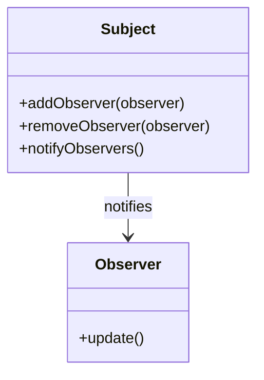

## 24.1 Recap of Key Concepts and Patterns

As we reach the conclusion of our comprehensive guide on Julia design patterns and best practices, it's essential to revisit the key concepts and patterns we've explored. This recap will not only reinforce your understanding but also highlight the connections between different topics, emphasizing the importance of design patterns in software development.

### Summary of Learnings

Throughout this guide, we've delved into the intricacies of Julia programming, exploring its unique features and how they can be leveraged to build efficient, scalable, and maintainable applications. Let's summarize the main points covered:

1. **Introduction to Design Patterns in Julia**:
   - We began by defining design patterns and their significance in software development. Design patterns provide reusable solutions to common problems, enhancing code readability and maintainability.

2. **Getting Started with Julia**:
   - We covered the basics of setting up Julia, exploring its REPL, and understanding its syntax and language constructs. This foundation is crucial for effectively implementing design patterns.

3. **Julia Programming Fundamentals**:
   - We explored data structures, the type system, and multiple dispatch, which are pivotal in Julia's design patterns. Understanding these fundamentals allows for more flexible and efficient code.

4. **Principles of Software Design in Julia**:
   - We discussed programming paradigms, such as functional and object-oriented programming, and how Julia's features support these paradigms. We also explored principles like SOLID, DRY, and KISS, which guide the application of design patterns.

5. **Creational, Structural, and Behavioral Design Patterns**:
   - We examined various design patterns, including Singleton, Factory, Adapter, and Observer, among others. Each pattern addresses specific design challenges and enhances the architecture of Julia applications.

6. **Idiomatic Julia Patterns**:
   - We highlighted idiomatic patterns unique to Julia, such as effective use of multiple dispatch and metaprogramming. These patterns leverage Julia's strengths to create more expressive and performant code.

7. **Data Visualization and Machine Learning**:
   - We explored Julia's capabilities in data visualization and machine learning, emphasizing the importance of design patterns in these domains for creating robust and scalable solutions.

8. **Parallel and Concurrent Computing**:
   - We discussed patterns for parallelism and concurrency, crucial for optimizing performance in Julia applications. Understanding these patterns is key to harnessing Julia's full potential in high-performance computing.

9. **Testing, Debugging, and Performance Optimization**:
   - We covered best practices for testing and debugging, as well as performance optimization techniques. These practices ensure that Julia applications are reliable and efficient.

10. **Security and Integration Patterns**:
    - We explored security patterns and integration techniques, emphasizing the importance of secure coding practices and interoperability in modern software development.

### Connections Between Topics

Understanding how different patterns and practices complement each other is crucial for mastering Julia development. Here are some key connections:

- **Multiple Dispatch and Design Patterns**:
  - Julia's multiple dispatch is a powerful feature that enhances many design patterns, such as the Strategy and Visitor patterns. It allows for more flexible and dynamic method selection, enabling cleaner and more modular code.

- **Metaprogramming and Code Generation**:
  - Metaprogramming in Julia allows for the creation of domain-specific languages and code generation, which can be used to implement patterns like the Interpreter and Template Method patterns. This capability enables developers to write more concise and expressive code.

- **Functional Programming and Immutability**:
  - Functional programming concepts, such as immutability and higher-order functions, are integral to patterns like the Command and Memento patterns. These concepts promote safer and more predictable code.

- **Concurrency and Asynchronous Patterns**:
  - Patterns for concurrency and asynchronous programming, such as the Producer-Consumer and Event-Driven patterns, are essential for building responsive and scalable applications. Julia's task-based concurrency model supports these patterns effectively.

- **Data Handling and Visualization**:
  - Patterns for data manipulation and visualization, such as using DataFrames.jl and Plots.jl, are crucial for data-driven applications. These patterns ensure efficient data processing and insightful visualizations.

### Importance of Patterns

Design patterns are invaluable in software development for several reasons:

- **Reusability**: Patterns provide proven solutions to common problems, reducing the need to reinvent the wheel and allowing developers to focus on solving unique challenges.

- **Readability and Maintainability**: Patterns promote code organization and clarity, making it easier for developers to understand and maintain complex systems.

- **Scalability**: Patterns help design systems that can scale efficiently, accommodating growing data and user demands.

- **Flexibility**: Patterns encourage modular design, enabling easier modifications and extensions to the system.

- **Community and Collaboration**: Patterns provide a common language for developers, facilitating communication and collaboration within teams and across the community.

### Code Examples

Let's revisit some key patterns with code examples to reinforce our understanding:

#### Singleton Pattern

The Singleton pattern ensures a class has only one instance and provides a global point of access to it.

```julia
mutable struct Singleton
    data::Int
end

function get_instance()
    global instance
    if !isdefined(:instance)
        instance = Singleton(0)
    end
    return instance
end

singleton1 = get_instance()
singleton2 = get_instance()
singleton1.data = 42
println(singleton2.data)  # Output: 42
```

#### Factory Method Pattern

The Factory Method pattern defines an interface for creating objects but allows subclasses to alter the type of objects that will be created.

```julia
abstract type Product end

struct ConcreteProductA <: Product end
struct ConcreteProductB <: Product end

function create_product(type::Symbol)::Product
    if type == :A
        return ConcreteProductA()
    elseif type == :B
        return ConcreteProductB()
    else
        error("Unknown product type")
    end
end

product = create_product(:A)
println(typeof(product))  # Output: ConcreteProductA
```

#### Observer Pattern

The Observer pattern defines a one-to-many dependency between objects so that when one object changes state, all its dependents are notified and updated automatically.

```julia
mutable struct Subject
    observers::Vector{Function}
end

function Subject()
    return Subject([])
end

function add_observer(subject::Subject, observer::Function)
    push!(subject.observers, observer)
end

function notify_observers(subject::Subject)
    for observer in subject.observers
        observer()
    end
end

subject = Subject()
add_observer(subject, () -> println("Observer 1 notified"))
add_observer(subject, () -> println("Observer 2 notified"))
notify_observers(subject)
```

### Visualizing Key Concepts

To further solidify our understanding, let's visualize some of the key concepts using Mermaid.js diagrams.

#### Visualizing the Observer Pattern



**Diagram Description**: This diagram illustrates the relationship between the `Subject` and `Observer` classes in the Observer pattern. The `Subject` maintains a list of observers and notifies them of state changes.

### Try It Yourself

Experiment with the code examples provided. Try modifying the Singleton pattern to include additional methods or properties. Implement a new product type in the Factory Method pattern. Add more observers in the Observer pattern and see how they interact.

### Knowledge Check

- What are the benefits of using design patterns in software development?
- How does Julia's multiple dispatch enhance design patterns?
- Why is metaprogramming important in Julia?
- How do concurrency patterns improve application performance?
- What role do data handling patterns play in data-driven applications?

### Embrace the Journey

Remember, this is just the beginning. As you progress, you'll build more complex and interactive applications using Julia. Keep experimenting, stay curious, and enjoy the journey!

## Quiz Time!



### What is the primary benefit of using design patterns in software development?

- [x] Reusability and maintainability
- [ ] Increased complexity
- [ ] Reduced performance
- [ ] Limited scalability

> **Explanation:** Design patterns provide reusable solutions to common problems, enhancing code readability and maintainability.

### How does Julia's multiple dispatch feature enhance design patterns?

- [x] By allowing more flexible and dynamic method selection
- [ ] By enforcing strict type hierarchies
- [ ] By limiting method overloading
- [ ] By reducing code readability

> **Explanation:** Multiple dispatch allows for more flexible and dynamic method selection, enabling cleaner and more modular code.

### Which pattern is best suited for creating a global point of access to a class instance?

- [x] Singleton Pattern
- [ ] Factory Method Pattern
- [ ] Observer Pattern
- [ ] Strategy Pattern

> **Explanation:** The Singleton pattern ensures a class has only one instance and provides a global point of access to it.

### What is the main advantage of using the Observer pattern?

- [x] It defines a one-to-many dependency between objects
- [ ] It simplifies object creation
- [ ] It enhances data encapsulation
- [ ] It enforces strict type checking

> **Explanation:** The Observer pattern defines a one-to-many dependency between objects so that when one object changes state, all its dependents are notified and updated automatically.

### Which pattern is commonly used for creating objects without specifying the exact class of object that will be created?

- [x] Factory Method Pattern
- [ ] Singleton Pattern
- [ ] Observer Pattern
- [ ] Command Pattern

> **Explanation:** The Factory Method pattern defines an interface for creating objects but allows subclasses to alter the type of objects that will be created.

### What is the role of metaprogramming in Julia?

- [x] To create domain-specific languages and code generation
- [ ] To enforce strict type hierarchies
- [ ] To limit method overloading
- [ ] To reduce code readability

> **Explanation:** Metaprogramming in Julia allows for the creation of domain-specific languages and code generation, enabling developers to write more concise and expressive code.

### How do concurrency patterns improve application performance?

- [x] By enabling parallel execution of tasks
- [ ] By enforcing strict type hierarchies
- [ ] By limiting method overloading
- [ ] By reducing code readability

> **Explanation:** Concurrency patterns enable parallel execution of tasks, which is essential for building responsive and scalable applications.

### What is the significance of data handling patterns in data-driven applications?

- [x] They ensure efficient data processing and insightful visualizations
- [ ] They enforce strict type hierarchies
- [ ] They limit method overloading
- [ ] They reduce code readability

> **Explanation:** Data handling patterns ensure efficient data processing and insightful visualizations, which are crucial for data-driven applications.

### Which principle promotes code organization and clarity?

- [x] DRY (Don't Repeat Yourself)
- [ ] YAGNI (You Aren't Gonna Need It)
- [ ] KISS (Keep It Simple, Stupid)
- [ ] Law of Demeter

> **Explanation:** The DRY principle promotes code organization and clarity by reducing repetition and encouraging reuse.

### True or False: Design patterns are only applicable to object-oriented programming.

- [ ] True
- [x] False

> **Explanation:** Design patterns are applicable to various programming paradigms, including functional and procedural programming, not just object-oriented programming.


