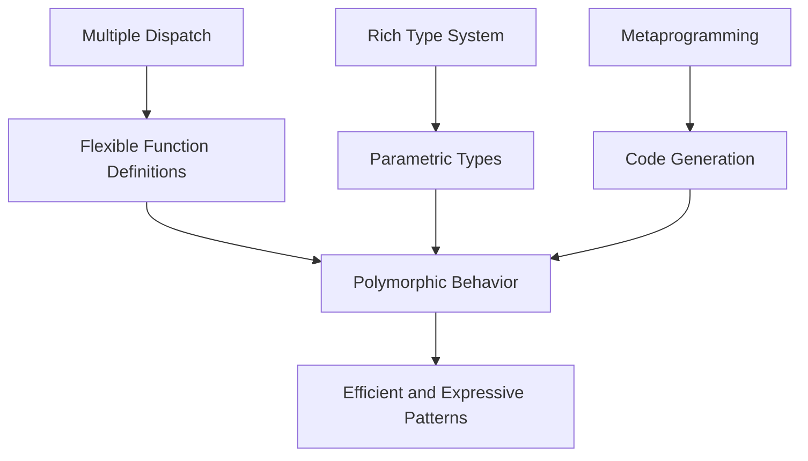

## 24.3 Final Thoughts on Design Patterns in Julia

As we reach the conclusion of our comprehensive journey through design patterns in Julia, it's essential to reflect on the unique aspects of Julia that make it a compelling choice for modern software development. We'll also explore how traditional design patterns adapt to the language's features and why these patterns remain crucial for effective software design.

### Julia's Unique Positioning

Julia stands out in the programming landscape due to its combination of high performance and high-level abstractions. This unique positioning allows developers to write code that is both expressive and efficient, bridging the gap between low-level languages like C and high-level languages like Python.

#### The Interplay of Performance and High-Level Abstractions

Julia's design philosophy emphasizes performance without sacrificing ease of use. This is achieved through several key features:

- **Multiple Dispatch**: Julia's multiple dispatch system allows functions to be defined for different combinations of argument types, enabling highly optimized and flexible code. This feature is particularly beneficial for implementing design patterns that rely on polymorphism.

- **Just-In-Time (JIT) Compilation**: Julia uses LLVM-based JIT compilation to generate efficient machine code, ensuring that high-level abstractions do not come at the cost of performance.

- **Rich Type System**: Julia's type system supports parametric types and generics, allowing developers to write reusable and type-safe code. This is crucial for implementing design patterns that require type flexibility.

- **Metaprogramming Capabilities**: Julia's metaprogramming features enable developers to write code that generates other code, facilitating the implementation of complex design patterns and domain-specific languages.

These features make Julia an ideal language for scientific computing, data analysis, and machine learning, where both performance and expressiveness are paramount.

### Adapting Patterns

While traditional design patterns provide a solid foundation for software design, they must be adapted to fit the unique characteristics of modern languages like Julia. Let's explore how some common patterns are transformed in the Julia ecosystem.

#### Singleton Pattern

The Singleton pattern ensures that a class has only one instance and provides a global point of access to it. In Julia, this pattern can be implemented using a combination of modules and constants.

```julia
module SingletonExample

const instance = Ref{Union{Nothing, SingletonType}}(nothing)

mutable struct SingletonType
    value::Int
end

function get_instance()
    if instance[] === nothing
        instance[] = SingletonType(0)
    end
    return instance[]
end

end # module
```

In this example, we use a `Ref` to hold the singleton instance, ensuring that it can be initialized lazily.

#### Factory Method Pattern

The Factory Method pattern provides an interface for creating objects but allows subclasses to alter the type of objects that will be created. Julia's multiple dispatch makes it easy to implement this pattern.

```julia
abstract type Product end

struct ConcreteProductA <: Product end
struct ConcreteProductB <: Product end

function create_product(::Type{ConcreteProductA})
    return ConcreteProductA()
end

function create_product(::Type{ConcreteProductB})
    return ConcreteProductB()
end

product_a = create_product(ConcreteProductA)
product_b = create_product(ConcreteProductB)
```

Here, we define a `create_product` function that dispatches based on the type of product to be created, demonstrating Julia's strength in handling polymorphic behavior.

### Continued Relevance

Despite the evolution of programming languages and paradigms, design patterns remain a cornerstone of effective software design. They provide a shared vocabulary for developers, facilitate communication, and offer proven solutions to common problems.

#### The Enduring Importance of Design Patterns

1. **Facilitating Communication**: Design patterns provide a common language for developers, making it easier to convey complex design ideas succinctly.

2. **Promoting Reusability**: Patterns encourage the reuse of proven solutions, reducing the need to reinvent the wheel and allowing developers to focus on solving domain-specific problems.

3. **Enhancing Maintainability**: By providing a structured approach to software design, patterns help create code that is easier to understand, modify, and extend.

4. **Supporting Scalability**: Patterns often address scalability concerns, ensuring that software can grow and adapt to changing requirements.

5. **Encouraging Best Practices**: Patterns embody best practices in software design, guiding developers toward robust and efficient solutions.

### Visualizing Julia's Design Patterns

To better understand how Julia's unique features influence design patterns, let's visualize the interplay between multiple dispatch, type system, and metaprogramming.



**Diagram Description**: This diagram illustrates how Julia's multiple dispatch, rich type system, and metaprogramming capabilities converge to enable efficient and expressive design patterns.

### Embrace the Journey

As we conclude this guide, remember that mastering design patterns in Julia is a journey, not a destination. The language's unique features offer endless possibilities for innovation and creativity. Keep experimenting, stay curious, and continue exploring the rich ecosystem of Julia.

### Try It Yourself

To solidify your understanding, try modifying the code examples provided in this section. Experiment with different types and structures to see how Julia's features can be leveraged to implement design patterns effectively.

### Knowledge Check

Reflect on the following questions to reinforce your learning:

- How does Julia's multiple dispatch influence the implementation of design patterns?
- In what ways can metaprogramming enhance the flexibility of design patterns in Julia?
- Why are design patterns still relevant in modern software development?

### References and Further Reading

For more in-depth exploration of design patterns and Julia's unique features, consider the following resources:

- [Design Patterns: Elements of Reusable Object-Oriented Software](https://en.wikipedia.org/wiki/Design_Patterns)
- [JuliaLang Documentation](https://docs.julialang.org/)
- [Metaprogramming in Julia](https://docs.julialang.org/en/v1/manual/metaprogramming/)

### Quiz Time!



### How does Julia's multiple dispatch system benefit design patterns?

- [x] It allows functions to be defined for different combinations of argument types.
- [ ] It restricts the use of polymorphism.
- [ ] It simplifies the type system.
- [ ] It eliminates the need for object-oriented design.

> **Explanation:** Julia's multiple dispatch system enables functions to be defined for various argument types, enhancing polymorphic behavior and flexibility in design patterns.

### What is a key advantage of using JIT compilation in Julia?

- [x] It generates efficient machine code at runtime.
- [ ] It simplifies the syntax of the language.
- [ ] It eliminates the need for type annotations.
- [ ] It restricts the use of high-level abstractions.

> **Explanation:** JIT compilation allows Julia to generate efficient machine code at runtime, ensuring high performance without sacrificing high-level abstractions.

### How can the Singleton pattern be implemented in Julia?

- [x] Using a combination of modules and constants.
- [ ] By creating multiple instances of a struct.
- [ ] By using global variables.
- [ ] By avoiding the use of functions.

> **Explanation:** In Julia, the Singleton pattern can be implemented using modules and constants to ensure a single instance of a type.

### What role does metaprogramming play in Julia?

- [x] It allows code to generate other code.
- [ ] It restricts the use of macros.
- [ ] It simplifies the type system.
- [ ] It eliminates the need for functions.

> **Explanation:** Metaprogramming in Julia enables code to generate other code, facilitating the implementation of complex design patterns.

### Why are design patterns still relevant today?

- [x] They provide a shared vocabulary for developers.
- [ ] They eliminate the need for documentation.
- [x] They offer proven solutions to common problems.
- [ ] They restrict the use of modern programming languages.

> **Explanation:** Design patterns remain relevant because they provide a common language for developers and offer proven solutions to common software design problems.

### What is a benefit of using Julia's rich type system?

- [x] It supports parametric types and generics.
- [ ] It restricts the use of multiple dispatch.
- [ ] It simplifies the syntax of the language.
- [ ] It eliminates the need for type annotations.

> **Explanation:** Julia's rich type system supports parametric types and generics, allowing for reusable and type-safe code.

### How does the Factory Method pattern benefit from Julia's features?

- [x] It utilizes multiple dispatch for flexible object creation.
- [ ] It restricts the use of polymorphism.
- [ ] It simplifies the type system.
- [ ] It eliminates the need for functions.

> **Explanation:** The Factory Method pattern benefits from Julia's multiple dispatch, enabling flexible and polymorphic object creation.

### What is a key feature of Julia's metaprogramming capabilities?

- [x] Code generation.
- [ ] Restriction of macros.
- [ ] Simplification of the type system.
- [ ] Elimination of functions.

> **Explanation:** Julia's metaprogramming capabilities include code generation, which is essential for implementing complex design patterns.

### How can design patterns enhance software maintainability?

- [x] By providing a structured approach to software design.
- [ ] By eliminating the need for documentation.
- [ ] By restricting the use of modern programming languages.
- [ ] By simplifying the syntax of the language.

> **Explanation:** Design patterns enhance software maintainability by providing a structured approach to design, making code easier to understand and modify.

### True or False: Design patterns are only relevant for object-oriented programming.

- [ ] True
- [x] False

> **Explanation:** Design patterns are relevant across various programming paradigms, including functional and procedural programming, not just object-oriented programming.



Remember, this is just the beginning. As you progress, you'll build more complex and interactive applications using Julia's powerful features. Keep experimenting, stay curious, and enjoy the journey!
