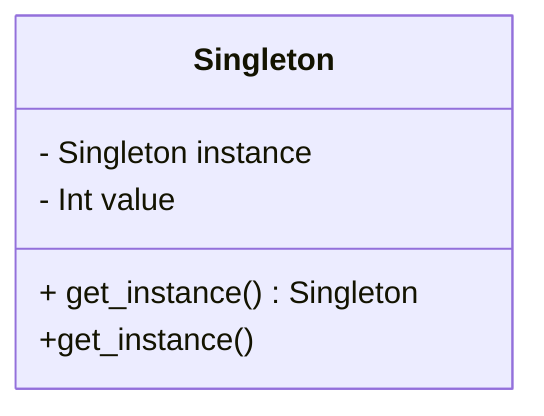

## 25.1 Glossary of Terms and Concepts

In this section, we provide a comprehensive glossary of terms and concepts that are essential for understanding and mastering Julia design patterns and best practices. This glossary is designed to serve as a reference for both beginners and expert developers, offering clear definitions and explanations of key terms, acronyms, and concepts used throughout the guide.

### Definitions

#### Abstract Factory Pattern
A creational design pattern that provides an interface for creating families of related or dependent objects without specifying their concrete classes. It is used to create a set of related objects that share a common theme.

#### Abstract Syntax Tree (AST)
A tree representation of the abstract syntactic structure of source code. Each node in the tree denotes a construct occurring in the source code. In Julia, ASTs are used extensively in metaprogramming to transform and generate code.

#### Actor Model
A conceptual model for dealing with concurrent computation. In this model, "actors" are the fundamental units of computation that communicate by sending messages to each other.

#### Adapter Pattern
A structural design pattern that allows objects with incompatible interfaces to work together. It acts as a bridge between two incompatible interfaces.

#### Algorithm
A step-by-step procedure or formula for solving a problem. In programming, algorithms are implemented in code to perform specific tasks.

#### API (Application Programming Interface)
A set of rules and tools for building software applications. An API defines the methods and data structures that developers can use to interact with a software component or service.

#### Asynchronous Programming
A programming paradigm that allows for the execution of tasks independently of the main program flow, enabling non-blocking operations and improving performance in I/O-bound applications.

#### Benchmarking
The process of measuring the performance of a piece of code or a system. In Julia, `BenchmarkTools.jl` is a popular package for benchmarking code.

#### Builder Pattern
A creational design pattern that allows for the step-by-step construction of complex objects. It separates the construction of a complex object from its representation.

#### Callback
A function passed as an argument to another function, which is then invoked inside the outer function to complete some kind of routine or action.

#### Channel
A concurrency primitive in Julia used for communication between tasks. Channels can be used to send and receive data between tasks in a synchronized manner.

#### Class
In object-oriented programming, a class is a blueprint for creating objects. It defines a set of properties and methods that the created objects will have.

#### Closure
A function that captures the bindings of free variables in its lexical context. Closures allow functions to access variables from their enclosing scope even after that scope has finished executing.

#### Code Coverage
A measure used in software testing to describe the degree to which the source code of a program is executed when a particular test suite runs.

#### Command Pattern
A behavioral design pattern that encapsulates a request as an object, thereby allowing for parameterization of clients with queues, requests, and operations.

#### Composition Over Inheritance
A principle that suggests using composition (combining objects) rather than inheritance (extending classes) to achieve code reuse and flexibility.

#### Concurrency
The ability of a program to execute multiple tasks simultaneously. In Julia, concurrency is achieved using tasks and coroutines.

#### Continuous Integration (CI)
A software development practice where developers frequently integrate code into a shared repository, with each integration being verified by an automated build and test process.

#### Coroutine
A general control structure whereby flow control is cooperatively passed between two different routines without returning.

#### DataFrame
A data structure used for storing tabular data in Julia, similar to a table in a database or a data frame in R or Python's pandas.

#### Dependency Injection
A design pattern used to implement IoC (Inversion of Control), where the control of creating and managing dependencies is transferred from the client to a container or framework.

#### Design Pattern
A general, reusable solution to a commonly occurring problem within a given context in software design. Design patterns are templates for solving problems that can be used in many different situations.

#### Distributed Computing
A field of computer science that studies distributed systems, where components located on networked computers communicate and coordinate their actions by passing messages.

#### Domain-Specific Language (DSL)
A computer language specialized to a particular application domain. In Julia, DSLs can be created using macros and metaprogramming.

#### DRY (Don't Repeat Yourself)
A principle aimed at reducing the repetition of software patterns, replacing them with abstractions or using data normalization to avoid redundancy.

#### Dynamic Typing
A feature of a programming language where the type of a variable is interpreted at runtime, rather than being explicitly declared by the programmer.

#### Encapsulation
An object-oriented programming principle that restricts access to certain components of an object and can prevent the accidental modification of data.

#### Event-Driven Programming
A programming paradigm in which the flow of the program is determined by events such as user actions, sensor outputs, or message passing.

#### Exception Handling
A construct in programming languages to handle errors and other exceptional events. It allows a program to continue execution even after an error has occurred.

#### Factory Method Pattern
A creational design pattern that defines an interface for creating an object, but lets subclasses alter the type of objects that will be created.

#### Facade Pattern
A structural design pattern that provides a simplified interface to a complex subsystem, making it easier to use.

#### Functional Programming
A programming paradigm where programs are constructed by applying and composing functions. It emphasizes the use of pure functions and avoids shared state and mutable data.

#### Garbage Collection
An automatic memory management feature that reclaims memory occupied by objects that are no longer in use by the program.

#### Generics
A feature of programming languages that allows functions and data types to operate on data of different types while providing compile-time type safety.

#### GRASP (General Responsibility Assignment Software Patterns)
A set of principles for assigning responsibilities to classes and objects in object-oriented design.

#### GUI (Graphical User Interface)
A user interface that includes graphical elements, such as windows, icons, and buttons, allowing users to interact with electronic devices through visual indicators.

#### Immutable
An object whose state cannot be modified after it is created. In Julia, immutable types are defined using the `struct` keyword.

#### Inheritance
A mechanism in object-oriented programming where a new class is created from an existing class by extending its properties and behaviors.

#### Interpreter Pattern
A behavioral design pattern that defines a representation for a language's grammar along with an interpreter that uses the representation to interpret sentences in the language.

#### Iterator
An object that enables a programmer to traverse a container, particularly lists. In Julia, iterators are used to iterate over collections.

#### JSON (JavaScript Object Notation)
A lightweight data interchange format that is easy for humans to read and write, and easy for machines to parse and generate.

#### KISS (Keep It Simple, Stupid)
A design principle that states that simplicity should be a key goal in design, and unnecessary complexity should be avoided.

#### Lazy Evaluation
A programming technique that delays the evaluation of an expression until its value is actually needed, which can improve performance by avoiding unnecessary calculations.

#### Law of Demeter
A design guideline for developing software, particularly object-oriented programs, that encourages minimal knowledge of other classes.

#### Machine Learning
A field of artificial intelligence that uses statistical techniques to give computer systems the ability to learn from data, without being explicitly programmed.

#### Macro
A rule or pattern that specifies how input sequences should be mapped to output sequences according to a defined procedure. In Julia, macros are used for metaprogramming.

#### Mediator Pattern
A behavioral design pattern that defines an object that encapsulates how a set of objects interact, promoting loose coupling by keeping objects from referring to each other explicitly.

#### Metaprogramming
A programming technique in which programs have the ability to treat other programs as their data. It allows a program to generate or modify code at runtime.

#### Memento Pattern
A behavioral design pattern that provides the ability to restore an object to its previous state without revealing the details of its implementation.

#### Multiple Dispatch
A feature of Julia that allows functions to be defined for different combinations of argument types, enabling polymorphism and code reuse.

#### Mutable
An object whose state can be modified after it is created. In Julia, mutable types are defined using the `mutable struct` keyword.

#### Namespace
A container that holds a set of identifiers and allows the disambiguation of homonym identifiers residing in different namespaces.

#### Null Object Pattern
A design pattern that uses a special null object to represent the absence of an object, avoiding null references and simplifying code.

#### Object-Oriented Programming (OOP)
A programming paradigm based on the concept of "objects", which can contain data and code that manipulates the data. OOP emphasizes encapsulation, inheritance, and polymorphism.

#### Observer Pattern
A behavioral design pattern in which an object, called the subject, maintains a list of its dependents, called observers, and notifies them automatically of any state changes.

#### Parametric Types
A feature in Julia that allows types to be parameterized by other types, enabling the creation of generic and reusable code.

#### Polymorphism
A programming language feature that allows values of different data types to be handled using a uniform interface. In Julia, polymorphism is achieved through multiple dispatch.

#### Prototype Pattern
A creational design pattern that allows for the creation of new objects by copying an existing object, known as the prototype.

#### Proxy Pattern
A structural design pattern that provides an object representing another object, controlling access to it.

#### REPL (Read-Eval-Print Loop)
An interactive programming environment that takes single user inputs, evaluates them, and returns the result to the user. Julia's REPL is a powerful tool for interactive programming.

#### Refactoring
The process of restructuring existing computer code without changing its external behavior, improving its readability, and reducing its complexity.

#### REST (Representational State Transfer)
An architectural style for designing networked applications, relying on stateless, client-server communication, typically using HTTP.

#### Serialization
The process of converting an object into a format that can be easily stored or transmitted and later reconstructed.

#### Singleton Pattern
A creational design pattern that restricts the instantiation of a class to one single instance, ensuring a single point of access.

#### SOLID Principles
A set of five design principles intended to make software designs more understandable, flexible, and maintainable. They include Single Responsibility, Open/Closed, Liskov Substitution, Interface Segregation, and Dependency Inversion principles.

#### State Pattern
A behavioral design pattern that allows an object to alter its behavior when its internal state changes, appearing to change its class.

#### Strategy Pattern
A behavioral design pattern that enables selecting an algorithm's behavior at runtime, allowing the client to choose from a family of algorithms.

#### Struct
A composite data type in Julia that groups together variables under a single name. Structs can be mutable or immutable.

#### Template Method Pattern
A behavioral design pattern that defines the skeleton of an algorithm in a method, deferring some steps to subclasses.

#### Thread
The smallest unit of processing that can be scheduled by an operating system. In Julia, threads are used for parallel execution.

#### Tuple
An ordered collection of elements, which can be of different types. Tuples are immutable in Julia.

#### Type Stability
A property of a function where the return type can be inferred from the types of the input arguments, leading to more efficient code execution.

#### UML (Unified Modeling Language)
A standardized modeling language used to specify, visualize, develop, and document the artifacts of a software system.

#### Visitor Pattern
A behavioral design pattern that allows adding new operations to existing object structures without modifying the structures.

#### YAGNI (You Aren't Gonna Need It)
A principle of extreme programming that states a programmer should not add functionality until it is necessary.

### Acronyms

- **AST**: Abstract Syntax Tree
- **API**: Application Programming Interface
- **CI**: Continuous Integration
- **DSL**: Domain-Specific Language
- **DRY**: Don't Repeat Yourself
- **GUI**: Graphical User Interface
- **JSON**: JavaScript Object Notation
- **KISS**: Keep It Simple, Stupid
- **OOP**: Object-Oriented Programming
- **REPL**: Read-Eval-Print Loop
- **REST**: Representational State Transfer
- **SOLID**: Single Responsibility, Open/Closed, Liskov Substitution, Interface Segregation, Dependency Inversion
- **UML**: Unified Modeling Language
- **YAGNI**: You Aren't Gonna Need It

### Try It Yourself

To deepen your understanding of these concepts, try implementing a simple design pattern in Julia. For example, create a Singleton pattern:

```julia
module SingletonExample

mutable struct Singleton
    value::Int
end

function get_instance()
    if !@isdefined instance
        global instance = Singleton(0)
    end
    return instance
end

end

using .SingletonExample

s1 = SingletonExample.get_instance()
s2 = SingletonExample.get_instance()

s1.value = 10
println(s2.value)  # Output: 10, proving s1 and s2 are the same instance
```

**Experiment:** Modify the `Singleton` struct to include additional fields or methods. Observe how changes affect the singleton behavior.

### Visualizing Design Patterns

Below is a diagram illustrating the Singleton pattern:



**Diagram Explanation:** This class diagram shows the Singleton class with a private instance and a method to access it.

### Knowledge Check

- Explain the difference between a Factory Method and an Abstract Factory pattern.
- Describe how multiple dispatch in Julia enhances polymorphism.
- What are the benefits of using the DRY principle in software development?

### Embrace the Journey

Remember, this glossary is just the beginning. As you progress, you'll encounter more complex concepts and patterns. Keep experimenting, stay curious, and enjoy the journey!

## Quiz Time!



### What is the primary purpose of the Singleton pattern?

- [x] To ensure a class has only one instance
- [ ] To create multiple instances of a class
- [ ] To provide a simplified interface to a complex system
- [ ] To encapsulate a request as an object

> **Explanation:** The Singleton pattern ensures that a class has only one instance and provides a global point of access to it.

### Which principle emphasizes reducing repetition in code?

- [x] DRY (Don't Repeat Yourself)
- [ ] KISS (Keep It Simple, Stupid)
- [ ] YAGNI (You Aren't Gonna Need It)
- [ ] SOLID

> **Explanation:** The DRY principle aims to reduce repetition by using abstractions or data normalization.

### What is an Abstract Syntax Tree (AST)?

- [x] A tree representation of the abstract syntactic structure of source code
- [ ] A design pattern for creating families of related objects
- [ ] A programming paradigm based on objects
- [ ] A method for measuring code performance

> **Explanation:** An AST is a tree representation of the abstract syntactic structure of source code, used in metaprogramming.

### What does the acronym API stand for?

- [x] Application Programming Interface
- [ ] Abstract Programming Interface
- [ ] Automated Programming Interface
- [ ] Advanced Programming Interface

> **Explanation:** API stands for Application Programming Interface, which defines methods and data structures for software interaction.

### Which pattern is used to encapsulate a request as an object?

- [x] Command Pattern
- [ ] Observer Pattern
- [ ] Strategy Pattern
- [ ] Singleton Pattern

> **Explanation:** The Command pattern encapsulates a request as an object, allowing for parameterization of clients with queues, requests, and operations.

### What is the primary benefit of using multiple dispatch in Julia?

- [x] Enhances polymorphism and code reuse
- [ ] Simplifies code syntax
- [ ] Increases code execution speed
- [ ] Reduces memory usage

> **Explanation:** Multiple dispatch in Julia enhances polymorphism and code reuse by allowing functions to be defined for different combinations of argument types.

### What does the acronym JSON stand for?

- [x] JavaScript Object Notation
- [ ] JavaScript Oriented Notation
- [ ] JavaScript Object Network
- [ ] JavaScript Online Notation

> **Explanation:** JSON stands for JavaScript Object Notation, a lightweight data interchange format.

### What is the purpose of the Adapter pattern?

- [x] To allow objects with incompatible interfaces to work together
- [ ] To create a simplified interface to a complex system
- [ ] To ensure a class has only one instance
- [ ] To encapsulate a request as an object

> **Explanation:** The Adapter pattern allows objects with incompatible interfaces to work together by acting as a bridge.

### What is a closure in programming?

- [x] A function that captures the bindings of free variables in its lexical context
- [ ] A design pattern for creating complex objects
- [ ] A method for measuring code performance
- [ ] A programming paradigm based on objects

> **Explanation:** A closure is a function that captures the bindings of free variables in its lexical context, allowing access to variables from an enclosing scope.

### True or False: In Julia, immutable types are defined using the `mutable struct` keyword.

- [ ] True
- [x] False

> **Explanation:** In Julia, immutable types are defined using the `struct` keyword, while `mutable struct` is used for mutable types.




