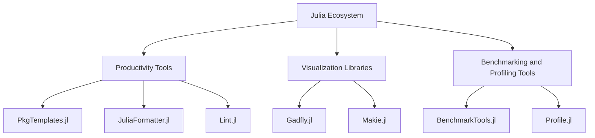

## 25.10 Additional Tools, Libraries, and Extensions

In the ever-evolving landscape of software development, leveraging the right tools, libraries, and extensions can significantly enhance productivity, streamline workflows, and optimize performance. This section delves into the additional resources available for Julia developers, focusing on productivity tools, visualization libraries, and benchmarking and profiling tools. Whether you're a seasoned Julia developer or just starting, these resources will help you build more efficient, scalable, and maintainable applications.

### Productivity Tools

Productivity tools are essential for any developer aiming to streamline their workflow and enhance code quality. In the Julia ecosystem, several tools can help you manage packages, format code, and ensure code quality through linting.

#### Package Managers

Julia's built-in package manager, `Pkg.jl`, is a powerful tool for managing dependencies, but there are additional tools that can enhance your package management experience.

- **PkgTemplates.jl**: This tool helps you create new Julia packages with a standardized structure, ensuring consistency across projects. It automates the setup of common files like README, LICENSE, and CI configurations.

```julia
using PkgTemplates

template = Template(;
    user="YourUsername",
    license="MIT",
    authors=["Your Name"],
    plugins=[GitHubActions(), Codecov()]
)

generate("NewPackage", template)
```

- **PkgDev.jl**: This extension provides additional functionality for package development, such as generating documentation and managing version control.

#### Code Formatters

Maintaining a consistent coding style is crucial for readability and collaboration. Julia offers several tools to help format your code.

- **JuliaFormatter.jl**: This tool automatically formats your Julia code according to a set of customizable rules, ensuring consistency across your codebase.

```julia
using JuliaFormatter

format("src/MyModule.jl")
```

- **DocumentFormat.jl**: Aimed at improving the formatting of Julia code within documentation, this tool ensures that your code snippets are as readable as your prose.

#### Linters

Linters analyze your code for potential errors, style issues, and other improvements.

- **Lint.jl**: This tool provides static analysis for Julia code, helping you catch common mistakes and improve code quality.

```julia
using Lint

lintfile("src/MyModule.jl")
```

- **Juno IDE**: Integrated with the Atom editor, Juno provides real-time linting and other productivity features, making it a popular choice among Julia developers.

### Visualization Libraries

Visualization is a powerful tool for understanding data and communicating insights. While Julia's standard libraries like Plots.jl are robust, there are additional libraries that offer unique features and capabilities.

#### Alternative Plotting Tools

- **Gadfly.jl**: Inspired by the Grammar of Graphics, Gadfly provides a high-level interface for creating complex visualizations with minimal code.

```julia
using Gadfly

plot(x=1:10, y=rand(10), Geom.line)
```

- **Makie.jl**: Known for its speed and interactivity, Makie is ideal for creating high-performance visualizations, including 3D plots and animations.

```julia
using Makie

scene = scatter(1:10, rand(10))
```

#### Supplementary Visualization Libraries

- **VegaLite.jl**: This library provides a Julia interface to the Vega-Lite visualization grammar, allowing for the creation of interactive and web-based visualizations.

```julia
using VegaLite

@vlplot(:point, x=1:10, y=rand(10))
```

- **PlotlyJS.jl**: Leveraging the Plotly.js library, this tool offers interactive plots that can be easily embedded in web applications.

```julia
using PlotlyJS

plot(scatter(x=1:10, y=rand(10)))
```

### Benchmarking and Profiling Tools

Performance is a critical aspect of software development, and Julia provides several tools to help you analyze and optimize your code.

#### Benchmarking Tools

- **BenchmarkTools.jl**: This library provides a robust framework for benchmarking Julia code, allowing you to measure execution time and memory usage with high precision.

```julia
using BenchmarkTools

@benchmark sum(rand(1000))
```

- **TimerOutputs.jl**: This tool helps you measure and report the time spent in different parts of your code, making it easier to identify bottlenecks.

```julia
using TimerOutputs

@timeit "computation" begin
    sum(rand(1000))
end
```

#### Profiling Tools

- **Profile.jl**: Julia's built-in profiler helps you identify performance bottlenecks by collecting data on function calls and execution time.

```julia
using Profile

@profile begin
    sum(rand(1000))
end
```

- **StatProfilerHTML.jl**: This tool generates interactive HTML reports from profiling data, providing a visual representation of your code's performance.

```julia
using StatProfilerHTML

Profile.clear()
@profile begin
    sum(rand(1000))
end
StatProfilerHTML.view()
```

### Try It Yourself

Experiment with the tools and libraries discussed in this section. Try creating a new package with `PkgTemplates.jl`, format your code with `JuliaFormatter.jl`, or visualize data using `Makie.jl`. Modify the code examples to suit your needs and observe how these tools can enhance your development workflow.

### Visualizing Julia's Ecosystem

To better understand how these tools fit into the Julia ecosystem, consider the following diagram, which illustrates the relationships between different tools and libraries.



This diagram provides a high-level overview of how various tools and libraries integrate into the Julia ecosystem, helping you choose the right resources for your projects.

### Knowledge Check

- What are the benefits of using `PkgTemplates.jl` for package development?
- How does `JuliaFormatter.jl` help maintain code quality?
- What are the key differences between `Gadfly.jl` and `Makie.jl`?
- How can `BenchmarkTools.jl` assist in performance optimization?

### Embrace the Journey

Remember, this is just the beginning. As you explore these tools and libraries, you'll discover new ways to enhance your Julia development experience. Keep experimenting, stay curious, and enjoy the journey!

## Quiz Time!



### What is the primary purpose of `PkgTemplates.jl`?

- [x] To create new Julia packages with a standardized structure
- [ ] To format Julia code
- [ ] To visualize data
- [ ] To benchmark code performance

> **Explanation:** `PkgTemplates.jl` is used to create new Julia packages with a standardized structure, ensuring consistency across projects.

### Which tool is used for automatic code formatting in Julia?

- [ ] PkgTemplates.jl
- [x] JuliaFormatter.jl
- [ ] Gadfly.jl
- [ ] BenchmarkTools.jl

> **Explanation:** `JuliaFormatter.jl` is used to automatically format Julia code according to customizable rules.

### What is the main advantage of using `Makie.jl` for visualization?

- [ ] It is the only plotting library for Julia
- [x] It offers high-performance visualizations, including 3D plots and animations
- [ ] It is a package manager
- [ ] It provides static analysis for Julia code

> **Explanation:** `Makie.jl` is known for its high-performance visualizations, including 3D plots and animations.

### How does `BenchmarkTools.jl` help in performance analysis?

- [x] By providing a framework for benchmarking Julia code
- [ ] By creating interactive plots
- [ ] By managing package dependencies
- [ ] By formatting code

> **Explanation:** `BenchmarkTools.jl` provides a robust framework for benchmarking Julia code, allowing you to measure execution time and memory usage.

### Which tool generates interactive HTML reports from profiling data?

- [ ] JuliaFormatter.jl
- [ ] Gadfly.jl
- [x] StatProfilerHTML.jl
- [ ] Lint.jl

> **Explanation:** `StatProfilerHTML.jl` generates interactive HTML reports from profiling data, providing a visual representation of code performance.

### What is the role of `Lint.jl` in Julia development?

- [x] To provide static analysis for Julia code
- [ ] To create new packages
- [ ] To visualize data
- [ ] To benchmark code performance

> **Explanation:** `Lint.jl` provides static analysis for Julia code, helping catch common mistakes and improve code quality.

### Which library is inspired by the Grammar of Graphics?

- [ ] Makie.jl
- [x] Gadfly.jl
- [ ] PlotlyJS.jl
- [ ] VegaLite.jl

> **Explanation:** `Gadfly.jl` is inspired by the Grammar of Graphics, providing a high-level interface for creating complex visualizations.

### What is the purpose of `TimerOutputs.jl`?

- [x] To measure and report the time spent in different parts of your code
- [ ] To create new packages
- [ ] To format code
- [ ] To visualize data

> **Explanation:** `TimerOutputs.jl` helps measure and report the time spent in different parts of your code, making it easier to identify bottlenecks.

### Which tool provides a Julia interface to the Vega-Lite visualization grammar?

- [ ] Gadfly.jl
- [ ] Makie.jl
- [x] VegaLite.jl
- [ ] PlotlyJS.jl

> **Explanation:** `VegaLite.jl` provides a Julia interface to the Vega-Lite visualization grammar, allowing for the creation of interactive and web-based visualizations.

### True or False: `Profile.jl` is a built-in profiler in Julia.

- [x] True
- [ ] False

> **Explanation:** `Profile.jl` is indeed a built-in profiler in Julia, helping identify performance bottlenecks by collecting data on function calls and execution time.


