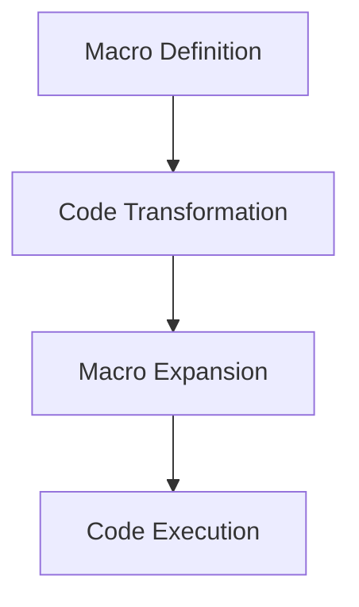

## 25.11 Advanced Topics in Metaprogramming and Macros

Metaprogramming in Julia is a powerful feature that allows developers to write code that generates other code. This capability can lead to more concise, flexible, and efficient programs. In this section, we will delve into advanced topics in metaprogramming and macros, providing you with a deeper understanding of how these tools work and how to leverage them effectively in your Julia projects.

### Macro Internals

Macros in Julia are a form of metaprogramming that allows you to transform code before it is evaluated. They are powerful tools for code generation and manipulation. Let's explore how macros work under the hood.

#### Understanding Macro Expansion

Macros operate on expressions, which are Julia's representation of code. When you define a macro, you are essentially defining a transformation from one expression to another. This transformation occurs at parse time, before the code is compiled or executed.

```julia
macro sayhello(name)
    return :(println("Hello, ", $name))
end

@sayhello "Julia"
```

In the example above, the macro `sayhello` takes an argument `name` and returns an expression that prints a greeting. The `@sayhello "Julia"` line is expanded into `println("Hello, ", "Julia")` before execution.

#### Macro Hygiene

One of the challenges with macros is ensuring that they do not unintentionally capture variables from the surrounding scope. Julia addresses this with a concept called "hygiene." By default, macros are hygienic, meaning they avoid variable capture unless explicitly instructed otherwise.

```julia
macro increment(x)
    return quote
        local temp = $x
        temp += 1
    end
end

x = 10
@increment x
println(x)  # Outputs: 10
```

In this example, the `increment` macro uses a local variable `temp` to avoid capturing the variable `x` from the surrounding scope.

#### Non-Hygienic Macros

Sometimes, you may want a macro to intentionally capture variables from the surrounding scope. You can achieve this by using the `esc` function, which escapes the hygiene mechanism.

```julia
macro nonhygienic_increment(x)
    return :( $x += 1 )
end

x = 10
@nonhygienic_increment x
println(x)  # Outputs: 11
```

Here, the `nonhygienic_increment` macro directly modifies the variable `x` in the surrounding scope.

### Generated Functions

Generated functions in Julia provide a way to generate specialized code based on the types of the arguments. They are particularly useful for performance optimization and code specialization.

#### Defining Generated Functions

A generated function is defined using the `@generated` macro. The body of the function returns an expression that is compiled and executed.

```julia
@generated function mysum(T::Type, a::T, b::T)
    if T <: Integer
        return :(a + b)
    else
        return :(a + b + 0.0)
    end
end

println(mysum(Int, 1, 2))  # Outputs: 3
println(mysum(Float64, 1.0, 2.0))  # Outputs: 3.0
```

In this example, the `mysum` function generates different code depending on whether the arguments are integers or floating-point numbers.

#### Limitations and Considerations

While generated functions are powerful, they come with limitations. They should be used judiciously, as they can complicate code and introduce maintenance challenges. Additionally, the generated code must be type-stable and should not depend on runtime values.

### Reflection and Introspection

Reflection and introspection are techniques that allow you to examine and modify the structure of your code at runtime. Julia provides several tools for dynamic code analysis.

#### Using Reflection

Reflection in Julia can be used to inspect types, methods, and other code elements. The `typeof` function, for example, returns the type of a given value.

```julia
x = 42
println(typeof(x))  # Outputs: Int64
```

You can also use the `methods` function to list all methods associated with a function.

```julia
println(methods(println))
```

#### Introspection with `@code_*` Macros

Julia provides several `@code_*` macros for introspection, which allow you to examine the generated code at various stages of compilation.

- `@code_lowered`: Shows the lowered form of a function.
- `@code_typed`: Displays the typed version of the lowered code.
- `@code_llvm`: Shows the LLVM intermediate representation.
- `@code_native`: Displays the native assembly code.

```julia
function add(a, b)
    return a + b
end

@code_lowered add(1, 2)
@code_typed add(1, 2)
@code_llvm add(1, 2)
@code_native add(1, 2)
```

These tools are invaluable for understanding how Julia compiles and optimizes your code.

### Try It Yourself

To deepen your understanding of metaprogramming and macros in Julia, try modifying the examples provided. Experiment with creating your own macros and generated functions. Consider how you might use reflection and introspection to analyze and optimize your code.

### Visualizing Macro Expansion

To better understand how macros transform code, let's visualize the process using a flowchart.



**Figure 1**: This flowchart illustrates the process of macro expansion, from definition to execution.

### Key Takeaways

- **Macros**: Powerful tools for code transformation, with hygiene mechanisms to prevent unintended variable capture.
- **Generated Functions**: Enable code specialization based on argument types, useful for performance optimization.
- **Reflection and Introspection**: Techniques for dynamic code analysis, providing insights into code structure and behavior.

### References and Further Reading

- [Julia Documentation on Metaprogramming](https://docs.julialang.org/en/v1/manual/metaprogramming/)
- [Metaprogramming in Julia: A Comprehensive Guide](https://julialang.org/blog/2018/08/metaprogramming/)
- [Advanced Julia Programming Techniques](https://www.juliabloggers.com/)

## Quiz Time!



### What is the primary purpose of macros in Julia?

- [x] To transform code before it is evaluated
- [ ] To execute code at runtime
- [ ] To optimize memory usage
- [ ] To handle exceptions

> **Explanation:** Macros in Julia are used to transform code before it is evaluated, allowing for code generation and manipulation.

### How does Julia ensure macro hygiene?

- [x] By avoiding variable capture unless explicitly instructed
- [ ] By using global variables
- [ ] By executing macros at runtime
- [ ] By optimizing memory usage

> **Explanation:** Julia macros are hygienic by default, meaning they avoid capturing variables from the surrounding scope unless explicitly instructed using `esc`.

### What is a generated function in Julia?

- [x] A function that generates specialized code based on argument types
- [ ] A function that executes at compile time
- [ ] A function that handles exceptions
- [ ] A function that optimizes memory usage

> **Explanation:** Generated functions in Julia generate specialized code based on the types of the arguments, allowing for performance optimization.

### Which of the following is a limitation of generated functions?

- [x] They must be type-stable and should not depend on runtime values
- [ ] They cannot be used with macros
- [ ] They are executed at runtime
- [ ] They optimize memory usage

> **Explanation:** Generated functions must be type-stable and should not depend on runtime values, as they are intended for compile-time specialization.

### What is the purpose of the `@code_llvm` macro?

- [x] To display the LLVM intermediate representation of a function
- [ ] To execute code at runtime
- [ ] To handle exceptions
- [ ] To optimize memory usage

> **Explanation:** The `@code_llvm` macro displays the LLVM intermediate representation of a function, providing insights into the compilation process.

### How can you intentionally capture variables from the surrounding scope in a macro?

- [x] By using the `esc` function
- [ ] By using global variables
- [ ] By executing the macro at runtime
- [ ] By optimizing memory usage

> **Explanation:** The `esc` function is used to intentionally capture variables from the surrounding scope in a macro, bypassing the hygiene mechanism.

### What is the role of reflection in Julia?

- [x] To inspect types, methods, and other code elements at runtime
- [ ] To execute code at compile time
- [ ] To handle exceptions
- [ ] To optimize memory usage

> **Explanation:** Reflection in Julia allows for the inspection of types, methods, and other code elements at runtime, enabling dynamic code analysis.

### Which `@code_*` macro shows the native assembly code of a function?

- [x] `@code_native`
- [ ] `@code_lowered`
- [ ] `@code_typed`
- [ ] `@code_llvm`

> **Explanation:** The `@code_native` macro displays the native assembly code of a function, providing insights into the final compiled code.

### What is the benefit of using generated functions?

- [x] They allow for performance optimization through code specialization
- [ ] They execute code at runtime
- [ ] They handle exceptions
- [ ] They optimize memory usage

> **Explanation:** Generated functions allow for performance optimization by generating specialized code based on argument types, improving execution efficiency.

### True or False: Macros in Julia are executed at runtime.

- [ ] True
- [x] False

> **Explanation:** Macros in Julia are not executed at runtime; they transform code before it is evaluated, during the parsing stage.



Remember, mastering metaprogramming and macros in Julia is a journey. Keep experimenting, stay curious, and enjoy the process of discovering new ways to optimize and enhance your code!
