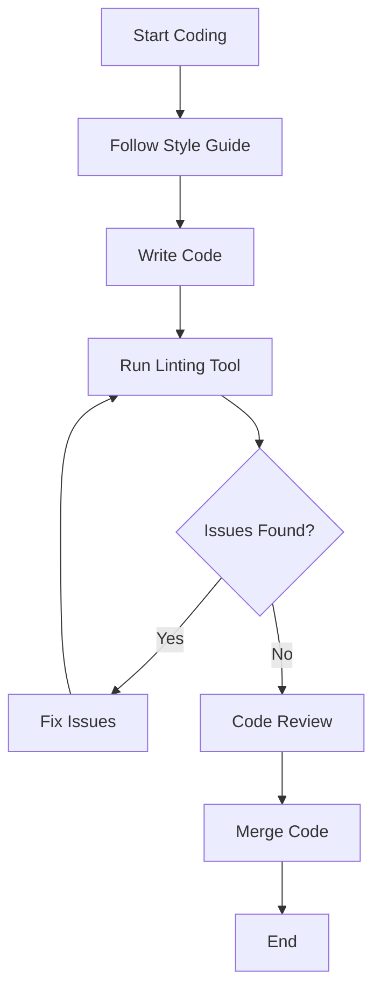

## 25.12 Style Guides and Linting Tools for Julia

Writing clean, efficient, and maintainable code is a cornerstone of professional software development. In the Julia programming language, adhering to style guides and utilizing linting tools can significantly enhance code quality and readability. This section delves into the official Julia style guide, explores various linting tools available for Julia, and provides best practices for maintaining high standards in your Julia codebase.

### Understanding the Importance of Style Guides

**Explain the Role of Style Guides**: Style guides serve as a set of conventions and best practices that help developers write code that is consistent, readable, and maintainable. They are essential for collaborative projects, where multiple developers contribute to the same codebase.

**Benefits of Adhering to Style Guides**:
- **Consistency**: Ensures that code looks uniform, making it easier to read and understand.
- **Readability**: Enhances the ability to quickly grasp the logic and flow of the code.
- **Maintainability**: Facilitates easier updates and modifications to the codebase.
- **Collaboration**: Simplifies teamwork by providing a common framework for code writing.

### The Official Julia Style Guide

The official Julia style guide provides comprehensive guidelines for writing clean and idiomatic Julia code. It covers various aspects of coding style, including naming conventions, code layout, and documentation practices.

#### Key Components of the Julia Style Guide

1. **Naming Conventions**:
   - **Variables and Functions**: Use lowercase letters and underscores for variable and function names (e.g., `my_variable`, `calculate_sum`).
   - **Types and Modules**: Use CamelCase for types and module names (e.g., `MyType`, `MyModule`).

2. **Code Layout**:
   - **Indentation**: Use four spaces per indentation level. Avoid using tabs.
   - **Line Length**: Limit lines to 92 characters to enhance readability.
   - **Whitespace**: Use whitespace to improve code clarity, such as around operators and after commas.

3. **Documentation**:
   - **Docstrings**: Provide docstrings for all public functions and types. Use triple quotes for multiline docstrings.
   - **Comments**: Use comments to explain complex logic or important decisions in the code.

4. **Best Practices**:
   - **Avoid Global Variables**: Minimize the use of global variables to prevent unintended side effects.
   - **Use Multiple Dispatch**: Leverage Julia's multiple dispatch feature for flexible and efficient function definitions.

#### Example of Following the Julia Style Guide

```julia
"""
    calculate_area(radius::Float64) -> Float64

Calculate the area of a circle given its radius.
"""
function calculate_area(radius::Float64) :: Float64
    return π * radius^2
end

radius = 5.0
area = calculate_area(radius)
println("The area of the circle is: $area")
```

### Linting Tools for Julia

Linting tools are essential for static code analysis, helping developers identify potential errors, enforce coding standards, and improve code quality. In Julia, several linting tools are available to assist in maintaining a clean codebase.

#### Popular Linting Tools for Julia

1. **Lint.jl**:
   - **Overview**: Lint.jl is a popular static analysis tool for Julia that checks code for potential errors and style violations.
   - **Features**: Provides warnings for unused variables, type mismatches, and other common issues.
   - **Usage**: Integrate Lint.jl into your development workflow to automatically check code quality.

2. **Juno IDE**:
   - **Overview**: Juno is an integrated development environment for Julia that includes built-in linting capabilities.
   - **Features**: Offers real-time feedback on code quality, highlighting issues as you type.
   - **Usage**: Use Juno for an interactive coding experience with integrated linting support.

3. **VS Code with Julia Extension**:
   - **Overview**: Visual Studio Code, with the Julia extension, provides linting and code analysis features.
   - **Features**: Offers syntax highlighting, error detection, and code formatting tools.
   - **Usage**: Leverage VS Code for a versatile development environment with robust linting support.

#### Example of Using Lint.jl

```julia
using Pkg
Pkg.add("Lint")

using Lint
Lint.lintfile("path/to/your_script.jl")
```

### Best Practices for Using Style Guides and Linting Tools

**Integrate Linting into Your Workflow**: Regularly run linting tools as part of your development process to catch issues early.

**Customize Linting Rules**: Tailor linting rules to match your project's specific style guide and coding standards.

**Encourage Team Adoption**: Promote the use of style guides and linting tools across your team to ensure consistent code quality.

**Review and Update Style Guides**: Periodically review and update your style guide to incorporate new best practices and language features.

### Visualizing the Workflow of Style Guides and Linting Tools



**Diagram Description**: This flowchart illustrates the workflow of using style guides and linting tools in Julia development. It begins with following the style guide, writing code, running a linting tool, and addressing any issues before proceeding to code review and merging.

### Try It Yourself

Encourage experimentation by suggesting modifications to the code examples provided. For instance, try changing the function `calculate_area` to calculate the circumference of a circle instead. Use the style guide to ensure your code remains clean and readable.

### References and Further Reading

- [JuliaLang Official Style Guide](https://docs.julialang.org/en/v1/manual/style-guide/)
- [Lint.jl GitHub Repository](https://github.com/tonyhffong/Lint.jl)
- [Juno IDE for Julia](https://junolab.org/)
- [Visual Studio Code Julia Extension](https://marketplace.visualstudio.com/items?itemName=julialang.language-julia)

### Knowledge Check

**Pose Questions**: What are the key components of the Julia style guide? How can linting tools improve code quality? What are some best practices for integrating style guides and linting tools into your workflow?

**Exercises**: Write a Julia function following the style guide to calculate the volume of a sphere. Use a linting tool to check your code for any issues.

### Embrace the Journey

Remember, mastering style guides and linting tools is just the beginning. As you progress, you'll develop cleaner, more efficient, and maintainable Julia code. Keep experimenting, stay curious, and enjoy the journey!

## Quiz Time!



### What is the primary purpose of a style guide in programming?

- [x] To ensure code consistency and readability
- [ ] To increase code execution speed
- [ ] To reduce the number of lines of code
- [ ] To automate code writing

> **Explanation:** Style guides provide conventions and best practices to ensure code is consistent and readable, which is crucial for collaboration and maintenance.

### Which naming convention is recommended for variables in Julia?

- [x] Lowercase with underscores
- [ ] CamelCase
- [ ] Uppercase with underscores
- [ ] PascalCase

> **Explanation:** The Julia style guide recommends using lowercase letters with underscores for variable names to enhance readability.

### What is the recommended line length for Julia code according to the official style guide?

- [ ] 80 characters
- [x] 92 characters
- [ ] 100 characters
- [ ] 120 characters

> **Explanation:** The official Julia style guide suggests limiting lines to 92 characters to maintain readability.

### Which tool is commonly used for static code analysis in Julia?

- [x] Lint.jl
- [ ] PyLint
- [ ] ESLint
- [ ] JSLint

> **Explanation:** Lint.jl is a popular static analysis tool for Julia that helps identify potential errors and style violations.

### What is a key benefit of using linting tools?

- [x] Identifying potential errors early
- [ ] Increasing code execution speed
- [ ] Reducing code size
- [ ] Automating code writing

> **Explanation:** Linting tools help identify potential errors and enforce coding standards, improving code quality and reducing bugs.

### Which IDE provides built-in linting capabilities for Julia?

- [x] Juno
- [ ] Eclipse
- [ ] NetBeans
- [ ] IntelliJ IDEA

> **Explanation:** Juno is an integrated development environment for Julia that includes built-in linting capabilities.

### How can you integrate Lint.jl into your workflow?

- [x] By running it regularly to check code quality
- [ ] By using it to write code automatically
- [ ] By using it to increase code execution speed
- [ ] By using it to reduce code size

> **Explanation:** Regularly running Lint.jl as part of your development process helps catch issues early and maintain code quality.

### What is the recommended indentation level in Julia code?

- [x] Four spaces
- [ ] Two spaces
- [ ] One tab
- [ ] Eight spaces

> **Explanation:** The Julia style guide recommends using four spaces per indentation level to ensure code clarity.

### Which of the following is a best practice for using style guides?

- [x] Encouraging team adoption
- [ ] Using them only for personal projects
- [ ] Ignoring them for small projects
- [ ] Using them to increase code execution speed

> **Explanation:** Encouraging team adoption of style guides ensures consistent code quality across collaborative projects.

### True or False: Linting tools can automate code writing.

- [ ] True
- [x] False

> **Explanation:** Linting tools are used for static code analysis to identify potential errors and enforce coding standards, not for automating code writing.


