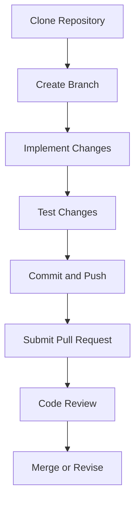

## 25.13 Contributing to Julia and Open Source Projects

Contributing to open source projects, particularly a dynamic and evolving language like Julia, can be an enriching experience. It not only enhances your skills but also allows you to collaborate with a global community of developers. In this guide, we will explore the steps to contribute to Julia itself, understand community norms, and learn best practices for effective contributions.

### Introduction to Open Source Contribution

Open source software is built collaboratively by developers from around the world. Contributing to open source projects can be a rewarding way to learn, teach, and build experience. Julia, a high-performance programming language, offers numerous opportunities for contribution, from core language development to package creation and documentation.

#### Why Contribute to Julia?

- **Skill Enhancement**: Working on real-world projects improves coding skills and problem-solving abilities.
- **Community Engagement**: Collaborate with like-minded individuals and learn from experienced developers.
- **Career Growth**: Contributions to well-known projects can enhance your resume and open up career opportunities.
- **Personal Satisfaction**: Contributing to projects that impact many users can be fulfilling.

### Julia's Contribution Guidelines

Contributing to Julia involves several steps, from setting up your development environment to submitting a pull request. Let's walk through the process.

#### Setting Up Your Development Environment

1. **Install Julia**: Ensure you have the latest version of Julia installed on your system. You can download it from the [official Julia website](https://julialang.org/downloads/).

2. **Clone the Julia Repository**: Use Git to clone the Julia repository from GitHub.

   ```bash
   git clone https://github.com/JuliaLang/julia.git
   cd julia
   ```

3. **Build Julia**: Follow the instructions in the `README.md` file to build Julia from source. This step is crucial for testing your changes locally.

   ```bash
   make
   ```

4. **Set Up Your Editor**: Configure your preferred code editor for Julia development. Popular choices include VSCode and Atom with Julia extensions.

#### Understanding the Codebase

Before making contributions, familiarize yourself with the Julia codebase. Explore the directory structure, read through the documentation, and understand the coding standards.

- **Documentation**: Julia's documentation is comprehensive and a great starting point. It includes guidelines on code style, testing, and more.
- **Code Structure**: Understand the different modules and how they interact. This knowledge is essential for making meaningful contributions.

#### Identifying Contribution Opportunities

There are various ways to contribute to Julia:

- **Bug Fixes**: Start with fixing bugs. Look for issues labeled "good first issue" on the [Julia GitHub repository](https://github.com/JuliaLang/julia/issues).
- **Feature Enhancements**: Propose and implement new features. Ensure they align with the project's goals.
- **Documentation**: Improve existing documentation or write new tutorials and guides.
- **Testing**: Write tests to improve code coverage and ensure robustness.

#### Making Your Contribution

1. **Fork the Repository**: Create a personal copy of the Julia repository on GitHub.

   ```bash
   git fork https://github.com/JuliaLang/julia.git
   ```

2. **Create a Branch**: Work on a separate branch for your changes.

   ```bash
   git checkout -b my-feature-branch
   ```

3. **Implement Changes**: Make your changes in the codebase. Ensure your code adheres to the project's coding standards.

4. **Test Your Changes**: Run tests to ensure your changes don't break existing functionality.

   ```bash
   make test
   ```

5. **Commit and Push**: Commit your changes with a descriptive message and push them to your forked repository.

   ```bash
   git add .
   git commit -m "Add feature X"
   git push origin my-feature-branch
   ```

6. **Submit a Pull Request**: Navigate to the original Julia repository and submit a pull request. Provide a clear description of your changes and their purpose.

#### Code Review and Feedback

Once your pull request is submitted, it will undergo a code review by the maintainers. Be open to feedback and ready to make necessary adjustments. This process ensures code quality and alignment with project goals.

### Community Norms

Contributing to open source projects involves more than just writing code. Understanding and adhering to community norms is crucial for successful collaboration.

#### Expected Behaviors

- **Respect and Inclusivity**: Treat all community members with respect. Be inclusive and considerate in your interactions.
- **Constructive Feedback**: Provide and accept feedback graciously. Focus on the code, not the person.
- **Collaboration**: Work collaboratively and be willing to help others. Share knowledge and resources.

#### Communication Channels

Julia's community is active on various platforms:

- **Discourse**: Join discussions on the [Julia Discourse forum](https://discourse.julialang.org/).
- **Slack**: Participate in real-time conversations on the Julia Slack channel.
- **GitHub**: Engage with issues, pull requests, and discussions on GitHub.

### Best Practices for Open Source Contribution

To make meaningful contributions, follow these best practices:

#### Understand the Project

- **Read the Documentation**: Familiarize yourself with the project's documentation and guidelines.
- **Explore the Codebase**: Understand the architecture and design patterns used in the project.

#### Start Small

- **Begin with Small Tasks**: Start with small issues or documentation improvements to get familiar with the contribution process.
- **Gradually Take on Bigger Tasks**: As you gain confidence, tackle more complex issues and features.

#### Write Clean Code

- **Follow Coding Standards**: Adhere to the project's coding standards and style guides.
- **Write Tests**: Ensure your code is well-tested and doesn't introduce new bugs.

#### Be Responsive

- **Engage with Feedback**: Respond to feedback promptly and make necessary changes.
- **Communicate Clearly**: Clearly communicate your intentions and progress to the community.

### Visualizing the Contribution Process

To better understand the contribution process, let's visualize it using a flowchart.



**Figure 1**: Flowchart of the Julia Contribution Process

### Try It Yourself

To get started with contributing to Julia, try the following exercise:

1. **Clone the Julia Repository**: Follow the steps outlined above to clone and set up the Julia repository.
2. **Identify a Simple Issue**: Look for a "good first issue" on the Julia GitHub repository.
3. **Implement a Fix**: Make the necessary changes and submit a pull request.
4. **Engage with the Community**: Participate in discussions and seek feedback on your contribution.

### Knowledge Check

Before we conclude, let's reinforce what we've learned with a few questions:

- What are the steps to set up your development environment for contributing to Julia?
- How can you identify contribution opportunities in the Julia project?
- What are the key community norms to follow when contributing to open source projects?

### Conclusion

Contributing to Julia and open source projects is a rewarding journey that enhances your skills and connects you with a global community. By following the guidelines and best practices outlined in this guide, you can make meaningful contributions and grow as a developer. Remember, this is just the beginning. Keep experimenting, stay curious, and enjoy the journey!

## Quiz Time!



### What is the first step in contributing to Julia?

- [x] Clone the Julia repository
- [ ] Submit a pull request
- [ ] Write tests
- [ ] Create a branch

> **Explanation:** Cloning the Julia repository is the first step to set up your development environment.

### Which platform is used for real-time conversations in the Julia community?

- [ ] Discourse
- [x] Slack
- [ ] GitHub
- [ ] Twitter

> **Explanation:** Slack is used for real-time conversations in the Julia community.

### What should you do after implementing changes in your local branch?

- [ ] Submit a pull request
- [ ] Merge changes
- [x] Test changes
- [ ] Delete the branch

> **Explanation:** Testing changes ensures that your modifications do not break existing functionality.

### What is a "good first issue"?

- [ ] A complex feature request
- [x] A simple issue suitable for beginners
- [ ] A documentation error
- [ ] A critical bug

> **Explanation:** "Good first issues" are simple tasks suitable for beginners to get started with contributions.

### What is the purpose of a pull request?

- [x] To propose changes to the codebase
- [ ] To delete a branch
- [ ] To create a new repository
- [ ] To fork a repository

> **Explanation:** A pull request is used to propose changes to the codebase and initiate a code review.

### Which of the following is a community norm in open source projects?

- [x] Respect and inclusivity
- [ ] Ignoring feedback
- [ ] Working in isolation
- [ ] Avoiding documentation

> **Explanation:** Respect and inclusivity are key community norms in open source projects.

### What should you do if you receive feedback on your pull request?

- [ ] Ignore it
- [ ] Delete the pull request
- [x] Engage with the feedback and make changes
- [ ] Start a new pull request

> **Explanation:** Engaging with feedback and making necessary changes is crucial for successful collaboration.

### What is the role of tests in open source contributions?

- [ ] To slow down the development process
- [x] To ensure code quality and prevent bugs
- [ ] To make the codebase larger
- [ ] To replace documentation

> **Explanation:** Tests ensure code quality and help prevent bugs in the codebase.

### What is the benefit of starting with small tasks in open source contributions?

- [ ] It takes more time
- [x] It helps you get familiar with the contribution process
- [ ] It is less rewarding
- [ ] It is not recommended

> **Explanation:** Starting with small tasks helps you get familiar with the contribution process and build confidence.

### True or False: Contributing to open source projects can enhance your resume.

- [x] True
- [ ] False

> **Explanation:** Contributing to open source projects can enhance your resume by showcasing your skills and experience.


