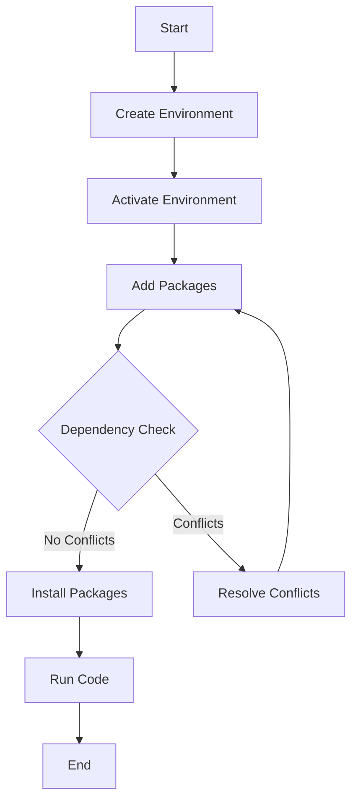

## 25.14 Troubleshooting and Common Issues

In the world of software development, encountering issues is inevitable. As developers, our ability to troubleshoot effectively is crucial for maintaining productivity and ensuring the smooth operation of our applications. In this section, we will explore common issues faced by Julia developers and provide practical solutions to overcome them. Whether you're dealing with installation problems, package management headaches, or performance anomalies, this guide will equip you with the knowledge to tackle these challenges head-on.

### Installation Problems

Installing Julia and setting up your development environment is the first step in your journey. However, this process can sometimes be fraught with issues. Let's explore some common installation problems and their solutions.

#### 1. Julia Installation Errors

**Problem:** You encounter errors during the installation of Julia.

**Solution:** Ensure that you are downloading the correct version of Julia for your operating system from the [official Julia website](https://julialang.org/downloads/). Verify the integrity of the downloaded file using checksums provided on the website. If you encounter permission issues, try running the installer as an administrator (Windows) or using `sudo` (Linux/Mac).

#### 2. Path Configuration Issues

**Problem:** Julia is installed, but the command `julia` is not recognized in the terminal.

**Solution:** Add Julia to your system's PATH variable. This allows you to run Julia from any terminal window. For Windows, you can add the Julia `bin` directory to the PATH through the System Properties. On Linux and Mac, you can add the following line to your `.bashrc` or `.zshrc` file:

```bash
export PATH="$PATH:/path/to/julia/bin"
```

Replace `/path/to/julia/bin` with the actual path to your Julia installation.

#### 3. Version Compatibility

**Problem:** Your code requires a specific version of Julia, but you have a different version installed.

**Solution:** Use a version manager like `juliaup` to manage multiple Julia versions on your system. This tool allows you to switch between different versions seamlessly. Install `juliaup` from the [JuliaUp GitHub repository](https://github.com/JuliaLang/juliaup) and follow the instructions to set up and switch versions.

### Package Management

Julia's package management system, Pkg.jl, is powerful but can sometimes lead to dependency conflicts and environment issues. Let's delve into common package management problems and their solutions.

#### 1. Dependency Conflicts

**Problem:** You encounter dependency conflicts when installing or updating packages.

**Solution:** Use Julia's package manager to create isolated environments for your projects. This prevents conflicts between package versions. Here's how you can create a new environment:

```julia
using Pkg

Pkg.activate("my_project")
Pkg.add("PackageName")
```

This command creates a new environment in the `my_project` directory and installs the specified package within that environment. Use `Pkg.status()` to check the status of your environment and resolve conflicts by adjusting package versions.

#### 2. Environment Issues

**Problem:** Your code works in one environment but not in another.

**Solution:** Ensure that you are working in the correct environment by activating it before running your code. Use `Pkg.activate("path/to/environment")` to switch to the desired environment. Additionally, use `Pkg.instantiate()` to install all dependencies listed in the `Project.toml` and `Manifest.toml` files, ensuring consistency across environments.

#### 3. Package Precompilation Errors

**Problem:** You encounter errors related to package precompilation.

**Solution:** Clear the precompiled cache and recompile the packages. Use the following command to clear the cache:

```julia
using Pkg

Pkg.precompile()
```

If the issue persists, try removing and reinstalling the problematic package:

```julia
Pkg.rm("PackageName")
Pkg.add("PackageName")
```

### Performance Anomalies

Performance is a critical aspect of software development. Identifying and resolving performance anomalies can significantly enhance the efficiency of your Julia applications.

#### 1. Slow Code Execution

**Problem:** Your code runs slower than expected.

**Solution:** Profile your code to identify bottlenecks using Julia's built-in `Profile` module. Here's a simple example:

```julia
using Profile

@profile begin
    # Your code here
end

Profile.print()
```

Analyze the output to identify functions or lines of code that consume the most time. Consider optimizing these areas by using more efficient algorithms or data structures.

#### 2. Memory Leaks

**Problem:** Your application consumes more memory over time, leading to crashes or slowdowns.

**Solution:** Use Julia's `@time` macro to monitor memory allocations and identify potential leaks. Here's an example:

```julia
@time begin
    # Your code here
end
```

If you notice excessive memory allocations, review your code for unnecessary data copying or retention of large data structures. Consider using `@views` to avoid unnecessary array copying.

#### 3. Type Instability

**Problem:** Your code suffers from type instability, leading to performance degradation.

**Solution:** Ensure that your functions are type-stable by using Julia's `@code_warntype` macro. This macro helps identify type instability issues. Here's how to use it:

```julia
function example(x)
    return x + 1
end

@code_warntype example(5)
```

Review the output for any `Any` types, which indicate type instability. Refactor your code to ensure consistent types throughout your functions.

### Try It Yourself

To reinforce your understanding, try modifying the following code examples to experiment with different scenarios:

1. **Installation:** Install a specific version of Julia and switch between versions using `juliaup`.

2. **Package Management:** Create a new environment and install multiple packages. Resolve any dependency conflicts that arise.

3. **Performance:** Profile a piece of code and optimize it for better performance. Experiment with different data structures to reduce memory usage.

### Visualizing Julia's Package Management Workflow

To better understand Julia's package management workflow, let's visualize the process using a flowchart.



**Figure 1:** This flowchart illustrates the typical workflow for managing packages in Julia, from creating and activating environments to resolving dependency conflicts and running code.

### References and Links

- [JuliaLang Downloads](https://julialang.org/downloads/)
- [JuliaUp GitHub Repository](https://github.com/JuliaLang/juliaup)
- [Pkg.jl Documentation](https://pkgdocs.julialang.org/)
- [Profiling in Julia](https://docs.julialang.org/en/v1/manual/profile/)

### Knowledge Check

- What steps would you take to resolve a package dependency conflict in Julia?
- How can you identify and fix type instability in your Julia code?
- What tools can you use to profile and optimize the performance of your Julia applications?

### Embrace the Journey

Remember, troubleshooting is an essential skill in software development. As you encounter and resolve issues, you'll gain valuable experience that will enhance your problem-solving abilities. Keep experimenting, stay curious, and enjoy the journey of mastering Julia programming!

## Quiz Time!



### What is the first step in resolving Julia installation errors?

- [x] Verify the integrity of the downloaded file using checksums.
- [ ] Reinstall the operating system.
- [ ] Contact Julia support immediately.
- [ ] Disable all security software.

> **Explanation:** Verifying the integrity of the downloaded file ensures that the installation file is not corrupted.

### How can you add Julia to your system's PATH variable on Linux?

- [x] Add `export PATH="$PATH:/path/to/julia/bin"` to `.bashrc` or `.zshrc`.
- [ ] Use the `addpath` command in the terminal.
- [ ] Install a PATH manager.
- [ ] Restart the computer.

> **Explanation:** Adding the export command to `.bashrc` or `.zshrc` ensures that Julia is accessible from any terminal window.

### What tool can you use to manage multiple Julia versions?

- [x] juliaup
- [ ] juliaman
- [ ] versioncontrol
- [ ] juliaswitch

> **Explanation:** `juliaup` is a version manager for Julia, allowing you to switch between different versions seamlessly.

### How can you resolve package dependency conflicts in Julia?

- [x] Create isolated environments for your projects.
- [ ] Delete all conflicting packages.
- [ ] Use a different programming language.
- [ ] Ignore the conflicts.

> **Explanation:** Creating isolated environments prevents conflicts between package versions.

### What command is used to clear the precompiled cache in Julia?

- [x] Pkg.precompile()
- [ ] Pkg.clearcache()
- [ ] Pkg.reset()
- [ ] Pkg.clean()

> **Explanation:** `Pkg.precompile()` clears the precompiled cache and recompiles the packages.

### How can you profile your code in Julia?

- [x] Use the `Profile` module and `@profile` macro.
- [ ] Use the `Debug` module.
- [ ] Use the `Trace` module.
- [ ] Use the `Log` module.

> **Explanation:** The `Profile` module and `@profile` macro help identify bottlenecks in your code.

### What macro helps identify type instability in Julia?

- [x] @code_warntype
- [ ] @code_typecheck
- [ ] @type_stability
- [ ] @type_check

> **Explanation:** `@code_warntype` helps identify type instability issues in your code.

### What is a common cause of memory leaks in Julia?

- [x] Unnecessary data copying or retention of large data structures.
- [ ] Using too many functions.
- [ ] Writing too many comments.
- [ ] Using the REPL.

> **Explanation:** Unnecessary data copying or retention of large data structures can lead to memory leaks.

### What is the purpose of the `@time` macro in Julia?

- [x] Monitor memory allocations and execution time.
- [ ] Measure code complexity.
- [ ] Track code changes.
- [ ] Log errors.

> **Explanation:** The `@time` macro helps monitor memory allocations and execution time.

### True or False: Troubleshooting is an essential skill in software development.

- [x] True
- [ ] False

> **Explanation:** Troubleshooting is crucial for maintaining productivity and ensuring the smooth operation of applications.




