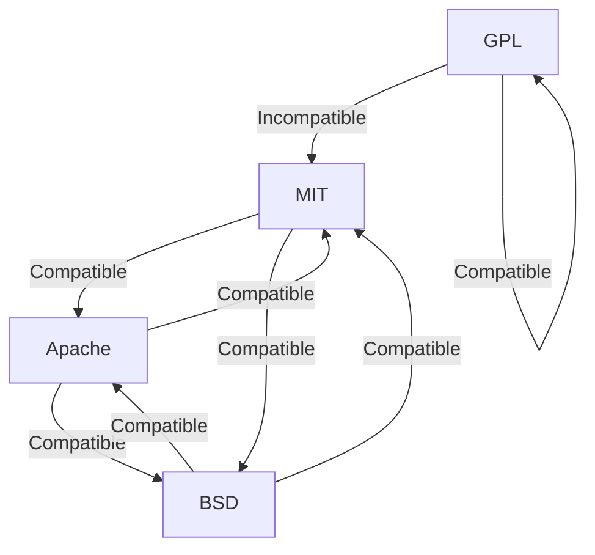

## 25.15 Licensing and Legal Considerations

In the world of software development, understanding licensing and legal considerations is crucial, especially when working with open-source projects like those in the Julia ecosystem. This section will guide you through the complexities of software licensing, helping you make informed decisions about using, contributing to, and distributing Julia-based software.

### Open Source Licenses

Open source licenses are legal frameworks that dictate how software can be used, modified, and shared. They play a vital role in the open-source community by ensuring that software remains free and accessible while protecting the rights of developers. Let's explore some common open-source licenses and their implications.

#### Overview of Common Licenses

1. **MIT License**: 
   - **Description**: A permissive license that is simple and easy to understand. It allows users to do almost anything with the code as long as they include the original license and copyright notice.
   - **Implications**: This license is highly flexible, making it popular among developers who want to maximize the use and adoption of their software.

2. **GNU General Public License (GPL)**:
   - **Description**: A copyleft license that requires any modified versions of the software to also be open source and distributed under the same license.
   - **Implications**: The GPL ensures that software remains free and open, but it can be restrictive for developers who want to integrate GPL-licensed code into proprietary software.

3. **Apache License 2.0**:
   - **Description**: A permissive license similar to the MIT License but with additional provisions related to patent rights.
   - **Implications**: It provides an explicit grant of patent rights from contributors to users, which can be beneficial in projects involving patented technology.

4. **BSD License**:
   - **Description**: Another permissive license that allows for redistribution and use with minimal restrictions.
   - **Implications**: Like the MIT License, the BSD License is favored for its simplicity and flexibility.

5. **Creative Commons Licenses**:
   - **Description**: While not typically used for software, Creative Commons licenses are often applied to documentation, images, and other non-software content.
   - **Implications**: These licenses provide a range of options for sharing and using creative works, from allowing any use with attribution to restricting commercial use.

#### Choosing a License

When licensing your own code, several factors should be considered to ensure that your intentions align with the legal framework you choose.

1. **Project Goals**:
   - **Consideration**: Determine whether you want your software to be freely available for any use, or if you want to impose certain restrictions.
   - **Example**: If your goal is widespread adoption, a permissive license like MIT or Apache might be suitable.

2. **Compatibility**:
   - **Consideration**: Ensure that your chosen license is compatible with the licenses of any third-party libraries or code you are using.
   - **Example**: If you are using GPL-licensed code, your project must also be released under the GPL.

3. **Community and Contribution**:
   - **Consideration**: Consider how your license choice will affect contributions from the community.
   - **Example**: A permissive license may encourage more contributions, while a copyleft license like GPL may deter some developers.

4. **Legal Protection**:
   - **Consideration**: Evaluate the level of legal protection you need for your code.
   - **Example**: Licenses like Apache 2.0 offer explicit patent grants, which can be important in certain industries.

5. **Future Plans**:
   - **Consideration**: Think about how your licensing decision will impact future development and potential commercialization.
   - **Example**: If you plan to offer a commercial version of your software, a dual-licensing strategy might be appropriate.

### Compliance

Ensuring compliance with open-source licenses is essential to avoid legal issues and maintain the integrity of your software projects. Here are some key aspects to consider:

#### Ensuring Adherence to License Terms

1. **Understanding License Obligations**:
   - **Action**: Thoroughly read and understand the obligations imposed by the licenses of any third-party code you use.
   - **Example**: If using GPL-licensed code, ensure that you provide access to the source code of your modifications.

2. **Attribution and Notices**:
   - **Action**: Include all required attribution and notices in your software distribution.
   - **Example**: For MIT-licensed code, include the original license text and copyright notice in your project.

3. **Distribution of Source Code**:
   - **Action**: If required by the license, make the source code available to users.
   - **Example**: GPL-licensed software must provide access to the source code when distributed.

4. **Patent Rights**:
   - **Action**: Be aware of any patent rights granted or required by the licenses you use.
   - **Example**: The Apache License 2.0 includes a patent grant, which can protect users from patent litigation.

5. **License Compatibility**:
   - **Action**: Ensure that all licenses used in your project are compatible with each other.
   - **Example**: Mixing incompatible licenses can lead to legal conflicts and restrict your ability to distribute your software.

6. **Regular Audits**:
   - **Action**: Conduct regular audits of your codebase to ensure compliance with all license terms.
   - **Example**: Use tools to scan for license information and verify that all third-party code is properly licensed.

### Code Examples

While licensing itself doesn't involve code, understanding how to apply licenses to your code is crucial. Here's a simple example of how to include a license in your Julia project:

```julia
# Copyright (c) 2024 Your Name

module MyProject


end
```

In this example, the license information is included at the top of the main file, and a separate `LICENSE` file contains the full text of the MIT License.

### Visualizing License Compatibility

Understanding license compatibility can be complex. Here's a diagram to help visualize how different licenses interact:



**Diagram Description**: This diagram illustrates the compatibility between common open-source licenses. For example, MIT and Apache licenses are compatible, meaning you can combine code under these licenses in a single project. However, GPL is incompatible with MIT, meaning you cannot combine GPL and MIT-licensed code without releasing the entire project under the GPL.

### References and Links

For further reading on open-source licenses and compliance, consider the following resources:

- [Open Source Initiative](https://opensource.org/licenses)
- [GNU General Public License](https://www.gnu.org/licenses/gpl-3.0.en.html)
- [Apache License 2.0](https://www.apache.org/licenses/LICENSE-2.0)
- [Creative Commons Licenses](https://creativecommons.org/licenses/)

### Knowledge Check

Let's reinforce what we've learned with some questions and exercises:

- **Question**: What is the main difference between permissive and copyleft licenses?
- **Exercise**: Choose a license for a hypothetical Julia project and justify your choice based on project goals and compatibility.

### Embrace the Journey

Remember, navigating the world of software licensing can be complex, but it's an essential skill for any developer. As you continue to develop and share your Julia projects, keep these considerations in mind to ensure that your work is legally sound and widely accessible. Stay curious, keep learning, and enjoy the journey of open-source development!

## Quiz Time!



### What is a key characteristic of the MIT License?

- [x] It is a permissive license that allows almost any use of the code.
- [ ] It requires modified versions to be open source.
- [ ] It includes a patent grant.
- [ ] It restricts commercial use.

> **Explanation:** The MIT License is known for its permissive nature, allowing users to do almost anything with the code as long as they include the original license and copyright notice.

### Which license requires that modified versions of the software also be open source?

- [ ] MIT License
- [x] GNU General Public License (GPL)
- [ ] Apache License 2.0
- [ ] BSD License

> **Explanation:** The GPL is a copyleft license that requires any modified versions of the software to also be open source and distributed under the same license.

### What is a benefit of the Apache License 2.0?

- [ ] It restricts commercial use.
- [x] It provides an explicit grant of patent rights.
- [ ] It is incompatible with the MIT License.
- [ ] It requires source code distribution.

> **Explanation:** The Apache License 2.0 includes an explicit grant of patent rights from contributors to users, which can be beneficial in projects involving patented technology.

### Why might a developer choose a permissive license like MIT or BSD?

- [x] To maximize the use and adoption of their software.
- [ ] To ensure all modifications remain open source.
- [ ] To restrict the software's use in commercial projects.
- [ ] To provide patent protection.

> **Explanation:** Permissive licenses like MIT and BSD are chosen to maximize the use and adoption of software due to their flexibility and minimal restrictions.

### What should you include in your software distribution to comply with the MIT License?

- [x] The original license text and copyright notice.
- [ ] A patent grant.
- [ ] A list of all contributors.
- [ ] A detailed changelog.

> **Explanation:** To comply with the MIT License, you must include the original license text and copyright notice in your software distribution.

### What is a potential downside of using GPL-licensed code in your project?

- [x] Your project must also be released under the GPL.
- [ ] You cannot use the code in commercial projects.
- [ ] You must provide a patent grant.
- [ ] You must include a detailed changelog.

> **Explanation:** A potential downside of using GPL-licensed code is that your project must also be released under the GPL, which can be restrictive for developers who want to integrate GPL-licensed code into proprietary software.

### What is an important consideration when choosing a license for your project?

- [x] Compatibility with third-party libraries.
- [ ] The number of contributors.
- [ ] The size of the codebase.
- [ ] The programming language used.

> **Explanation:** Ensuring compatibility with the licenses of any third-party libraries or code you are using is an important consideration when choosing a license for your project.

### What is a common requirement of copyleft licenses like the GPL?

- [x] Distribution of source code.
- [ ] Inclusion of a patent grant.
- [ ] Restriction of commercial use.
- [ ] Compatibility with all other licenses.

> **Explanation:** A common requirement of copyleft licenses like the GPL is the distribution of source code, ensuring that modified versions of the software remain open source.

### Which license is often used for documentation and non-software content?

- [ ] MIT License
- [ ] GNU General Public License (GPL)
- [ ] Apache License 2.0
- [x] Creative Commons Licenses

> **Explanation:** Creative Commons licenses are often applied to documentation, images, and other non-software content, providing a range of options for sharing and using creative works.

### True or False: The BSD License is more restrictive than the GPL.

- [ ] True
- [x] False

> **Explanation:** False. The BSD License is a permissive license with minimal restrictions, while the GPL is a copyleft license that imposes more restrictions to ensure software remains open source.


