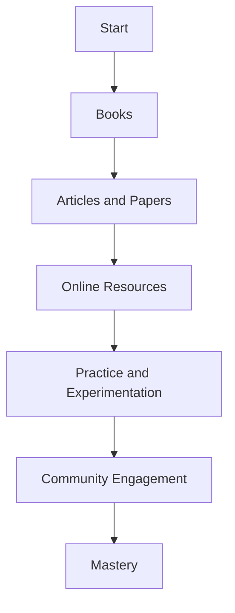

## 25.2 Bibliography and Recommended Reading

In the journey of mastering Julia programming and understanding design patterns, having a well-curated list of resources can be invaluable. This section provides a comprehensive bibliography and recommended reading list, including books, articles, and online resources that will deepen your understanding and enhance your skills in Julia programming, design patterns, and software engineering.

### Books

Books are an excellent way to gain in-depth knowledge and insights from experts in the field. Here are some essential books that cover Julia programming, design patterns, and software engineering principles:

1. **"Julia Programming for Operations Research: A Primer on Computing" by Changhyun Kwon**
   - This book offers a comprehensive introduction to Julia, focusing on its application in operations research. It covers the basics of Julia programming and explores advanced topics such as optimization and simulation.

2. **"Think Julia: How to Think Like a Computer Scientist" by Ben Lauwens and Allen B. Downey**
   - Aimed at beginners, this book introduces programming concepts using Julia. It emphasizes problem-solving and computational thinking, making it an excellent resource for those new to programming.

3. **"Design Patterns: Elements of Reusable Object-Oriented Software" by Erich Gamma, Richard Helm, Ralph Johnson, and John Vlissides**
   - Known as the "Gang of Four" book, this classic text introduces the concept of design patterns in software engineering. While not specific to Julia, the patterns discussed are applicable across programming languages.

4. **"Hands-On Design Patterns and Best Practices with Julia" by Tom Kwong**
   - This book focuses on implementing design patterns in Julia, providing practical examples and best practices. It covers creational, structural, and behavioral patterns, making it a valuable resource for Julia developers.

5. **"Programming in Julia: A Hands-On Introduction" by Ivo Balbaert**
   - This book offers a hands-on approach to learning Julia, covering the language's syntax, features, and libraries. It includes numerous examples and exercises to reinforce learning.

6. **"The Pragmatic Programmer: Your Journey to Mastery" by Andrew Hunt and David Thomas**
   - Although not specific to Julia, this book provides timeless advice on software development practices and principles. It covers topics such as code quality, debugging, and project management.

7. **"Clean Code: A Handbook of Agile Software Craftsmanship" by Robert C. Martin**
   - This book emphasizes writing clean, maintainable code. It covers best practices for software design and development, making it a must-read for any programmer.

8. **"Introduction to Algorithms" by Thomas H. Cormen, Charles E. Leiserson, Ronald L. Rivest, and Clifford Stein**
   - A comprehensive guide to algorithms, this book covers fundamental concepts and techniques. It is an essential resource for understanding algorithm design and analysis.

### Articles and Papers

Articles and academic papers provide insights into the latest research and developments in the field. Here are some influential publications relevant to Julia programming and design patterns:

1. **"Julia: A Fresh Approach to Numerical Computing" by Jeff Bezanson, Alan Edelman, Stefan Karpinski, and Viral B. Shah**
   - This paper introduces Julia as a high-performance programming language for numerical computing. It discusses the language's design goals and features, highlighting its advantages over other languages.

2. **"Multiple Dispatch in Julia" by Stefan Karpinski**
   - This article explores the concept of multiple dispatch, a core feature of Julia. It explains how multiple dispatch enables flexible and efficient code design, making it a powerful tool for developers.

3. **"Design Patterns in Dynamic Programming Languages" by Peter Norvig**
   - This paper examines the application of design patterns in dynamic programming languages. It discusses how patterns can be adapted to languages like Julia, which support dynamic typing and metaprogramming.

4. **"The Julia Language: A Fresh Approach to Technical Computing" by Viral B. Shah, Alan Edelman, Jeff Bezanson, and Stefan Karpinski**
   - This paper provides an overview of Julia's features and capabilities, emphasizing its suitability for technical computing. It highlights the language's performance, ease of use, and ecosystem.

5. **"Metaprogramming in Julia" by Tim Holy**
   - This article delves into the metaprogramming capabilities of Julia, exploring how macros and generated functions can be used to write more expressive and efficient code.

6. **"The Art of Multiprocessor Programming" by Maurice Herlihy and Nir Shavit**
   - Although not specific to Julia, this paper covers concepts and techniques for concurrent programming. It provides valuable insights into designing and implementing parallel algorithms.

### Online Resources

The internet offers a wealth of resources for learning and mastering Julia programming. Here are some websites, blogs, and tutorials that provide valuable information and guidance:

1. **[JuliaLang.org](https://julialang.org/)**
   - The official website for the Julia programming language, offering documentation, tutorials, and community resources. It is an essential starting point for anyone learning Julia.

2. **[JuliaAcademy](https://juliaacademy.com/)**
   - An online platform offering free courses on Julia programming. It covers topics ranging from beginner to advanced levels, providing interactive lessons and exercises.

3. **[JuliaCon](https://juliacon.org/)**
   - An annual conference dedicated to the Julia programming language. It features talks, workshops, and tutorials from experts in the field, offering valuable insights and networking opportunities.

4. **[Stack Overflow](https://stackoverflow.com/questions/tagged/julia)**
   - A popular Q&A platform where developers can ask questions and share knowledge about Julia programming. It is a great place to find solutions to common problems and learn from the community.

5. **[GitHub](https://github.com/JuliaLang)**
   - The official GitHub repository for Julia, hosting the language's source code and a wide range of packages. It is a valuable resource for exploring open-source projects and contributing to the community.

6. **[Julia Observer](https://juliaobserver.com/)**
   - A website that tracks and ranks Julia packages based on popularity and activity. It is a useful tool for discovering new packages and staying up-to-date with the latest developments.

7. **[Julia Discourse](https://discourse.julialang.org/)**
   - An online forum for discussing Julia-related topics. It is a great place to connect with other developers, ask questions, and share knowledge.

8. **[YouTube](https://www.youtube.com/results?search_query=julia+programming)**
   - A platform offering a wide range of video tutorials and lectures on Julia programming. It is a great resource for visual learners who prefer video content.

9. **[Medium](https://medium.com/tag/julia-programming)**
   - A blogging platform where developers share articles and tutorials on Julia programming. It offers a diverse range of content, from beginner guides to advanced topics.

10. **[Reddit](https://www.reddit.com/r/Julia/)**
    - A subreddit dedicated to the Julia programming language. It is a community-driven platform for sharing news, resources, and discussions related to Julia.

### Try It Yourself

To make the most of these resources, we encourage you to explore the recommended books, articles, and online platforms. Experiment with the code examples provided in the books, participate in discussions on forums, and contribute to open-source projects on GitHub. By actively engaging with these resources, you'll deepen your understanding of Julia programming and design patterns.

### Visualizing the Learning Path

To help you visualize your learning journey, here is a flowchart illustrating the recommended sequence of resources:

**Caption:** Visualizing the recommended learning path for mastering Julia programming and design patterns.

### Knowledge Check

To reinforce your understanding, consider the following questions:

- What are the key features of Julia that make it suitable for numerical computing?
- How does multiple dispatch enhance code flexibility and efficiency in Julia?
- What are some common design patterns, and how can they be applied in Julia?
- How can metaprogramming be used to write more expressive and efficient code in Julia?
- What are the benefits of engaging with the Julia community and contributing to open-source projects?

### Embrace the Journey

Remember, mastering Julia programming and design patterns is a journey. As you progress, you'll build more complex and efficient applications. Keep experimenting, stay curious, and enjoy the learning process. By leveraging the resources provided in this section, you'll be well-equipped to excel in Julia software development.

## Quiz Time!



### Which book is known as the "Gang of Four" book?

- [ ] "Think Julia: How to Think Like a Computer Scientist"
- [ ] "Julia Programming for Operations Research: A Primer on Computing"
- [x] "Design Patterns: Elements of Reusable Object-Oriented Software"
- [ ] "Programming in Julia: A Hands-On Introduction"

> **Explanation:** "Design Patterns: Elements of Reusable Object-Oriented Software" is commonly referred to as the "Gang of Four" book.

### What is a core feature of Julia that enables flexible and efficient code design?

- [ ] Object-oriented programming
- [x] Multiple dispatch
- [ ] Static typing
- [ ] Garbage collection

> **Explanation:** Multiple dispatch is a core feature of Julia that allows for flexible and efficient code design by enabling functions to be dispatched based on the types of all their arguments.

### Which online platform offers free courses on Julia programming?

- [ ] Stack Overflow
- [ ] GitHub
- [x] JuliaAcademy
- [ ] Medium

> **Explanation:** JuliaAcademy is an online platform that offers free courses on Julia programming, covering topics from beginner to advanced levels.

### What is the primary focus of the book "Think Julia"?

- [x] Introducing programming concepts using Julia
- [ ] Advanced optimization techniques
- [ ] Machine learning applications
- [ ] Concurrent programming

> **Explanation:** "Think Julia" focuses on introducing programming concepts using Julia, emphasizing problem-solving and computational thinking.

### Which paper introduces Julia as a high-performance programming language for numerical computing?

- [x] "Julia: A Fresh Approach to Numerical Computing"
- [ ] "Multiple Dispatch in Julia"
- [ ] "Metaprogramming in Julia"
- [ ] "The Art of Multiprocessor Programming"

> **Explanation:** "Julia: A Fresh Approach to Numerical Computing" introduces Julia as a high-performance programming language for numerical computing.

### What is the primary benefit of engaging with the Julia community?

- [ ] Access to proprietary software
- [ ] Guaranteed job placement
- [x] Sharing knowledge and learning from others
- [ ] Free hardware

> **Explanation:** Engaging with the Julia community allows developers to share knowledge, learn from others, and stay updated with the latest developments.

### Which book emphasizes writing clean, maintainable code?

- [ ] "The Pragmatic Programmer"
- [x] "Clean Code: A Handbook of Agile Software Craftsmanship"
- [ ] "Introduction to Algorithms"
- [ ] "Hands-On Design Patterns and Best Practices with Julia"

> **Explanation:** "Clean Code: A Handbook of Agile Software Craftsmanship" emphasizes writing clean, maintainable code and covers best practices for software design and development.

### What is the focus of the paper "Design Patterns in Dynamic Programming Languages"?

- [ ] Static typing
- [x] Application of design patterns in dynamic programming languages
- [ ] Numerical computing
- [ ] Concurrent programming

> **Explanation:** The paper "Design Patterns in Dynamic Programming Languages" examines the application of design patterns in dynamic programming languages like Julia.

### Which online resource tracks and ranks Julia packages based on popularity and activity?

- [ ] JuliaLang.org
- [ ] Julia Discourse
- [x] Julia Observer
- [ ] Reddit

> **Explanation:** Julia Observer is a website that tracks and ranks Julia packages based on popularity and activity, helping developers discover new packages.

### True or False: "The Pragmatic Programmer" is specific to Julia programming.

- [ ] True
- [x] False

> **Explanation:** "The Pragmatic Programmer" is not specific to Julia programming; it provides general advice on software development practices and principles.


