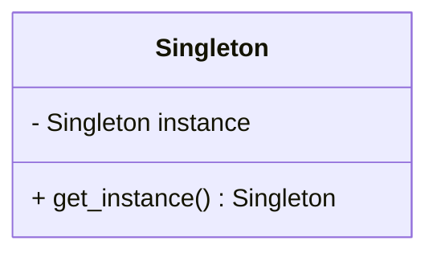
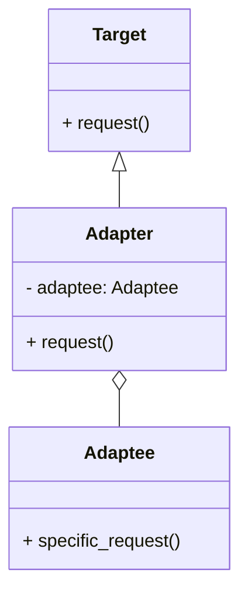

## 25.3 Design Pattern Reference Cheat Sheet

Welcome to the Design Pattern Reference Cheat Sheet for Julia! This section serves as a quick reference guide to the design patterns discussed throughout the guide. Each pattern is summarized with its intent, structure, and examples, accompanied by visual diagrams for easy recall. This cheat sheet is designed to help you quickly identify and apply the right pattern for your Julia projects.

### Creational Design Patterns

#### Singleton Pattern

- **Intent**: Ensure a class has only one instance and provide a global point of access to it.
- **Structure**: 
  - A single instance is created and stored in a variable.
  - Access to the instance is provided through a method.

```julia
module SingletonExample
    mutable struct Singleton
        value::Int
    end

    const instance = Singleton(0)

    function get_instance()
        return instance
    end
end
```

- **Key Participants**: Singleton class, instance accessor.
- **Applicability**: Use when exactly one instance of a class is needed.
- **Design Considerations**: Ensure thread safety if accessed from multiple threads.

#### Factory Method Pattern

- **Intent**: Define an interface for creating an object, but let subclasses alter the type of objects that will be created.
- **Structure**: 
  - An interface for creating objects.
  - Subclasses implement the creation method.

```julia
abstract type Product end

struct ConcreteProductA <: Product end
struct ConcreteProductB <: Product end

function create_product(type::Symbol)::Product
    if type == :A
        return ConcreteProductA()
    elseif type == :B
        return ConcreteProductB()
    else
        error("Unknown product type")
    end
end
```

- **Key Participants**: Creator, Concrete Creators, Product.
- **Applicability**: Use when a class can't anticipate the class of objects it must create.
- **Design Considerations**: Leverage Julia's multiple dispatch for flexibility.

### Structural Design Patterns

#### Adapter Pattern

- **Intent**: Convert the interface of a class into another interface clients expect.
- **Structure**: 
  - An adapter class that implements the target interface.
  - The adapter holds an instance of the class it adapts.

```julia
abstract type Target end

struct Adaptee
    function specific_request()
        return "Specific behavior"
    end
end

struct Adapter <: Target
    adaptee::Adaptee
end

function request(adapter::Adapter)
    return adapter.adaptee.specific_request()
end
```

- **Key Participants**: Target, Adapter, Adaptee.
- **Applicability**: Use when you want to use an existing class but its interface does not match the one you need.
- **Design Considerations**: Consider performance implications of additional abstraction layers.

#### Composite Pattern

- **Intent**: Compose objects into tree structures to represent part-whole hierarchies.
- **Structure**: 
  - Component interface.
  - Leaf and Composite classes.

```julia
abstract type Component end

struct Leaf <: Component
    name::String
end

struct Composite <: Component
    children::Vector{Component}
end

function add_component(composite::Composite, component::Component)
    push!(composite.children, component)
end
```

- **Key Participants**: Component, Leaf, Composite.
- **Applicability**: Use when you want to represent part-whole hierarchies of objects.
- **Design Considerations**: Ensure operations are meaningful for both leaf and composite nodes.

### Behavioral Design Patterns

#### Strategy Pattern

- **Intent**: Define a family of algorithms, encapsulate each one, and make them interchangeable.
- **Structure**: 
  - Strategy interface.
  - Concrete strategies implementing the interface.

```julia
abstract type Strategy end

struct ConcreteStrategyA <: Strategy end
struct ConcreteStrategyB <: Strategy end

function execute(strategy::ConcreteStrategyA)
    return "Executing strategy A"
end

function execute(strategy::ConcreteStrategyB)
    return "Executing strategy B"
end
```

- **Key Participants**: Strategy, Concrete Strategies, Context.
- **Applicability**: Use when you want to define a family of algorithms and make them interchangeable.
- **Design Considerations**: Use Julia's multiple dispatch to select strategies dynamically.

#### Observer Pattern

- **Intent**: Define a one-to-many dependency between objects so that when one object changes state, all its dependents are notified and updated automatically.
- **Structure**: 
  - Subject interface.
  - Observer interface.
  - Concrete subject and observers.

```julia
abstract type Observer end

struct ConcreteObserver <: Observer
    state::Int
end

function update(observer::ConcreteObserver, new_state::Int)
    observer.state = new_state
end

abstract type Subject end

mutable struct ConcreteSubject <: Subject
    observers::Vector{Observer}
end

function notify(subject::ConcreteSubject, new_state::Int)
    for observer in subject.observers
        update(observer, new_state)
    end
end
```

- **Key Participants**: Subject, Observer, Concrete Subject, Concrete Observer.
- **Applicability**: Use when a change to one object requires changing others, and you don't know how many objects need to be changed.
- **Design Considerations**: Manage observer registration and removal carefully.

### Idiomatic Julia Patterns

#### Multiple Dispatch

- **Intent**: Leverage Julia's multiple dispatch to write flexible and efficient code.
- **Structure**: 
  - Define methods for different combinations of argument types.

```julia
function process(x::Int, y::Int)
    return x + y
end

function process(x::String, y::String)
    return x * y
end
```

- **Key Participants**: Functions, Methods.
- **Applicability**: Use when you need different behavior based on argument types.
- **Design Considerations**: Ensure method signatures are clear and unambiguous.

#### Metaprogramming

- **Intent**: Use Julia's metaprogramming capabilities to write code that writes code.
- **Structure**: 
  - Use macros and generated functions.

```julia
macro sayhello(name)
    return :(println("Hello, ", $name))
end

@sayhello "Julia"
```

- **Key Participants**: Macros, Expressions.
- **Applicability**: Use when repetitive code can be generated programmatically.
- **Design Considerations**: Maintain macro hygiene to avoid variable capture.

### Visualizing Design Patterns

#### Diagram: Singleton Pattern



**Caption**: This diagram illustrates the Singleton pattern, showing the single instance and the method to access it.

#### Diagram: Adapter Pattern



**Caption**: The Adapter pattern diagram shows how the Adapter class implements the Target interface and uses an instance of Adaptee.

### Knowledge Check

- **Question**: What is the primary purpose of the Singleton pattern?
  - **Answer**: To ensure a class has only one instance and provide a global point of access to it.

- **Question**: How does the Factory Method pattern differ from the Abstract Factory pattern?
  - **Answer**: The Factory Method pattern defines an interface for creating an object, while the Abstract Factory pattern provides an interface for creating families of related or dependent objects.

### Embrace the Journey

Remember, mastering design patterns in Julia is a journey. As you progress, you'll find new ways to apply these patterns to solve complex problems efficiently. Keep experimenting, stay curious, and enjoy the process of becoming an expert in Julia software development!

## Quiz Time!



### What is the primary intent of the Singleton pattern?

- [x] Ensure a class has only one instance and provide a global point of access to it.
- [ ] Define a family of algorithms, encapsulate each one, and make them interchangeable.
- [ ] Compose objects into tree structures to represent part-whole hierarchies.
- [ ] Convert the interface of a class into another interface clients expect.

> **Explanation:** The Singleton pattern ensures a class has only one instance and provides a global point of access to it.

### Which pattern is used to define a family of algorithms and make them interchangeable?

- [ ] Singleton
- [x] Strategy
- [ ] Composite
- [ ] Adapter

> **Explanation:** The Strategy pattern is used to define a family of algorithms, encapsulate each one, and make them interchangeable.

### In the Adapter pattern, what role does the Adapter class play?

- [x] It implements the target interface and holds an instance of the class it adapts.
- [ ] It defines a family of algorithms and encapsulates each one.
- [ ] It composes objects into tree structures to represent part-whole hierarchies.
- [ ] It ensures a class has only one instance.

> **Explanation:** The Adapter class implements the target interface and holds an instance of the class it adapts.

### What is the key benefit of using the Composite pattern?

- [ ] It ensures a class has only one instance.
- [ ] It defines a family of algorithms and makes them interchangeable.
- [x] It allows you to compose objects into tree structures to represent part-whole hierarchies.
- [ ] It converts the interface of a class into another interface clients expect.

> **Explanation:** The Composite pattern allows you to compose objects into tree structures to represent part-whole hierarchies.

### Which pattern is best suited for situations where a change to one object requires changing others?

- [ ] Singleton
- [ ] Strategy
- [ ] Composite
- [x] Observer

> **Explanation:** The Observer pattern is used when a change to one object requires changing others, and you don't know how many objects need to be changed.

### How does Julia's multiple dispatch enhance the Strategy pattern?

- [x] It allows selecting strategies dynamically based on argument types.
- [ ] It ensures a class has only one instance.
- [ ] It composes objects into tree structures.
- [ ] It converts the interface of a class into another interface.

> **Explanation:** Julia's multiple dispatch allows selecting strategies dynamically based on argument types, enhancing the flexibility of the Strategy pattern.

### What is a key consideration when using the Singleton pattern in a multi-threaded environment?

- [x] Ensure thread safety when accessing the single instance.
- [ ] Define a family of algorithms and encapsulate each one.
- [ ] Compose objects into tree structures.
- [ ] Convert the interface of a class into another interface.

> **Explanation:** In a multi-threaded environment, it's important to ensure thread safety when accessing the single instance in the Singleton pattern.

### What is the role of macros in Julia's metaprogramming?

- [x] They are used to write code that writes code.
- [ ] They ensure a class has only one instance.
- [ ] They define a family of algorithms and make them interchangeable.
- [ ] They compose objects into tree structures.

> **Explanation:** Macros in Julia's metaprogramming are used to write code that writes code, allowing for programmatic code generation.

### Which pattern uses an interface for creating objects, allowing subclasses to alter the type of objects created?

- [x] Factory Method
- [ ] Singleton
- [ ] Composite
- [ ] Adapter

> **Explanation:** The Factory Method pattern uses an interface for creating objects, allowing subclasses to alter the type of objects created.

### True or False: The Adapter pattern is used to ensure a class has only one instance.

- [ ] True
- [x] False

> **Explanation:** False. The Adapter pattern is used to convert the interface of a class into another interface clients expect, not to ensure a class has only one instance.




