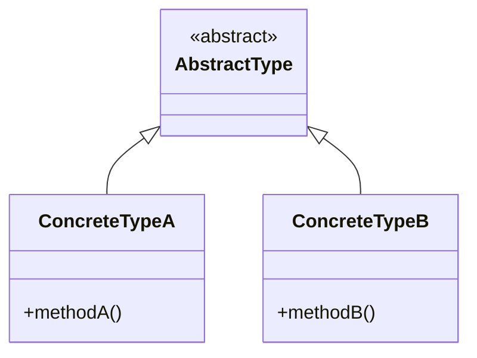

## 25.4 Common Interview Questions on Julia and Design Patterns

In this section, we will explore common interview questions related to Julia programming and design patterns. These questions are designed to test your understanding of Julia's unique features and your ability to apply design patterns effectively. We will provide guidance on how to approach these questions, along with detailed explanations and code examples to help you prepare for your next technical interview.

### Introduction

Julia is a high-level, high-performance programming language for technical computing. Its design is rooted in the need for a language that combines the ease of use of Python with the speed of C. Understanding Julia's design patterns is crucial for building efficient, scalable, and maintainable applications. This section will cover typical interview questions you might encounter, along with strategies for answering them effectively.

### Sample Questions and Answers

#### 1. Explain the concept of multiple dispatch in Julia and its advantages.

**Answer:**

Multiple dispatch is a core feature of Julia that allows functions to be defined for different combinations of argument types. This means that the method that gets executed is determined by the types of all the arguments, not just the first one.

**Advantages:**
- **Flexibility:** It allows for more flexible and generic code.
- **Performance:** Julia can optimize method selection at runtime, leading to faster execution.
- **Code Reusability:** Encourages writing generic functions that can work with any data type.

**Example:**

```julia
function area(shape)
    error("area not implemented for this shape")
end

function area(circle::Circle)
    return π * circle.radius^2
end

function area(rectangle::Rectangle)
    return rectangle.width * rectangle.height
end

circle = Circle(5)
rectangle = Rectangle(4, 6)

println(area(circle))     # Outputs: 78.53981633974483
println(area(rectangle))  # Outputs: 24
```

#### 2. What is the Singleton pattern, and how can it be implemented in Julia?

**Answer:**

The Singleton pattern ensures that a class has only one instance and provides a global point of access to it. In Julia, this can be implemented using a module or a constant.

**Example:**

```julia
module SingletonExample
    mutable struct Singleton
        value::Int
    end

    const instance = Singleton(0)

    function get_instance()
        return instance
    end
end

singleton1 = SingletonExample.get_instance()
singleton2 = SingletonExample.get_instance()

println(singleton1 === singleton2)  # Outputs: true
```

#### 3. Describe the Factory Method pattern and provide an example in Julia.

**Answer:**

The Factory Method pattern defines an interface for creating an object but lets subclasses alter the type of objects that will be created. It is useful for creating objects without specifying the exact class of object that will be created.

**Example:**

```julia
abstract type Product end

struct ConcreteProductA <: Product end
struct ConcreteProductB <: Product end

function create_product(type::Symbol)::Product
    if type == :A
        return ConcreteProductA()
    elseif type == :B
        return ConcreteProductB()
    else
        error("Unknown product type")
    end
end

product_a = create_product(:A)
product_b = create_product(:B)

println(typeof(product_a))  # Outputs: ConcreteProductA
println(typeof(product_b))  # Outputs: ConcreteProductB
```

#### 4. How does Julia's type system support the implementation of the Strategy pattern?

**Answer:**

The Strategy pattern defines a family of algorithms, encapsulates each one, and makes them interchangeable. Julia's type system and multiple dispatch make it easy to implement this pattern by defining different methods for a function.

**Example:**

```julia
abstract type Strategy end

struct StrategyA <: Strategy end
struct StrategyB <: Strategy end

function execute(strategy::StrategyA)
    println("Executing Strategy A")
end

function execute(strategy::StrategyB)
    println("Executing Strategy B")
end

strategy_a = StrategyA()
strategy_b = StrategyB()

execute(strategy_a)  # Outputs: Executing Strategy A
execute(strategy_b)  # Outputs: Executing Strategy B
```

#### 5. What is metaprogramming in Julia, and how can it be used to implement design patterns?

**Answer:**

Metaprogramming in Julia involves writing code that generates other code. It allows for powerful abstractions and can be used to implement design patterns by generating boilerplate code or enforcing certain structures.

**Example:**

```julia
macro define_getter(name)
    return quote
        function $(Symbol("get_", name))(obj)
            return getfield(obj, $(QuoteNode(name)))
        end
    end
end

struct Person
    name::String
    age::Int
end

@define_getter name
@define_getter age

p = Person("Alice", 30)
println(get_name(p))  # Outputs: Alice
println(get_age(p))   # Outputs: 30
```

#### 6. Explain the Observer pattern and how it can be implemented in Julia.

**Answer:**

The Observer pattern defines a one-to-many dependency between objects so that when one object changes state, all its dependents are notified and updated automatically. In Julia, this can be implemented using callbacks or signals.

**Example:**

```julia
mutable struct Subject
    observers::Vector{Function}
end

function Subject()
    return Subject([])
end

function attach(subject::Subject, observer::Function)
    push!(subject.observers, observer)
end

function notify(subject::Subject)
    for observer in subject.observers
        observer()
    end
end

subject = Subject()

attach(subject, () -> println("Observer 1 notified"))
attach(subject, () -> println("Observer 2 notified"))

notify(subject)
# Observer 1 notified
```

#### 7. How can the Decorator pattern be used in Julia to extend functionality?

**Answer:**

The Decorator pattern allows behavior to be added to individual objects, either statically or dynamically, without affecting the behavior of other objects from the same class. In Julia, this can be achieved using higher-order functions.

**Example:**

```julia
function base_function()
    println("Base function")
end

function decorator(func::Function)
    return function()
        println("Before decoration")
        func()
        println("After decoration")
    end
end

decorated_function = decorator(base_function)
decorated_function()
# Before decoration
# After decoration
```

#### 8. What are parametric types in Julia, and how do they facilitate the implementation of design patterns?

**Answer:**

Parametric types in Julia allow types to be parameterized by other types, enabling the creation of generic and reusable code. They are particularly useful in implementing design patterns that require flexibility and type safety.

**Example:**

```julia
struct Box{T}
    value::T
end

function get_value(box::Box{T}) where T
    return box.value
end

int_box = Box(42)
string_box = Box("Hello")

println(get_value(int_box))    # Outputs: 42
println(get_value(string_box)) # Outputs: Hello
```

#### 9. Describe the Composite pattern and provide an example in Julia.

**Answer:**

The Composite pattern allows you to compose objects into tree structures to represent part-whole hierarchies. It lets clients treat individual objects and compositions of objects uniformly.

**Example:**

```julia
abstract type Component end

struct Leaf <: Component
    name::String
end

struct Composite <: Component
    children::Vector{Component}
end

function add_child(composite::Composite, component::Component)
    push!(composite.children, component)
end

function display(component::Component, indent::Int = 0)
    if isa(component, Leaf)
        println(" " ^ indent * 2, component.name)
    elseif isa(component, Composite)
        for child in component.children
            display(child, indent + 1)
        end
    end
end

leaf1 = Leaf("Leaf 1")
leaf2 = Leaf("Leaf 2")
composite = Composite([])
add_child(composite, leaf1)
add_child(composite, leaf2)

display(composite)
#   Leaf 1
```

#### 10. How does Julia's type system differ from traditional object-oriented languages, and how does this affect design patterns?

**Answer:**

Julia's type system is dynamic and supports multiple dispatch, which is different from traditional object-oriented languages that typically use single dispatch. This affects design patterns by allowing more flexible and generic implementations.

**Key Differences:**
- **Multiple Dispatch:** Allows methods to be defined for combinations of argument types.
- **No Inheritance:** Julia uses composition and parametric types instead of class inheritance.
- **Type Hierarchies:** Julia supports abstract types and concrete types, enabling flexible design patterns.

**Impact on Design Patterns:**
- Encourages the use of composition over inheritance.
- Facilitates the implementation of patterns like Strategy and Visitor through multiple dispatch.
- Allows for more generic and reusable code with parametric types.

### Try It Yourself

Experiment with the code examples provided in this section. Try modifying the types and methods to see how Julia's type system and multiple dispatch can be leveraged to implement different design patterns. For instance, create your own design pattern using parametric types or explore how metaprogramming can simplify repetitive tasks.

### Visualizing Julia's Type System

To better understand how Julia's type system supports design patterns, let's visualize the relationship between abstract types, concrete types, and multiple dispatch using a class diagram.



**Diagram Description:** This diagram illustrates how abstract types can be extended by concrete types in Julia. Multiple dispatch allows methods to be defined for different combinations of these types, enabling flexible design patterns.

### References and Links

- [Julia Documentation](https://docs.julialang.org/)
- [Design Patterns: Elements of Reusable Object-Oriented Software](https://en.wikipedia.org/wiki/Design_Patterns)
- [Metaprogramming in Julia](https://docs.julialang.org/en/v1/manual/metaprogramming/)

### Knowledge Check

- What are the advantages of using multiple dispatch in Julia?
- How can the Singleton pattern be implemented in Julia?
- Describe how the Factory Method pattern can be used to create objects in Julia.
- What role does metaprogramming play in implementing design patterns in Julia?

### Embrace the Journey

Remember, mastering Julia and design patterns is a journey. As you progress, you'll discover new ways to leverage Julia's unique features to build efficient and scalable applications. Keep experimenting, stay curious, and enjoy the journey!

## Quiz Time!



### What is multiple dispatch in Julia?

- [x] A feature that allows functions to be defined for different combinations of argument types.
- [ ] A way to dispatch multiple functions at once.
- [ ] A method of handling multiple threads.
- [ ] A technique for optimizing memory usage.

> **Explanation:** Multiple dispatch in Julia allows functions to be defined for different combinations of argument types, enabling flexible and efficient code execution.

### How can the Singleton pattern be implemented in Julia?

- [x] Using a module or a constant.
- [ ] By creating multiple instances of a struct.
- [ ] Using inheritance.
- [ ] By defining a global variable.

> **Explanation:** The Singleton pattern can be implemented in Julia using a module or a constant to ensure only one instance exists.

### What is the Factory Method pattern used for?

- [x] Defining an interface for creating objects without specifying the exact class.
- [ ] Creating multiple instances of a class.
- [ ] Managing global state.
- [ ] Optimizing memory usage.

> **Explanation:** The Factory Method pattern defines an interface for creating objects, allowing subclasses to alter the type of objects that will be created.

### How does Julia's type system support the Strategy pattern?

- [x] By allowing different methods for a function based on argument types.
- [ ] By using inheritance.
- [ ] By defining global variables.
- [ ] By optimizing memory usage.

> **Explanation:** Julia's type system and multiple dispatch allow different methods for a function based on argument types, facilitating the implementation of the Strategy pattern.

### What is metaprogramming in Julia?

- [x] Writing code that generates other code.
- [ ] A technique for optimizing memory usage.
- [ ] A method of handling multiple threads.
- [ ] A way to dispatch multiple functions at once.

> **Explanation:** Metaprogramming in Julia involves writing code that generates other code, enabling powerful abstractions and design pattern implementations.

### How can the Observer pattern be implemented in Julia?

- [x] Using callbacks or signals.
- [ ] By creating multiple instances of a struct.
- [ ] Using inheritance.
- [ ] By defining global variables.

> **Explanation:** The Observer pattern can be implemented in Julia using callbacks or signals to notify dependents of state changes.

### What are parametric types in Julia?

- [x] Types that are parameterized by other types.
- [ ] A way to dispatch multiple functions at once.
- [ ] A method of handling multiple threads.
- [ ] A technique for optimizing memory usage.

> **Explanation:** Parametric types in Julia allow types to be parameterized by other types, enabling generic and reusable code.

### How does the Composite pattern work in Julia?

- [x] By composing objects into tree structures.
- [ ] By creating multiple instances of a struct.
- [ ] Using inheritance.
- [ ] By defining global variables.

> **Explanation:** The Composite pattern allows objects to be composed into tree structures, representing part-whole hierarchies.

### How does Julia's type system differ from traditional object-oriented languages?

- [x] It supports multiple dispatch and uses composition over inheritance.
- [ ] It uses single dispatch and inheritance.
- [ ] It relies on global variables.
- [ ] It optimizes memory usage.

> **Explanation:** Julia's type system supports multiple dispatch and uses composition over inheritance, differing from traditional object-oriented languages.

### True or False: Julia's multiple dispatch allows for more flexible and generic code.

- [x] True
- [ ] False

> **Explanation:** True. Julia's multiple dispatch allows for more flexible and generic code by enabling functions to be defined for different combinations of argument types.




