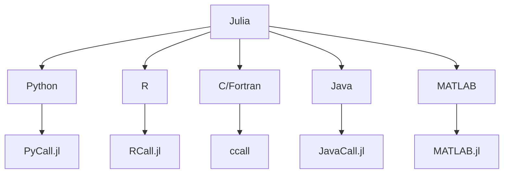

## 25.6 Frequently Asked Questions (FAQ)

Welcome to the Frequently Asked Questions (FAQ) section of the Julia Design Patterns & Best Practices guide. In this section, we aim to address common questions and provide solutions to typical setup and configuration issues that developers may encounter while working with Julia. Whether you're a beginner or an expert, this FAQ will serve as a valuable resource to enhance your understanding and troubleshooting skills in Julia programming.

### General Inquiries

#### What is Julia, and why should I use it?

Julia is a high-level, high-performance programming language designed for technical computing. It is particularly well-suited for numerical and scientific computing due to its speed, ease of use, and ability to handle complex mathematical operations. Julia's unique features include multiple dispatch, a dynamic type system, and the ability to call C and Fortran libraries directly. These features make Julia an excellent choice for data science, machine learning, and scientific research.

#### How does Julia compare to other programming languages?

Julia combines the best aspects of several programming languages. It offers the speed of C, the dynamism of Python, the mathematical prowess of MATLAB, and the statistical capabilities of R. Unlike many other languages, Julia is designed from the ground up for high-performance numerical and scientific computing, making it a powerful tool for developers in these fields.

#### What are the key features of Julia?

- **Multiple Dispatch**: Allows functions to be defined for different combinations of argument types, enabling flexible and efficient code.
- **Dynamic Type System**: Supports both dynamic and static typing, offering flexibility and performance.
- **Performance**: Julia is designed for speed, often matching or exceeding the performance of statically-typed languages like C.
- **Interoperability**: Easily integrates with other languages, allowing you to call C, Fortran, Python, and R code directly.
- **Rich Ecosystem**: Includes a wide range of packages for data manipulation, visualization, machine learning, and more.

#### What are design patterns, and why are they important in Julia?

Design patterns are reusable solutions to common problems in software design. They provide a template for solving issues in a consistent and efficient manner. In Julia, design patterns help developers write clean, maintainable, and scalable code by leveraging the language's unique features, such as multiple dispatch and metaprogramming.

#### How do I get started with Julia?

To get started with Julia, follow these steps:

1. **Install Julia**: Download and install Julia from the [official website](https://julialang.org/downloads/).
2. **Set Up the Development Environment**: Use an IDE like Visual Studio Code with the Julia extension for a seamless coding experience.
3. **Explore the REPL**: Familiarize yourself with the Julia REPL (Read-Eval-Print Loop) for interactive programming.
4. **Learn the Basics**: Start with basic syntax, data types, and control structures.
5. **Experiment with Packages**: Use Julia's package manager to install and explore libraries for various applications.

#### What are some best practices for writing Julia code?

- **Use Multiple Dispatch**: Leverage multiple dispatch to write flexible and efficient functions.
- **Optimize for Performance**: Focus on type stability and avoid unnecessary allocations.
- **Write Modular Code**: Organize code into modules and packages for better maintainability.
- **Document Your Code**: Use docstrings and comments to explain code functionality.
- **Follow Coding Standards**: Adhere to Julia's style guide for consistent and readable code.

#### How can I contribute to the Julia community?

Contributing to the Julia community is a rewarding experience. Here are some ways to get involved:

- **Contribute to Open Source Projects**: Explore and contribute to Julia packages on GitHub.
- **Join the Julia Community**: Participate in forums, mailing lists, and community events.
- **Share Your Knowledge**: Write blog posts, tutorials, or create educational content about Julia.
- **Report Issues and Suggest Improvements**: Help improve Julia by reporting bugs and suggesting enhancements.

### Troubleshooting

#### How do I resolve installation issues with Julia?

If you encounter issues during installation, consider the following solutions:

- **Check System Requirements**: Ensure your system meets the minimum requirements for Julia.
- **Use the Latest Version**: Download the latest stable release from the [official website](https://julialang.org/downloads/).
- **Verify Installation Path**: Ensure Julia is installed in a directory with appropriate permissions.
- **Consult the Documentation**: Refer to the [installation guide](https://julialang.org/downloads/platform/) for platform-specific instructions.

#### What should I do if Julia packages fail to install?

If you experience package installation issues, try these steps:

- **Update Package Manager**: Run `Pkg.update()` to update the package manager and resolve dependencies.
- **Check Internet Connection**: Ensure you have a stable internet connection for downloading packages.
- **Clear Package Cache**: Use `Pkg.gc()` to clean up the package cache and free up space.
- **Consult Package Documentation**: Review the package's documentation for specific installation instructions.

#### How can I troubleshoot performance issues in Julia code?

To address performance issues, consider the following tips:

- **Profile Your Code**: Use the `Profile` module to identify bottlenecks in your code.
- **Optimize Type Stability**: Ensure functions are type-stable to improve performance.
- **Minimize Allocations**: Avoid unnecessary memory allocations by using in-place operations.
- **Use Benchmarking Tools**: Utilize `BenchmarkTools.jl` to measure and compare code performance.

#### What are common errors in Julia, and how can I fix them?

Here are some common errors and their solutions:

- **MethodError**: Occurs when a function is called with arguments that don't match any method signature. Check the function's method definitions and ensure correct argument types.
- **UndefVarError**: Indicates a variable is used before being defined. Ensure all variables are initialized before use.
- **LoadError**: Happens when there's an error in a script or module being loaded. Review the error message for details and fix the underlying issue.
- **TypeError**: Arises when an operation is performed on incompatible types. Verify that types are compatible with the operation being performed.

#### How do I handle missing data in Julia?

Julia provides several ways to handle missing data:

- **Use `Missing` Type**: Represent missing values with the `Missing` type.
- **Use `DataFrames.jl`**: Leverage the `DataFrames.jl` package for handling missing data in tabular formats.
- **Impute Missing Values**: Use functions like `coalesce` to replace missing values with defaults or calculated values.

#### How can I debug Julia code effectively?

Effective debugging in Julia involves the following techniques:

- **Use Debugger.jl**: Utilize the `Debugger.jl` package for interactive debugging.
- **Insert Print Statements**: Add print statements to track variable values and program flow.
- **Leverage Logging**: Use the `Logging` module to capture and analyze log messages.
- **Test Incrementally**: Test small code sections to isolate and identify issues.

#### How do I manage dependencies in Julia projects?

Managing dependencies in Julia involves:

- **Using Project.toml**: Define project dependencies in a `Project.toml` file.
- **Creating Environments**: Use environments to isolate dependencies for different projects.
- **Updating Dependencies**: Run `Pkg.update()` to update all dependencies to their latest versions.
- **Pinning Versions**: Use `Pkg.pin()` to lock specific package versions and ensure compatibility.

#### What are some common pitfalls to avoid in Julia programming?

Avoid these common pitfalls to write better Julia code:

- **Ignoring Type Stability**: Ensure functions are type-stable for optimal performance.
- **Overusing Global Variables**: Minimize the use of global variables to avoid performance issues.
- **Neglecting Documentation**: Document code thoroughly to improve readability and maintainability.
- **Premature Optimization**: Focus on writing correct and clear code before optimizing for performance.

#### How can I improve the performance of my Julia code?

To enhance performance, consider these strategies:

- **Optimize Algorithms**: Choose efficient algorithms and data structures for your problem.
- **Use In-Place Operations**: Perform operations in-place to reduce memory allocations.
- **Leverage Parallelism**: Utilize Julia's parallel computing capabilities to speed up computations.
- **Profile and Benchmark**: Continuously profile and benchmark your code to identify and address performance bottlenecks.

#### How do I integrate Julia with other programming languages?

Julia's interoperability features allow seamless integration with other languages:

- **Call C and Fortran**: Use `ccall` to call C and Fortran functions directly from Julia.
- **Use PyCall.jl**: Leverage `PyCall.jl` to call Python functions and libraries.
- **Use RCall.jl**: Utilize `RCall.jl` to interface with R code and packages.
- **Embed Julia in Other Languages**: Use Julia's embedding API to call Julia code from other languages.

### Try It Yourself

To solidify your understanding, try experimenting with the following tasks:

1. **Create a Simple Julia Script**: Write a script that performs basic arithmetic operations and prints the results.
2. **Implement a Design Pattern**: Choose a design pattern and implement it in Julia, using multiple dispatch and type stability.
3. **Optimize a Function**: Take a function with performance issues and apply optimization techniques to improve its speed.
4. **Integrate Julia with Python**: Use `PyCall.jl` to call a Python library from Julia and process the results.

### Visualizing Julia's Ecosystem

To better understand Julia's ecosystem and its integration capabilities, consider the following diagram:

**Diagram Description**: This diagram illustrates Julia's interoperability with various programming languages, highlighting the packages and methods used for integration.

### Knowledge Check

Before moving on, consider these questions to test your understanding:

- What are the benefits of using multiple dispatch in Julia?
- How can you handle missing data in a DataFrame?
- What steps can you take to improve the performance of a Julia function?
- How does Julia's type system contribute to its performance?

### Embrace the Journey

Remember, mastering Julia and its design patterns is a journey. As you progress, you'll discover new techniques and best practices that will enhance your programming skills. Keep experimenting, stay curious, and enjoy the process of learning and growing as a Julia developer.

## Quiz Time!



### What is a key feature of Julia that contributes to its high performance?

- [x] Multiple Dispatch
- [ ] Global Variables
- [ ] Dynamic Typing
- [ ] Lack of Type System

> **Explanation:** Multiple dispatch allows Julia to efficiently select the appropriate method for a given set of argument types, contributing to its high performance.

### How can you handle missing data in Julia?

- [x] Use the `Missing` type
- [ ] Use `NaN` for all missing values
- [ ] Ignore missing data
- [ ] Use `null` as in JavaScript

> **Explanation:** Julia uses the `Missing` type to represent missing data, providing a robust way to handle such cases.

### What is the purpose of the `ccall` function in Julia?

- [x] To call C functions directly from Julia
- [ ] To call Python functions
- [ ] To call R functions
- [ ] To call Java methods

> **Explanation:** The `ccall` function is used to call C functions directly from Julia, enabling seamless integration with C libraries.

### Which package is used to call Python functions from Julia?

- [x] PyCall.jl
- [ ] RCall.jl
- [ ] JavaCall.jl
- [ ] MATLAB.jl

> **Explanation:** PyCall.jl is the package used to call Python functions and libraries from Julia.

### What is a common pitfall to avoid in Julia programming?

- [x] Ignoring Type Stability
- [ ] Using Multiple Dispatch
- [ ] Writing Modular Code
- [ ] Documenting Code

> **Explanation:** Ignoring type stability can lead to performance issues, so it's important to ensure functions are type-stable.

### How can you improve the performance of a Julia function?

- [x] Optimize Algorithms
- [ ] Use Global Variables
- [ ] Avoid Documentation
- [ ] Ignore Type Stability

> **Explanation:** Optimizing algorithms and ensuring type stability are key strategies for improving the performance of Julia functions.

### What is the role of the `Project.toml` file in Julia projects?

- [x] To define project dependencies
- [ ] To store data
- [ ] To execute scripts
- [ ] To manage user settings

> **Explanation:** The `Project.toml` file is used to define and manage project dependencies in Julia.

### How can you contribute to the Julia community?

- [x] Contribute to Open Source Projects
- [ ] Keep Knowledge to Yourself
- [ ] Avoid Community Events
- [ ] Ignore Bug Reports

> **Explanation:** Contributing to open source projects and participating in community events are great ways to get involved in the Julia community.

### What is a benefit of using Julia's package manager?

- [x] Easy installation and management of packages
- [ ] Slower package updates
- [ ] Limited package availability
- [ ] Complex dependency management

> **Explanation:** Julia's package manager simplifies the installation and management of packages, making it easy to work with dependencies.

### True or False: Julia can only be used for numerical computing.

- [ ] True
- [x] False

> **Explanation:** While Julia excels at numerical computing, it is a versatile language that can be used for a wide range of applications, including web development and data analysis.


