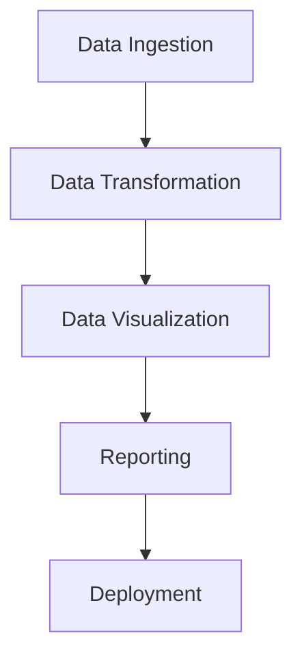

## 25.7 Sample Projects and Code Repositories

In this section, we delve into the world of sample projects and code repositories that exemplify the best practices and design patterns in Julia programming. Whether you're a beginner looking to understand the basics or an expert seeking to refine your skills, these projects will provide valuable insights and practical experience. Let's explore a variety of projects, each designed to highlight different aspects of Julia's capabilities.

### Introduction to Sample Projects

Sample projects are an excellent way to learn by doing. They provide a hands-on approach to understanding how design patterns and best practices are applied in real-world scenarios. By examining these projects, you can see how theoretical concepts are translated into practical solutions.

### Why Sample Projects Matter

- **Practical Application**: Sample projects allow you to apply what you've learned in a practical context, reinforcing your understanding of design patterns and best practices.
- **Code Reusability**: By studying well-structured projects, you can learn how to write reusable and maintainable code.
- **Problem-Solving Skills**: Working on projects helps you develop problem-solving skills as you encounter and overcome various challenges.
- **Community Engagement**: Many sample projects are open-source, allowing you to contribute to the community and learn from others.

### Example Projects and Code Repositories

Below, we present a curated list of sample projects and code repositories that demonstrate various design patterns and best practices in Julia. Each project includes a brief description, key concepts covered, and links to the code repositories.

#### 1. **Data Analysis and Visualization**

**Project Name**: Julia Data Explorer

- **Description**: A comprehensive data analysis and visualization tool built using Julia. This project demonstrates the use of data manipulation libraries like DataFrames.jl and visualization libraries such as Plots.jl and Makie.jl.
- **Key Concepts**: Data manipulation, data visualization, modular design, and user interface development.
- **Repository Link**: [Julia Data Explorer on GitHub](https://github.com/example/julia-data-explorer)

**Code Example**:

```julia
using DataFrames
using Plots

df = DataFrame(Name=["Alice", "Bob", "Charlie"], Age=[25, 30, 35])

plot(df.Age, labels=df.Name, title="Age Distribution", xlabel="Name", ylabel="Age")
```

**Try It Yourself**: Modify the dataset to include more individuals and plot additional attributes like height or weight.

#### 2. **Machine Learning Application**

**Project Name**: Julia ML Toolkit

- **Description**: A machine learning toolkit that showcases the implementation of various algorithms using MLJ.jl. This project covers supervised and unsupervised learning techniques.
- **Key Concepts**: Machine learning, model training, evaluation, and hyperparameter tuning.
- **Repository Link**: [Julia ML Toolkit on GitHub](https://github.com/example/julia-ml-toolkit)

**Code Example**:

```julia
using MLJ

X, y = @load_iris

model = @load DecisionTreeClassifier

mach = machine(model, X, y)
fit!(mach)

evaluate!(mach, resampling=CV(nfolds=5))
```

**Try It Yourself**: Experiment with different models available in MLJ.jl and compare their performance on the Iris dataset.

#### 3. **Web Application Development**

**Project Name**: Julia Web Server

- **Description**: A simple web server built using Genie.jl, demonstrating how to create RESTful APIs and serve web pages.
- **Key Concepts**: Web development, RESTful API design, and server-side rendering.
- **Repository Link**: [Julia Web Server on GitHub](https://github.com/example/julia-web-server)

**Code Example**:

```julia
using Genie

route("/") do
    "Welcome to the Julia Web Server!"
end

Genie.startup()
```

**Try It Yourself**: Add more routes to handle different HTTP methods like POST and PUT, and implement a simple CRUD application.

#### 4. **Scientific Computing**

**Project Name**: Julia Scientific Solver

- **Description**: A project focused on solving differential equations using DifferentialEquations.jl. It includes examples of modeling physical systems.
- **Key Concepts**: Differential equations, numerical methods, and scientific computing.
- **Repository Link**: [Julia Scientific Solver on GitHub](https://github.com/example/julia-scientific-solver)

**Code Example**:

```julia
using DifferentialEquations

function f(du, u, p, t)
    du[1] = u[2]
    du[2] = -u[1]
end

u0 = [1.0, 0.0]
tspan = (0.0, 10.0)

prob = ODEProblem(f, u0, tspan)
sol = solve(prob)

plot(sol, title="Harmonic Oscillator", xlabel="Time", ylabel="Displacement")
```

**Try It Yourself**: Modify the differential equation to model a damped harmonic oscillator and observe the changes in the solution.

#### 5. **Parallel and Distributed Computing**

**Project Name**: Julia Parallel Processor

- **Description**: A project that demonstrates parallel and distributed computing techniques using Distributed.jl and Threads.jl.
- **Key Concepts**: Parallel computing, distributed computing, and performance optimization.
- **Repository Link**: [Julia Parallel Processor on GitHub](https://github.com/example/julia-parallel-processor)

**Code Example**:

```julia
using Distributed

addprocs(4)

@everywhere function parallel_sum(arr)
    return sum(arr)
end

arr = rand(1000000)
result = @distributed (+) for i in arr
    parallel_sum(i)
end

println("Parallel sum: ", result)
```

**Try It Yourself**: Increase the number of worker processes and observe the impact on performance for larger datasets.

### Tutorials and Walkthroughs

In addition to sample projects, tutorials and walkthroughs provide step-by-step guidance on building applications in Julia. These resources are invaluable for understanding the intricacies of project development and implementation.

#### Tutorial 1: Building a Data Pipeline

- **Objective**: Learn how to build a data pipeline using Julia's data manipulation and visualization libraries.
- **Steps**:
  1. **Data Ingestion**: Use CSV.jl to read data from CSV files.
  2. **Data Transformation**: Apply transformations using DataFrames.jl.
  3. **Data Visualization**: Create plots using Plots.jl.
  4. **Reporting**: Generate reports with Markdown.jl.

**Code Example**:

```julia
using CSV, DataFrames, Plots

df = CSV.File("data.csv") |> DataFrame

df_transformed = filter(row -> row[:Age] > 18, df)

plot(df_transformed.Age, df_transformed.Salary, title="Age vs Salary", xlabel="Age", ylabel="Salary")

open("report.md", "w") do io
    write(io, "# Data Report\n\n")
    write(io, "## Age vs Salary\n\n")
    write(io, "\n")
end
```

**Try It Yourself**: Extend the pipeline to include additional data sources and more complex transformations.

#### Tutorial 2: Creating a Machine Learning Model

- **Objective**: Build and deploy a machine learning model using Julia.
- **Steps**:
  1. **Data Preparation**: Load and preprocess data.
  2. **Model Selection**: Choose an appropriate model from MLJ.jl.
  3. **Training**: Train the model on the dataset.
  4. **Evaluation**: Evaluate the model's performance.
  5. **Deployment**: Deploy the model using Genie.jl.

**Code Example**:

```julia
using MLJ, Genie

X, y = @load_iris

model = @load RandomForestClassifier

mach = machine(model, X, y)
fit!(mach)

evaluate!(mach, resampling=CV(nfolds=5))

route("/predict") do
    # Prediction logic here
    "Prediction result"
end

Genie.startup()
```

**Try It Yourself**: Experiment with different datasets and models, and deploy the application to a cloud platform.

### Visualizing Project Architecture

To better understand the architecture of these projects, let's visualize a typical project structure using Mermaid.js diagrams. This will help you grasp how different components interact within a project.



**Diagram Description**: This flowchart represents the typical stages of a data pipeline project, from data ingestion to deployment.

### References and Links

For further reading and exploration, consider the following resources:

- [JuliaLang Official Documentation](https://docs.julialang.org/)
- [JuliaHub](https://juliahub.com/)
- [Julia Discourse Community](https://discourse.julialang.org/)
- [GitHub Repositories for Julia Projects](https://github.com/JuliaLang)

### Knowledge Check

To reinforce your understanding, consider the following questions:

- What are the benefits of studying sample projects?
- How can you contribute to open-source Julia projects?
- What are the key components of a data pipeline in Julia?

### Embrace the Journey

Remember, exploring sample projects and code repositories is just the beginning. As you progress, you'll gain deeper insights into Julia's capabilities and develop your own innovative solutions. Keep experimenting, stay curious, and enjoy the journey!

## Quiz Time!



### What is the primary benefit of studying sample projects in Julia?

- [x] Practical application of theoretical concepts
- [ ] Learning a new programming language
- [ ] Improving typing speed
- [ ] Understanding hardware specifications

> **Explanation:** Sample projects allow developers to apply theoretical concepts in practical scenarios, reinforcing their understanding.

### Which library is commonly used for data manipulation in Julia?

- [x] DataFrames.jl
- [ ] Plots.jl
- [ ] Genie.jl
- [ ] MLJ.jl

> **Explanation:** DataFrames.jl is a popular library for data manipulation in Julia.

### What is the purpose of the Genie.jl library?

- [x] Web development and creating RESTful APIs
- [ ] Data visualization
- [ ] Machine learning
- [ ] Numerical computing

> **Explanation:** Genie.jl is used for web development and creating RESTful APIs in Julia.

### Which library is used for solving differential equations in Julia?

- [x] DifferentialEquations.jl
- [ ] MLJ.jl
- [ ] DataFrames.jl
- [ ] Plots.jl

> **Explanation:** DifferentialEquations.jl is used for solving differential equations in Julia.

### What is the first step in building a data pipeline in Julia?

- [x] Data Ingestion
- [ ] Data Visualization
- [ ] Model Training
- [ ] Deployment

> **Explanation:** Data ingestion is the first step in building a data pipeline, where data is read from various sources.

### Which library is used for machine learning in Julia?

- [x] MLJ.jl
- [ ] Genie.jl
- [ ] DataFrames.jl
- [ ] DifferentialEquations.jl

> **Explanation:** MLJ.jl is a library for machine learning in Julia.

### What is the role of Distributed.jl in Julia?

- [x] Parallel and distributed computing
- [ ] Data visualization
- [ ] Web development
- [ ] Machine learning

> **Explanation:** Distributed.jl is used for parallel and distributed computing in Julia.

### Which of the following is a key concept covered in the Julia ML Toolkit project?

- [x] Model training and evaluation
- [ ] Web development
- [ ] Data visualization
- [ ] Numerical computing

> **Explanation:** The Julia ML Toolkit project covers model training and evaluation as key concepts.

### What is the main focus of the Julia Scientific Solver project?

- [x] Solving differential equations
- [ ] Web development
- [ ] Data visualization
- [ ] Machine learning

> **Explanation:** The Julia Scientific Solver project focuses on solving differential equations.

### True or False: Sample projects can help improve problem-solving skills.

- [x] True
- [ ] False

> **Explanation:** Sample projects provide practical challenges that help improve problem-solving skills.


