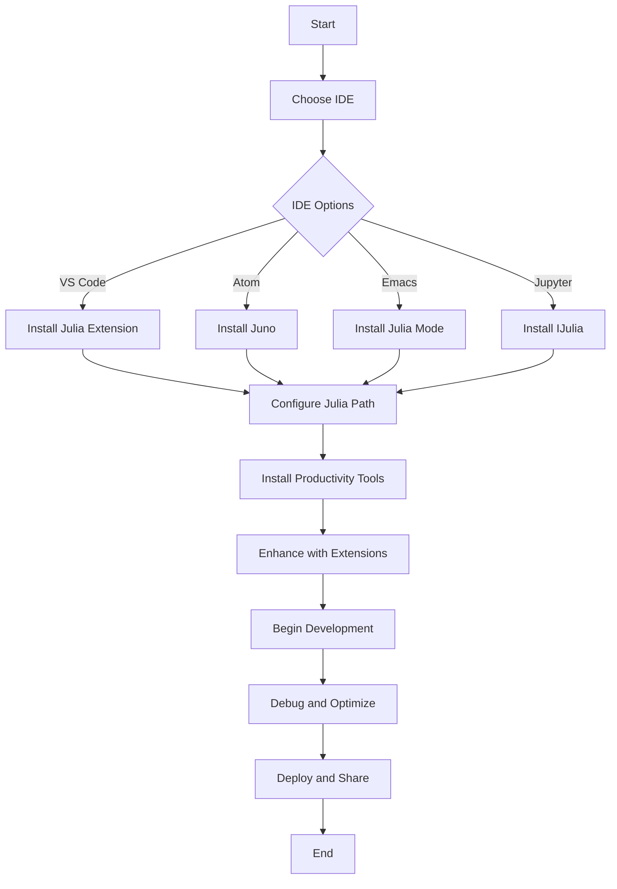

## 25.8 Setting Up Advanced Development Environments

Setting up an advanced development environment is crucial for efficient and productive Julia programming. In this section, we will explore how to configure popular Integrated Development Environments (IDEs) such as VS Code, Atom, Emacs, and Jupyter for Julia development. Additionally, we will delve into various tools and extensions that can significantly enhance your productivity.

### IDE Configurations

#### Visual Studio Code (VS Code)

Visual Studio Code is a popular choice among developers due to its versatility and extensive extension library. Let's explore how to set up VS Code for Julia development.

1. **Install VS Code**: Download and install VS Code from the [official website](https://code.visualstudio.com/).

2. **Install Julia Extension**: 
   - Open VS Code and navigate to the Extensions view by clicking on the Extensions icon in the Activity Bar on the side of the window.
   - Search for "Julia" and install the Julia extension by Julia Language Support.

3. **Configure Julia Path**:
   - Open the Command Palette (Ctrl+Shift+P) and type "Julia: Select Julia Executable Path".
   - Select the path to your Julia executable. This is typically located in `C:\Users\<YourUsername>\AppData\Local\Programs\Julia\Julia-<version>\bin` on Windows or `/Applications/Julia-<version>.app/Contents/Resources/julia/bin/julia` on macOS.

4. **Enable Linting and Formatting**:
   - Install the "LanguageServer.jl" package in Julia by running `import Pkg; Pkg.add("LanguageServer")`.
   - Configure settings in VS Code to enable linting and formatting by navigating to `File > Preferences > Settings` and searching for "Julia".

5. **Debugging Setup**:
   - Install the "Debugger.jl" package by running `import Pkg; Pkg.add("Debugger")`.
   - Use breakpoints and the debug console in VS Code to debug your Julia code.

6. **Integrated Terminal**:
   - Use the integrated terminal in VS Code to run Julia scripts and commands directly within the IDE.

**Code Example**: Running a simple Julia script in VS Code.

```julia
println("Hello, Julia!")

```

#### Atom

Atom is another popular editor for Julia development, known for its hackability and customization options.

1. **Install Atom**: Download and install Atom from the [official website](https://atom.io/).

2. **Install Juno**:
   - Juno is a powerful IDE for Julia that runs on Atom. Install it by navigating to `File > Settings > Install` and searching for "uber-juno".
   - Install the "uber-juno" package to get a full suite of tools for Julia development.

3. **Configure Julia Path**:
   - Open Atom and go to `Settings > Packages > julia-client > Settings`.
   - Set the Julia Path to the location of your Julia executable.

4. **Enable Linting and Autocompletion**:
   - Ensure that the "language-julia" package is installed for syntax highlighting and autocompletion.

5. **Debugging and Plotting**:
   - Use Juno's integrated debugger and plotting capabilities to visualize data and debug code.

**Code Example**: Using Juno to plot a simple graph.

```julia
using Plots

x = 1:10
y = rand(10)
plot(x, y, title="Random Plot", xlabel="X-axis", ylabel="Y-axis")

```

#### Emacs

Emacs is a highly customizable text editor that can be configured for Julia development using the `julia-mode`.

1. **Install Emacs**: Download and install Emacs from the [official website](https://www.gnu.org/software/emacs/).

2. **Install Julia Mode**:
   - Add the following to your Emacs configuration file (`~/.emacs` or `~/.emacs.d/init.el`):

```elisp
;; Julia Mode
(require 'julia-mode)
(add-to-list 'auto-mode-alist '("\\.jl\\'" . julia-mode))
```

3. **Enable Linting and Autocompletion**:
   - Install `company-mode` for autocompletion and `flycheck` for linting.

4. **Configure Julia REPL**:
   - Use `julia-repl` package to integrate Julia REPL within Emacs.

5. **Debugging and Plotting**:
   - Use `ESS` (Emacs Speaks Statistics) for advanced debugging and plotting capabilities.

**Code Example**: Running Julia code in Emacs.

```julia
function greet(name)
    println("Hello, $name!")
end

greet("Julia")
```

#### Jupyter

Jupyter notebooks provide an interactive environment for Julia development, particularly useful for data analysis and visualization.

1. **Install Jupyter**: Use the following command to install Jupyter:

```bash
pip install jupyter
```

2. **Install IJulia**:
   - Open Julia and run the following command to install IJulia:

```julia
using Pkg
Pkg.add("IJulia")
```

3. **Launch Jupyter Notebook**:
   - Start Jupyter by running `jupyter notebook` in your terminal.
   - Create a new notebook and select Julia as the kernel.

4. **Interactive Development**:
   - Use Jupyter notebooks for interactive coding, visualization, and documentation.

**Code Example**: Creating a simple plot in a Jupyter notebook.

```julia
using Plots

x = 1:10
y = rand(10)
plot(x, y, title="Random Plot", xlabel="X-axis", ylabel="Y-axis")
```

### Tooling and Extensions

Enhance your Julia development experience with these recommended tools and extensions.

#### Productivity Tools

1. **Revise.jl**: Automatically reloads code changes without restarting the Julia session. Install it using:

```julia
using Pkg
Pkg.add("Revise")
```

2. **OhMyREPL.jl**: Enhances the Julia REPL with syntax highlighting and other features. Install it using:

```julia
using Pkg
Pkg.add("OhMyREPL")
```

3. **Debugger.jl**: Provides debugging capabilities for Julia code. Install it using:

```julia
using Pkg
Pkg.add("Debugger")
```

4. **BenchmarkTools.jl**: Aids in performance measurement and optimization. Install it using:

```julia
using Pkg
Pkg.add("BenchmarkTools")
```

#### Recommended Extensions

1. **VS Code Extensions**:
   - **Julia**: Provides language support for Julia.
   - **Bracket Pair Colorizer**: Colors matching brackets for better readability.
   - **GitLens**: Enhances Git capabilities within VS Code.

2. **Atom Packages**:
   - **language-julia**: Provides syntax highlighting for Julia.
   - **julia-client**: Integrates Julia REPL and other features into Atom.

3. **Emacs Packages**:
   - **julia-mode**: Provides syntax highlighting and indentation for Julia.
   - **company-mode**: Offers autocompletion support.

4. **Jupyter Extensions**:
   - **nbextensions**: Adds additional features and widgets to Jupyter notebooks.

### Visualizing Development Workflows

To better understand how these tools and configurations fit together, let's visualize a typical development workflow using a flowchart.



**Diagram Description**: This flowchart illustrates the process of setting up an advanced development environment for Julia, starting from choosing an IDE to deploying and sharing your projects.

### References and Links

- [VS Code Julia Extension](https://marketplace.visualstudio.com/items?itemName=julialang.language-julia)
- [Atom Juno](https://junolab.org/)
- [Emacs Julia Mode](https://github.com/JuliaEditorSupport/julia-emacs)
- [Jupyter and IJulia](https://github.com/JuliaLang/IJulia.jl)

### Knowledge Check

- **Question**: What is the primary purpose of the `Revise.jl` package?
- **Exercise**: Set up a Julia development environment in your preferred IDE and create a simple "Hello, World!" program.

### Embrace the Journey

Remember, setting up an advanced development environment is just the beginning. As you progress, you'll discover more tools and techniques to enhance your Julia programming experience. Keep experimenting, stay curious, and enjoy the journey!

## Quiz Time!



### Which IDE is known for its versatility and extensive extension library for Julia development?

- [x] Visual Studio Code
- [ ] Atom
- [ ] Emacs
- [ ] Jupyter

> **Explanation:** Visual Studio Code is renowned for its versatility and extensive extension library, making it a popular choice for Julia development.

### What package is recommended for automatically reloading code changes in Julia?

- [x] Revise.jl
- [ ] OhMyREPL.jl
- [ ] Debugger.jl
- [ ] BenchmarkTools.jl

> **Explanation:** Revise.jl is used for automatically reloading code changes without restarting the Julia session.

### Which tool enhances the Julia REPL with syntax highlighting?

- [ ] Revise.jl
- [x] OhMyREPL.jl
- [ ] Debugger.jl
- [ ] BenchmarkTools.jl

> **Explanation:** OhMyREPL.jl enhances the Julia REPL with syntax highlighting and other features.

### What is the primary function of the `Debugger.jl` package?

- [x] Provides debugging capabilities for Julia code
- [ ] Enhances the REPL with syntax highlighting
- [ ] Automatically reloads code changes
- [ ] Aids in performance measurement

> **Explanation:** Debugger.jl provides debugging capabilities for Julia code, allowing developers to set breakpoints and inspect variables.

### Which package is used for performance measurement and optimization in Julia?

- [ ] Revise.jl
- [ ] OhMyREPL.jl
- [ ] Debugger.jl
- [x] BenchmarkTools.jl

> **Explanation:** BenchmarkTools.jl aids in performance measurement and optimization, providing tools to benchmark Julia code.

### What is the purpose of the `julia-mode` package in Emacs?

- [x] Provides syntax highlighting and indentation for Julia
- [ ] Integrates Julia REPL into Emacs
- [ ] Offers autocompletion support
- [ ] Enhances Git capabilities

> **Explanation:** julia-mode provides syntax highlighting and indentation for Julia code in Emacs.

### Which extension is recommended for enhancing Git capabilities within VS Code?

- [ ] Julia
- [ ] Bracket Pair Colorizer
- [x] GitLens
- [ ] nbextensions

> **Explanation:** GitLens enhances Git capabilities within VS Code, providing features like blame annotations and history exploration.

### What is the primary use of Jupyter notebooks in Julia development?

- [x] Interactive coding, visualization, and documentation
- [ ] Debugging and optimization
- [ ] Syntax highlighting and indentation
- [ ] Performance measurement

> **Explanation:** Jupyter notebooks are primarily used for interactive coding, visualization, and documentation in Julia development.

### Which package provides a full suite of tools for Julia development in Atom?

- [x] uber-juno
- [ ] language-julia
- [ ] julia-client
- [ ] company-mode

> **Explanation:** uber-juno provides a full suite of tools for Julia development in Atom, including REPL integration and plotting capabilities.

### True or False: Emacs can be configured to integrate Julia REPL within the editor.

- [x] True
- [ ] False

> **Explanation:** True. Emacs can be configured to integrate Julia REPL within the editor using the `julia-repl` package.


