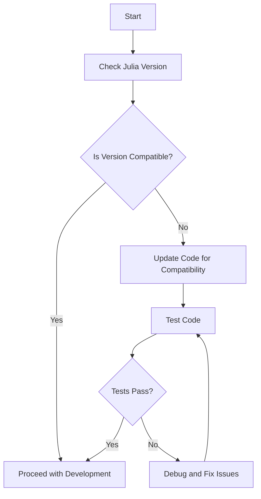

## 25.9 Julia Versions and Compatibility Considerations

As we delve into the world of Julia programming, understanding the nuances of versioning and compatibility is crucial for maintaining robust and efficient software. This section will guide you through the intricacies of Julia's versioning system, how to handle deprecations, and best practices for ensuring compatibility across different versions.

### Understanding Semantic Versioning in Julia

Semantic Versioning (SemVer) is a versioning scheme that conveys meaning about the underlying changes with each new release. Julia adheres to SemVer principles, which is essential for developers to understand when managing dependencies and ensuring compatibility.

#### Key Concepts of Semantic Versioning

Semantic Versioning follows a `MAJOR.MINOR.PATCH` format:

- **MAJOR**: Incremented for incompatible API changes.
- **MINOR**: Incremented for backward-compatible functionality.
- **PATCH**: Incremented for backward-compatible bug fixes.

For example, version `1.2.3` indicates:
- `1` is the major version, suggesting potential breaking changes from `0.x.x`.
- `2` is the minor version, indicating new features that are backward compatible.
- `3` is the patch version, representing bug fixes that do not affect compatibility.

#### Why Semantic Versioning Matters

Semantic Versioning provides a clear framework for understanding the impact of updates. It helps developers:
- Predict the impact of upgrading dependencies.
- Maintain compatibility with other packages.
- Communicate changes effectively within the community.

### Deprecations and Updates

As Julia evolves, certain features may become deprecated. Understanding how to manage these changes is vital for maintaining a stable codebase.

#### Handling Breaking Changes

Breaking changes occur when updates introduce modifications that are not backward compatible. To handle these effectively:

1. **Stay Informed**: Regularly check the [JuliaLang release notes](https://julialang.org/news/) for updates on breaking changes.
2. **Use Compatibility Bounds**: Specify version bounds in your `Project.toml` to prevent automatic upgrades to incompatible versions.
3. **Test Thoroughly**: Before upgrading, test your codebase against the new version to identify and address any breaking changes.

#### Managing Deprecations

Deprecations are features that are slated for removal in future releases. Julia provides warnings for deprecated features, allowing developers time to transition.

- **Identify Deprecations**: Use the `--depwarn=yes` flag to enable deprecation warnings.
- **Update Code**: Replace deprecated features with their recommended alternatives.
- **Leverage Tools**: Utilize tools like [CompatHelper.jl](https://github.com/JuliaRegistries/CompatHelper.jl) to automate compatibility checks.

### Best Practices for Version Management

To effectively manage versions and compatibility in Julia, consider the following best practices:

#### Regularly Update Dependencies

Keeping dependencies up-to-date ensures that you benefit from the latest features and security patches. Use the `Pkg.update()` function to update your packages.

```julia
using Pkg

Pkg.update()
```

#### Use Version Control

Version control systems like Git are essential for tracking changes and managing different versions of your code. Ensure your `Project.toml` and `Manifest.toml` files are included in your repository.

#### Implement Continuous Integration

Continuous Integration (CI) systems can automatically test your code against multiple Julia versions, ensuring compatibility. Configure your CI to run tests on the latest stable and long-term support (LTS) versions of Julia.

#### Document Version Requirements

Clearly document the Julia version and package dependencies required for your project. This information should be included in your `README.md` and `Project.toml`.

### Visualizing Julia's Versioning and Compatibility

To better understand the flow of versioning and compatibility in Julia, let's visualize the process using a Mermaid.js diagram.



**Diagram Explanation**: This flowchart illustrates the process of checking Julia version compatibility, updating code if necessary, and ensuring that tests pass before proceeding with development.

### Try It Yourself

To solidify your understanding, try the following exercises:

1. **Check Compatibility**: Use the `Pkg.status()` function to list your current package versions and identify any outdated dependencies.
2. **Update a Package**: Choose a package to update and modify your `Project.toml` to specify a new version. Test your code to ensure compatibility.
3. **Handle Deprecations**: Introduce a deprecated function into your code and use the `--depwarn=yes` flag to identify and replace it.

### Knowledge Check

- What is Semantic Versioning, and why is it important?
- How can you handle breaking changes in Julia?
- What tools can assist with managing deprecations?

### Embrace the Journey

Remember, mastering version management in Julia is an ongoing process. As you continue to develop and maintain your projects, stay informed about the latest updates and best practices. Keep experimenting, stay curious, and enjoy the journey!

## Quiz Time!



### What does the major version number in Semantic Versioning indicate?

- [x] Incompatible API changes
- [ ] Backward-compatible functionality
- [ ] Bug fixes
- [ ] New features

> **Explanation:** The major version number indicates incompatible API changes, which may break existing code.

### How can you specify version bounds in Julia?

- [x] Using the `Project.toml` file
- [ ] Using the `Manifest.toml` file
- [ ] Using the `Pkg.update()` function
- [ ] Using the `Pkg.status()` function

> **Explanation:** Version bounds are specified in the `Project.toml` file to prevent automatic upgrades to incompatible versions.

### Which flag enables deprecation warnings in Julia?

- [x] `--depwarn=yes`
- [ ] `--warn=yes`
- [ ] `--deprecate=yes`
- [ ] `--warn-deprecations`

> **Explanation:** The `--depwarn=yes` flag enables deprecation warnings in Julia.

### What is the purpose of CompatHelper.jl?

- [x] Automate compatibility checks
- [ ] Update packages
- [ ] Manage version control
- [ ] Test code

> **Explanation:** CompatHelper.jl automates compatibility checks, helping developers manage deprecations and updates.

### Which tool is essential for tracking changes and managing versions of your code?

- [x] Git
- [ ] CompatHelper.jl
- [ ] Pkg.update()
- [ ] Pkg.status()

> **Explanation:** Git is essential for tracking changes and managing different versions of your code.

### What should you include in your repository to manage dependencies?

- [x] `Project.toml` and `Manifest.toml`
- [ ] `README.md` and `LICENSE`
- [ ] `Pkg.update()` and `Pkg.status()`
- [ ] `CompatHelper.jl` and `Pkg.test()`

> **Explanation:** `Project.toml` and `Manifest.toml` files should be included in your repository to manage dependencies.

### What is the purpose of Continuous Integration in version management?

- [x] Automatically test code against multiple Julia versions
- [ ] Update packages
- [ ] Manage version control
- [ ] Document version requirements

> **Explanation:** Continuous Integration automatically tests code against multiple Julia versions, ensuring compatibility.

### How can you update all packages in Julia?

- [x] Using `Pkg.update()`
- [ ] Using `Pkg.status()`
- [ ] Using `Pkg.test()`
- [ ] Using `Pkg.add()`

> **Explanation:** `Pkg.update()` is used to update all packages in Julia.

### What should you do if tests fail after updating a package?

- [x] Debug and fix issues
- [ ] Ignore the failure
- [ ] Revert to the previous version
- [ ] Document the failure

> **Explanation:** If tests fail after updating a package, you should debug and fix the issues to ensure compatibility.

### Semantic Versioning follows which format?

- [x] `MAJOR.MINOR.PATCH`
- [ ] `PATCH.MINOR.MAJOR`
- [ ] `MINOR.MAJOR.PATCH`
- [ ] `PATCH.MAJOR.MINOR`

> **Explanation:** Semantic Versioning follows the `MAJOR.MINOR.PATCH` format, indicating the type of changes made.


