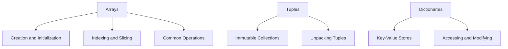

## 3.1 Arrays, Tuples, and Dictionaries

In the world of programming, data structures are the backbone of efficient code. Julia, a high-performance programming language, offers a rich set of data structures that cater to various needs. In this section, we will delve into three fundamental data structures in Julia: Arrays, Tuples, and Dictionaries. Understanding these structures will empower you to write more efficient, scalable, and maintainable code.

### Arrays

Arrays are one of the most versatile and commonly used data structures in Julia. They are mutable, allowing for dynamic modification of their elements, and can store collections of items of the same or different types.

#### Creation and Initialization

Creating arrays in Julia is straightforward. You can use array literals or constructors to initialize them.

**Array Literals:**

```julia
int_array = [1, 2, 3, 4, 5]

float_matrix = [1.0 2.0; 3.0 4.0]
```

**Array Constructors:**

```julia
empty_array = Array{Int}(undef, 5)  # Creates an uninitialized array of 5 integers

zero_array = zeros(3, 3)  # 3x3 matrix of zeros
```

#### Indexing and Slicing

Julia arrays are 1-based, meaning the first element is accessed with index 1. You can access elements and subarrays using indexing and slicing.

**Indexing:**

```julia
first_element = int_array[1]  # 1
last_element = int_array[end]  # 5
```

**Slicing:**

```julia
sub_array = int_array[2:4]  # [2, 3, 4]

sub_matrix = float_matrix[:, 1]  # First column of the matrix
```

#### Common Operations

Arrays in Julia support a variety of operations, including iteration, mutation, and aggregation.

**Iteration:**

```julia
for element in int_array
    println(element)
end
```

**Mutation:**

```julia
int_array[1] = 10  # Changes the first element to 10
```

**Aggregation:**

```julia
sum_of_elements = sum(int_array)  # Sum of all elements
max_element = maximum(int_array)  # Maximum element
```

### Tuples

Tuples are immutable collections in Julia, meaning their elements cannot be changed after creation. They are useful for grouping related data and returning multiple values from functions.

#### Immutable Collections

Tuples are defined using parentheses and can store elements of different types.

```julia
my_tuple = (1, "hello", 3.14)

first_element = my_tuple[1]  # 1
```

#### Unpacking Tuples

You can unpack tuples to assign their elements to variables.

```julia
a, b, c = my_tuple
println(a)  # 1
println(b)  # "hello"
println(c)  # 3.14
```

### Dictionaries

Dictionaries are key-value stores that allow for efficient data retrieval. They are mutable and can store keys and values of different types.

#### Key-Value Stores

Creating and manipulating dictionaries is simple in Julia.

```julia
my_dict = Dict("a" => 1, "b" => 2, "c" => 3)

value_a = my_dict["a"]  # 1
```

#### Accessing and Modifying

You can add, update, and delete entries in a dictionary.

**Adding and Updating:**

```julia
my_dict["d"] = 4

my_dict["a"] = 10
```

**Deleting Entries:**

```julia
delete!(my_dict, "b")
```

### Visualizing Data Structures

To better understand the relationships and operations on these data structures, let's visualize them using Mermaid.js diagrams.



**Diagram Description:** This diagram illustrates the main topics covered in this section: Arrays, Tuples, and Dictionaries, along with their key features and operations.

### Try It Yourself

Experiment with the code examples provided. Try modifying the arrays, tuples, and dictionaries to see how they behave. For instance, change the elements of an array or try adding new key-value pairs to a dictionary.

### References and Links

- [Julia Documentation on Arrays](https://docs.julialang.org/en/v1/manual/arrays/)
- [Julia Documentation on Tuples](https://docs.julialang.org/en/v1/manual/types/#Tuples)
- [Julia Documentation on Dictionaries](https://docs.julialang.org/en/v1/base/collections/#Dictionaries)

### Knowledge Check

- What are the differences between arrays and tuples in Julia?
- How do you access the last element of an array?
- What is the syntax for creating a dictionary in Julia?

### Embrace the Journey

Remember, mastering these data structures is just the beginning. As you progress, you'll learn to combine them in complex ways to solve real-world problems. Keep experimenting, stay curious, and enjoy the journey!

## Quiz Time!



### What is the default indexing base for arrays in Julia?

- [x] 1
- [ ] 0
- [ ] 2
- [ ] -1

> **Explanation:** Julia uses 1-based indexing, meaning the first element of an array is accessed with index 1.

### Which of the following is a characteristic of tuples in Julia?

- [x] Immutable
- [ ] Mutable
- [ ] Always homogeneous
- [ ] Only store integers

> **Explanation:** Tuples in Julia are immutable, meaning their elements cannot be changed after creation.

### How do you access the value associated with a key in a dictionary?

- [x] Using the key as an index
- [ ] Using the value as an index
- [ ] Using a numerical index
- [ ] Using a tuple

> **Explanation:** In Julia, you access a value in a dictionary by using its key as an index, e.g., `my_dict["key"]`.

### What function would you use to sum all elements in an array?

- [x] sum()
- [ ] add()
- [ ] total()
- [ ] aggregate()

> **Explanation:** The `sum()` function is used to calculate the sum of all elements in an array in Julia.

### Which of the following operations is not allowed on a tuple?

- [x] Modifying an element
- [ ] Accessing an element
- [ ] Unpacking elements
- [ ] Creating a tuple

> **Explanation:** Tuples are immutable, so you cannot modify their elements after creation.

### How do you delete an entry from a dictionary in Julia?

- [x] delete!()
- [ ] remove()
- [ ] erase()
- [ ] clear()

> **Explanation:** The `delete!()` function is used to remove a key-value pair from a dictionary in Julia.

### What is the syntax for creating a 2D array (matrix) in Julia?

- [x] [1.0 2.0; 3.0 4.0]
- [ ] [1.0, 2.0, 3.0, 4.0]
- [ ] {1.0 2.0; 3.0 4.0}
- [ ] (1.0 2.0; 3.0 4.0)

> **Explanation:** A 2D array (matrix) in Julia is created using semicolons to separate rows, e.g., `[1.0 2.0; 3.0 4.0]`.

### Which of the following is a valid way to iterate over an array in Julia?

- [x] for element in array
- [ ] while element in array
- [ ] foreach element in array
- [ ] iterate element in array

> **Explanation:** The `for element in array` loop is used to iterate over each element in an array in Julia.

### What is the result of the following operation: `int_array[2:4]` if `int_array = [1, 2, 3, 4, 5]`?

- [x] [2, 3, 4]
- [ ] [1, 2, 3]
- [ ] [3, 4, 5]
- [ ] [2, 3, 4, 5]

> **Explanation:** The slice `int_array[2:4]` returns the subarray `[2, 3, 4]` from the original array.

### True or False: Dictionaries in Julia can have keys of different types.

- [x] True
- [ ] False

> **Explanation:** Dictionaries in Julia can have keys of different types, allowing for flexible data storage.




