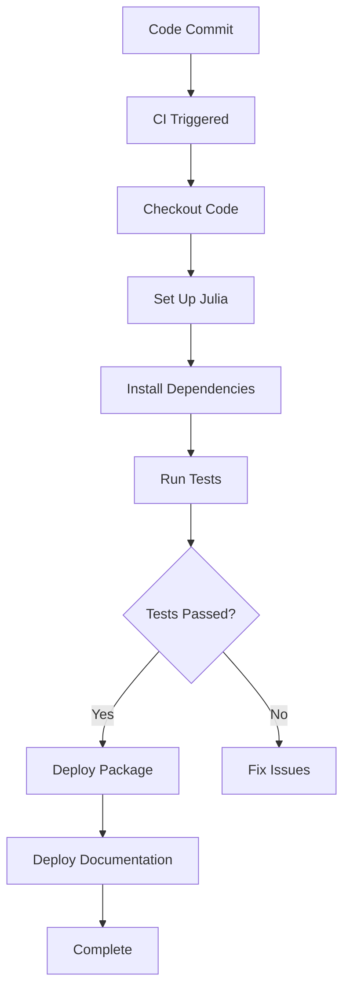

## 3.10 Continuous Integration with Julia Projects

Continuous Integration (CI) is a crucial practice in modern software development that involves automatically testing and building code changes as they are integrated into a shared repository. This practice helps ensure that code is always in a deployable state, reduces integration problems, and allows teams to develop cohesive software more efficiently. In this section, we will explore how to set up CI for Julia projects using popular tools like GitHub Actions, Travis CI, and CircleCI. We will also discuss testing across different Julia versions and automating the deployment of packages and documentation.

### Setting Up CI

#### Using GitHub Actions for Automated Testing

GitHub Actions is a powerful CI/CD tool integrated directly into GitHub, allowing you to automate workflows for your Julia projects. Let's walk through setting up a basic CI pipeline using GitHub Actions.

1. **Create a Workflow File**: In your Julia project repository, create a `.github/workflows/ci.yml` file. This file will define the steps for your CI pipeline.

2. **Define the Workflow**: Use the following YAML configuration to set up a simple CI workflow that tests your Julia code:

   ```yaml
   name: CI

   on:
     push:
       branches:
         - main
     pull_request:
       branches:
         - main

   jobs:
     test:
       runs-on: ubuntu-latest

       steps:
       - name: Checkout code
         uses: actions/checkout@v2

       - name: Set up Julia
         uses: julia-actions/setup-julia@v1
         with:
           version: '1.6'

       - name: Install dependencies
         run: julia --project=. -e 'using Pkg; Pkg.instantiate()'

       - name: Run tests
         run: julia --project=. -e 'using Pkg; Pkg.test()'
   ```

   **Explanation**:
   - **Trigger**: The workflow triggers on pushes and pull requests to the `main` branch.
   - **Jobs**: The `test` job runs on the latest Ubuntu environment.
   - **Steps**: The steps include checking out the code, setting up Julia, installing dependencies, and running tests.

3. **Commit and Push**: Commit the workflow file to your repository and push the changes. GitHub Actions will automatically run the workflow whenever code is pushed or a pull request is opened.

#### Configuring Travis CI or CircleCI

While GitHub Actions is a popular choice, Travis CI and CircleCI are also widely used CI tools that offer robust support for Julia projects.

##### Travis CI

1. **Create a `.travis.yml` File**: In your project root, create a `.travis.yml` file with the following configuration:

   ```yaml
   language: julia
   julia:
     - 1.6
     - nightly
   os:
     - linux
     - osx
   script:
     - julia --project=. -e 'using Pkg; Pkg.test()'
   ```

   **Explanation**:
   - **Language**: Specifies Julia as the language.
   - **Versions**: Tests against stable and nightly Julia versions.
   - **Operating Systems**: Runs tests on Linux and macOS.
   - **Script**: Executes the test suite using Julia's package manager.

2. **Activate Travis CI**: Link your GitHub repository to Travis CI and activate the repository to start using Travis CI for your builds.

##### CircleCI

1. **Create a `config.yml` File**: In the `.circleci` directory, create a `config.yml` file with the following content:

   ```yaml
   version: 2.1

   jobs:
     test:
       docker:
         - image: julia:1.6
       steps:
         - checkout
         - run:
             name: Install dependencies
             command: julia --project=. -e 'using Pkg; Pkg.instantiate()'
         - run:
             name: Run tests
             command: julia --project=. -e 'using Pkg; Pkg.test()'

   workflows:
     version: 2
     test:
       jobs:
         - test
   ```

   **Explanation**:
   - **Docker Image**: Uses the official Julia Docker image.
   - **Steps**: Includes checking out the code, installing dependencies, and running tests.
   - **Workflows**: Defines a simple workflow with a single test job.

2. **Set Up CircleCI**: Connect your GitHub repository to CircleCI and configure the project to use the `config.yml` file.

### Testing Across Versions

Ensuring compatibility with different Julia versions is essential for maintaining a robust codebase. CI tools allow you to easily test your code against multiple Julia versions.

- **Specify Versions**: In your CI configuration files, specify the Julia versions you want to test against. For example, you might include both the latest stable release and the nightly build to catch any upcoming changes that might affect your code.

- **Matrix Builds**: Use matrix builds to run tests across different combinations of Julia versions and operating systems. This approach helps identify platform-specific issues early in the development process.

### Automating Deployment

Automating the deployment of packages and documentation is a key aspect of modern CI/CD pipelines. This process ensures that your software is always up-to-date and accessible to users.

#### Continuous Delivery of Packages

1. **Tagging Releases**: Use semantic versioning to tag releases in your GitHub repository. This practice helps automate the deployment process by triggering workflows on new tags.

2. **Deploying to JuliaHub**: Configure your CI pipeline to automatically deploy new package versions to JuliaHub, the central package registry for Julia. This step ensures that users can easily install the latest version of your package.

   ```yaml
   jobs:
     deploy:
       runs-on: ubuntu-latest
       steps:
       - name: Checkout code
         uses: actions/checkout@v2

       - name: Set up Julia
         uses: julia-actions/setup-julia@v1
         with:
           version: '1.6'

       - name: Deploy to JuliaHub
         run: julia --project=. -e 'using Pkg; Pkg.add("Registrator"); using Registrator; Registrator.register()'
   ```

   **Explanation**:
   - **Registrator**: Uses the Registrator.jl package to register new versions of your package on JuliaHub.

#### Continuous Delivery of Documentation

1. **Generate Documentation**: Use Documenter.jl to generate HTML documentation for your Julia project.

2. **Deploy Documentation**: Configure your CI pipeline to automatically deploy the generated documentation to GitHub Pages or another hosting service.

   ```yaml
   jobs:
     docs:
       runs-on: ubuntu-latest
       steps:
       - name: Checkout code
         uses: actions/checkout@v2

       - name: Set up Julia
         uses: julia-actions/setup-julia@v1
         with:
           version: '1.6'

       - name: Build documentation
         run: julia --project=docs -e 'using Pkg; Pkg.instantiate(); include("docs/make.jl")'

       - name: Deploy to GitHub Pages
         uses: peaceiris/actions-gh-pages@v3
         with:
           github_token: ${{ secrets.GITHUB_TOKEN }}
           publish_dir: ./docs/build
   ```

   **Explanation**:
   - **Documenter.jl**: Builds the documentation using the `make.jl` script.
   - **GitHub Pages**: Deploys the documentation to GitHub Pages using the `actions-gh-pages` action.

### Visualizing CI Workflows

To better understand the CI workflow, let's visualize the process using a flowchart.



**Caption**: This flowchart illustrates the CI workflow for a Julia project, from code commit to deployment.

### Knowledge Check

- **Why is CI important for Julia projects?**
- **How can you test your Julia code across different versions?**
- **What are the benefits of automating deployment?**

### Try It Yourself

Experiment with the CI configurations provided in this section. Try modifying the workflows to include additional steps, such as linting or code coverage analysis. Observe how these changes affect the CI process and the overall quality of your Julia project.

### Embrace the Journey

Remember, setting up CI for your Julia projects is just the beginning. As you gain more experience, you'll find new ways to optimize and enhance your CI/CD pipelines. Keep exploring, stay curious, and enjoy the journey of continuous improvement!

## Quiz Time!



### What is the primary purpose of Continuous Integration (CI)?

- [x] To automatically test and build code changes as they are integrated into a shared repository.
- [ ] To manually test code changes before integration.
- [ ] To deploy code changes to production environments.
- [ ] To write documentation for code changes.

> **Explanation:** CI focuses on automatically testing and building code changes to ensure they are always in a deployable state.

### Which CI tool is integrated directly into GitHub?

- [x] GitHub Actions
- [ ] Travis CI
- [ ] CircleCI
- [ ] Jenkins

> **Explanation:** GitHub Actions is a CI/CD tool integrated directly into GitHub, allowing for seamless automation of workflows.

### In a GitHub Actions workflow, what file extension is used for the configuration file?

- [x] .yml
- [ ] .json
- [ ] .xml
- [ ] .ini

> **Explanation:** GitHub Actions workflows are configured using YAML files with the `.yml` extension.

### What is the purpose of matrix builds in CI?

- [x] To run tests across different combinations of Julia versions and operating systems.
- [ ] To deploy code to multiple environments simultaneously.
- [ ] To generate documentation for multiple versions of a project.
- [ ] To create multiple branches in a repository.

> **Explanation:** Matrix builds allow testing across various combinations of versions and platforms to identify compatibility issues.

### Which package is used to register new versions of a Julia package on JuliaHub?

- [x] Registrator.jl
- [ ] Documenter.jl
- [ ] Pkg.jl
- [ ] Test.jl

> **Explanation:** Registrator.jl is used to register new versions of Julia packages on JuliaHub.

### What is the role of Documenter.jl in a CI pipeline?

- [x] To generate HTML documentation for a Julia project.
- [ ] To run tests on a Julia project.
- [ ] To deploy a Julia project to production.
- [ ] To manage package dependencies.

> **Explanation:** Documenter.jl is used to generate documentation for Julia projects, which can be deployed as part of a CI pipeline.

### Which CI tool uses a `config.yml` file in the `.circleci` directory?

- [x] CircleCI
- [ ] Travis CI
- [ ] GitHub Actions
- [ ] Jenkins

> **Explanation:** CircleCI uses a `config.yml` file located in the `.circleci` directory to define its workflows.

### What is the benefit of using semantic versioning in CI/CD pipelines?

- [x] It helps automate the deployment process by triggering workflows on new tags.
- [ ] It allows for manual testing of code changes.
- [ ] It ensures code is always in a deployable state.
- [ ] It generates documentation for each version.

> **Explanation:** Semantic versioning helps automate deployments by triggering workflows when new tags are created.

### Which action is used to deploy documentation to GitHub Pages in a GitHub Actions workflow?

- [x] peaceiris/actions-gh-pages@v3
- [ ] actions/checkout@v2
- [ ] julia-actions/setup-julia@v1
- [ ] actions/setup-node@v2

> **Explanation:** The `peaceiris/actions-gh-pages@v3` action is used to deploy documentation to GitHub Pages.

### True or False: Continuous Integration only involves testing code changes.

- [ ] True
- [x] False

> **Explanation:** Continuous Integration involves not only testing but also building and integrating code changes into a shared repository.




