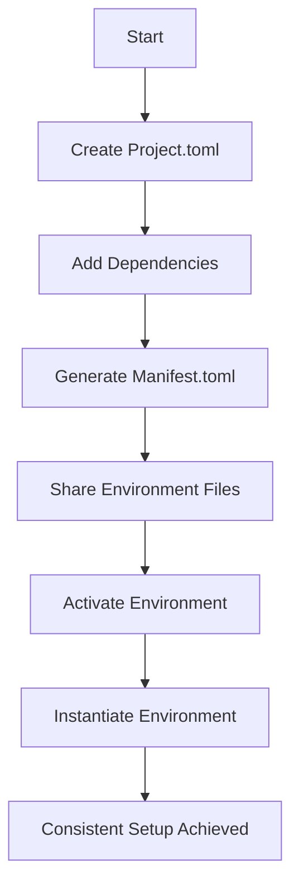

## 3.11 Managing Environments and Dependency Versioning

In the world of software development, managing environments and dependencies is crucial for ensuring that applications run consistently across different systems. Julia, with its powerful package management system, provides robust tools for handling environments and dependency versioning. In this section, we will explore how to effectively manage environments in Julia, understand the role of `Project.toml` and `Manifest.toml` files, specify version constraints, and create reproducible environments.

### Understanding Environment Files

Julia uses two primary files to manage environments: `Project.toml` and `Manifest.toml`. These files are essential for defining and maintaining the dependencies your project requires.

#### Project.toml

The `Project.toml` file is the heart of a Julia environment. It specifies the direct dependencies of your project, along with metadata such as the project name, version, and authors. Here's a simple example of a `Project.toml` file:

```toml
name = "MyJuliaProject"
uuid = "12345678-1234-5678-1234-567812345678"
version = "0.1.0"

[deps]
DataFrames = "0.22"
Plots = "1.10"
```

- **name**: The name of your project.
- **uuid**: A unique identifier for your project.
- **version**: The version of your project.
- **[deps]**: A section listing the direct dependencies and their versions.

#### Manifest.toml

The `Manifest.toml` file is automatically generated and contains a complete snapshot of the dependency graph, including all transitive dependencies. It ensures that the exact versions of all packages are recorded, allowing for precise reproducibility.

```toml
[[DataFrames]]
deps = ["CategoricalArrays", "Compat", "DataAPI", "Future"]
git-tree-sha1 = "abc123"
uuid = "a93c6f00-e57d-5684-b7b6-d8193f3e46e1"
version = "0.22.5"

[[Plots]]
deps = ["Base64", "Contour", "FFMPEG", "FixedPointNumbers"]
git-tree-sha1 = "def456"
uuid = "91a5bcdd-55d7-5caf-9e0b-520d859cae80"
version = "1.10.6"
```

- **[[PackageName]]**: Each entry represents a package with its dependencies, version, and other metadata.
- **deps**: Lists the dependencies required by the package.
- **version**: Specifies the exact version of the package.

### Version Constraints

Managing version constraints is vital to ensure compatibility and stability in your project. Julia allows you to specify version ranges for dependencies in the `Project.toml` file.

#### Specifying Version Ranges

You can specify version constraints using operators like `^`, `~`, `>=`, `<=`, and others. Here are some examples:

- **Exact Version**: `DataFrames = "0.22.5"` specifies an exact version.
- **Caret (`^`)**: `DataFrames = "^0.22"` allows updates that do not change the leftmost non-zero digit.
- **Tilde (`~`)**: `DataFrames = "~0.22.5"` allows updates to the last digit.
- **Range**: `DataFrames = ">=0.22, <0.23"` specifies a range of acceptable versions.

### Reproducible Environments

Creating reproducible environments is crucial for collaboration and deployment. Julia's package manager makes it easy to share environments and ensure consistent setups across different machines.

#### Sharing Environments

To share an environment, you need to distribute both the `Project.toml` and `Manifest.toml` files. This ensures that others can recreate the exact environment you used.

1. **Create a New Environment**: Use the `Pkg` REPL to create a new environment.

   ```julia
   using Pkg
   Pkg.activate("MyProject")
   ```

2. **Add Dependencies**: Add the necessary packages.

   ```julia
   Pkg.add("DataFrames")
   Pkg.add("Plots")
   ```

3. **Generate Manifest**: The `Manifest.toml` file is automatically generated.

4. **Share Files**: Distribute the `Project.toml` and `Manifest.toml` files.

#### Ensuring Consistent Setups

When others receive your environment files, they can activate the environment and instantiate it to install the exact versions of all dependencies.

```julia
using Pkg
Pkg.activate("MyProject")
Pkg.instantiate()
```

This command reads the `Manifest.toml` file and installs the specified versions of all packages, ensuring consistency.

### Visualizing Dependency Management

To better understand how Julia manages dependencies, let's visualize the process using a flowchart.



**Caption**: This flowchart illustrates the process of managing environments and dependencies in Julia, from creating a `Project.toml` file to achieving a consistent setup across machines.

### Try It Yourself

Experiment with creating and managing environments in Julia. Try modifying the version constraints in the `Project.toml` file and observe how it affects the installed packages. Share your environment files with a colleague and ensure they can recreate your setup.

### References and Links

- [JuliaLang Documentation on Environments](https://docs.julialang.org/en/v1/stdlib/Pkg/#Environments)
- [Semantic Versioning](https://semver.org/)
- [Julia Pkg.jl Documentation](https://julialang.github.io/Pkg.jl/v1/)

### Knowledge Check

- What is the purpose of the `Project.toml` file?
- How does the `Manifest.toml` file ensure reproducibility?
- What are the differences between caret (`^`) and tilde (`~`) version constraints?
- How can you share a Julia environment with others?

### Embrace the Journey

Remember, mastering environments and dependency versioning in Julia is just the beginning. As you progress, you'll build more complex projects and collaborate with others seamlessly. Keep experimenting, stay curious, and enjoy the journey!

## Quiz Time!



### What is the primary purpose of the `Project.toml` file in Julia?

- [x] To specify the direct dependencies and metadata of a project.
- [ ] To list all transitive dependencies of a project.
- [ ] To store the source code of a project.
- [ ] To manage the project's version control.

> **Explanation:** The `Project.toml` file specifies the direct dependencies and metadata of a Julia project.

### How does the `Manifest.toml` file contribute to reproducibility?

- [x] By recording the exact versions of all dependencies.
- [ ] By listing only the direct dependencies.
- [ ] By storing the project's source code.
- [ ] By managing version control.

> **Explanation:** The `Manifest.toml` file records the exact versions of all dependencies, ensuring reproducibility.

### Which operator allows updates that do not change the leftmost non-zero digit in version constraints?

- [x] Caret (`^`)
- [ ] Tilde (`~`)
- [ ] Greater than (`>`)
- [ ] Less than (`<`)

> **Explanation:** The caret (`^`) operator allows updates that do not change the leftmost non-zero digit.

### What command is used to activate a Julia environment?

- [x] `Pkg.activate("MyProject")`
- [ ] `Pkg.start("MyProject")`
- [ ] `Pkg.init("MyProject")`
- [ ] `Pkg.run("MyProject")`

> **Explanation:** The `Pkg.activate("MyProject")` command is used to activate a Julia environment.

### What is the purpose of the `Pkg.instantiate()` command?

- [x] To install the exact versions of all packages specified in `Manifest.toml`.
- [ ] To create a new `Project.toml` file.
- [ ] To update all packages to their latest versions.
- [ ] To remove all installed packages.

> **Explanation:** The `Pkg.instantiate()` command installs the exact versions of all packages specified in `Manifest.toml`.

### Which file should be shared to ensure others can recreate your Julia environment?

- [x] Both `Project.toml` and `Manifest.toml`
- [ ] Only `Project.toml`
- [ ] Only `Manifest.toml`
- [ ] Neither file

> **Explanation:** Both `Project.toml` and `Manifest.toml` should be shared to ensure others can recreate your Julia environment.

### What does the tilde (`~`) operator specify in version constraints?

- [x] It allows updates to the last digit.
- [ ] It allows updates that do not change the leftmost non-zero digit.
- [ ] It specifies an exact version.
- [ ] It specifies a range of acceptable versions.

> **Explanation:** The tilde (`~`) operator allows updates to the last digit in version constraints.

### How can you specify a range of acceptable versions in `Project.toml`?

- [x] Using `>=` and `<` operators.
- [ ] Using `^` and `~` operators.
- [ ] Using `==` operator.
- [ ] Using `!=` operator.

> **Explanation:** You can specify a range of acceptable versions using `>=` and `<` operators.

### What is the role of the `uuid` in `Project.toml`?

- [x] To uniquely identify the project.
- [ ] To specify the project's version.
- [ ] To list the project's dependencies.
- [ ] To manage the project's source code.

> **Explanation:** The `uuid` in `Project.toml` uniquely identifies the project.

### True or False: The `Manifest.toml` file is manually edited to manage dependencies.

- [ ] True
- [x] False

> **Explanation:** The `Manifest.toml` file is automatically generated and should not be manually edited to manage dependencies.




