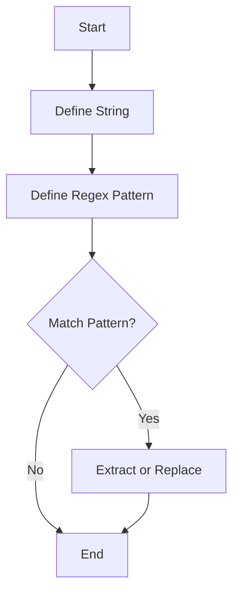

## 3.2 Strings and Regular Expressions

In the world of programming, strings and regular expressions are indispensable tools for handling and manipulating text data. Julia, with its powerful and flexible string handling capabilities, allows developers to perform a wide range of text processing tasks efficiently. In this section, we will delve into the fundamentals of strings and regular expressions in Julia, exploring their creation, manipulation, and application in various scenarios.

### String Basics

Strings in Julia are sequences of characters, and they are used to represent text. Let's start by understanding how to create and manipulate strings in Julia.

#### Creation and Interpolation

Creating strings in Julia is straightforward. You can define a string by enclosing text in double quotes:

```julia
greeting = "Hello, World!"
```

Julia also supports string interpolation, which allows you to embed expressions within a string. This is done using the `$` symbol:

```julia
name = "Alice"
message = "Hello, $name!"
println(message)  # Output: Hello, Alice!
```

String interpolation is a powerful feature that enables dynamic string creation by embedding variables or expressions directly within the string.

#### Multi-line Strings

For multi-line text, Julia provides triple-quoted strings. This feature is particularly useful for defining long strings without the need for concatenation:

```julia
long_text = """
This is a multi-line string.
It spans multiple lines.
"""
println(long_text)
```

Multi-line strings preserve the formatting, including line breaks and indentation, making them ideal for documentation or large text blocks.

### String Operations

Once you have strings, you'll often need to perform various operations on them. Julia provides a rich set of functions for string manipulation.

#### Concatenation and Substrings

String concatenation in Julia can be done using the `*` operator:

```julia
first_part = "Hello"
second_part = ", World!"
full_greeting = first_part * second_part
println(full_greeting)  # Output: Hello, World!
```

To extract a substring, you can use the `SubString` function:

```julia
text = "Julia Programming"
sub_text = SubString(text, 1, 5)
println(sub_text)  # Output: Julia
```

#### String Functions

Julia offers a variety of utility functions for strings, such as `length`, `replace`, and `split`.

- **Length**: Determine the number of characters in a string.

  ```julia
  text = "Hello, World!"
  println(length(text))  # Output: 13
  ```

- **Replace**: Substitute parts of a string with another string.

  ```julia
  text = "I love programming."
  new_text = replace(text, "love" => "enjoy")
  println(new_text)  # Output: I enjoy programming.
  ```

- **Split**: Divide a string into an array of substrings based on a delimiter.

  ```julia
  text = "apple,banana,cherry"
  fruits = split(text, ",")
  println(fruits)  # Output: ["apple", "banana", "cherry"]
  ```

These functions are essential for processing and transforming text data in Julia applications.

### Regular Expressions

Regular expressions (regex) are powerful tools for pattern matching and text manipulation. Julia provides robust support for regex, enabling complex text processing tasks.

#### Defining Patterns

In Julia, regex patterns are defined using the `r""` syntax:

```julia
pattern = r"\d+"  # Matches one or more digits
```

This pattern can be used to search for numeric sequences within a string.

#### Matching and Searching

Julia provides several functions for regex operations, including `match`, `ismatch`, and `eachmatch`.

- **Match**: Find the first occurrence of a pattern in a string.

  ```julia
  text = "The year is 2024."
  result = match(r"\d+", text)
  println(result.match)  # Output: 2024
  ```

- **Ismatch**: Check if a pattern exists in a string.

  ```julia
  text = "Hello, World!"
  has_hello = ismatch(r"Hello", text)
  println(has_hello)  # Output: true
  ```

- **Eachmatch**: Find all occurrences of a pattern in a string.

  ```julia
  text = "Call me at 123-456-7890 or 987-654-3210."
  for m in eachmatch(r"\d{3}-\d{3}-\d{4}", text)
      println(m.match)
  end
  # Output:
  # 123-456-7890
  # 987-654-3210
  ```

These functions allow you to perform detailed searches and extract information from text data.

#### Replacements

Regex can also be used for replacing patterns in strings. The `replace` function supports regex patterns:

```julia
text = "The quick brown fox jumps over the lazy dog."
new_text = replace(text, r"fox" => "cat")
println(new_text)  # Output: The quick brown cat jumps over the lazy dog.
```

This capability is useful for transforming text data based on specific patterns.

### Visualizing String and Regex Operations

To better understand how strings and regex work in Julia, let's visualize the process of matching and replacing patterns using a flowchart.



**Figure 1:** This flowchart illustrates the process of using regex to match and replace patterns in a string. It starts with defining a string and a regex pattern, checks for matches, and then either extracts or replaces the pattern.

### Try It Yourself

Experiment with the following code snippets to deepen your understanding of strings and regex in Julia:

1. Modify the string interpolation example to include a calculation within the string.
2. Create a multi-line string that represents a JSON object and print it.
3. Use regex to extract all email addresses from a given text.
4. Replace all occurrences of a specific word in a paragraph with another word using regex.

### References and Links

For further reading on strings and regular expressions in Julia, consider the following resources:

- [Julia Documentation on Strings](https://docs.julialang.org/en/v1/manual/strings/)
- [Regular Expressions in Julia](https://docs.julialang.org/en/v1/manual/strings/#Regular-Expressions-1)
- [Regex101](https://regex101.com/) for testing and learning regex patterns.

### Knowledge Check

Before moving on, let's reinforce what we've learned with a few questions and exercises.

1. What is the syntax for defining a regex pattern in Julia?
2. How do you concatenate two strings in Julia?
3. Write a function that takes a string and returns the number of vowels in it.
4. Use regex to find all dates in the format `YYYY-MM-DD` within a text.

### Embrace the Journey

Remember, mastering strings and regular expressions is a journey. As you practice and experiment with these concepts, you'll become more proficient in handling text data in Julia. Keep exploring, stay curious, and enjoy the process!

## Quiz Time!



### What is the syntax for defining a regex pattern in Julia?

- [x] r"pattern"
- [ ] /pattern/
- [ ] "pattern"
- [ ] regex(pattern)

> **Explanation:** In Julia, regex patterns are defined using the `r""` syntax.

### How do you concatenate two strings in Julia?

- [x] Using the `*` operator
- [ ] Using the `+` operator
- [ ] Using the `&` operator
- [ ] Using the `concat` function

> **Explanation:** In Julia, strings are concatenated using the `*` operator.

### Which function is used to find the first occurrence of a pattern in a string?

- [x] match
- [ ] ismatch
- [ ] eachmatch
- [ ] find

> **Explanation:** The `match` function is used to find the first occurrence of a pattern in a string.

### How can you check if a pattern exists in a string?

- [x] ismatch
- [ ] match
- [ ] eachmatch
- [ ] contains

> **Explanation:** The `ismatch` function checks if a pattern exists in a string.

### What is the output of `length("Hello, World!")`?

- [x] 13
- [ ] 12
- [ ] 14
- [ ] 15

> **Explanation:** The `length` function returns the number of characters in a string, which is 13 for "Hello, World!".

### How do you extract a substring from a string in Julia?

- [x] Using the `SubString` function
- [ ] Using the `substring` method
- [ ] Using the `slice` function
- [ ] Using the `extract` function

> **Explanation:** The `SubString` function is used to extract a substring from a string in Julia.

### Which function is used to replace parts of a string with another string?

- [x] replace
- [ ] substitute
- [ ] change
- [ ] modify

> **Explanation:** The `replace` function is used to substitute parts of a string with another string.

### How do you split a string into an array of substrings based on a delimiter?

- [x] Using the `split` function
- [ ] Using the `divide` function
- [ ] Using the `partition` function
- [ ] Using the `separate` function

> **Explanation:** The `split` function divides a string into an array of substrings based on a delimiter.

### What is the purpose of string interpolation in Julia?

- [x] To embed expressions within a string
- [ ] To concatenate strings
- [ ] To split strings
- [ ] To replace strings

> **Explanation:** String interpolation allows embedding expressions within a string using the `$` symbol.

### True or False: Multi-line strings in Julia are defined using triple quotes.

- [x] True
- [ ] False

> **Explanation:** Multi-line strings in Julia are defined using triple quotes (`"""`).


